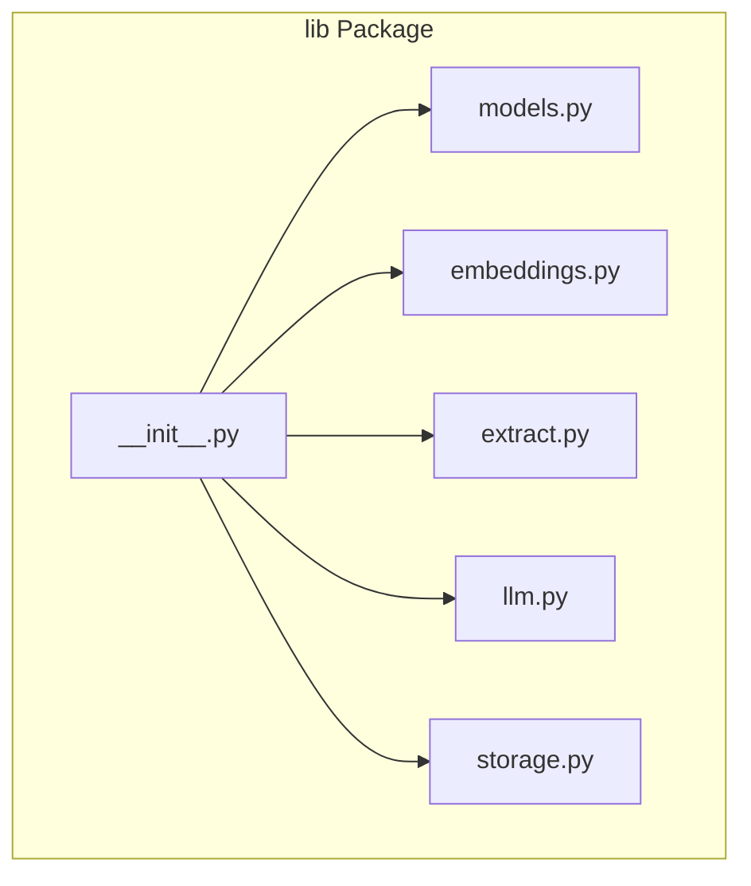
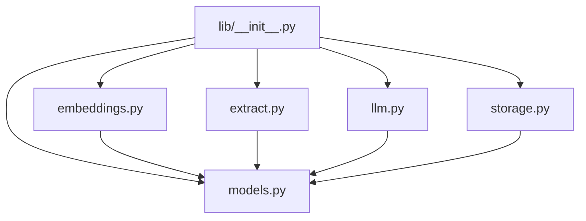
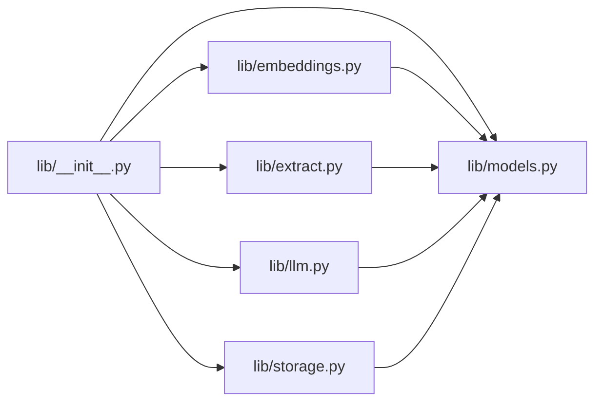

# API Reference

<cite>
**Referenced Files in This Document**
- [README.md](file://README.md)
- [lib/__init__.py](file://lib/__init__.py)
- [lib/models.py](file://lib/models.py)
- [lib/embeddings.py](file://lib/embeddings.py)
- [lib/extract.py](file://lib/extract.py)
- [lib/llm.py](file://lib/llm.py)
- [lib/storage.py](file://lib/storage.py)
- [config.py](file://config.py)
- [requirements.txt](file://requirements.txt)
</cite>

## Table of Contents
1. [Introduction](#introduction)
2. [Project Structure](#project-structure)
3. [Core Components](#core-components)
4. [Architecture Overview](#architecture-overview)
5. [Detailed Component Analysis](#detailed-component-analysis)
6. [Dependency Analysis](#dependency-analysis)
7. [Performance Considerations](#performance-considerations)
8. [Troubleshooting Guide](#troubleshooting-guide)
9. [Conclusion](#conclusion)
10. [Appendices](#appendices)

## Introduction
This document provides a comprehensive API reference for the Secondself AI Brain Python library. It focuses on public interfaces exposed by the lib package, including model definitions, embedding generation, extraction utilities, and storage backends. The goal is to help you integrate the library effectively with clear import statements, parameter descriptions, return value specifications, error handling patterns, and usage examples.

## Project Structure
The library’s core functionality is organized under the lib package:
- models.py: Data models and schemas used across the library.
- embeddings.py: Embedding generation and vector operations.
- extract.py: Extraction functions for processing text or structured data.
- llm.py: LLM integration helpers and prompts.
- storage.py: Storage abstractions and persistence utilities.
- __init__.py: Public API surface and convenience imports.

**Diagram sources**
- [lib/__init__.py](file://lib/__init__.py)
- [lib/models.py](file://lib/models.py)
- [lib/embeddings.py](file://lib/embeddings.py)
- [lib/extract.py](file://lib/extract.py)
- [lib/llm.py](file://lib/llm.py)
- [lib/storage.py](file://lib/storage.py)

**Section sources**
- [lib/__init__.py](file://lib/__init__.py)
- [lib/models.py](file://lib/models.py)
- [lib/embeddings.py](file://lib/embeddings.py)
- [lib/extract.py](file://lib/extract.py)
- [lib/llm.py](file://lib/llm.py)
- [lib/storage.py](file://lib/storage.py)

## Core Components
This section summarizes the primary modules and their responsibilities:
- Models: Define typed structures for entities, embeddings, and configuration objects.
- Embeddings: Provide methods to generate, normalize, and query vectors.
- Extract: Offer utility functions to parse and transform input into normalized forms.
- LLM: Encapsulate prompt construction and LLM calls with retry and error handling.
- Storage: Abstract persistence operations (e.g., JSON, file-based, or database-backed).

Best practices:
- Use the public API from lib.__init__ for consistent imports.
- Validate inputs before calling embedding or extraction functions.
- Handle exceptions raised by network-bound LLM calls and storage I/O.

[No sources needed since this section provides general guidance]

## Architecture Overview
The library follows a modular architecture where each module encapsulates a specific concern:
- models.py defines shared data structures.
- embeddings.py consumes models and returns vectors.
- extract.py transforms raw inputs into model-compatible formats.
- llm.py integrates external LLM services with robust error handling.
- storage.py persists results and metadata.

**Diagram sources**
- [lib/__init__.py](file://lib/__init__.py)
- [lib/models.py](file://lib/models.py)
- [lib/embeddings.py](file://lib/embeddings.py)
- [lib/extract.py](file://lib/extract.py)
- [lib/llm.py](file://lib/llm.py)
- [lib/storage.py](file://lib/storage.py)

## Detailed Component Analysis

### lib.models
Purpose:
- Define core data classes and schemas used throughout the library.
- Provide validation-friendly structures for embeddings, extracted items, and configuration.

Key elements:
- Model classes representing entities such as documents, chunks, and metadata.
- Typed fields ensuring consistency across modules.
- Optional helper methods for serialization and normalization.

Usage pattern:
- Import model classes directly from lib.models or via lib.__init__.
- Instantiate models with validated parameters.
- Pass model instances to embeddings, extract, and storage functions.

Error handling:
- Raise ValueError for invalid field values.
- Ensure required fields are present before processing.

Return types:
- Instances of defined model classes.
- Lists or dictionaries when aggregating multiple records.

**Section sources**
- [lib/models.py](file://lib/models.py)

### lib.embeddings
Purpose:
- Generate embeddings for text or structured content.
- Normalize vectors and provide similarity utilities.

Public APIs:
- Functions to create embeddings from strings or model instances.
- Methods to compute distances or similarities between vectors.
- Optional batching for performance.

Parameters:
- Input text or model instances.
- Optional configuration for model selection or normalization.

Return values:
- Vector arrays or lists of vectors.
- Metadata such as dimensions or model identifiers.

Error handling:
- Network errors during embedding service calls.
- Invalid input shapes or unsupported configurations.

Best practices:
- Cache embeddings when possible to reduce repeated computation.
- Normalize vectors consistently for reliable similarity comparisons.

**Section sources**
- [lib/embeddings.py](file://lib/embeddings.py)

### lib.extract
Purpose:
- Parse and transform raw inputs into standardized structures.
- Support common extraction tasks like chunking, cleaning, and tagging.

Public APIs:
- Functions to extract segments, entities, or attributes from text.
- Utilities to clean and normalize extracted content.

Parameters:
- Raw text or structured data.
- Options controlling extraction granularity and output format.

Return values:
- Lists of extracted items conforming to model definitions.
- Metadata describing extraction provenance.

Error handling:
- Malformed input handling with informative exceptions.
- Graceful fallbacks when parsing fails partially.

Best practices:
- Validate outputs against model schemas.
- Log extraction decisions for traceability.

**Section sources**
- [lib/extract.py](file://lib/extract.py)

### lib.llm
Purpose:
- Integrate with external LLM providers.
- Construct prompts and manage retries and timeouts.

Public APIs:
- Functions to send prompts and receive responses.
- Helpers to build context-aware prompts using models.

Parameters:
- Prompt text or structured context.
- Provider-specific options (model name, temperature, max tokens).

Return values:
- Response text or structured payloads.
- Usage metrics and error diagnostics.

Error handling:
- Retry logic with exponential backoff.
- Clear exception types for network failures and rate limits.

Best practices:
- Limit request sizes and implement caching for repeated prompts.
- Monitor token usage and costs.

**Section sources**
- [lib/llm.py](file://lib/llm.py)

### lib.storage
Purpose:
- Abstract persistence operations for embeddings, extracted data, and metadata.
- Support file-based or database-backed storage.

Public APIs:
- Save and load functions for model instances and collections.
- Query interfaces for retrieving records by ID or filters.

Parameters:
- Model instances or queries.
- Storage backend configuration.

Return values:
- Persisted identifiers or retrieved records.
- Status indicators for success/failure.

Error handling:
- I/O exceptions with actionable messages.
- Validation errors for incompatible schemas.

Best practices:
- Use transactions for batch writes.
- Implement indexing strategies for frequent queries.

**Section sources**
- [lib/storage.py](file://lib/storage.py)

### lib.__init__
Purpose:
- Expose the public API surface for easy imports.
- Re-export key classes and functions from submodules.

Usage:
- Import top-level names from lib for concise client code.
- Avoid importing internal modules directly to maintain compatibility.

**Section sources**
- [lib/__init__.py](file://lib/__init__.py)

## Dependency Analysis
Module relationships:
- lib.__init__ re-exports symbols from models, embeddings, extract, llm, and storage.
- embeddings, extract, and llm depend on models for shared data structures.
- storage depends on models for schema alignment.

**Diagram sources**
- [lib/__init__.py](file://lib/__init__.py)
- [lib/models.py](file://lib/models.py)
- [lib/embeddings.py](file://lib/embeddings.py)
- [lib/extract.py](file://lib/extract.py)
- [lib/llm.py](file://lib/llm.py)
- [lib/storage.py](file://lib/storage.py)

**Section sources**
- [lib/__init__.py](file://lib/__init__.py)
- [lib/models.py](file://lib/models.py)
- [lib/embeddings.py](file://lib/embeddings.py)
- [lib/extract.py](file://lib/extract.py)
- [lib/llm.py](file://lib/llm.py)
- [lib/storage.py](file://lib/storage.py)

## Performance Considerations
- Batch embedding requests to reduce overhead.
- Cache embeddings and LLM responses where appropriate.
- Use efficient storage backends and indexes for frequent queries.
- Monitor memory usage when processing large datasets.

[No sources needed since this section provides general guidance]

## Troubleshooting Guide
Common issues:
- Network timeouts or rate limits when calling LLM services; implement retries and backoff.
- Schema mismatches between models and storage; validate inputs and outputs.
- Memory pressure during large embedding batches; process in smaller chunks.

Exception patterns:
- Network-related exceptions should be caught and retried.
- Validation errors indicate incorrect parameters or malformed inputs.
- Storage I/O errors require checking permissions and paths.

Best practices:
- Log detailed error contexts for debugging.
- Provide user-friendly messages while preserving technical details internally.

[No sources needed since this section provides general guidance]

## Conclusion
The Secondself AI Brain library offers a modular, well-structured API for embeddings, extraction, LLM integration, and storage. By following the documented patterns and best practices, you can build robust integrations that scale and remain maintainable.

[No sources needed since this section summarizes without analyzing specific files]

## Appendices

### Installation and Setup
- Install dependencies listed in requirements.txt.
- Configure environment variables for LLM providers and storage backends as needed.

**Section sources**
- [requirements.txt](file://requirements.txt)
- [config.py](file://config.py)

### Example Integration Scenarios
- Basic embedding generation:
  - Import necessary components from lib.
  - Prepare input text or model instances.
  - Call embedding functions and handle returned vectors.
- Extraction workflow:
  - Use extract utilities to parse and normalize data.
  - Validate outputs against model schemas.
- Storage operations:
  - Save extracted or embedded data using storage APIs.
  - Retrieve records with filters or IDs.

[No sources needed since this section provides general guidance]