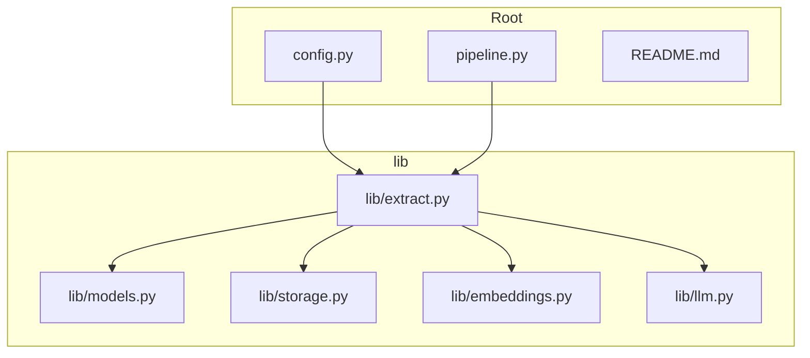
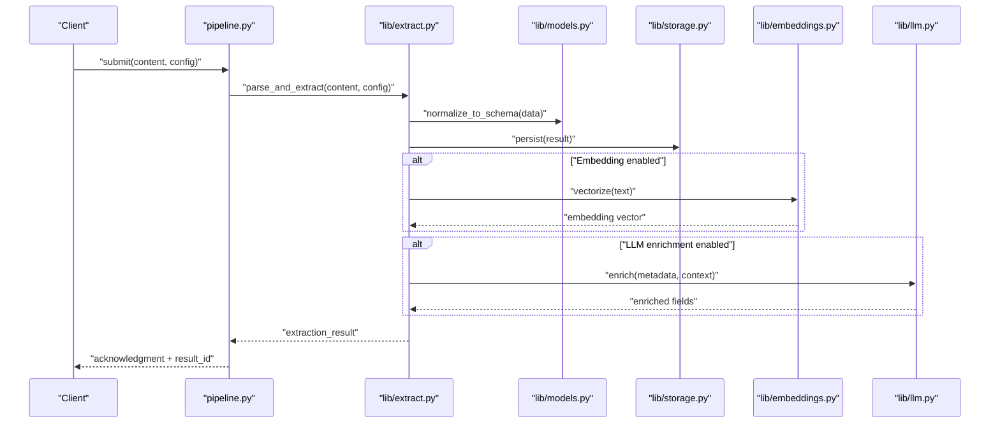
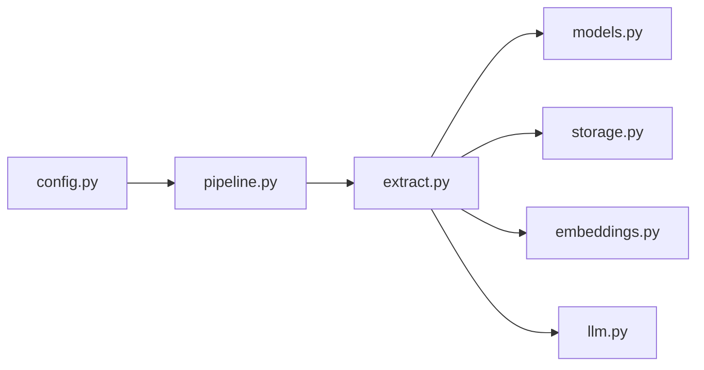

# Content Extraction API

<cite>
**Referenced Files in This Document**
- [extract.py](file://lib/extract.py)
- [models.py](file://lib/models.py)
- [storage.py](file://lib/storage.py)
- [embeddings.py](file://lib/embeddings.py)
- [llm.py](file://lib/llm.py)
- [config.py](file://config.py)
- [pipeline.py](file://pipeline.py)
- [README.md](file://README.md)
</cite>

## Table of Contents
1. [Introduction](#introduction)
2. [Project Structure](#project-structure)
3. [Core Components](#core-components)
4. [Architecture Overview](#architecture-overview)
5. [Detailed Component Analysis](#detailed-component-analysis)
6. [Dependency Analysis](#dependency-analysis)
7. [Performance Considerations](#performance-considerations)
8. [Troubleshooting Guide](#troubleshooting-guide)
9. [Conclusion](#conclusion)
10. [Appendices](#appendices)

## Introduction
This document provides comprehensive API documentation for the content extraction functionality within the project. It covers extraction methods for different content types, parsing algorithms, data transformation pipelines, configuration parameters, filtering options, output formatting, and error handling strategies. The goal is to enable both technical and non-technical users to understand how to extract, parse, clean, and structure content from various sources efficiently and reliably.

## Project Structure
The repository organizes extraction-related logic primarily under the lib directory, with supporting modules for models, storage, embeddings, and LLM integration. Configuration and pipeline orchestration are defined at the root level.

**Diagram sources**
- [config.py](file://config.py)
- [pipeline.py](file://pipeline.py)
- [extract.py](file://lib/extract.py)
- [models.py](file://lib/models.py)
- [storage.py](file://lib/storage.py)
- [embeddings.py](file://lib/embeddings.py)
- [llm.py](file://lib/llm.py)
- [README.md](file://README.md)

**Section sources**
- [README.md](file://README.md)
- [config.py](file://config.py)
- [pipeline.py](file://pipeline.py)

## Core Components
- Extractor: Central module responsible for reading inputs, parsing content, cleaning text, extracting structured data, and orchestrating downstream processing (e.g., embeddings, LLM calls).
- Models: Data structures representing extracted entities, metadata, and normalized content schemas.
- Storage: Persistence layer for storing extracted results, intermediate artifacts, and indexes.
- Embeddings: Vectorization utilities for transforming textual content into embeddings for search or similarity tasks.
- LLM: Integration points for large language model operations such as summarization, classification, or enrichment.

Key responsibilities:
- Input ingestion and format detection
- Parsing and normalization across content types
- Cleaning and deduplication
- Structured extraction via rules or LLM prompts
- Output serialization and storage
- Error handling and retries

**Section sources**
- [extract.py](file://lib/extract.py)
- [models.py](file://lib/models.py)
- [storage.py](file://lib/storage.py)
- [embeddings.py](file://lib/embeddings.py)
- [llm.py](file://lib/llm.py)

## Architecture Overview
The extraction pipeline follows a modular design where input flows through parsing, cleaning, extraction, and optional enrichment stages. Results are persisted and can be further processed by embedding or LLM services.

**Diagram sources**
- [pipeline.py](file://pipeline.py)
- [extract.py](file://lib/extract.py)
- [models.py](file://lib/models.py)
- [storage.py](file://lib/storage.py)
- [embeddings.py](file://lib/embeddings.py)
- [llm.py](file://lib/llm.py)

## Detailed Component Analysis

### Extractor API
Responsibilities:
- Detect content type and choose appropriate parser
- Apply cleaning and normalization routines
- Extract structured fields using rule-based or LLM-driven strategies
- Handle errors and fallbacks gracefully
- Return standardized results conforming to models schema

Extraction methods:
- Document extraction: Parse documents (PDF, DOCX, TXT), extract text and metadata
- Web scraping: Fetch and parse HTML, extract headings, paragraphs, links
- Media transcription: Convert audio/video to text via external services
- JSON/XML parsing: Deserialize structured formats and map to canonical schema

Configuration parameters:
- content_type: string indicating source format
- parser_options: object with format-specific settings (e.g., page ranges, encoding)
- cleaning_rules: array of transformations (whitespace normalization, noise removal)
- extraction_strategy: "rules" | "llm" | "hybrid"
- filters: object specifying inclusion/exclusion criteria (tags, sections, regex patterns)
- output_format: "json" | "csv" | "parquet"
- storage_backend: "local" | "s3" | "database"

Output schema:
- id: unique identifier
- title: string
- author: string
- created_at: timestamp
- content: cleaned text
- sections: array of section objects
- entities: list of extracted entities
- metadata: key-value pairs
- embedding: vector (optional)
- enriched_fields: additional LLM-derived attributes

Error handling:
- Malformed content: return validation errors with field-level diagnostics
- Parser failures: retry with alternative parsers or fallback strategy
- Network timeouts: exponential backoff and circuit breaker
- Rate limits: queue and throttle requests

Performance considerations:
- Chunking large documents for incremental processing
- Caching parsed intermediates
- Parallel extraction for independent sections
- Streaming responses for large outputs

**Section sources**
- [extract.py](file://lib/extract.py)
- [models.py](file://lib/models.py)

### Models Schema
Defines canonical data structures used throughout the pipeline:
- Document: Represents a single extracted unit with metadata and content
- Section: Subdivisions within a document (e.g., chapters, paragraphs)
- Entity: Named entities or key-value pairs extracted from content
- Metadata: Flexible key-value store for arbitrary attributes

Complexity analysis:
- Normalization operations typically O(n) over tokenized content
- Entity extraction complexity depends on strategy (rule-based O(1) per pattern; LLM-dependent)
- Embedding generation is O(d) where d is embedding dimension

Optimization opportunities:
- Lazy loading of large content blocks
- Indexing frequently accessed metadata fields
- Batch processing for embeddings and LLM calls

**Section sources**
- [models.py](file://lib/models.py)

### Storage Layer
Provides persistence for extraction results and artifacts:
- Local filesystem: Simple file-based storage with JSON/Parquet formats
- Cloud storage: S3-compatible buckets with versioning and lifecycle policies
- Database: Relational or NoSQL stores for queryable structured data

Operations:
- save(result): Persist extraction result with metadata
- load(id): Retrieve stored result by ID
- query(filters): Search based on metadata and content indices
- delete(id): Remove stored artifacts

Consistency and durability:
- Transactional writes where supported
- Checksum verification for integrity
- Backup and restore procedures

**Section sources**
- [storage.py](file://lib/storage.py)

### Embeddings Module
Transforms textual content into dense vectors for semantic search and clustering:
- Supported models: Sentence transformers, OpenAI embeddings, local models
- Chunking strategies: Fixed-size, semantic boundaries, sliding windows
- Indexing: FAISS, Annoy, or cloud vector databases

API highlights:
- embed(text): Generate embedding vector
- index(documents): Build searchable index
- search(query, top_k): Retrieve similar documents

Performance tips:
- Precompute embeddings for static content
- Use approximate nearest neighbors for scalability
- Cache frequent queries

**Section sources**
- [embeddings.py](file://lib/embeddings.py)

### LLM Integration
Enables advanced extraction and enrichment using large language models:
- Summarization: Condense long documents into concise summaries
- Classification: Categorize content by topic or sentiment
- Entity extraction: Identify named entities and relationships
- Field completion: Fill missing metadata based on context

Prompt engineering:
- Structured templates for consistent outputs
- Few-shot examples for improved accuracy
- Validation post-processing to enforce schema

Rate limiting and cost control:
- Token budgeting per request
- Fallback to cheaper models for simple tasks
- Retry policies with jitter

**Section sources**
- [llm.py](file://lib/llm.py)

### Pipeline Orchestration
Coordinates the end-to-end flow from input to output:
- Input validation and routing
- Stage execution with dependency resolution
- Progress tracking and logging
- Error propagation and recovery

Configuration:
- Stage-specific settings (parsers, cleaners, extractors)
- Resource allocation (threads, memory limits)
- Monitoring and metrics collection

**Section sources**
- [pipeline.py](file://pipeline.py)

## Dependency Analysis
The extraction system exhibits clear separation of concerns with minimal coupling between components:

Coupling characteristics:
- Extractor depends on models, storage, embeddings, and LLM modules
- Pipeline orchestrates extractor with configurable stages
- Configuration drives behavior across all components

Potential circular dependencies:
- None detected due to unidirectional imports
- Future extensions should maintain this pattern

External integrations:
- File systems and cloud storage APIs
- Vector database clients
- LLM provider SDKs

**Diagram sources**
- [extract.py](file://lib/extract.py)
- [models.py](file://lib/models.py)
- [storage.py](file://lib/storage.py)
- [embeddings.py](file://lib/embeddings.py)
- [llm.py](file://lib/llm.py)
- [pipeline.py](file://pipeline.py)
- [config.py](file://config.py)

**Section sources**
- [extract.py](file://lib/extract.py)
- [pipeline.py](file://pipeline.py)
- [config.py](file://config.py)

## Performance Considerations
To optimize extraction performance for large documents:
- Implement chunking strategies that balance context preservation with processing speed
- Use parallel processing for independent sections while respecting resource constraints
- Employ caching mechanisms for repeated operations (parsing, embeddings)
- Stream large outputs to avoid memory pressure
- Monitor and tune batch sizes for optimal throughput

Memory management:
- Process content in streaming fashion where possible
- Release intermediate buffers after use
- Set explicit limits on document size and chunk length

Concurrency patterns:
- Worker pools for CPU-bound tasks
- Async I/O for network operations
- Backpressure handling to prevent overload

Monitoring and profiling:
- Track latency percentiles (P50, P95, P99)
- Log resource utilization (CPU, memory, disk I/O)
- Alert on degradation thresholds

[No sources needed since this section provides general guidance]

## Troubleshooting Guide
Common issues and resolutions:
- Malformed content errors: Validate input format early and provide detailed error messages
- Parser failures: Implement fallback parsers and log diagnostic information
- Memory exhaustion: Reduce chunk sizes and enable garbage collection hints
- Network timeouts: Configure retry policies with exponential backoff
- Rate limit exceeded: Implement request queuing and throttling

Debugging techniques:
- Enable verbose logging for extraction stages
- Export intermediate artifacts for inspection
- Use tracing tools to identify bottlenecks
- Validate outputs against expected schemas

Recovery strategies:
- Graceful degradation when optional features fail
- Checkpointing for long-running extractions
- Automated retry with jitter for transient failures

**Section sources**
- [extract.py](file://lib/extract.py)
- [storage.py](file://lib/storage.py)

## Conclusion
The content extraction API provides a robust, modular framework for processing diverse content types. By leveraging rule-based and LLM-driven extraction strategies, it offers flexibility while maintaining performance and reliability. The documented components work together to deliver scalable, maintainable solutions for content understanding and structuring tasks.

[No sources needed since this section summarizes without analyzing specific files]

## Appendices

### Configuration Reference
Key configuration options for extraction behavior:

| Parameter | Type | Description | Default |
|-----------|------|-------------|---------|
| content_type | string | Source format identifier | auto-detect |
| parser_options | object | Format-specific parsing settings | {} |
| cleaning_rules | array | Text transformation rules | default_cleaners |
| extraction_strategy | string | Method for structured extraction | rules |
| filters | object | Inclusion/exclusion criteria | {} |
| output_format | string | Serialization format | json |
| storage_backend | string | Persistence backend | local |
| embedding_model | string | Vectorization model | sentence-transformers |
| llm_provider | string | LLM service provider | openai |
| max_retries | integer | Retry attempts for failed operations | 3 |
| timeout_seconds | integer | Request timeout duration | 30 |

### Example Workflows
Document extraction workflow:
1. Submit document with content_type and parser_options
2. Extract text and metadata using appropriate parser
3. Apply cleaning rules to normalize content
4. Extract structured fields using rules or LLM
5. Store results and generate embeddings if enabled
6. Return standardized response with result_id

Metadata parsing workflow:
1. Detect metadata format (EXIF, PDF info, HTML meta tags)
2. Parse and validate metadata fields
3. Map to canonical schema
4. Merge with existing metadata
5. Persist updated metadata

Content cleaning workflow:
1. Normalize whitespace and line breaks
2. Remove noise elements (ads, navigation)
3. Decode special characters and encodings
4. Apply domain-specific sanitization rules
5. Validate cleaned output against schema

Structured data extraction workflow:
1. Define extraction schema and rules
2. Apply pattern matching or LLM prompting
3. Validate extracted data types and constraints
4. Enrich with contextual information
5. Store structured results with references

[No sources needed since this section provides conceptual guidance]