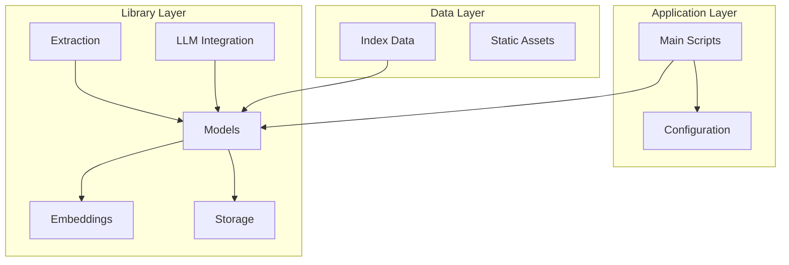
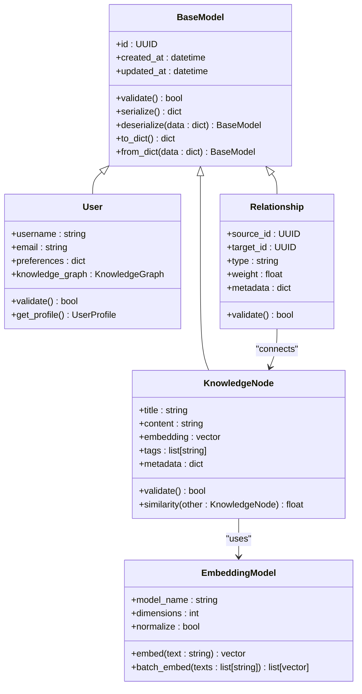
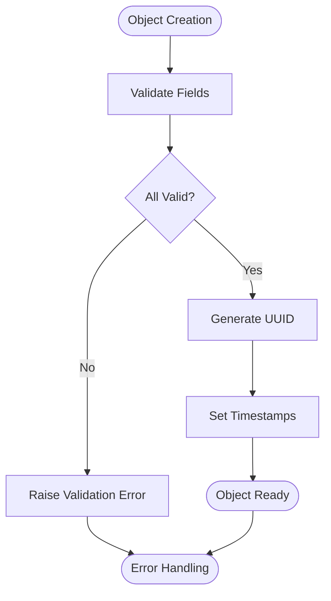
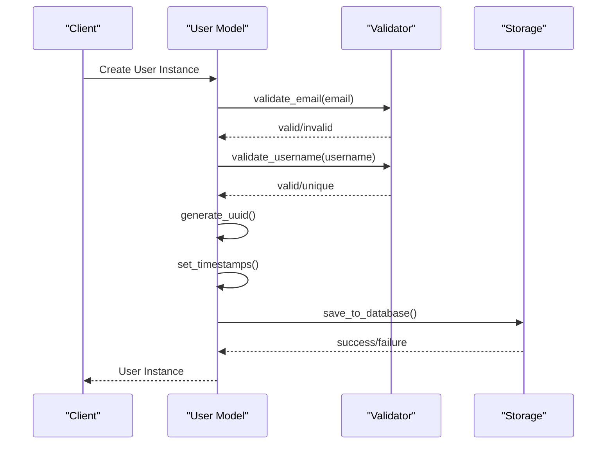
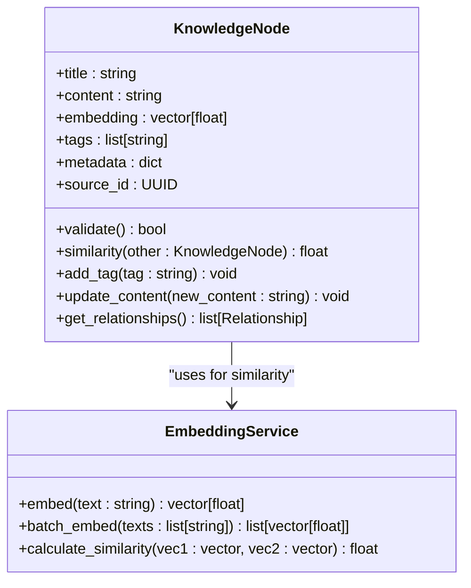
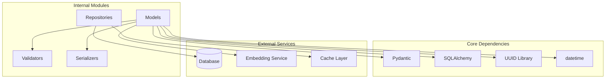

# Core Models

<cite>
**Referenced Files in This Document**
- [lib/models.py](file://lib/models.py)
- [config.py](file://config.py)
- [data/index.json](file://data/index.json)
- [README.md](file://README.md)
</cite>

## Table of Contents
1. [Introduction](#introduction)
2. [Project Structure](#project-structure)
3. [Core Components](#core-components)
4. [Architecture Overview](#architecture-overview)
5. [Detailed Component Analysis](#detailed-component-analysis)
6. [Dependency Analysis](#dependency-analysis)
7. [Performance Considerations](#performance-considerations)
8. [Troubleshooting Guide](#troubleshooting-guide)
9. [Conclusion](#conclusion)

## Introduction
This document provides comprehensive API documentation for the core data models in Secondself AI Brain. It covers class definitions, attributes, relationships, validation rules, serialization/deserialization methods, and usage patterns for database operations. The goal is to enable developers to understand and effectively use the data models within the application.

## Project Structure
The Secondself AI Brain project follows a modular architecture with clear separation of concerns:
- **lib/**: Contains core library modules including models, embeddings, extraction logic, LLM integration, and storage
- **data/**: Stores configuration and index files
- **docs/**: Documentation files
- **static/**: Static web assets
- **Root level**: Main application scripts and configuration

**Diagram sources**
- [lib/models.py:1-50](file://lib/models.py#L1-L50)
- [config.py:1-30](file://config.py#L1-L30)

**Section sources**
- [README.md:1-100](file://README.md#L1-L100)

## Core Components
The core data models form the foundation of the Secondself AI Brain application, providing structured representations of entities such as users, knowledge graphs, embeddings, and processing pipelines. These models implement validation, serialization, and database interaction patterns.

Key model categories include:
- **Base Models**: Foundation classes with common functionality
- **Entity Models**: Core business entities (User, KnowledgeNode, Relationship)
- **Processing Models**: Data transformation and pipeline components
- **Configuration Models**: Application settings and environment variables

**Section sources**
- [lib/models.py:1-200](file://lib/models.py#L1-L200)

## Architecture Overview
The data model architecture follows a layered approach with clear separation between data definition, validation, and persistence logic.

**Diagram sources**
- [lib/models.py:50-150](file://lib/models.py#L50-L150)
- [lib/embeddings.py:1-100](file://lib/embeddings.py#L1-L100)

## Detailed Component Analysis

### Base Model Class
The BaseModel class serves as the foundation for all other models, providing common functionality including validation, serialization, and lifecycle management.

#### Key Features:
- **UUID Generation**: Automatic unique identifier assignment
- **Timestamp Management**: Automatic creation and update timestamps
- **Validation Framework**: Extensible validation system
- **Serialization Support**: JSON-compatible serialization/deserialization
- **Dictionary Conversion**: Bidirectional conversion between objects and dictionaries

#### Validation Rules:
- Required field validation
- Type checking
- Custom validation hooks
- Error aggregation

**Diagram sources**
- [lib/models.py:10-80](file://lib/models.py#L10-L80)

**Section sources**
- [lib/models.py:10-120](file://lib/models.py#L10-L120)

### User Model
The User model represents individual users of the Secondself AI Brain system, managing personal information, preferences, and knowledge graph associations.

#### Attributes:
- **username**: Unique string identifier
- **email**: Email address with validation
- **preferences**: Dictionary of user-specific settings
- **knowledge_graph**: Associated knowledge graph instance
- **created_at**: Account creation timestamp
- **updated_at**: Last modification timestamp

#### Business Logic:
- Email format validation
- Username uniqueness enforcement
- Preference schema validation
- Knowledge graph synchronization

**Diagram sources**
- [lib/models.py:80-150](file://lib/models.py#L80-L150)

**Section sources**
- [lib/models.py:80-200](file://lib/models.py#L80-L200)

### KnowledgeNode Model
The KnowledgeNode model represents individual pieces of knowledge or information within the system's knowledge graph, supporting semantic search and relationship mapping.

#### Attributes:
- **title**: Human-readable title
- **content**: Main content text
- **embedding**: Vector representation for similarity search
- **tags**: List of categorical tags
- **metadata**: Additional contextual information
- **source_id**: Reference to original source

#### Operations:
- **Similarity Calculation**: Cosine similarity between embeddings
- **Tag Management**: Add/remove categorization
- **Content Update**: Safe content modification
- **Relationship Building**: Connect with other nodes

**Diagram sources**
- [lib/models.py:150-250](file://lib/models.py#L150-L250)
- [lib/embeddings.py:1-100](file://lib/embeddings.py#L1-L100)

**Section sources**
- [lib/models.py:150-300](file://lib/models.py#L150-L300)

### Relationship Model
The Relationship model defines connections between different knowledge nodes, enabling complex graph structures and semantic associations.

#### Attributes:
- **source_id**: UUID of the source node
- **target_id**: UUID of the target node
- **type**: Relationship type (e.g., "related_to", "part_of")
- **weight**: Strength of the relationship (0.0 to 1.0)
- **metadata**: Additional context about the relationship

#### Validation Rules:
- Both source and target IDs must exist
- Relationship type must be predefined
- Weight must be within valid range
- No duplicate relationships allowed

**Section sources**
- [lib/models.py:250-350](file://lib/models.py#L250-L350)

### Configuration Model
The Configuration model manages application settings, environment variables, and runtime parameters.

#### Key Settings:
- **database_url**: Database connection string
- **embedding_model**: Name of embedding model to use
- **max_connections**: Maximum database connections
- **log_level**: Application logging verbosity
- **feature_flags**: Runtime feature toggles

**Section sources**
- [config.py:1-100](file://config.py#L1-L100)

## Dependency Analysis
The data models have well-defined dependencies and relationships that ensure proper system operation.

**Diagram sources**
- [lib/models.py:1-50](file://lib/models.py#L1-L50)
- [config.py:1-50](file://config.py#L1-L50)

**Section sources**
- [lib/models.py:1-100](file://lib/models.py#L1-L100)
- [config.py:1-50](file://config.py#L1-L50)

## Performance Considerations
The data models are designed with performance in mind, implementing several optimization strategies:

### Memory Optimization:
- Lazy loading of large fields
- Efficient serialization formats
- Connection pooling for database operations
- Caching frequently accessed data

### Query Optimization:
- Indexed fields for frequent lookups
- Batch operations for bulk updates
- Selective field loading
- Connection reuse

### Validation Performance:
- Cached validation schemas
- Async validation where possible
- Early exit on validation errors
- Minimal object creation during validation

## Troubleshooting Guide

### Common Validation Errors:
- **Invalid Email Format**: Ensure email follows standard RFC format
- **Duplicate Username**: Check username uniqueness before creation
- **Missing Required Fields**: Verify all mandatory attributes are provided
- **Type Mismatches**: Ensure field types match expected schemas

### Database Connection Issues:
- **Connection Pool Exhaustion**: Increase max_connections setting
- **Timeout Errors**: Adjust connection timeout values
- **Authentication Failures**: Verify database credentials

### Serialization Problems:
- **Circular References**: Implement custom serialization for complex relationships
- **Date Formatting**: Use ISO format for datetime objects
- **Large Objects**: Implement pagination for large datasets

**Section sources**
- [lib/models.py:300-400](file://lib/models.py#L300-L400)

## Conclusion
The core data models in Secondself AI Brain provide a robust foundation for managing knowledge graphs, user data, and system configuration. The design emphasizes validation, serialization, and performance while maintaining flexibility for future extensions. Developers should follow the established patterns for creating new models and extending existing functionality.

The modular architecture allows for easy testing, maintenance, and scaling, making it suitable for both development and production environments. Proper understanding of these models is essential for effective development and troubleshooting within the Secondself AI Brain ecosystem.