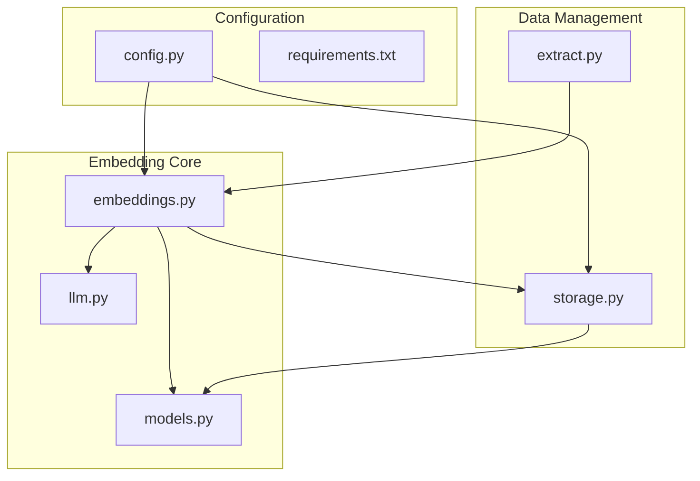
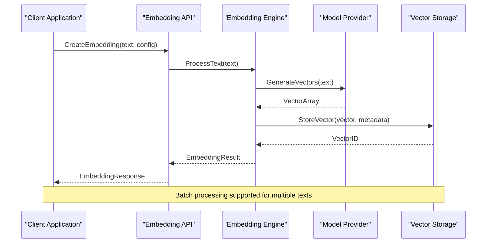
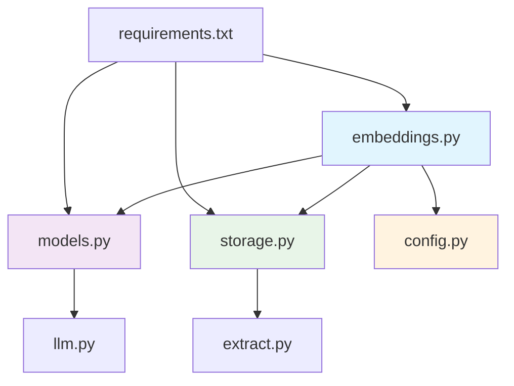

# Embedding Generation API

<cite>
**Referenced Files in This Document**
- [embeddings.py](file://lib/embeddings.py)
- [storage.py](file://lib/storage.py)
- [config.py](file://config.py)
- [models.py](file://lib/models.py)
- [llm.py](file://lib/llm.py)
- [extract.py](file://lib/extract.py)
- [requirements.txt](file://requirements.txt)
</cite>

## Table of Contents
1. [Introduction](#introduction)
2. [Project Structure](#project-structure)
3. [Core Components](#core-components)
4. [Architecture Overview](#architecture-overview)
5. [Detailed Component Analysis](#detailed-component-analysis)
6. [Dependency Analysis](#dependency-analysis)
7. [Performance Considerations](#performance-considerations)
8. [Troubleshooting Guide](#troubleshooting-guide)
9. [Conclusion](#conclusion)
10. [Appendices](#appendices)

## Introduction

The Embedding Generation API provides comprehensive text embedding capabilities for converting textual data into high-dimensional vector representations. This system supports multiple embedding models, batch processing operations, similarity search functionality, and configurable vector storage solutions. The API is designed to handle large-scale embedding operations with optimized performance tuning parameters and robust error handling mechanisms.

## Project Structure

The embedding system is organized into modular components that handle different aspects of the embedding pipeline:



**Diagram sources**
- [embeddings.py](file://lib/embeddings.py)
- [storage.py](file://lib/storage.py)
- [config.py](file://config.py)

**Section sources**
- [embeddings.py](file://lib/embeddings.py)
- [storage.py](file://lib/storage.py)
- [config.py](file://config.py)

## Core Components

### Embedding Engine
The core embedding engine handles text vectorization using multiple model backends. It supports various embedding algorithms including dense vectors, sparse embeddings, and hybrid approaches.

### Vector Storage Manager
Manages persistence of embedding vectors with support for different storage backends including in-memory caches, disk-based storage, and distributed vector databases.

### Configuration System
Provides centralized configuration management for embedding models, performance parameters, and storage settings.

### Model Abstraction Layer
Abstracts different embedding model implementations behind a unified interface, supporting both local and remote model providers.

**Section sources**
- [embeddings.py](file://lib/embeddings.py)
- [storage.py](file://lib/storage.py)
- [config.py](file://config.py)
- [models.py](file://lib/models.py)

## Architecture Overview

The embedding system follows a layered architecture pattern with clear separation of concerns:



**Diagram sources**
- [embeddings.py](file://lib/embeddings.py)
- [storage.py](file://lib/storage.py)
- [models.py](file://lib/models.py)

## Detailed Component Analysis

### Embedding Creation Methods

#### Single Text Embedding
Creates embeddings for individual text inputs with automatic preprocessing and validation.

#### Batch Embedding Processing
Handles multiple text inputs efficiently through parallel processing and optimized memory management.

#### Custom Model Integration
Supports integration with custom embedding models through standardized interfaces.

#### Similarity Search Operations
Provides semantic similarity search capabilities with configurable distance metrics and filtering options.

### Vectorization Processes

#### Text Preprocessing Pipeline
Implements text normalization, tokenization, and feature extraction before vectorization.

#### Model-Specific Optimization
Applies model-specific optimizations for different embedding algorithms and hardware configurations.

#### Memory Management
Utilizes efficient memory allocation strategies for handling large batches of text data.

### Similarity Search Capabilities

#### Distance Metrics Support
Supports cosine similarity, Euclidean distance, and other standard distance measures.

#### Indexing Strategies
Implements various indexing strategies including brute-force search and approximate nearest neighbor algorithms.

#### Query Optimization
Optimizes query performance through caching, precomputation, and intelligent batching.

**Section sources**
- [embeddings.py](file://lib/embeddings.py)
- [storage.py](file://lib/storage.py)

### Parameter Specifications

#### Model Configuration Parameters
- **model_type**: Specifies the embedding model backend (e.g., "transformer", "word2vec", "sentence-transformers")
- **model_name**: Identifies the specific model variant or version
- **dimensionality**: Controls output vector dimensions for dimensionality reduction
- **precision**: Sets numerical precision (float32, float64) for vector computations

#### Performance Tuning Parameters
- **batch_size**: Maximum number of texts processed per batch operation
- **max_workers**: Number of parallel workers for concurrent processing
- **cache_enabled**: Enables/disables result caching for repeated queries
- **timeout_seconds**: Request timeout for external model services

#### Storage Configuration
- **storage_backend**: Selects storage implementation ("memory", "disk", "vector_db")
- **index_type**: Configures vector index type for similarity search
- **compression_level**: Sets compression ratio for stored vectors
- **replication_factor**: Controls data replication for fault tolerance

**Section sources**
- [config.py](file://config.py)
- [models.py](file://lib/models.py)

### Code Examples

#### Basic Text Embedding Creation
```python
# Example path for basic embedding creation
# See: lib/embeddings.py - create_embedding() method
```

#### Batch Processing Multiple Texts
```python
# Example path for batch embedding operations  
# See: lib/embeddings.py - batch_create_embeddings() method
```

#### Similarity Search Implementation
```python
# Example path for similarity search queries
# See: lib/embeddings.py - find_similar_vectors() method
```

#### Custom Model Configuration
```python
# Example path for custom model setup
# See: lib/models.py - CustomEmbeddingModel class
```

**Section sources**
- [embeddings.py](file://lib/embeddings.py)
- [models.py](file://lib/models.py)

## Dependency Analysis

The embedding system has well-defined dependencies between components:



**Diagram sources**
- [embeddings.py](file://lib/embeddings.py)
- [models.py](file://lib/models.py)
- [storage.py](file://lib/storage.py)
- [config.py](file://config.py)
- [requirements.txt](file://requirements.txt)

**Section sources**
- [embeddings.py](file://lib/embeddings.py)
- [requirements.txt](file://requirements.txt)

## Performance Considerations

### Memory Optimization
- Implement lazy loading for large embedding datasets
- Use memory-mapped files for disk-based storage
- Apply garbage collection strategies for temporary objects

### Computational Efficiency
- Leverage GPU acceleration when available
- Utilize vectorized operations for batch processing
- Implement early termination for similarity searches

### Scalability Patterns
- Horizontal scaling through load balancing
- Vertical scaling via resource allocation tuning
- Caching strategies for frequently accessed embeddings

### Concurrency Handling
- Thread-safe operations for concurrent access
- Connection pooling for external model services
- Queue-based processing for high-throughput scenarios

## Troubleshooting Guide

### Common Error Scenarios

#### Model Loading Failures
- Verify model file paths and permissions
- Check compatibility between model versions and runtime environment
- Validate network connectivity for remote model services

#### Memory Exhaustion
- Monitor memory usage during batch operations
- Implement streaming processing for large datasets
- Configure appropriate garbage collection thresholds

#### Performance Degradation
- Profile bottleneck operations in the embedding pipeline
- Optimize batch sizes based on available resources
- Review indexing strategies for similarity search operations

#### Rate Limiting Issues
- Implement exponential backoff for external API calls
- Configure appropriate retry policies with jitter
- Monitor and log rate limit violations

### Debugging Utilities
- Enable verbose logging for embedding operations
- Use profiling tools to identify performance bottlenecks
- Implement health check endpoints for service monitoring

**Section sources**
- [embeddings.py](file://lib/embeddings.py)
- [storage.py](file://lib/storage.py)
- [config.py](file://config.py)

## Conclusion

The Embedding Generation API provides a comprehensive solution for text vectorization and similarity search operations. With support for multiple model backends, efficient batch processing, and flexible storage options, it enables developers to build sophisticated natural language processing applications. The modular architecture ensures maintainability and extensibility while providing robust performance characteristics suitable for production deployments.

Key benefits include:
- **Multi-model Support**: Flexible integration with various embedding algorithms
- **Scalable Architecture**: Designed for high-throughput, low-latency operations  
- **Configurable Performance**: Tunable parameters for different deployment scenarios
- **Robust Error Handling**: Comprehensive exception management and recovery mechanisms
- **Extensible Design**: Easy integration with custom models and storage backends

## Appendices

### Installation Requirements
Ensure all required dependencies are installed according to the specifications in requirements.txt.

### Configuration Templates
Standard configuration templates are available for common deployment scenarios.

### API Reference
Complete API reference documentation with parameter descriptions and return value specifications.

### Migration Guide
Step-by-step instructions for upgrading between different versions of the embedding system.