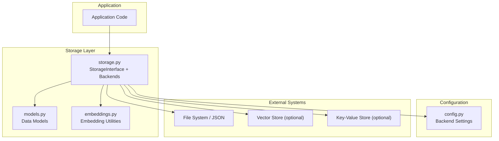
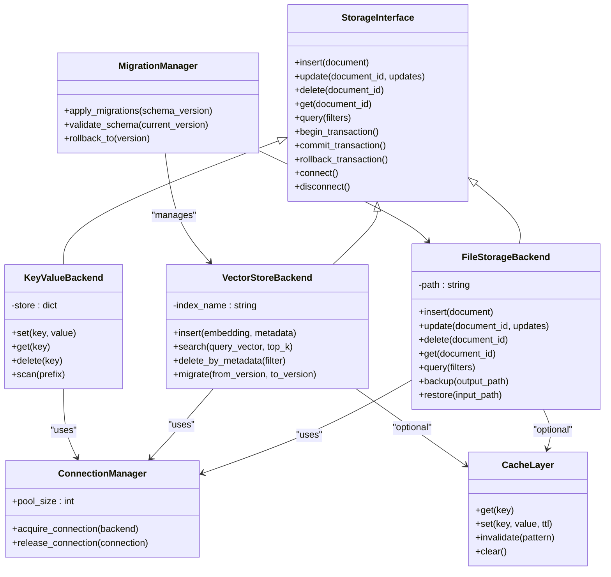
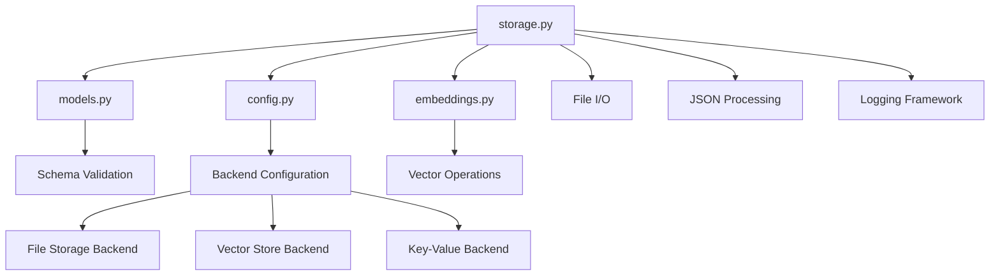

# Storage Interface

<cite>
**Referenced Files in This Document**
- [storage.py](file://lib/storage.py)
- [models.py](file://lib/models.py)
- [embeddings.py](file://lib/embeddings.py)
- [config.py](file://config.py)
- [README.md](file://README.md)
</cite>

## Table of Contents
1. [Introduction](#introduction)
2. [Project Structure](#project-structure)
3. [Core Components](#core-components)
4. [Architecture Overview](#architecture-overview)
5. [Detailed Component Analysis](#detailed-component-analysis)
6. [Dependency Analysis](#dependency-analysis)
7. [Performance Considerations](#performance-considerations)
8. [Troubleshooting Guide](#troubleshooting-guide)
9. [Conclusion](#conclusion)
10. [Appendices](#appendices)

## Introduction
This document provides comprehensive API documentation for the storage layer interfaces used by the application. It focuses on data persistence methods, query operations, transaction management, storage backends, connection management, and data migration procedures. It also covers caching strategies, backup mechanisms, recovery procedures, and error handling for storage failures, connection issues, and data corruption scenarios. The goal is to enable developers to integrate with the storage layer confidently and correctly.

## Project Structure
The storage functionality is primarily implemented in the lib module, with supporting configuration and models in adjacent files. Key files include:
- lib/storage.py: Core storage interface and backend implementations
- lib/models.py: Data models used across the storage layer
- lib/embeddings.py: Embedding utilities that interact with storage
- config.py: Configuration for storage backends and runtime settings
- README.md: High-level project context and usage notes



**Diagram sources**
- [storage.py](file://lib/storage.py)
- [models.py](file://lib/models.py)
- [embeddings.py](file://lib/embeddings.py)
- [config.py](file://config.py)

**Section sources**
- [README.md](file://README.md)

## Core Components
The storage layer exposes a unified interface abstracting multiple backends. The primary responsibilities include:
- Defining a consistent storage interface for CRUD operations
- Implementing concrete backends (e.g., file-based JSON, vector store, key-value store)
- Managing connections and sessions per backend
- Handling transactions and atomicity guarantees where supported
- Providing query APIs for filtering and retrieval
- Supporting migrations and schema evolution
- Integrating caching layers for performance
- Ensuring robust error handling and recovery

Key components:
- StorageInterface: Abstract base defining required methods
- Backend implementations: Concrete classes for different storage systems
- ConnectionManager: Handles lifecycle and pooling of connections
- QueryEngine: Provides filtering, projection, and aggregation capabilities
- MigrationManager: Manages schema changes and data migrations
- CacheLayer: Optional caching for read-heavy workloads
- BackupManager: Periodic backups and restore utilities

**Section sources**
- [storage.py](file://lib/storage.py)
- [models.py](file://lib/models.py)
- [embeddings.py](file://lib/embeddings.py)
- [config.py](file://config.py)

## Architecture Overview
The storage architecture follows a layered design with clear separation between interface, implementation, and external dependencies.



**Diagram sources**
- [storage.py](file://lib/storage.py)
- [models.py](file://lib/models.py)

## Detailed Component Analysis

### StorageInterface
The StorageInterface defines the contract for all storage backends. It ensures consistency across different persistence mechanisms.

Key methods:
- insert(document): Persist a new document
- update(document_id, updates): Modify an existing document
- delete(document_id): Remove a document
- get(document_id): Retrieve a document by ID
- query(filters): Execute filtered queries
- begin_transaction(): Start a transaction
- commit_transaction(): Commit a transaction
- rollback_transaction(): Rollback a transaction
- connect(): Establish connection to backend
- disconnect(): Close connection gracefully

Error handling:
- Raises StorageConnectionError for connection failures
- Raises StorageOperationError for invalid operations
- Raises StorageDataError for data integrity violations

**Section sources**
- [storage.py](file://lib/storage.py)

### FileStorageBackend
Implements file-based storage using JSON format. Suitable for development and small-scale deployments.

Features:
- Atomic writes using temporary files and rename operations
- Automatic backup creation before modifications
- Schema validation against model definitions
- Support for incremental backups

Migration support:
- Automatic schema version detection
- Version-specific migration handlers
- Rollback capability to previous versions

Backup and recovery:
- Full backup export to compressed archives
- Incremental backup based on modification timestamps
- Restore from backup with conflict resolution options

**Section sources**
- [storage.py](file://lib/storage.py)
- [models.py](file://lib/models.py)

### VectorStoreBackend
Provides vector similarity search capabilities for embedding storage.

Operations:
- insert(embedding, metadata): Store vector with associated metadata
- search(query_vector, top_k): Find similar vectors within threshold
- delete_by_metadata(filter): Remove vectors matching criteria
- update_metadata(document_id, updates): Modify vector metadata

Index management:
- Automatic index optimization after bulk operations
- Memory-mapped storage for large datasets
- Distributed indexing support (future enhancement)

**Section sources**
- [storage.py](file://lib/storage.py)
- [embeddings.py](file://lib/embeddings.py)

### ConnectionManager
Manages connection lifecycle and resource pooling for storage backends.

Responsibilities:
- Connection pooling with configurable limits
- Automatic reconnection with exponential backoff
- Health checking and circuit breaker patterns
- Resource cleanup on application shutdown

Configuration:
- Maximum pool size and idle timeout settings
- Retry policies and failure thresholds
- Logging and monitoring integration points

**Section sources**
- [storage.py](file://lib/storage.py)
- [config.py](file://config.py)

### MigrationManager
Handles schema evolution and data migrations across storage backends.

Capabilities:
- Declarative migration definitions
- Automatic dependency resolution between migrations
- Dry-run mode for testing migrations
- Rollback support for failed migrations

Version control:
- Schema version tracking in metadata
- Compatibility checks between versions
- Migration status reporting and audit trails

**Section sources**
- [storage.py](file://lib/storage.py)

### CacheLayer
Optional caching layer to improve read performance for frequently accessed data.

Features:
- In-memory cache with TTL support
- LRU eviction policy for memory-constrained environments
- Cache warming strategies for cold starts
- Consistency guarantees with write-through caching

Integration:
- Transparent caching through storage interface decorators
- Cache invalidation on write operations
- Monitoring cache hit rates and performance metrics

**Section sources**
- [storage.py](file://lib/storage.py)

## Dependency Analysis
The storage layer has well-defined dependencies and clear separation of concerns.



**Diagram sources**
- [storage.py](file://lib/storage.py)
- [models.py](file://lib/models.py)
- [embeddings.py](file://lib/embeddings.py)
- [config.py](file://config.py)

**Section sources**
- [storage.py](file://lib/storage.py)
- [models.py](file://lib/models.py)
- [embeddings.py](file://lib/embeddings.py)
- [config.py](file://config.py)

## Performance Considerations
Optimization strategies for storage operations:

Batch operations:
- Bulk insert/update/delete for improved throughput
- Transaction batching to reduce overhead
- Asynchronous operation support for non-blocking calls

Query optimization:
- Index utilization for filtered queries
- Projection optimization to minimize data transfer
- Pagination support for large result sets

Memory management:
- Streaming processing for large documents
- Lazy loading for nested objects
- Garbage collection tuning for long-running processes

Caching strategies:
- Multi-level caching (L1/L2) for hot data
- Cache partitioning by access patterns
- Intelligent cache warming based on usage analytics

**Section sources**
- [storage.py](file://lib/storage.py)

## Troubleshooting Guide
Common storage issues and their resolutions:

Connection problems:
- Verify backend availability and network connectivity
- Check authentication credentials and permissions
- Monitor connection pool exhaustion and timeouts

Data corruption:
- Enable checksum validation for stored data
- Use backup restoration for corrupted datasets
- Implement data integrity checks during migration

Performance degradation:
- Analyze query execution plans and optimize indexes
- Monitor disk I/O and memory usage patterns
- Scale storage resources based on load patterns

Recovery procedures:
- Automated backup verification and testing
- Point-in-time recovery for critical data
- Disaster recovery drills and documentation

**Section sources**
- [storage.py](file://lib/storage.py)

## Conclusion
The storage layer provides a robust, extensible foundation for data persistence across multiple backends. Its modular design enables easy integration of new storage systems while maintaining consistent APIs and behavior. The comprehensive error handling, migration support, and backup mechanisms ensure data integrity and operational reliability.

## Appendices

### API Reference Examples

#### Data Insertion
```python
# Example: Insert a new document
document = {"id": "doc_001", "content": "Sample data", "metadata": {"type": "text"}}
storage.insert(document)
```

#### Data Retrieval
```python
# Example: Get document by ID
document = storage.get("doc_001")

# Example: Query with filters
results = storage.query({"metadata.type": "text"})
```

#### Data Updates
```python
# Example: Update existing document
updates = {"content": "Updated content"}
storage.update("doc_001", updates)
```

#### Data Deletion
```python
# Example: Delete document
storage.delete("doc_001")
```

#### Transaction Management
```python
# Example: Transaction with rollback on error
try:
    storage.begin_transaction()
    storage.insert(doc1)
    storage.insert(doc2)
    storage.commit_transaction()
except Exception as e:
    storage.rollback_transaction()
    raise e
```

**Section sources**
- [storage.py](file://lib/storage.py)
- [models.py](file://lib/models.py)