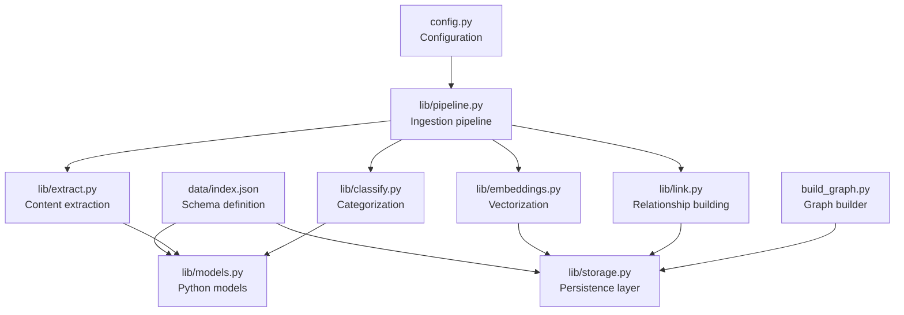
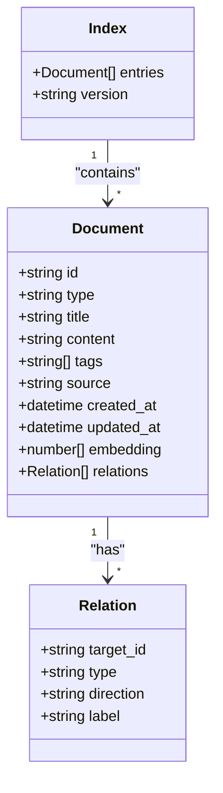
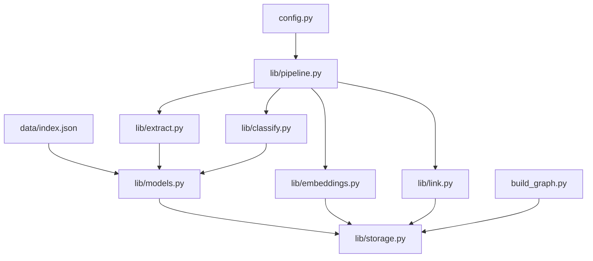

# Data Schema & Index Structure

<cite>
**Referenced Files in This Document**
- [index.json](file://data/index.json)
- [storage.py](file://lib/storage.py)
- [extract.py](file://lib/extract.py)
- [embeddings.py](file://lib/embeddings.py)
- [models.py](file://lib/models.py)
- [config.py](file://config.py)
- [pipeline.py](file://pipeline.py)
- [classify.py](file://classify.py)
- [link.py](file://link.py)
- [build_graph.py](file://build_graph.py)
</cite>

## Table of Contents
1. [Introduction](#introduction)
2. [Project Structure](#project-structure)
3. [Core Components](#core-components)
4. [Architecture Overview](#architecture-overview)
5. [Detailed Component Analysis](#detailed-component-analysis)
6. [Dependency Analysis](#dependency-analysis)
7. [Performance Considerations](#performance-considerations)
8. [Troubleshooting Guide](#troubleshooting-guide)
9. [Conclusion](#conclusion)
10. [Appendices](#appendices)

## Introduction
This document explains the data schema and index structure used by the system, focusing on how documents are represented, indexed, categorized, and related within the application. It provides a clear guide to the JSON schema format, field definitions, data types, validation rules, and extension points for custom document types and metadata fields. The goal is to make it easy for both new users and contributors to understand and extend the indexing model safely and consistently.

## Project Structure
The project organizes data schemas and indexing logic across a small set of core files:
- data/index.json defines the canonical schema for indexed documents and their relationships.
- lib/storage.py handles persistence and retrieval of index entries.
- lib/extract.py parses raw content into structured fields aligned with the schema.
- lib/embeddings.py computes embeddings for searchable text fields.
- lib/models.py defines Python models that mirror the schema for type safety.
- config.py centralizes configuration such as embedding dimensions and storage paths.
- pipeline.py orchestrates ingestion, extraction, embedding, and linking steps.
- classify.py assigns categories or tags to documents based on content.
- link.py builds relationships between documents using semantic or rule-based matching.
- build_graph.py constructs a graph view from the index for visualization.



**Diagram sources**
- [index.json](file://data/index.json)
- [storage.py](file://lib/storage.py)
- [extract.py](file://lib/extract.py)
- [embeddings.py](file://lib/embeddings.py)
- [models.py](file://lib/models.py)
- [config.py](file://config.py)
- [pipeline.py](file://pipeline.py)
- [classify.py](file://classify.py)
- [link.py](file://link.py)
- [build_graph.py](file://build_graph.py)

**Section sources**
- [index.json](file://data/index.json)
- [storage.py](file://lib/storage.py)
- [extract.py](file://lib/extract.py)
- [embeddings.py](file://lib/embeddings.py)
- [models.py](file://lib/models.py)
- [config.py](file://config.py)
- [pipeline.py](file://pipeline.py)
- [classify.py](file://classify.py)
- [link.py](file://link.py)
- [build_graph.py](file://build_graph.py)

## Core Components
The index schema centers around a collection of document entries, each representing an entity with typed fields, optional nested structures, and relationships to other entities. Key aspects include:
- Document identity and versioning for safe updates.
- Content fields for text, links, and media references.
- Metadata fields for categorization, provenance, and timestamps.
- Embedding vectors for semantic search.
- Relationships defining edges between documents (e.g., references, citations).

Typical fields and roles:
- id: Unique identifier for the document.
- type: Category or document kind (e.g., note, article, task).
- title: Human-readable name.
- content: Primary textual content; may be split into sections.
- tags: List of labels for filtering and grouping.
- created_at / updated_at: Timestamps for lifecycle tracking.
- source: Origin of the content (URL, file path, etc.).
- embedding: Vector representation for similarity search.
- relations: Array of relationships pointing to other document ids.

Validation rules generally enforce:
- Presence of required fields (id, type, title).
- Type constraints for each field (string, array, object).
- Non-empty content when applicable.
- Valid reference formats for relations and source.

Extensibility:
- New document types can be added by defining additional type values and corresponding metadata fields.
- Custom metadata fields should follow naming conventions and be documented in the schema.
- Relations can be extended with typed edges and directionality if needed.

**Section sources**
- [index.json](file://data/index.json)
- [models.py](file://lib/models.py)
- [storage.py](file://lib/storage.py)

## Architecture Overview
The indexing architecture integrates extraction, classification, embedding, and relationship building into a cohesive pipeline. Documents flow through these stages before being persisted in the index.

```mermaid
sequenceDiagram
participant User as "User"
participant Pipeline as "pipeline.py"
participant Extract as "extract.py"
participant Classify as "classify.py"
participant Embed as "embeddings.py"
participant Link as "link.py"
participant Storage as "storage.py"
participant Index as "data/index.json"
User->>Pipeline : "Submit content"
Pipeline->>Extract : "Parse and extract fields"
Extract-->>Pipeline : "Structured document"
Pipeline->>Classify : "Assign category/tags"
Classify-->>Pipeline : "Updated document"
Pipeline->>Embed : "Compute embeddings"
Embed-->>Pipeline : "Vectorized fields"
Pipeline->>Link : "Build relationships"
Link-->>Pipeline : "Relations added"
Pipeline->>Storage : "Persist to index"
Storage-->>Index : "Write entry"
Pipeline-->>User : "Indexed document"
```

**Diagram sources**
- [pipeline.py](file://pipeline.py)
- [extract.py](file://lib/extract.py)
- [classify.py](file://classify.py)
- [embeddings.py](file://lib/embeddings.py)
- [link.py](file://link.py)
- [storage.py](file://lib/storage.py)
- [index.json](file://data/index.json)

## Detailed Component Analysis

### Index Schema Definition
The index schema defines the shape of each document entry and the overall index structure. It includes:
- Top-level container for entries.
- Entry schema specifying required and optional fields.
- Field types and constraints.
- Nested objects for complex metadata.
- Arrays for tags and relations.

Key considerations:
- Ensure id uniqueness across the index.
- Maintain consistent timestamp formats.
- Keep embedding dimensions aligned with configured vectorizer.
- Validate relation targets exist or are deferred until resolution.



**Diagram sources**
- [index.json](file://data/index.json)
- [models.py](file://lib/models.py)

**Section sources**
- [index.json](file://data/index.json)
- [models.py](file://lib/models.py)

### Extraction and Normalization
Extraction transforms raw inputs into normalized fields aligned with the schema:
- Parses text into structured sections.
- Extracts URLs, mentions, and attachments.
- Cleans and normalizes strings.
- Populates metadata like source and timestamps.

Validation during extraction ensures:
- Required fields are present.
- Types match expectations.
- Content length and formatting meet constraints.

**Section sources**
- [extract.py](file://lib/extract.py)
- [models.py](file://lib/models.py)

### Classification and Tagging
Classification assigns categories and tags based on content analysis:
- Rule-based heuristics or ML classifiers.
- Confidence scores for automated decisions.
- Manual overrides supported.

Outputs update the document’s type and tags accordingly.

**Section sources**
- [classify.py](file://classify.py)
- [models.py](file://lib/models.py)

### Embedding Generation
Embedding generation converts text fields into vectors:
- Uses configured embedding model.
- Handles chunking for large content.
- Stores vectors alongside documents.

Constraints:
- Dimensionality must match configuration.
- Vectors should be normalized if required by search.

**Section sources**
- [embeddings.py](file://lib/embeddings.py)
- [config.py](file://config.py)

### Relationship Building
Relationship building connects documents via:
- Explicit references in content.
- Semantic similarity thresholds.
- Rule-based patterns (e.g., citations).

Outputs populate the relations array with typed edges.

**Section sources**
- [link.py](file://link.py)
- [storage.py](file://lib/storage.py)

### Persistence and Retrieval
Persistence manages writing and reading index entries:
- Atomic updates to avoid corruption.
- Versioning for rollback capability.
- Efficient queries by id, type, tags, and embeddings.

Retrieval supports:
- Exact matches.
- Filtered searches.
- Similarity search using embeddings.

**Section sources**
- [storage.py](file://lib/storage.py)
- [index.json](file://data/index.json)

### Graph Construction
Graph construction visualizes relationships:
- Aggregates relations into nodes and edges.
- Supports export for external tools.
- Enables interactive exploration.

**Section sources**
- [build_graph.py](file://build_graph.py)
- [storage.py](file://lib/storage.py)

## Dependency Analysis
The schema and indexing components have clear dependencies:
- models.py depends on index.json for type definitions.
- storage.py reads/writes index.json and uses models.py for serialization.
- extract.py, classify.py, embeddings.py, and link.py produce outputs conforming to models.py.
- pipeline.py orchestrates these modules and relies on config.py for settings.



**Diagram sources**
- [index.json](file://data/index.json)
- [models.py](file://lib/models.py)
- [storage.py](file://lib/storage.py)
- [extract.py](file://lib/extract.py)
- [classify.py](file://classify.py)
- [embeddings.py](file://lib/embeddings.py)
- [link.py](file://link.py)
- [pipeline.py](file://pipeline.py)
- [config.py](file://config.py)
- [build_graph.py](file://build_graph.py)

**Section sources**
- [index.json](file://data/index.json)
- [models.py](file://lib/models.py)
- [storage.py](file://lib/storage.py)
- [extract.py](file://lib/extract.py)
- [classify.py](file://classify.py)
- [embeddings.py](file://lib/embeddings.py)
- [link.py](file://link.py)
- [pipeline.py](file://pipeline.py)
- [config.py](file://config.py)
- [build_graph.py](file://build_graph.py)

## Performance Considerations
- Batch processing: Group extractions and embeddings to reduce overhead.
- Chunking: Split large content to fit embedding limits.
- Index size: Prune outdated entries and compress vectors if possible.
- Query optimization: Use filters before similarity search to narrow results.
- Concurrency: Parallelize independent tasks while maintaining write consistency.

[No sources needed since this section provides general guidance]

## Troubleshooting Guide
Common issues and resolutions:
- Validation errors: Check required fields and types against the schema.
- Missing relations: Ensure target ids exist or defer resolution.
- Embedding mismatches: Verify dimensionality and normalization settings.
- Persistence failures: Confirm atomic writes and backup strategies.
- Classification inaccuracies: Review classifier thresholds and manual overrides.

**Section sources**
- [storage.py](file://lib/storage.py)
- [extract.py](file://lib/extract.py)
- [embeddings.py](file://lib/embeddings.py)
- [classify.py](file://classify.py)

## Conclusion
The data schema and index structure provide a robust foundation for organizing, searching, and relating documents. By adhering to the defined fields, types, and validation rules, you can reliably extend the system with new document types and metadata. The modular architecture enables flexible integration of extraction, classification, embedding, and linking processes, ensuring scalability and maintainability.

[No sources needed since this section summarizes without analyzing specific files]

## Appendices

### Extending the Schema
To add a new document type:
- Define the type value in the schema.
- Add any new metadata fields with appropriate types.
- Update models.py to reflect changes.
- Adjust extraction and classification logic to populate new fields.
- Validate with test entries before deployment.

**Section sources**
- [index.json](file://data/index.json)
- [models.py](file://lib/models.py)
- [extract.py](file://lib/extract.py)
- [classify.py](file://classify.py)

### Example Valid Index Entries
Valid entries typically include:
- A note with title, content, tags, and timestamp.
- An article with source URL and extracted sections.
- A task with due date and status metadata.
- Each entry has a unique id and may contain relations to others.

**Section sources**
- [index.json](file://data/index.json)

### Nested Structures and Relationships
Nested structures allow grouping related metadata:
- Sections within content.
- Attachments with metadata.
- Relations with typed edges and directions.

Relationships enable:
- References between notes.
- Citations in articles.
- Dependencies in tasks.

**Section sources**
- [index.json](file://data/index.json)
- [link.py](file://link.py)