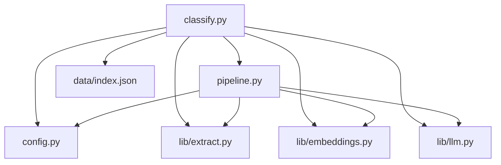
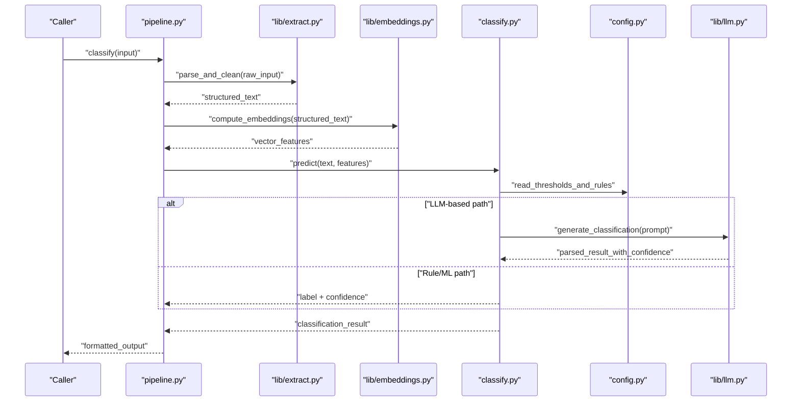
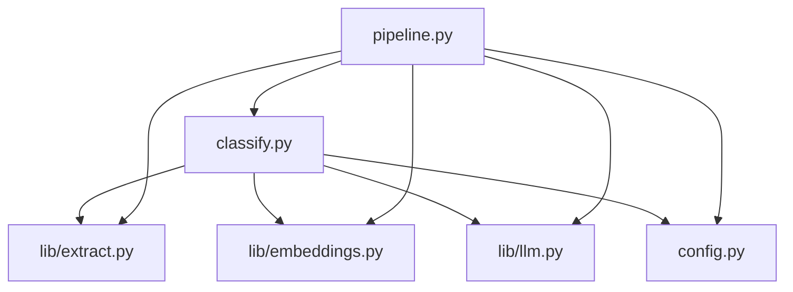

# Custom Classifiers

<cite>
**Referenced Files in This Document**
- [classify.py](file://classify.py)
- [pipeline.py](file://pipeline.py)
- [config.py](file://config.py)
- [lib/models.py](file://lib/models.py)
- [lib/extract.py](file://lib/extract.py)
- [lib/embeddings.py](file://lib/embeddings.py)
- [lib/llm.py](file://lib/llm.py)
- [data/index.json](file://data/index.json)
- [README.md](file://README.md)
</cite>

## Table of Contents
1. [Introduction](#introduction)
2. [Project Structure](#project-structure)
3. [Core Components](#core-components)
4. [Architecture Overview](#architecture-overview)
5. [Detailed Component Analysis](#detailed-component-analysis)
6. [Dependency Analysis](#dependency-analysis)
7. [Performance Considerations](#performance-considerations)
8. [Troubleshooting Guide](#troubleshooting-guide)
9. [Conclusion](#conclusion)
10. [Appendices](#appendices)

## Introduction
This document explains how to build and integrate custom classification models and logic into the Secondself AI Brain system. It focuses on the classifier interface, text preprocessing requirements, output format specifications, confidence scoring mechanisms, training workflows, integration steps, edge-case handling, evaluation, performance tuning, and dynamic rule updates. The guidance is designed for both rule-based systems and machine learning or hybrid classifiers.

## Project Structure
The classification functionality is primarily implemented in classify.py and integrated through pipeline.py. Supporting utilities for data extraction, embeddings, and LLM calls are located under lib/. Configuration is centralized in config.py, and example data is stored in data/index.json.

**Diagram sources**
- [classify.py:1-200](file://classify.py#L1-L200)
- [pipeline.py:1-200](file://pipeline.py#L1-L200)
- [config.py:1-200](file://config.py#L1-L200)
- [lib/extract.py:1-200](file://lib/extract.py#L1-L200)
- [lib/embeddings.py:1-200](file://lib/embeddings.py#L1-L200)
- [lib/llm.py:1-200](file://lib/llm.py#L1-L200)
- [data/index.json:1-200](file://data/index.json#L1-L200)

**Section sources**
- [README.md:1-200](file://README.md#L1-L200)

## Core Components
- Classifier Interface: The entry point for classification resides in classify.py. It defines how inputs are accepted, preprocessed, classified, and returned with confidence scores.
- Pipeline Integration: pipeline.py orchestrates the end-to-end flow, invoking preprocessing, embedding generation, model inference, and post-processing.
- Data Extraction: lib/extract.py provides utilities to parse raw content into structured text suitable for classification.
- Embeddings: lib/embeddings.py computes vector representations used by ML/hybrid classifiers.
- LLM Utilities: lib/llm.py offers helpers for prompt construction and response parsing when using LLM-based classification.
- Configuration: config.py centralizes settings such as thresholds, model paths, and feature flags.
- Example Data: data/index.json contains sample records that can be used for testing and evaluation.

Key responsibilities:
- Input validation and normalization
- Text preprocessing (tokenization, cleaning, feature extraction)
- Model invocation (rule-based, ML, or hybrid)
- Confidence scoring and thresholding
- Output formatting and error handling

**Section sources**
- [classify.py:1-200](file://classify.py#L1-L200)
- [pipeline.py:1-200](file://pipeline.py#L1-L200)
- [lib/extract.py:1-200](file://lib/extract.py#L1-L200)
- [lib/embeddings.py:1-200](file://lib/embeddings.py#L1-L200)
- [lib/llm.py:1-200](file://lib/llm.py#L1-L200)
- [config.py:1-200](file://config.py#L1-L200)
- [data/index.json:1-200](file://data/index.json#L1-L200)

## Architecture Overview
The classification architecture follows a modular pipeline:
- Ingestion: Raw input is received and validated.
- Preprocessing: Text is cleaned, normalized, and optionally transformed into features or embeddings.
- Classification: Rule-based, ML, or hybrid logic is applied.
- Scoring: Confidence scores are computed and thresholded.
- Output: Results are formatted and returned to the caller.

**Diagram sources**
- [pipeline.py:1-200](file://pipeline.py#L1-L200)
- [lib/extract.py:1-200](file://lib/extract.py#L1-L200)
- [lib/embeddings.py:1-200](file://lib/embeddings.py#L1-L200)
- [classify.py:1-200](file://classify.py#L1-L200)
- [config.py:1-200](file://config.py#L1-L200)
- [lib/llm.py:1-200](file://lib/llm.py#L1-L200)

## Detailed Component Analysis

### Classifier Interface
The classifier interface defines:
- Input contract: Accepts normalized text and optional features/embeddings.
- Output contract: Returns a label and a confidence score between 0 and 1.
- Error contract: Raises clear exceptions for invalid inputs or unsupported operations.

Implementation patterns:
- Rule-based: Uses pattern matching, keyword lists, and decision trees.
- ML-based: Loads trained models and predicts labels with probabilities.
- Hybrid: Combines rules and ML outputs via weighted aggregation or voting.

Preprocessing requirements:
- Normalize whitespace and encoding.
- Remove noise (HTML tags, special characters).
- Optional tokenization and stopword removal.
- Feature extraction or embedding computation.

Confidence scoring mechanisms:
- Probability from ML models.
- Heuristic scores based on rule match strength.
- Aggregation across multiple signals (e.g., keywords, embeddings similarity).

Output format specification:
- Label: String category identifier.
- Confidence: Float in [0, 1].
- Metadata: Optional fields like reasons, matched rules, or feature contributions.

**Section sources**
- [classify.py:1-200](file://classify.py#L1-L200)
- [config.py:1-200](file://config.py#L1-L200)

### Pipeline Integration
The pipeline coordinates:
- Input validation and routing to preprocessors.
- Embedding generation for ML/hybrid classifiers.
- Invocation of the classifier with appropriate context.
- Post-processing and result formatting.

Integration points:
- Configuration-driven thresholds and model selection.
- Extensible hooks for custom preprocessors and postprocessors.
- Logging and metrics collection for monitoring.

**Section sources**
- [pipeline.py:1-200](file://pipeline.py#L1-L200)
- [config.py:1-200](file://config.py#L1-L200)

### Data Extraction and Embeddings
Data extraction transforms raw inputs into clean text suitable for classification. Embeddings convert text into vectors for semantic similarity and ML models.

Key considerations:
- Robustness to malformed inputs.
- Efficient batching for large datasets.
- Consistency across environments.

**Section sources**
- [lib/extract.py:1-200](file://lib/extract.py#L1-L200)
- [lib/embeddings.py:1-200](file://lib/embeddings.py#L1-L200)

### LLM-Based Classification
LLM utilities support prompt engineering and response parsing for LLM-based classifiers.

Guidelines:
- Design prompts that elicit structured outputs.
- Parse responses reliably and extract confidence scores.
- Handle rate limits and retries gracefully.

**Section sources**
- [lib/llm.py:1-200](file://lib/llm.py#L1-L200)

### Training Custom Models
Training workflow:
- Prepare labeled dataset using data/index.json as a template.
- Choose model type (rule-based, ML, or hybrid).
- Train model and validate performance.
- Persist model artifacts and update configuration.

Evaluation:
- Use accuracy, precision, recall, and F1-score.
- Analyze confusion matrix and error cases.
- Iterate on features and thresholds.

**Section sources**
- [data/index.json:1-200](file://data/index.json#L1-L200)
- [lib/models.py:1-200](file://lib/models.py#L1-L200)

### Edge Case Handling
Common edge cases:
- Empty or extremely short text.
- Ambiguous or conflicting signals.
- Out-of-distribution inputs.

Mitigation strategies:
- Default categories with low confidence.
- Fallback to simpler rules or human review.
- Logging and alerting for anomalies.

**Section sources**
- [classify.py:1-200](file://classify.py#L1-L200)
- [pipeline.py:1-200](file://pipeline.py#L1-L200)

### Dynamic Rule Updates
Dynamic updates allow changing classification behavior without redeploying code.

Approaches:
- Load rules from configuration files or external stores.
- Hot-reload rules at runtime.
- Version control and rollback capabilities.

**Section sources**
- [config.py:1-200](file://config.py#L1-L200)

## Dependency Analysis
The classifier depends on extraction, embeddings, and configuration modules. The pipeline orchestrates these dependencies and may call LLM services.

**Diagram sources**
- [classify.py:1-200](file://classify.py#L1-L200)
- [pipeline.py:1-200](file://pipeline.py#L1-L200)
- [lib/extract.py:1-200](file://lib/extract.py#L1-L200)
- [lib/embeddings.py:1-200](file://lib/embeddings.py#L1-L200)
- [lib/llm.py:1-200](file://lib/llm.py#L1-L200)
- [config.py:1-200](file://config.py#L1-L200)

**Section sources**
- [classify.py:1-200](file://classify.py#L1-L200)
- [pipeline.py:1-200](file://pipeline.py#L1-L200)

## Performance Considerations
- Batch processing for embeddings and predictions.
- Caching frequent results and embeddings.
- Optimizing preprocessing pipelines for speed.
- Monitoring latency and throughput.
- Scaling horizontally for high-volume workloads.

[No sources needed since this section provides general guidance]

## Troubleshooting Guide
Common issues and resolutions:
- Invalid input format: Validate and normalize inputs early.
- Low confidence scores: Adjust thresholds and improve features.
- Slow inference: Optimize model size and batch sizes.
- LLM errors: Implement retries and fallbacks.

Debugging tips:
- Enable detailed logging.
- Inspect intermediate outputs.
- Use test datasets for regression checks.

**Section sources**
- [classify.py:1-200](file://classify.py#L1-L200)
- [pipeline.py:1-200](file://pipeline.py#L1-L200)

## Conclusion
Building custom classifiers in the Secondself AI Brain system involves defining a clear interface, robust preprocessing, flexible classification logic, and reliable confidence scoring. By following the guidelines for training, evaluation, and dynamic updates, you can create effective rule-based, ML, or hybrid classifiers that integrate seamlessly into the pipeline.

[No sources needed since this section summarizes without analyzing specific files]

## Appendices

### Implementation Examples

#### Rule-Based Classifier
- Define keyword lists and decision rules.
- Match text against rules and compute heuristic confidence.
- Update rules dynamically via configuration.

#### Machine Learning Classifier
- Train a model on labeled data.
- Predict labels and probabilities.
- Tune hyperparameters and evaluate performance.

#### Hybrid Classifier
- Combine rule-based and ML outputs.
- Aggregate scores using weighted averaging or voting.
- Adjust weights based on validation results.

[No sources needed since this section provides conceptual examples]

### Evaluation Metrics
- Accuracy, Precision, Recall, F1-Score.
- Confusion Matrix analysis.
- Calibration of confidence scores.

[No sources needed since this section provides conceptual guidance]

### Updating Classification Rules Dynamically
- Store rules in configuration files.
- Reload rules at runtime.
- Version and rollback as needed.

[No sources needed since this section provides conceptual guidance]