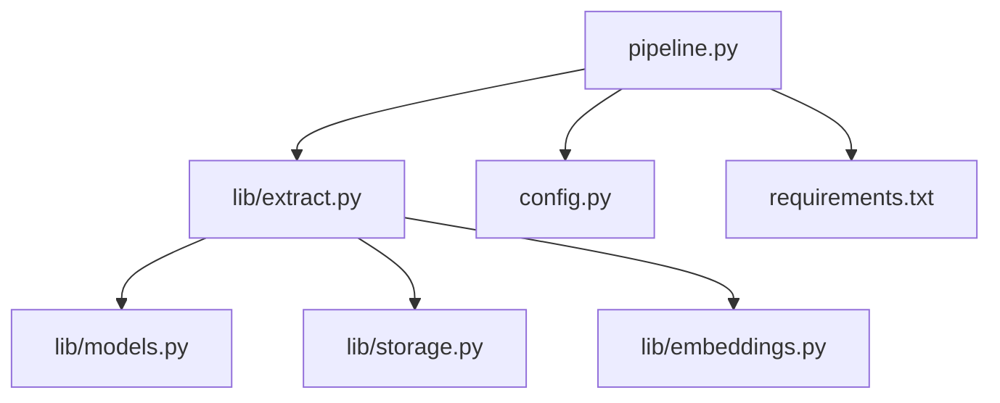
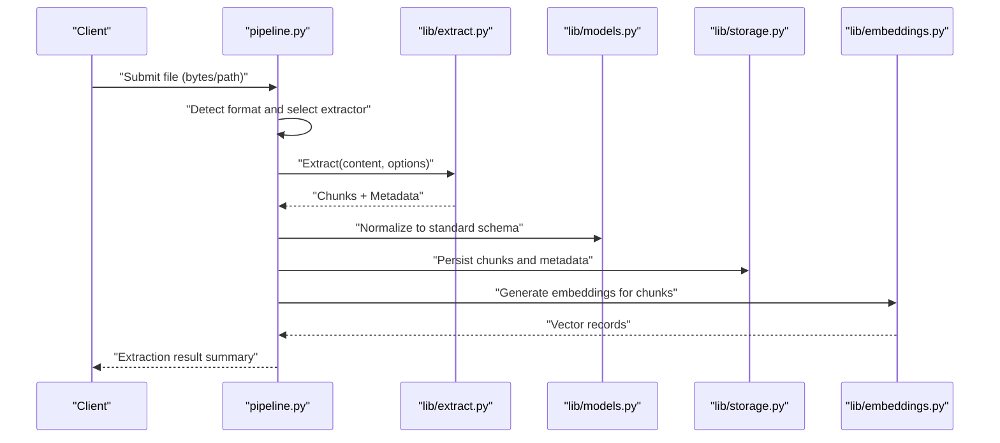
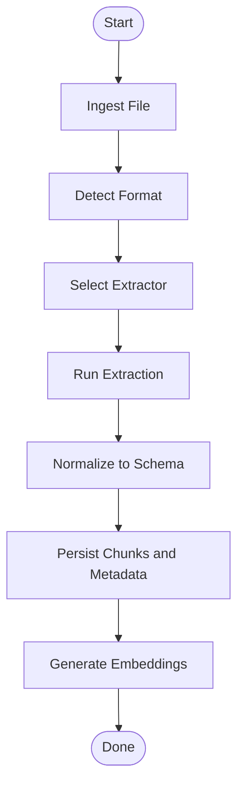
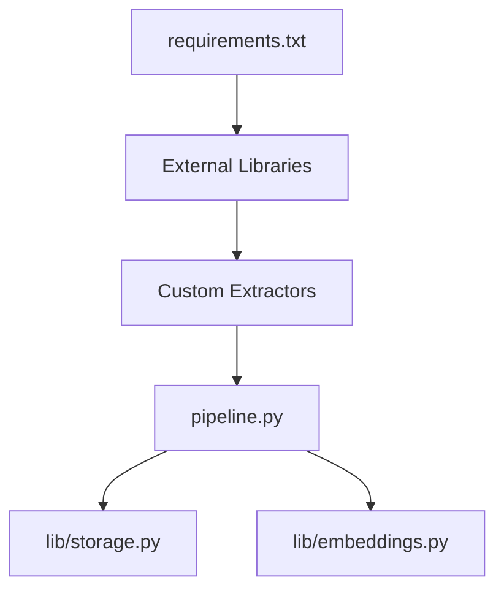

# Custom Extractors

<cite>
**Referenced Files in This Document**
- [extract.py](file://lib/extract.py)
- [pipeline.py](file://pipeline.py)
- [config.py](file://config.py)
- [storage.py](file://lib/storage.py)
- [embeddings.py](file://lib/embeddings.py)
- [models.py](file://lib/models.py)
- [requirements.txt](file://requirements.txt)
</cite>

## Table of Contents
1. [Introduction](#introduction)
2. [Project Structure](#project-structure)
3. [Core Components](#core-components)
4. [Architecture Overview](#architecture-overview)
5. [Detailed Component Analysis](#detailed-component-analysis)
6. [Dependency Analysis](#dependency-analysis)
7. [Performance Considerations](#performance-considerations)
8. [Troubleshooting Guide](#troubleshooting-guide)
9. [Conclusion](#conclusion)
10. [Appendices](#appendices)

## Introduction
This document explains how to implement custom document extractors for the Secondself AI Brain system. It covers the extractor interface contract, input/output formats, error handling patterns, metadata extraction standards, and integration with the extraction pipeline. You will find step-by-step guidance for adding support for new document formats such as PDF, DOCX, and images, along with best practices for performance, memory management, and error recovery.

## Project Structure
The extraction subsystem is primarily implemented in lib/extract.py and integrated into the main processing flow via pipeline.py. Supporting modules include configuration (config.py), storage (lib/storage.py), embeddings (lib/embeddings.py), and data models (lib/models.py). External dependencies are declared in requirements.txt.

**Diagram sources**
- [pipeline.py](file://pipeline.py)
- [lib/extract.py](file://lib/extract.py)
- [lib/models.py](file://lib/models.py)
- [lib/storage.py](file://lib/storage.py)
- [lib/embeddings.py](file://lib/embeddings.py)
- [config.py](file://config.py)
- [requirements.txt](file://requirements.txt)

**Section sources**
- [lib/extract.py](file://lib/extract.py)
- [pipeline.py](file://pipeline.py)
- [config.py](file://config.py)
- [lib/storage.py](file://lib/storage.py)
- [lib/embeddings.py](file://lib/embeddings.py)
- [lib/models.py](file://lib/models.py)
- [requirements.txt](file://requirements.txt)

## Core Components
- Extractor Interface: Defines how a custom extractor must accept inputs, produce outputs, and handle errors.
- Pipeline Integration: The pipeline discovers and invokes extractors based on file type or content detection.
- Data Models: Standardized structures for extracted content and metadata.
- Storage and Embeddings: Downstream consumers that persist results and generate vector representations.

Key responsibilities:
- Accept raw bytes or file paths for supported formats.
- Return structured content chunks and associated metadata.
- Raise consistent exceptions for recoverable and non-recoverable errors.
- Integrate with the pipeline’s registration mechanism.

**Section sources**
- [lib/extract.py](file://lib/extract.py)
- [lib/models.py](file://lib/models.py)
- [pipeline.py](file://pipeline.py)

## Architecture Overview
The extraction pipeline orchestrates file ingestion, format detection, extractor selection, chunking, metadata enrichment, and downstream persistence/embedding generation.

**Diagram sources**
- [pipeline.py](file://pipeline.py)
- [lib/extract.py](file://lib/extract.py)
- [lib/models.py](file://lib/models.py)
- [lib/storage.py](file://lib/storage.py)
- [lib/embeddings.py](file://lib/embeddings.py)

## Detailed Component Analysis

### Extractor Interface Requirements
A custom extractor should implement a single entry function that:
- Accepts either raw bytes or a file path string.
- Returns a list of content chunks and a metadata dictionary.
- Raises standardized exceptions for invalid inputs, unsupported formats, and I/O failures.

Recommended signature and behavior:
- Input: bytes or path; optional options dict (e.g., language hints, OCR flags).
- Output: sequence of chunk objects conforming to the model schema plus metadata.
- Errors: raise specific exception types to signal validation, parsing, or runtime issues.

Metadata extraction standards:
- Include at minimum: source identifier, title (if available), author (if available), creation/update timestamps (if available), page count or segment indices, and language hints.
- Normalize values to consistent types and encodings.
- Preserve original identifiers when possible to enable traceability.

Error handling patterns:
- Validation errors: raise a dedicated exception indicating malformed input or unsupported format.
- Parsing errors: raise an exception with context (e.g., page number, byte offset).
- I/O errors: wrap underlying exceptions with a consistent error envelope.
- Recoverable errors: return partial results where feasible and log warnings.

**Section sources**
- [lib/extract.py](file://lib/extract.py)
- [lib/models.py](file://lib/models.py)

### Pipeline Integration and Registration
To integrate a custom extractor:
- Register the extractor with the pipeline using the provided registry API.
- Map file extensions or MIME types to your extractor function.
- Ensure the extractor adheres to the interface contract so the pipeline can invoke it uniformly.

Registration steps:
- Import your extractor module.
- Call the pipeline’s registration function with the format key and extractor callable.
- Optionally provide a content-type detector if extension-based routing is insufficient.

Integration points:
- The pipeline calls the extractor during the extraction phase.
- Results are normalized via models before being persisted or embedded.

**Section sources**
- [pipeline.py](file://pipeline.py)
- [lib/extract.py](file://lib/extract.py)

### Data Models and Normalization
Use the shared models to ensure consistency across extractors and downstream components:
- Chunk model: text content, optional positional info (page/offset), and references.
- Metadata model: source, title, authors, dates, language, and custom fields.
- Normalization layer: converts extractor-specific outputs into the canonical schema.

Benefits:
- Uniformity across different extractors.
- Simplifies storage and embedding logic.
- Enables robust querying and analytics.

**Section sources**
- [lib/models.py](file://lib/models.py)

### Storage and Embeddings Integration
After extraction and normalization:
- Persist chunks and metadata through the storage module.
- Generate embeddings for each chunk via the embeddings module.
- Maintain relationships between chunks and their metadata for retrieval.

Considerations:
- Batch operations for efficiency.
- Idempotent writes to avoid duplicates.
- Error propagation back to the pipeline for retry or fallback strategies.

**Section sources**
- [lib/storage.py](file://lib/storage.py)
- [lib/embeddings.py](file://lib/embeddings.py)

### Step-by-Step Implementation Guide

#### Adding Support for PDF
- Implement an extractor function that reads PDF bytes or path.
- Extract text and structural elements (pages, headings).
- Attach metadata like page count and language hints.
- Raise clear errors for corrupted or password-protected files.
- Register the extractor under the PDF format key.

Best practices:
- Stream large PDFs to minimize memory usage.
- Use OCR only when necessary and cache results.
- Validate output against the chunk and metadata schemas.

#### Adding Support for DOCX
- Parse DOCX structure to retrieve paragraphs, tables, and styles.
- Convert formatting cues into semantic chunk boundaries.
- Capture document properties as metadata.
- Handle missing or inconsistent styles gracefully.

Optimization tips:
- Process sections incrementally.
- Avoid loading entire documents into memory when unnecessary.

#### Adding Support for Images
- Detect image type and decide whether OCR is required.
- Run OCR with appropriate language packs.
- Segment recognized text into meaningful chunks.
- Store image thumbnails or references alongside text chunks.

Reliability measures:
- Validate image integrity before OCR.
- Provide fallbacks when OCR confidence is low.

#### Registering Custom Extractors
- Import your extractor module.
- Register the extractor with the pipeline using the registration API.
- Map file extensions or MIME types to your extractor.
- Test with sample files to verify correct behavior.

**Section sources**
- [lib/extract.py](file://lib/extract.py)
- [pipeline.py](file://pipeline.py)
- [lib/models.py](file://lib/models.py)

### Conceptual Overview
The following conceptual diagram illustrates the end-to-end flow from file submission to stored and embedded results.

[No sources needed since this diagram shows conceptual workflow, not actual code structure]

## Dependency Analysis
External libraries used by the extraction pipeline and extractors are declared in requirements.txt. Ensure all dependencies are installed and compatible with your environment.

**Diagram sources**
- [requirements.txt](file://requirements.txt)
- [pipeline.py](file://pipeline.py)
- [lib/storage.py](file://lib/storage.py)
- [lib/embeddings.py](file://lib/embeddings.py)

**Section sources**
- [requirements.txt](file://requirements.txt)

## Performance Considerations
- Memory management: Stream large files and process in chunks to avoid high memory peaks.
- Parallelism: Where safe, parallelize independent tasks like OCR or embedding generation.
- Caching: Cache OCR results and parsed structures to reduce repeated work.
- Batching: Batch storage writes and embedding calls to minimize overhead.
- Resource limits: Set timeouts and size limits to prevent runaway processes.

[No sources needed since this section provides general guidance]

## Troubleshooting Guide
Common issues and resolutions:
- Unsupported format: Verify extension mapping and MIME detection; ensure the extractor is registered.
- Corrupted files: Wrap I/O operations with try/catch and return descriptive errors.
- OCR failures: Check language pack availability and image quality; fall back to plain text when possible.
- Memory errors: Reduce batch sizes and enable streaming; monitor heap usage.
- Missing metadata: Inspect extractor logic for property extraction and normalize defaults.

Diagnostic tips:
- Log extractor name, input size, and stage of failure.
- Emit structured error codes for programmatic handling.
- Provide user-friendly messages while retaining technical details in logs.

**Section sources**
- [lib/extract.py](file://lib/extract.py)
- [pipeline.py](file://pipeline.py)

## Conclusion
Implementing custom extractors involves adhering to a clear interface contract, normalizing outputs to shared models, and integrating with the pipeline’s registration mechanism. By following the guidelines for error handling, metadata standards, and performance optimization, you can reliably extend the system to support new document formats and improve overall extraction quality.

[No sources needed since this section summarizes without analyzing specific files]

## Appendices

### Quick Checklist for New Extractors
- Implements the extractor interface (input, output, errors).
- Produces chunks conforming to the chunk model.
- Supplies complete and normalized metadata.
- Registers itself with the pipeline under the correct format key.
- Handles large files efficiently (streaming, batching).
- Includes robust error handling and logging.

[No sources needed since this section provides general guidance]