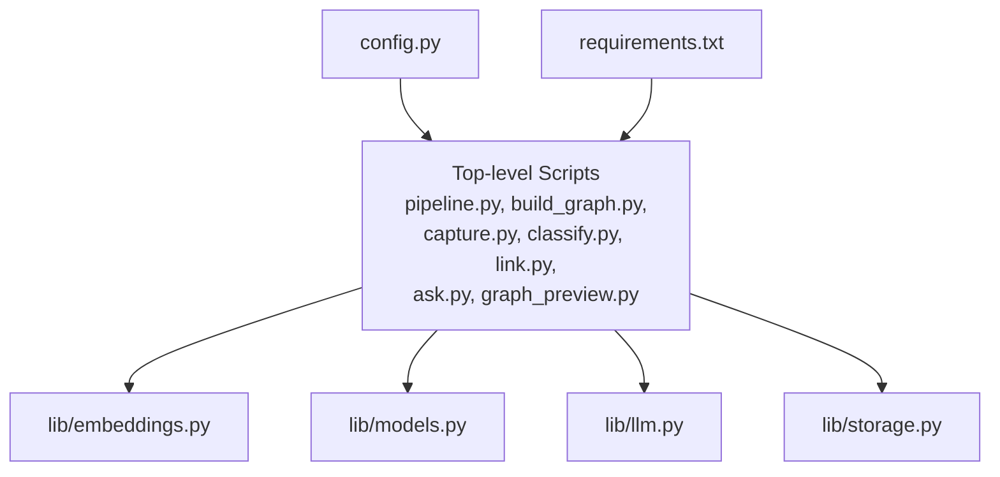
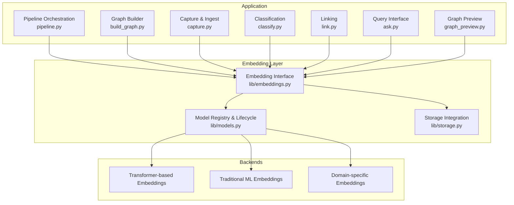
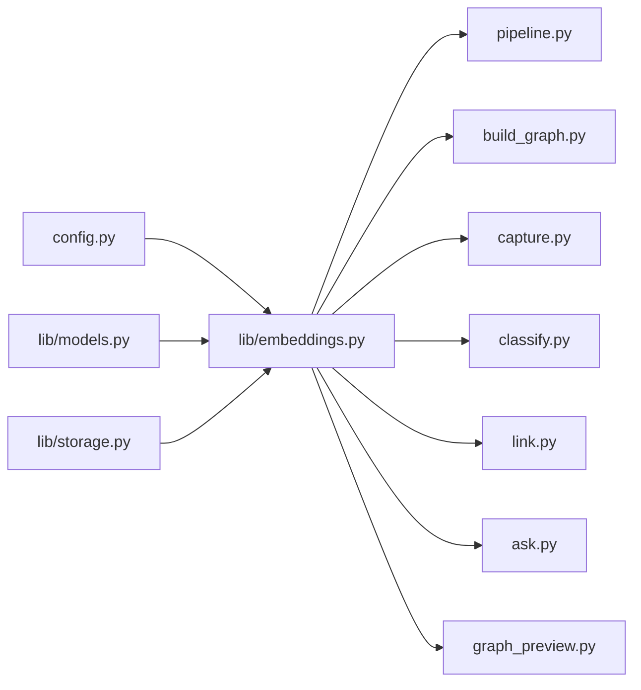

# Embedding Models

<cite>
**Referenced Files in This Document**
- [README.md](file://README.md)
- [config.py](file://config.py)
- [lib/embeddings.py](file://lib/embeddings.py)
- [lib/models.py](file://lib/models.py)
- [lib/llm.py](file://lib/llm.py)
- [lib/storage.py](file://lib/storage.py)
- [pipeline.py](file://pipeline.py)
- [build_graph.py](file://build_graph.py)
- [capture.py](file://capture.py)
- [classify.py](file://classify.py)
- [link.py](file://link.py)
- [ask.py](file://ask.py)
- [graph_preview.py](file://graph_preview.py)
- [requirements.txt](file://requirements.txt)
</cite>

## Table of Contents
1. Introduction
2. Project Structure
3. Core Components
4. Architecture Overview
5. Detailed Component Analysis
6. Dependency Analysis
7. Performance Considerations
8. Troubleshooting Guide
9. Conclusion
10. Appendices

## Introduction
This document explains how to integrate custom embedding models into the Secondself AI Brain system. It covers the embedding interface requirements (vector dimensions, normalization, batching), implementation patterns for transformer-based, traditional ML, and domain-specific embeddings, as well as model loading, inference optimization, memory management, evaluation strategies, fine-tuning guidance, and efficient large-scale generation.

## Project Structure
The project is a Python application with a modular layout:
- lib/: core libraries including embeddings, models, LLM integration, and storage
- Top-level scripts: pipeline orchestration, graph building, capture/classification/linking utilities, and interactive tools
- Configuration and dependencies: config.py and requirements.txt

**Diagram sources**
- [pipeline.py](file://pipeline.py)
- [build_graph.py](file://build_graph.py)
- [capture.py](file://capture.py)
- [classify.py](file://classify.py)
- [link.py](file://link.py)
- [ask.py](file://ask.py)
- [graph_preview.py](file://graph_preview.py)
- [lib/embeddings.py](file://lib/embeddings.py)
- [lib/models.py](file://lib/models.py)
- [lib/llm.py](file://lib/llm.py)
- [lib/storage.py](file://lib/storage.py)
- [config.py](file://config.py)
- [requirements.txt](file://requirements.txt)

**Section sources**
- [README.md](file://README.md)
- [config.py](file://config.py)
- [requirements.txt](file://requirements.txt)

## Core Components
- Embedding interface: defines how custom models must expose methods for generating vectors, handling batches, and reporting metadata such as dimensionality and normalization behavior.
- Model registry and lifecycle: manages instantiation, device placement, and resource cleanup.
- Storage integration: persists embeddings and supports retrieval for downstream tasks like similarity search and graph construction.
- Pipeline integration: orchestrates ingestion, embedding generation, and indexing across the system.

Key responsibilities:
- Enforce consistent vector dimensionality and normalization semantics
- Provide batched inference for throughput
- Offer pluggable backends (transformer, traditional ML, domain-specific)
- Integrate with storage and graph-building workflows

**Section sources**
- [lib/embeddings.py](file://lib/embeddings.py)
- [lib/models.py](file://lib/models.py)
- [lib/storage.py](file://lib/storage.py)
- [pipeline.py](file://pipeline.py)

## Architecture Overview
The embedding subsystem integrates with the broader AI Brain pipeline by providing a standardized interface that other modules consume. Custom implementations plug into this interface and are selected via configuration.

**Diagram sources**
- [lib/embeddings.py](file://lib/embeddings.py)
- [lib/models.py](file://lib/models.py)
- [lib/storage.py](file://lib/storage.py)
- [pipeline.py](file://pipeline.py)
- [build_graph.py](file://build_graph.py)
- [capture.py](file://capture.py)
- [classify.py](file://classify.py)
- [link.py](file://link.py)
- [ask.py](file://ask.py)
- [graph_preview.py](file://graph_preview.py)

## Detailed Component Analysis

### Embedding Interface Requirements
Custom embedding models must implement a minimal interface to be compatible with the system:
- Vector dimension specification: each model must declare its output dimension consistently so downstream components can allocate buffers and indexes correctly.
- Normalization contract: models should specify whether outputs are normalized (e.g., unit L2 norm) and provide an option to enforce or skip normalization at inference time.
- Batch processing: support for generating embeddings for multiple inputs in one call to improve throughput and reduce overhead.
- Metadata exposure: include capability flags such as supported input types, maximum batch size, and device availability.

Implementation guidelines:
- Ensure deterministic outputs for identical inputs when possible.
- Handle empty or malformed inputs gracefully with clear error messages.
- Expose a method to retrieve the configured dimension and normalization mode.

**Section sources**
- [lib/embeddings.py](file://lib/embeddings.py)

### Model Loading and Lifecycle Management
- Centralized registration: models are registered with a name and factory function to enable selection via configuration.
- Device placement: models should support CPU/GPU selection and automatic fallback if resources are unavailable.
- Resource cleanup: ensure tensors and model states are released when no longer needed to prevent memory leaks.
- Warm-up: optional pre-warming step to initialize caches and validate device compatibility.

Best practices:
- Cache frequently used models to avoid repeated initialization costs.
- Use lazy loading where appropriate to minimize startup time.
- Validate model weights and configuration before activation.

**Section sources**
- [lib/models.py](file://lib/models.py)

### Storage Integration for Embeddings
- Persistence format: embeddings should be stored in a format optimized for fast retrieval and updates (e.g., columnar or vector index formats).
- Indexing: maintain indices keyed by entity identifiers to support quick lookups and joins during graph construction.
- Versioning: store version metadata alongside embeddings to track model changes and enable rollback.
- Consistency: ensure atomic writes and integrity checks to avoid corrupted indexes.

Operational tips:
- Partition large datasets by shard keys to distribute load.
- Periodically compact and rebuild indexes to maintain performance.
- Monitor storage growth and set retention policies.

**Section sources**
- [lib/storage.py](file://lib/storage.py)

### Pipeline Integration
- Orchestration: the pipeline coordinates ingestion, embedding generation, and indexing steps.
- Backpressure: handle high-throughput scenarios by buffering and streaming data through the embedding layer.
- Error propagation: surface failures from embedding calls with actionable diagnostics.
- Observability: log metrics such as latency, throughput, and error rates per model.

Integration points:
- Preprocessing hooks to normalize text or features before embedding.
- Post-processing hooks to apply additional transformations or filters.
- Retry and fallback mechanisms for transient errors.

**Section sources**
- [pipeline.py](file://pipeline.py)

### Transformer-based Embeddings
Characteristics:
- High-dimensional vectors capturing rich semantic information.
- Often benefit from tokenization and attention mechanisms.
- Typically require GPU acceleration for optimal performance.

Implementation considerations:
- Token limit handling and truncation strategies.
- Padding and masking for variable-length inputs.
- Mixed precision to reduce memory footprint while maintaining accuracy.

Optimization techniques:
- Batch encoding with dynamic padding.
- Gradient checkpointing during fine-tuning.
- Quantization-aware training or post-training quantization for deployment.

**Section sources**
- [lib/embeddings.py](file://lib/embeddings.py)
- [lib/models.py](file://lib/models.py)

### Traditional ML Embeddings
Characteristics:
- Lower-dimensional vectors derived from statistical features (e.g., TF-IDF, word2vec, sentence transformers based on older architectures).
- Faster inference and lower memory usage.
- Suitable for constrained environments or legacy systems.

Implementation considerations:
- Feature extraction pipelines aligned with model expectations.
- Vocabulary alignment and out-of-vocabulary handling.
- Scaling and centering transformations if required by the model.

Optimization techniques:
- Vectorized operations using NumPy or similar libraries.
- Parallel processing across cores for batch generation.
- Caching of frequent feature representations.

**Section sources**
- [lib/embeddings.py](file://lib/embeddings.py)
- [lib/models.py](file://lib/models.py)

### Domain-specific Embeddings
Characteristics:
- Tailored to specific domains (e.g., legal, medical, finance) to capture specialized terminology and relationships.
- May combine general-purpose encoders with domain adapters or prompt engineering.

Implementation considerations:
- Data curation and preprocessing tailored to domain conventions.
- Evaluation metrics aligned with domain objectives (e.g., retrieval precision on domain queries).
- Continuous learning pipelines to incorporate new domain data.

Optimization techniques:
- Parameter-efficient fine-tuning (LoRA, adapters).
- Knowledge distillation to smaller models for deployment.
- Hybrid approaches combining embeddings with rule-based filters.

**Section sources**
- [lib/embeddings.py](file://lib/embeddings.py)
- [lib/models.py](file://lib/models.py)

### Inference Optimization and Memory Management
- Batch sizing: tune batch sizes to balance throughput and memory constraints; use adaptive batching based on available resources.
- Device utilization: pin models to GPU memory when possible; offload to CPU only when necessary.
- Memory pooling: reuse tensor buffers to reduce allocation overhead.
- Garbage collection: periodically trigger GC and explicitly delete unused objects.
- Profiling: monitor memory usage and identify hotspots for optimization.

Practical recommendations:
- Use streaming APIs to process large corpora without loading everything into memory.
- Implement checkpointing to resume interrupted jobs.
- Employ asynchronous I/O for storage operations to avoid blocking inference.

**Section sources**
- [lib/models.py](file://lib/models.py)
- [lib/storage.py](file://lib/storage.py)

### Evaluating Embedding Quality
Evaluation strategies:
- Retrieval benchmarks: measure recall@k and mean reciprocal rank on curated query sets.
- Clustering quality: assess silhouette scores and cluster purity on labeled data.
- Downstream task performance: evaluate impact on classification, linking, and graph construction metrics.
- Stability tests: check consistency across runs and sensitivity to input perturbations.

Tools and practices:
- Maintain validation datasets representative of production distributions.
- Track metric drift over time and model versions.
- Conduct ablation studies to understand component contributions.

**Section sources**
- [lib/embeddings.py](file://lib/embeddings.py)

### Fine-tuning Models for Specific Domains
Fine-tuning workflow:
- Prepare domain-labeled data with clear objectives (e.g., contrastive pairs, ranking lists).
- Select parameter-efficient methods to reduce compute and risk of catastrophic forgetting.
- Validate on held-out domain sets before deployment.
- Monitor loss curves and early stopping criteria.

Deployment considerations:
- Export optimized artifacts (e.g., ONNX, TorchScript) for faster inference.
- Containerize models for consistent environments.
- Set up automated retraining pipelines triggered by data drift signals.

**Section sources**
- [lib/models.py](file://lib/models.py)

### Handling Large-Scale Embedding Generation
Scalability patterns:
- Shard data by entity type or time windows to parallelize workloads.
- Use distributed workers with message queues for robust job distribution.
- Implement idempotent processing to safely retry failed tasks.

Resource planning:
- Estimate peak memory and GPU requirements per worker.
- Scale horizontally by adding more workers within cluster limits.
- Monitor queue depths and adjust concurrency accordingly.

Operational safeguards:
- Circuit breakers to protect downstream services.
- Dead letter queues for failed items with alerting.
- Regular capacity planning reviews based on observed growth.

**Section sources**
- [lib/storage.py](file://lib/storage.py)
- [pipeline.py](file://pipeline.py)

## Dependency Analysis
The embedding layer depends on configuration and storage, and is consumed by multiple top-level scripts.

**Diagram sources**
- [config.py](file://config.py)
- [lib/embeddings.py](file://lib/embeddings.py)
- [lib/models.py](file://lib/models.py)
- [lib/storage.py](file://lib/storage.py)
- [pipeline.py](file://pipeline.py)
- [build_graph.py](file://build_graph.py)
- [capture.py](file://capture.py)
- [classify.py](file://classify.py)
- [link.py](file://link.py)
- [ask.py](file://ask.py)
- [graph_preview.py](file://graph_preview.py)

**Section sources**
- [lib/embeddings.py](file://lib/embeddings.py)
- [lib/models.py](file://lib/models.py)
- [lib/storage.py](file://lib/storage.py)
- [pipeline.py](file://pipeline.py)

## Performance Considerations
- Choose the right model family based on latency vs. accuracy trade-offs.
- Tune batch sizes dynamically according to workload characteristics.
- Prefer vectorized operations and avoid Python loops in hot paths.
- Use mixed precision and quantization where acceptable.
- Profile regularly to detect regressions and optimize bottlenecks.

[No sources needed since this section provides general guidance]

## Troubleshooting Guide
Common issues and resolutions:
- Dimension mismatch errors: verify model configuration and ensure consistent dimension declarations across the pipeline.
- Out-of-memory errors: reduce batch size, enable memory pooling, and offload non-critical components to CPU.
- Slow inference: check device placement, disable unnecessary logging, and consider model quantization.
- Stale embeddings: implement versioning and invalidate caches when models change.
- Data corruption: add integrity checks and checksums for persisted embeddings.

Debugging tips:
- Enable detailed logs around embedding calls and storage operations.
- Use sampling to reproduce issues with small subsets.
- Validate inputs and outputs against expected schemas.

**Section sources**
- [lib/embeddings.py](file://lib/embeddings.py)
- [lib/storage.py](file://lib/storage.py)

## Conclusion
Integrating custom embedding models into the Secondself AI Brain requires a clear interface, robust lifecycle management, and careful attention to performance and evaluation. By following the guidelines outlined here—covering interface design, optimization techniques, evaluation strategies, and scalability patterns—you can deploy high-quality embeddings tailored to your domain while maintaining system reliability and efficiency.

[No sources needed since this section summarizes without analyzing specific files]

## Appendices

### Appendix A: Embedding Interface Checklist
- Declare vector dimension clearly
- Specify normalization behavior and options
- Support batched inference
- Expose metadata (supported devices, max batch size)
- Handle errors gracefully with informative messages

**Section sources**
- [lib/embeddings.py](file://lib/embeddings.py)

### Appendix B: Model Selection Matrix
- Transformer-based: best for semantic richness; higher resource needs
- Traditional ML: fast and lightweight; suitable for constrained environments
- Domain-specific: targeted performance gains; requires curated data and tuning

**Section sources**
- [lib/models.py](file://lib/models.py)

### Appendix C: Operational Runbook
- Start services and verify device availability
- Load model and warm up with sample batches
- Begin ingestion and monitor metrics
- Perform periodic health checks and index compaction
- Rollback procedures for model updates

**Section sources**
- [pipeline.py](file://pipeline.py)
- [lib/storage.py](file://lib/storage.py)