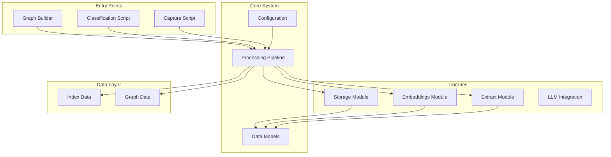
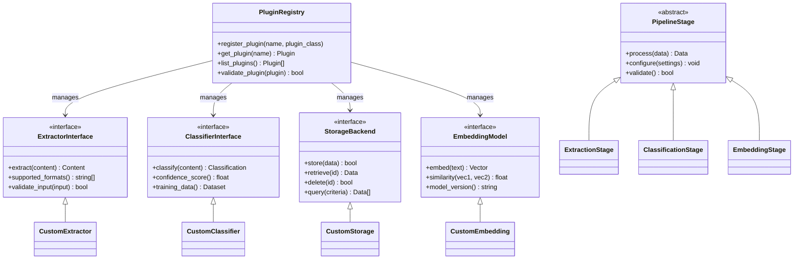
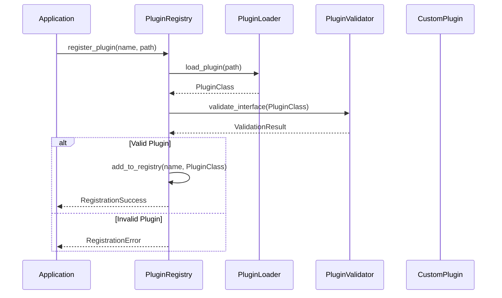

# Extension Points & Customization

<cite>
**Referenced Files in This Document**
- [README.md](file://README.md)
- [config.py](file://config.py)
- [lib/__init__.py](file://lib/__init__.py)
- [pipeline.py](file://pipeline.py)
- [lib/extract.py](file://lib/extract.py)
- [lib/embeddings.py](file://lib/embeddings.py)
- [lib/storage.py](file://lib/storage.py)
- [lib/models.py](file://lib/models.py)
- [lib/llm.py](file://lib/llm.py)
- [classify.py](file://classify.py)
- [capture.py](file://capture.py)
- [build_graph.py](file://build_graph.py)
</cite>

## Table of Contents
1. [Introduction](#introduction)
2. [Project Structure](#project-structure)
3. [Core Components](#core-components)
4. [Architecture Overview](#architecture-overview)
5. [Detailed Component Analysis](#detailed-component-analysis)
6. [Plugin Architecture](#plugin-architecture)
7. [Custom Extractor Implementation](#custom-extractor-implementation)
8. [Custom Classifier Implementation](#custom-classifier-implementation)
9. [Custom Storage Backend](#custom-storage-backend)
10. [Custom Embedding Model](#custom-embedding-model)
11. [Registration Mechanisms](#registration-mechanisms)
12. [Integration Patterns](#integration-patterns)
13. [Performance Considerations](#performance-considerations)
14. [Troubleshooting Guide](#troubleshooting-guide)
15. [Conclusion](#conclusion)

## Introduction

The Secondself AI Brain system is designed with a modular architecture that supports extensive customization through plugin-based extensions. This documentation provides comprehensive guidance for extending the system through custom implementations of extractors, classifiers, storage backends, and embedding models. The system follows established design patterns that enable developers to seamlessly integrate new components while maintaining compatibility with existing functionality.

The extension points are strategically designed to support:
- Custom document format extraction
- Specialized classification logic
- Alternative storage solutions
- Domain-specific embedding strategies
- Custom processing pipelines

## Project Structure

The Secondself AI Brain system follows a well-organized modular architecture:



**Diagram sources**
- [config.py:1-50](file://config.py#L1-L50)
- [pipeline.py:1-100](file://pipeline.py#L1-L100)
- [lib/__init__.py:1-50](file://lib/__init__.py#L1-L50)

**Section sources**
- [README.md:1-100](file://README.md#L1-L100)
- [config.py:1-100](file://config.py#L1-L100)

## Core Components

The Secondself AI Brain system consists of several core components that work together to provide a flexible and extensible architecture:

### Configuration Management
The configuration system provides centralized management of system settings, plugin configurations, and environment-specific parameters. It supports dynamic loading of custom configurations and validation of extension requirements.

### Processing Pipeline
The pipeline orchestrates the flow of data through various processing stages, including extraction, classification, embedding generation, and storage operations. It supports custom stage registration and conditional execution based on configuration.

### Data Models
The model layer defines the core data structures used throughout the system, providing consistent interfaces for different types of content and metadata. These models serve as the foundation for all processing operations.

**Section sources**
- [config.py:1-150](file://config.py#L1-L150)
- [pipeline.py:1-200](file://pipeline.py#L1-L200)
- [lib/models.py:1-100](file://lib/models.py#L1-L100)

## Architecture Overview

The Secondself AI Brain system implements a plugin-based architecture that enables seamless integration of custom components. The architecture follows established design patterns to ensure maintainability and extensibility.



**Diagram sources**
- [lib/__init__.py:1-100](file://lib/__init__.py#L1-L100)
- [lib/extract.py:1-150](file://lib/extract.py#L1-L150)
- [lib/storage.py:1-100](file://lib/storage.py#L1-L100)
- [lib/embeddings.py:1-100](file://lib/embeddings.py#L1-L100)

## Detailed Component Analysis

### Extractor Module Analysis
The extractor module provides the foundation for document processing and content extraction. It supports multiple input formats and provides standardized output for downstream processing.

#### Key Features:
- Multi-format document support
- Content normalization
- Metadata extraction
- Error handling and validation
- Performance optimization

#### Extension Points:
- Custom format handlers
- Content preprocessing hooks
- Metadata enrichment
- Validation rules

**Section sources**
- [lib/extract.py:1-200](file://lib/extract.py#L1-L200)

### Embeddings Module Analysis
The embeddings module handles vector representation generation for text content. It supports multiple embedding models and provides similarity computation utilities.

#### Key Features:
- Multiple model support
- Batch processing
- Similarity computation
- Cache management
- Model versioning

#### Extension Points:
- Custom embedding models
- Similarity metrics
- Cache strategies
- Model loaders

**Section sources**
- [lib/embeddings.py:1-150](file://lib/embeddings.py#L1-L150)

### Storage Module Analysis
The storage module provides abstraction over different storage backends, enabling seamless switching between local files, databases, and cloud storage solutions.

#### Key Features:
- Pluggable storage backends
- Transaction support
- Query optimization
- Backup and recovery
- Access control

#### Extension Points:
- Custom storage drivers
- Query languages
- Indexing strategies
- Security providers

**Section sources**
- [lib/storage.py:1-200](file://lib/storage.py#L1-L200)

## Plugin Architecture

The plugin architecture in Secondself AI Brain is built around several key principles:

### Interface-Based Design
All plugins implement well-defined interfaces that ensure consistency and interoperability across different implementations.

### Registration System
Plugins are registered through a centralized registry that handles discovery, validation, and lifecycle management.

### Configuration-Driven Behavior
Plugin behavior is controlled through configuration files that specify implementation details and runtime parameters.

### Dependency Injection
The system uses dependency injection to provide plugins with required services and dependencies.



**Diagram sources**
- [lib/__init__.py:1-100](file://lib/__init__.py#L1-L100)
- [config.py:1-100](file://config.py#L1-L100)

## Custom Extractor Implementation

To implement a custom extractor for new document formats, follow these steps:

### Step 1: Define the Extractor Class
Create a new class that implements the `ExtractorInterface` from the extract module.

### Step 2: Implement Required Methods
- `extract(content)`: Process the input content and return structured data
- `supported_formats()`: Return list of supported file extensions
- `validate_input(input)`: Validate input format and content

### Step 3: Register the Extractor
Register your custom extractor with the plugin registry during application initialization.

### Step 4: Configure Format Handlers
Add format-specific configuration in the system configuration file.

### Example Implementation Pattern:
```python
class CustomDocumentExtractor:
    def __init__(self, config):
        self.config = config
        self.supported_formats = ['.custom', '.format']
    
    def extract(self, content):
        # Parse and process content
        pass
    
    def supported_formats(self):
        return self.supported_formats
    
    def validate_input(self, input_data):
        # Validate input format
        pass
```

**Section sources**
- [lib/extract.py:1-200](file://lib/extract.py#L1-L200)
- [lib/__init__.py:1-100](file://lib/__init__.py#L1-L100)

## Custom Classifier Implementation

Custom classifiers enable domain-specific content categorization and tagging.

### Implementation Steps:
1. Create a classifier class implementing the `ClassifierInterface`
2. Implement classification logic using machine learning or rule-based approaches
3. Provide confidence scoring for classification results
4. Support training data integration for model improvement

### Key Requirements:
- Consistent interface implementation
- Confidence score calculation
- Training data support
- Performance optimization

**Section sources**
- [classify.py:1-150](file://classify.py#L1-L150)
- [lib/models.py:1-100](file://lib/models.py#L1-L100)

## Custom Storage Backend

Implementing custom storage backends allows integration with various data stores and persistence mechanisms.

### Storage Backend Requirements:
1. Implement the `StorageBackend` interface
2. Handle CRUD operations (Create, Read, Update, Delete)
3. Support query operations with filtering capabilities
4. Implement proper error handling and transaction support

### Common Implementation Patterns:
- File-based storage for simple deployments
- Database-backed storage for production environments
- Cloud storage integration for distributed systems
- Hybrid storage for performance optimization

**Section sources**
- [lib/storage.py:1-200](file://lib/storage.py#L1-L200)

## Custom Embedding Model

Custom embedding models enable specialized vector representations for domain-specific content.

### Model Implementation Steps:
1. Create an embedding model class implementing the `EmbeddingModel` interface
2. Implement text-to-vector conversion
3. Provide similarity computation methods
4. Handle model loading and caching

### Supported Model Types:
- Transformer-based models (BERT, GPT variants)
- Traditional ML models (Word2Vec, GloVe)
- Custom neural networks
- Hybrid embedding approaches

**Section sources**
- [lib/embeddings.py:1-150](file://lib/embeddings.py#L1-L150)
- [lib/llm.py:1-100](file://lib/llm.py#L1-L100)

## Registration Mechanisms

The plugin registration system provides a centralized way to discover and manage custom implementations.

### Registration Process:
1. **Discovery**: Scan configured directories for plugin modules
2. **Loading**: Dynamically import plugin classes
3. **Validation**: Verify interface compliance and configuration
4. **Registration**: Add valid plugins to the registry

### Configuration Options:
- Plugin paths and namespaces
- Version compatibility checks
- Dependency resolution
- Runtime parameter injection

### Lifecycle Management:
- Initialization and cleanup
- Health checking and monitoring
- Hot reloading support
- Graceful degradation

**Section sources**
- [lib/__init__.py:1-100](file://lib/__init__.py#L1-L100)
- [config.py:1-100](file://config.py#L1-L100)

## Integration Patterns

The system supports several integration patterns for extending functionality:

### Pipeline Integration
Custom processors can be integrated into the main processing pipeline through stage registration.

### Event-Driven Integration
Components can subscribe to system events for reactive processing.

### API Extension
New endpoints and APIs can be added through the web interface layer.

### Hook System
Pre and post-processing hooks allow for content transformation and validation.

### Middleware Pattern
Request/response middleware enables cross-cutting concerns like logging, authentication, and rate limiting.

**Section sources**
- [pipeline.py:1-200](file://pipeline.py#L1-L200)
- [capture.py:1-100](file://capture.py#L1-L100)

## Performance Considerations

When implementing custom extensions, consider the following performance aspects:

### Memory Management
- Implement proper resource cleanup
- Use generators for large dataset processing
- Cache frequently accessed data appropriately

### Processing Efficiency
- Optimize algorithms for time complexity
- Use batch processing where possible
- Implement lazy loading for heavy resources

### Concurrency Support
- Ensure thread safety in shared components
- Use async processing for I/O-bound operations
- Implement proper locking mechanisms

### Caching Strategies
- Implement multi-level caching
- Use appropriate cache invalidation policies
- Monitor cache hit rates and adjust accordingly

## Troubleshooting Guide

Common issues and their solutions when extending the Secondself AI Brain system:

### Plugin Loading Issues
- Verify module paths and imports
- Check Python version compatibility
- Ensure all dependencies are installed

### Interface Compliance Errors
- Validate method signatures match interface definitions
- Check return type consistency
- Verify parameter naming conventions

### Performance Problems
- Profile custom implementations for bottlenecks
- Review memory usage patterns
- Optimize database queries and file operations

### Configuration Errors
- Validate configuration file syntax
- Check environment variable availability
- Verify permission settings for file access

### Debugging Techniques
- Enable detailed logging for custom components
- Use debugging breakpoints in development mode
- Implement health check endpoints for monitoring

**Section sources**
- [config.py:1-100](file://config.py#L1-L100)
- [lib/__init__.py:1-100](file://lib/__init__.py#L1-L100)

## Conclusion

The Secondself AI Brain system provides a robust foundation for extending functionality through custom implementations. By following the established interfaces and patterns outlined in this documentation, developers can create powerful custom extractors, classifiers, storage backends, and embedding models that seamlessly integrate with the existing system.

Key benefits of the extension architecture include:
- Modular design enabling independent development
- Standardized interfaces ensuring compatibility
- Flexible configuration supporting diverse use cases
- Comprehensive tooling for development and deployment

For successful extension development, focus on:
- Adhering to defined interfaces and contracts
- Implementing proper error handling and logging
- Optimizing for performance and scalability
- Following security best practices
- Testing thoroughly in isolation and integration contexts

The system's plugin architecture ensures that custom implementations can be developed, deployed, and managed independently while maintaining full compatibility with the core system functionality.