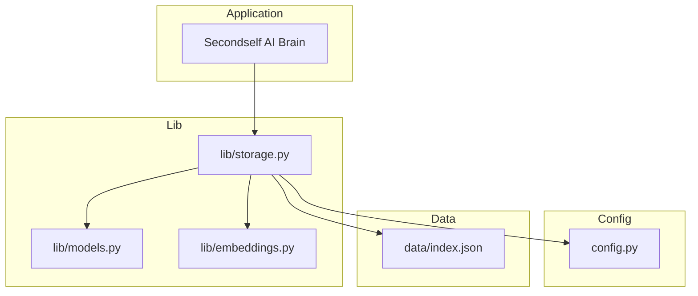
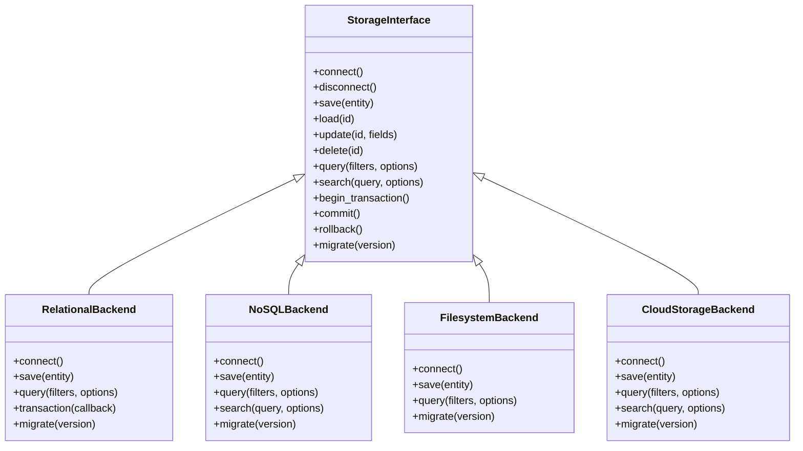
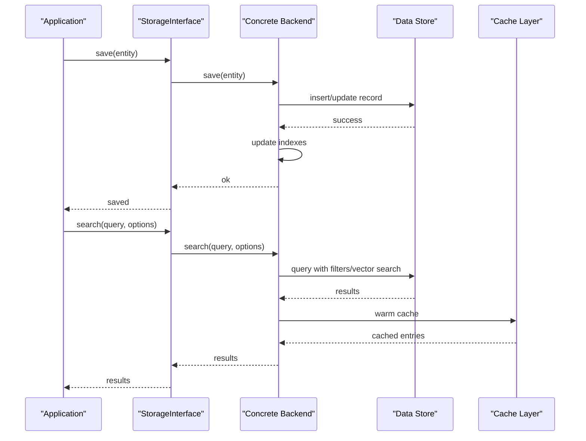
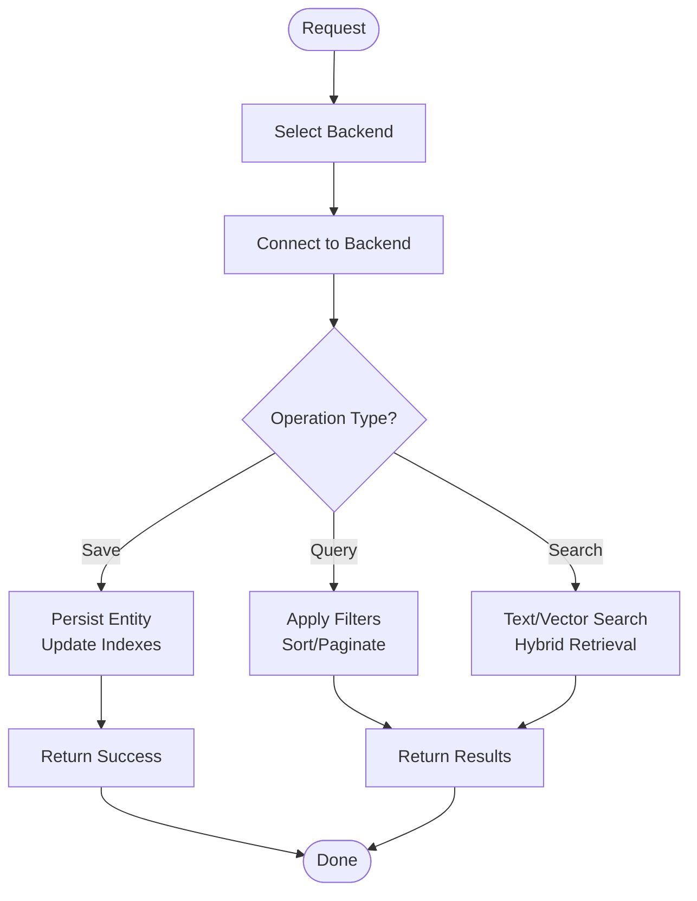
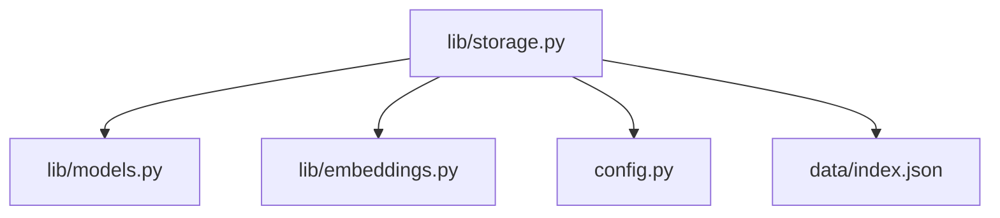

# Storage Backends

<cite>
**Referenced Files in This Document**
- [storage.py](file://lib/storage.py)
- [models.py](file://lib/models.py)
- [embeddings.py](file://lib/embeddings.py)
- [config.py](file://config.py)
- [index.json](file://data/index.json)
- [architecture.md](file://docs/architecture.md)
- [implementation-plan.md](file://docs/implementation-plan.md)
</cite>

## Table of Contents
1. [Introduction](#introduction)
2. [Project Structure](#project-structure)
3. [Core Components](#core-components)
4. [Architecture Overview](#architecture-overview)
5. [Detailed Component Analysis](#detailed-component-analysis)
6. [Dependency Analysis](#dependency-analysis)
7. [Performance Considerations](#performance-considerations)
8. [Troubleshooting Guide](#troubleshooting-guide)
9. [Conclusion](#conclusion)
10. [Appendices](#appendices)

## Introduction
This document explains how to implement custom storage backends for the Secondself AI Brain system. It focuses on the storage interface requirements, data persistence patterns, query operations, and indexing strategies. It also provides guidance for implementing backends across relational databases, NoSQL databases, file systems, and cloud storage services. Connection management, transaction handling, and data migration procedures are covered, along with performance optimization, caching strategies, and consistency considerations for distributed environments.

## Project Structure
The storage subsystem is primarily implemented under lib/storage.py and integrates with models and embeddings modules. Configuration is centralized in config.py, and an index file exists under data/index.json to support search or retrieval workflows. Architectural context and implementation plans are documented in docs.

**Diagram sources**
- [storage.py](file://lib/storage.py)
- [models.py](file://lib/models.py)
- [embeddings.py](file://lib/embeddings.py)
- [config.py](file://config.py)
- [index.json](file://data/index.json)

**Section sources**
- [storage.py](file://lib/storage.py)
- [models.py](file://lib/models.py)
- [embeddings.py](file://lib/embeddings.py)
- [config.py](file://config.py)
- [index.json](file://data/index.json)
- [architecture.md](file://docs/architecture.md)
- [implementation-plan.md](file://docs/implementation-plan.md)

## Core Components
- Storage Interface: A unified abstraction that defines methods for persisting, querying, updating, and deleting entities, as well as managing indexes and transactions.
- Data Models: Typed structures representing core entities (e.g., nodes, edges, embeddings) used by the storage layer.
- Embeddings Integration: Vectorized representations stored alongside metadata to enable similarity search and semantic retrieval.
- Configuration: Centralized settings for connection parameters, timeouts, retry policies, and feature flags.
- Indexing: Auxiliary structures (e.g., JSON-based indices) to accelerate lookup and filtering operations.

Key responsibilities:
- Persistence: Save, load, update, and remove records consistently.
- Querying: Support filters, pagination, sorting, and vector similarity queries.
- Indexing: Maintain secondary indexes for fast lookups and full-text or vector search.
- Transactions: Provide atomic multi-operation semantics where supported.
- Migration: Versioned schema evolution and data transformation pipelines.

**Section sources**
- [storage.py](file://lib/storage.py)
- [models.py](file://lib/models.py)
- [embeddings.py](file://lib/embeddings.py)
- [config.py](file://config.py)
- [index.json](file://data/index.json)

## Architecture Overview
The storage layer abstracts multiple backend implementations behind a common interface. The application interacts with the interface, while concrete backends handle persistence details. Indexes and embeddings are integrated to support efficient retrieval.

**Diagram sources**
- [storage.py](file://lib/storage.py)
- [models.py](file://lib/models.py)
- [embeddings.py](file://lib/embeddings.py)
- [config.py](file://config.py)

## Detailed Component Analysis

### Storage Interface Requirements
The storage interface should expose consistent methods for CRUD, querying, searching, transactions, and migrations. Implementations must adhere to these contracts to ensure interchangeability.

- Connection Management
  - connect(): Establish and validate connections; return a session or client object.
  - disconnect(): Gracefully close connections and release resources.
  - Health checks and retries should be configurable via configuration.

- Persistence Patterns
  - save(entity): Persist a single entity; handle upsert semantics if needed.
  - load(id): Retrieve an entity by identifier; raise clear errors when not found.
  - update(id, fields): Partial updates with validation and conflict resolution.
  - delete(id): Remove entities and associated indexes/embeddings atomically.

- Query Operations
  - query(filters, options): Filter, sort, paginate, and project results efficiently.
  - search(query, options): Support text search and vector similarity using embeddings.

- Indexing Strategies
  - Maintain secondary indexes for frequently queried fields.
  - Use inverted indexes for full-text search and vector indexes for similarity search.
  - Keep indexes consistent with data mutations; consider background rebuilds.

- Transaction Handling
  - begin_transaction(), commit(), rollback(): Provide ACID-like guarantees where supported.
  - For non-transactional backends, emulate transactions with compensating actions.

- Data Migration Procedures
  - migrate(version): Apply schema changes and transform existing data safely.
  - Ensure idempotency and rollback capability during migrations.

**Section sources**
- [storage.py](file://lib/storage.py)
- [models.py](file://lib/models.py)
- [embeddings.py](file://lib/embeddings.py)
- [config.py](file://config.py)

### Data Models
Models define the structure of entities persisted by the storage layer. They should include identifiers, metadata, relationships, and optional embedding references.

- Entities
  - Node: Represents a primary concept or item with attributes and links.
  - Edge: Represents relationships between nodes with properties.
  - Embedding: Stores vectorized representations and associated metadata.

- Relationships
  - One-to-many and many-to-many relationships should be modeled explicitly.
  - Foreign keys or reference IDs should be enforced at the model level.

- Validation
  - Enforce required fields, types, and constraints before persistence.
  - Normalize values and sanitize inputs to prevent corruption.

**Section sources**
- [models.py](file://lib/models.py)

### Embeddings Integration
Embeddings enable semantic search and similarity retrieval. The storage layer should store vectors alongside metadata and provide efficient search operations.

- Storage
  - Store embeddings as arrays or binary blobs depending on backend capabilities.
  - Associate embeddings with entity IDs for quick joins and lookups.

- Search
  - Implement vector similarity queries using appropriate distance metrics.
  - Combine text filters with vector search for hybrid retrieval.

- Indexing
  - Use specialized vector indexes (e.g., approximate nearest neighbor) for performance.
  - Rebuild or update indexes incrementally to minimize downtime.

**Section sources**
- [embeddings.py](file://lib/embeddings.py)
- [storage.py](file://lib/storage.py)

### Configuration and Environment
Configuration centralizes connection parameters, timeouts, retry policies, and feature toggles.

- Parameters
  - Backend selection, credentials, endpoints, and ports.
  - Pool sizes, connection limits, and concurrency settings.
  - Feature flags for enabling advanced features like vector search.

- Security
  - Secure credential storage and encryption at rest and in transit.
  - Least privilege access for database users and cloud buckets.

**Section sources**
- [config.py](file://config.py)

### Indexing with data/index.json
An index file can accelerate lookups and filtering. It should be kept consistent with the underlying data store and updated on mutations.

- Structure
  - Map searchable keys to entity IDs or pointers.
  - Include versioning and checksums for integrity.

- Updates
  - Batch updates to minimize I/O overhead.
  - Background workers to rebuild or reconcile indexes.

**Section sources**
- [index.json](file://data/index.json)
- [storage.py](file://lib/storage.py)

## Architecture Overview
The following sequence diagram illustrates a typical save-and-search workflow through the storage interface.

**Diagram sources**
- [storage.py](file://lib/storage.py)
- [models.py](file://lib/models.py)
- [embeddings.py](file://lib/embeddings.py)
- [config.py](file://config.py)

## Detailed Component Analysis

### Relational Database Backend
Relational backends leverage structured schemas and SQL queries.

- Schema Design
  - Define tables for nodes, edges, and embeddings.
  - Use foreign keys and constraints to enforce relationships.

- Queries
  - Optimize with indexes on frequently filtered columns.
  - Use JOINs and subqueries carefully to avoid performance pitfalls.

- Transactions
  - Wrap multi-step operations in transactions for consistency.
  - Handle deadlocks and retries gracefully.

- Migrations
  - Use versioned migration scripts with rollback support.
  - Validate data integrity post-migration.

**Section sources**
- [storage.py](file://lib/storage.py)
- [models.py](file://lib/models.py)

### NoSQL Database Backend
NoSQL backends offer flexible schemas and horizontal scalability.

- Data Modeling
  - Denormalize where necessary to optimize read patterns.
  - Use embedded documents for one-to-one relationships.

- Queries
  - Leverage compound indexes and aggregation pipelines.
  - Implement soft deletes and TTLs for lifecycle management.

- Transactions
  - Use multi-document transactions if supported; otherwise, implement compensating logic.

- Migrations
  - Perform incremental schema evolution with backward compatibility.

**Section sources**
- [storage.py](file://lib/storage.py)
- [models.py](file://lib/models.py)

### File System Backend
File system backends store data as files or directories.

- Organization
  - Group entities by type and partition by date or hash.
  - Use JSON or binary formats with clear schemas.

- Indexing
  - Maintain a separate index file for fast lookups.
  - Reconcile index with actual files periodically.

- Concurrency
  - Use file locks or atomic writes to prevent corruption.
  - Implement backup and restore mechanisms.

- Migrations
  - Transform file formats and re-index after upgrades.

**Section sources**
- [storage.py](file://lib/storage.py)
- [index.json](file://data/index.json)

### Cloud Storage Backend
Cloud backends provide scalable and durable storage with APIs.

- Authentication
  - Use secure credentials and least privilege roles.
  - Encrypt data at rest and in transit.

- Operations
  - Implement chunked uploads and resumable transfers.
  - Use object tagging and metadata for filtering.

- Indexing
  - Maintain server-side indexes or external catalogs.
  - Sync indexes with object storage asynchronously.

- Migrations
  - Migrate objects between buckets or formats with validation.

**Section sources**
- [storage.py](file://lib/storage.py)
- [config.py](file://config.py)

### Conceptual Overview
The storage layer abstracts diverse backends behind a uniform interface, enabling interchangeable implementations. Indexing and embeddings enhance retrieval performance and semantic search capabilities.

[No sources needed since this diagram shows conceptual workflow, not actual code structure]

## Dependency Analysis
The storage layer depends on models, embeddings, and configuration. Concrete backends encapsulate specific persistence technologies while adhering to the shared interface.

**Diagram sources**
- [storage.py](file://lib/storage.py)
- [models.py](file://lib/models.py)
- [embeddings.py](file://lib/embeddings.py)
- [config.py](file://config.py)
- [index.json](file://data/index.json)

**Section sources**
- [storage.py](file://lib/storage.py)
- [models.py](file://lib/models.py)
- [embeddings.py](file://lib/embeddings.py)
- [config.py](file://config.py)
- [index.json](file://data/index.json)

## Performance Considerations
- Connection Pooling
  - Configure pool sizes based on workload and backend limits.
  - Monitor connection usage and adjust dynamically.

- Caching Strategies
  - Implement read-through and write-through caches for hot data.
  - Use TTLs and invalidation policies to maintain freshness.

- Index Optimization
  - Analyze query patterns to design effective indexes.
  - Avoid over-indexing to reduce write overhead.

- Vector Search Tuning
  - Choose appropriate distance metrics and index algorithms.
  - Balance accuracy vs. latency with approximate methods.

- Concurrency Control
  - Use optimistic locking or version fields to resolve conflicts.
  - Partition writes to reduce contention.

- Monitoring and Profiling
  - Track latency, throughput, and error rates.
  - Profile slow queries and optimize execution plans.

[No sources needed since this section provides general guidance]

## Troubleshooting Guide
Common issues and resolutions:
- Connection Failures
  - Verify credentials, endpoints, and network connectivity.
  - Implement retries with exponential backoff.

- Transaction Errors
  - Detect deadlocks and retry operations.
  - Log transaction boundaries and state transitions.

- Index Inconsistencies
  - Rebuild indexes from source data periodically.
  - Validate index checksums and repair corrupted entries.

- Data Corruption
  - Enable backups and point-in-time recovery.
  - Validate data integrity on load and after migrations.

- Performance Degradation
  - Identify slow queries and add missing indexes.
  - Tune cache sizes and eviction policies.

**Section sources**
- [storage.py](file://lib/storage.py)
- [config.py](file://config.py)

## Conclusion
Implementing custom storage backends for the Secondself AI Brain system requires a robust interface, clear data models, and thoughtful indexing strategies. By abstracting persistence details and integrating embeddings for semantic search, the system can support diverse backends while maintaining performance and consistency. Proper connection management, transaction handling, and migration procedures ensure reliability and scalability across environments.

[No sources needed since this section summarizes without analyzing specific files]

## Appendices
- Implementation Plan References
  - Review architecture and implementation plans for additional context and guidelines.

**Section sources**
- [architecture.md](file://docs/architecture.md)
- [implementation-plan.md](file://docs/implementation-plan.md)