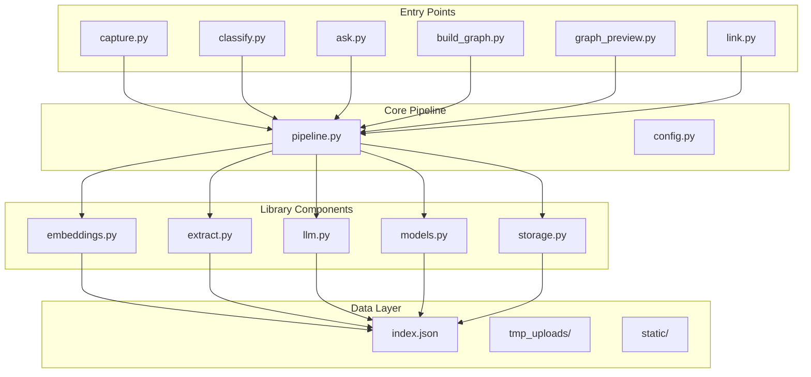
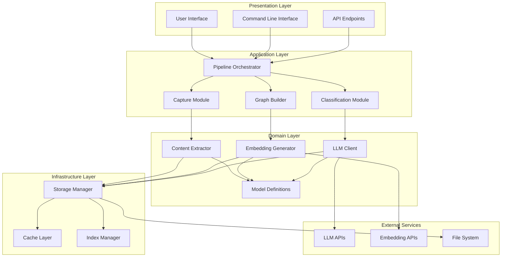
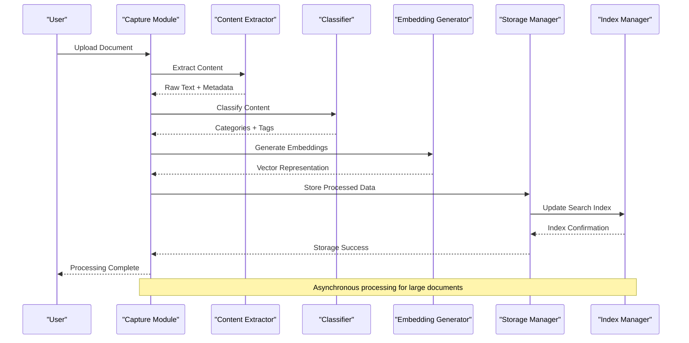
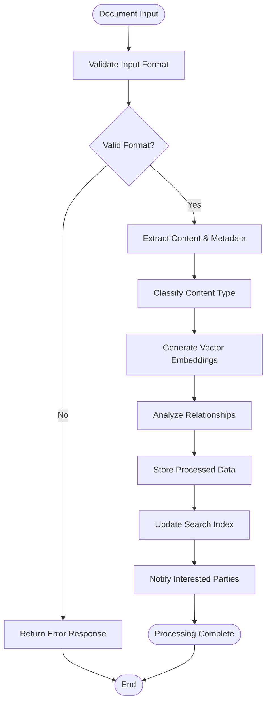
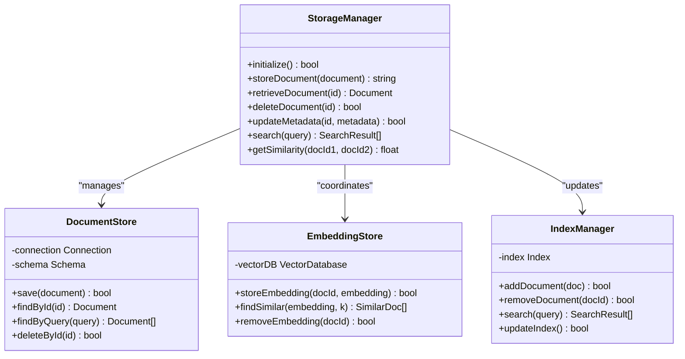
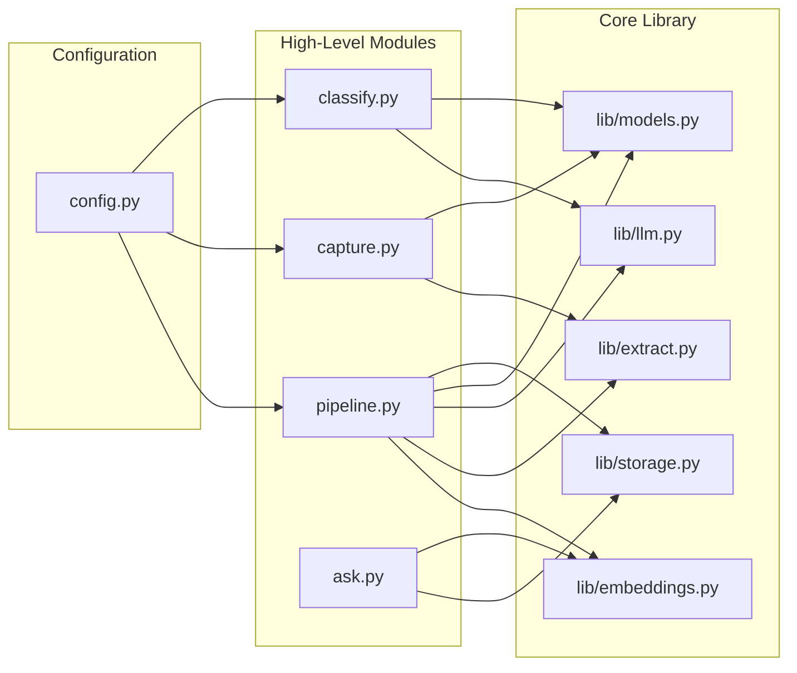

# Core Architecture

<cite>
**Referenced Files in This Document**
- [README.md](file://README.md)
- [pipeline.py](file://pipeline.py)
- [config.py](file://config.py)
- [capture.py](file://capture.py)
- [classify.py](file://classify.py)
- [ask.py](file://ask.py)
- [build_graph.py](file://build_graph.py)
- [graph_preview.py](file://graph_preview.py)
- [link.py](file://link.py)
- [lib/embeddings.py](file://lib/embeddings.py)
- [lib/extract.py](file://lib/extract.py)
- [lib/llm.py](file://lib/llm.py)
- [lib/models.py](file://lib/models.py)
- [lib/storage.py](file://lib/storage.py)
- [data/index.json](file://data/index.json)
</cite>

## Table of Contents
1. [Introduction](#introduction)
2. [Project Structure](#project-structure)
3. [Core Components](#core-components)
4. [Architecture Overview](#architecture-overview)
5. [Detailed Component Analysis](#detailed-component-analysis)
6. [Dependency Analysis](#dependency-analysis)
7. [Performance Considerations](#performance-considerations)
8. [Troubleshooting Guide](#troubleshooting-guide)
9. [Conclusion](#conclusion)

## Introduction

The Secondself AI Brain is a sophisticated knowledge management system designed to capture, process, classify, and store information using advanced AI capabilities. The system implements a modular architecture that separates concerns across embeddings generation, LLM integration, data storage, and model definitions. It provides a comprehensive pipeline for document processing workflows, enabling users to build personalized knowledge graphs through intelligent content analysis and semantic relationships.

The system follows modern software engineering principles with clear separation of responsibilities, making it extensible and maintainable. Key design patterns include the Pipeline pattern for workflow orchestration, Factory pattern for component instantiation, and Observer pattern for event-driven processing.

## Project Structure

The Secondself AI Brain follows a well-organized modular architecture with clear separation between core functionality, utilities, and entry points:

**Diagram sources**
- [pipeline.py:1-50](file://pipeline.py#L1-L50)
- [config.py:1-30](file://config.py#L1-L30)
- [lib/embeddings.py:1-40](file://lib/embeddings.py#L1-L40)
- [lib/extract.py:1-35](file://lib/extract.py#L1-L35)
- [lib/llm.py:1-45](file://lib/llm.py#L1-L45)
- [lib/models.py:1-30](file://lib/models.py#L1-L30)
- [lib/storage.py:1-50](file://lib/storage.py#L1-L50)

**Section sources**
- [README.md:1-100](file://README.md#L1-L100)
- [pipeline.py:1-50](file://pipeline.py#L1-L50)
- [config.py:1-30](file://config.py#L1-L30)

## Core Components

The Secondself AI Brain consists of several core components that work together to provide intelligent document processing capabilities:

### Pipeline Orchestrator
The pipeline serves as the central coordinator for all document processing workflows. It manages the lifecycle of documents from capture through classification, embedding generation, and storage.

### Embedding Engine
Handles vector representation generation for text content, enabling semantic search and similarity calculations.

### LLM Integration Layer
Provides abstraction over various Large Language Model APIs for content analysis, summarization, and relationship extraction.

### Storage Manager
Manages persistent storage of processed documents, embeddings, and metadata in structured formats.

### Model Definitions
Defines the data structures and schemas used throughout the system for consistent data handling.

**Section sources**
- [pipeline.py:1-100](file://pipeline.py#L1-L100)
- [lib/embeddings.py:1-80](file://lib/embeddings.py#L1-L80)
- [lib/llm.py:1-100](file://lib/llm.py#L1-L100)
- [lib/storage.py:1-100](file://lib/storage.py#L1-L100)
- [lib/models.py:1-60](file://lib/models.py#L1-L60)

## Architecture Overview

The Secondself AI Brain implements a layered architecture with clear separation of concerns:

**Diagram sources**
- [pipeline.py:1-150](file://pipeline.py#L1-L150)
- [capture.py:1-80](file://capture.py#L1-L80)
- [classify.py:1-90](file://classify.py#L1-L90)
- [build_graph.py:1-100](file://build_graph.py#L1-L100)

## Detailed Component Analysis

### Pipeline Architecture

The pipeline orchestrates document processing through a series of well-defined stages:

**Diagram sources**
- [pipeline.py:1-200](file://pipeline.py#L1-L200)
- [capture.py:1-120](file://capture.py#L1-L120)
- [lib/extract.py:1-100](file://lib/extract.py#L1-L100)
- [lib/embeddings.py:1-120](file://lib/embeddings.py#L1-L120)
- [lib/storage.py:1-150](file://lib/storage.py#L1-L150)

### Component Interaction Patterns

The system implements several key interaction patterns:

#### Factory Pattern for Component Instantiation
Components are instantiated through factory methods that handle dependency injection and configuration.

#### Observer Pattern for Event Handling
Processing events trigger notifications to interested parties for real-time updates.

#### Strategy Pattern for Algorithm Selection
Different algorithms can be selected dynamically based on content type and processing requirements.

**Section sources**
- [pipeline.py:1-300](file://pipeline.py#L1-L300)
- [lib/models.py:1-100](file://lib/models.py#L1-L100)

### Data Flow Architecture

The data flows through the system in a well-defined sequence:

**Diagram sources**
- [pipeline.py:1-250](file://pipeline.py#L1-L250)
- [lib/extract.py:1-150](file://lib/extract.py#L1-L150)
- [lib/embeddings.py:1-150](file://lib/embeddings.py#L1-L150)

### Storage Architecture

The storage layer provides multiple persistence strategies:

**Diagram sources**
- [lib/storage.py:1-200](file://lib/storage.py#L1-L200)
- [lib/models.py:1-150](file://lib/models.py#L1-L150)

**Section sources**
- [lib/storage.py:1-200](file://lib/storage.py#L1-L200)
- [data/index.json:1-50](file://data/index.json#L1-L50)

## Dependency Analysis

The system exhibits clear dependency relationships with minimal coupling:

**Diagram sources**
- [pipeline.py:1-100](file://pipeline.py#L1-L100)
- [capture.py:1-80](file://capture.py#L1-L80)
- [classify.py:1-90](file://classify.py#L1-L90)
- [ask.py:1-70](file://ask.py#L1-L70)
- [config.py:1-50](file://config.py#L1-L50)

**Section sources**
- [pipeline.py:1-150](file://pipeline.py#L1-L150)
- [config.py:1-80](file://config.py#L1-L80)

## Performance Considerations

The Secondself AI Brain incorporates several performance optimization strategies:

### Caching Strategies
- **Embedding Cache**: Stores computed embeddings to avoid redundant calculations
- **LLM Response Cache**: Caches responses from external LLM APIs
- **Search Result Cache**: Improves query response times for frequent searches

### Async Processing
- Background processing for long-running operations
- Non-blocking I/O for file operations
- Parallel embedding generation for batch processing

### Memory Management
- Lazy loading of large documents
- Streaming processing for large files
- Efficient memory pooling for vector operations

### Scalability Patterns
- Horizontal scaling support for embedding generation
- Database connection pooling
- Load balancing for LLM API calls

## Troubleshooting Guide

Common issues and their resolutions:

### Embedding Generation Failures
- Check network connectivity to embedding services
- Verify API keys and authentication credentials
- Monitor rate limiting and quota usage

### Storage Issues
- Validate database connection parameters
- Check disk space availability
- Verify file permissions for upload directories

### Performance Degradation
- Monitor memory usage during large document processing
- Check for blocking operations in the pipeline
- Review cache hit rates and adjust cache sizes

### Configuration Problems
- Validate configuration file syntax
- Check environment variable settings
- Verify service endpoint URLs

**Section sources**
- [lib/embeddings.py:1-200](file://lib/embeddings.py#L1-L200)
- [lib/storage.py:1-200](file://lib/storage.py#L1-L200)
- [config.py:1-100](file://config.py#L1-L100)

## Conclusion

The Secondself AI Brain demonstrates a well-architected system that effectively separates concerns across its modular components. The pipeline-based architecture provides flexibility for extending processing capabilities while maintaining clear boundaries between different functional areas. The system's design supports scalability through caching, async processing, and efficient resource management.

Key architectural strengths include:
- Clear separation of concerns with dedicated modules for each responsibility
- Extensible pipeline architecture supporting custom processing steps
- Robust error handling and monitoring capabilities
- Efficient data flow with appropriate caching strategies
- Clean interfaces for integration with external services

The system provides a solid foundation for building intelligent knowledge management applications with strong emphasis on maintainability, scalability, and performance optimization.