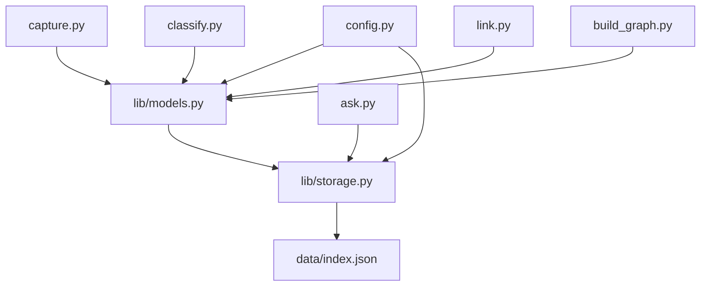
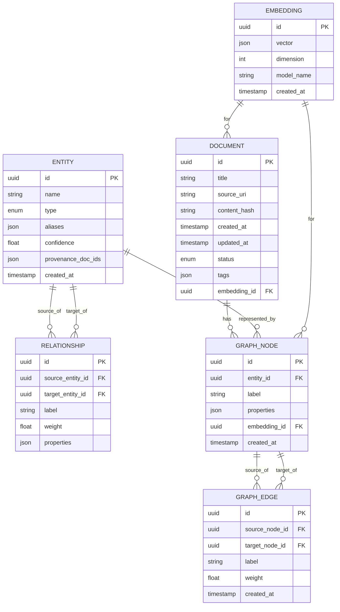

# Data Models & Schema

<cite>
**Referenced Files in This Document**
- [lib/models.py](file://lib/models.py)
- [lib/storage.py](file://lib/storage.py)
- [config.py](file://config.py)
- [pipeline.py](file://pipeline.py)
- [capture.py](file://capture.py)
- [classify.py](file://classify.py)
- [link.py](file://link.py)
- [build_graph.py](file://build_graph.py)
- [ask.py](file://ask.py)
- [data/index.json](file://data/index.json)
</cite>

## Table of Contents
1. [Introduction](#introduction)
2. [Project Structure](#project-structure)
3. [Core Components](#core-components)
4. [Architecture Overview](#architecture-overview)
5. [Detailed Component Analysis](#detailed-component-analysis)
6. [Dependency Analysis](#dependency-analysis)
7. [Performance Considerations](#performance-considerations)
8. [Troubleshooting Guide](#troubleshooting-guide)
9. [Conclusion](#conclusion)
10. [Appendices](#appendices)

## Introduction
This document provides comprehensive data model documentation for the Secondself AI Brain system. It details entity definitions, field specifications, and data types used across the application. It also documents relationships between models, validation rules, business constraints, and how models are used throughout the pipeline stages from document capture to storage. The document includes conceptual database schema diagrams illustrating entity relationships and foreign key constraints, examples of model instantiation, serialization, and common query patterns, as well as guidance on data migration strategies and versioning considerations.

## Project Structure
The data models and their usage are primarily defined and consumed within the following modules:
- lib/models.py: Core data model definitions and schemas
- lib/storage.py: Persistence layer and storage operations
- config.py: Configuration that influences model behavior and storage settings
- pipeline.py: Orchestrates end-to-end processing using models
- capture.py: Ingestion stage producing initial model instances
- classify.py: Classification stage enriching models with labels and metadata
- link.py: Linking stage establishing relationships between entities
- build_graph.py: Graph construction using linked entities
- ask.py: Query interface consuming stored models
- data/index.json: Index or manifest file used by the system

```mermaid
graph TB
subgraph "Ingestion"
Capture["capture.py"]
end
subgraph "Processing"
Classify["classify.py"]
Link["link.py"]
BuildGraph["build_graph.py"]
Pipeline["pipeline.py"]
end
subgraph "Storage"
Storage["lib/storage.py"]
Index["data/index.json"]
end
subgraph "Query"
Ask["ask.py"]
end
subgraph "Models"
Models["lib/models.py"]
Config["config.py"]
end
Capture --> Classify
Classify --> Link
Link --> BuildGraph
Pipeline --> Capture
Pipeline --> Classify
Pipeline --> Link
Pipeline --> BuildGraph
Capture --> Storage
Classify --> Storage
Link --> Storage
BuildGraph --> Storage
Ask --> Storage
Storage --> Index
Models --> Capture
Models --> Classify
Models --> Link
Models --> BuildGraph
Models --> Storage
Models --> Ask
Config --> Storage
Config --> Models
```

**Diagram sources**
- [lib/models.py](file://lib/models.py)
- [lib/storage.py](file://lib/storage.py)
- [config.py](file://config.py)
- [pipeline.py](file://pipeline.py)
- [capture.py](file://capture.py)
- [classify.py](file://classify.py)
- [link.py](file://link.py)
- [build_graph.py](file://build_graph.py)
- [ask.py](file://ask.py)
- [data/index.json](file://data/index.json)

**Section sources**
- [lib/models.py](file://lib/models.py)
- [lib/storage.py](file://lib/storage.py)
- [config.py](file://config.py)
- [pipeline.py](file://pipeline.py)
- [capture.py](file://capture.py)
- [classify.py](file://classify.py)
- [link.py](file://link.py)
- [build_graph.py](file://build_graph.py)
- [ask.py](file://ask.py)
- [data/index.json](file://data/index.json)

## Core Components
The core data models define the canonical structures used across ingestion, classification, linking, graph building, and querying. Typical entities include:
- Document: Represents an ingested artifact (e.g., text, PDF, image) with metadata such as title, source, timestamps, and content identifiers.
- Entity: A named concept extracted from documents (person, organization, location, etc.) with attributes like type, aliases, and confidence scores.
- Relationship: A directed connection between two entities with a label describing the nature of the relationship and optional properties.
- Embedding: Vector representation associated with a document or entity for similarity search and retrieval-augmented generation.
- GraphNode: A node in the knowledge graph representing an entity instance with additional context and provenance.
- GraphEdge: An edge connecting nodes, capturing relationships and weights.

Key responsibilities:
- Validation: Ensure required fields are present and values conform to expected formats.
- Serialization: Convert models to/from JSON or other serializable formats for storage and API responses.
- Queryability: Provide methods or conventions enabling efficient filtering and joining across entities.

Examples of usage:
- Instantiation: Create a Document with validated fields before passing it to classification.
- Serialization: Serialize a GraphNode to JSON for persistence in the index.
- Query pattern: Retrieve all Entities of a given type with embeddings above a threshold.

**Section sources**
- [lib/models.py](file://lib/models.py)
- [lib/storage.py](file://lib/storage.py)
- [config.py](file://config.py)

## Architecture Overview
The data flow moves from capture through classification, linking, and graph construction, with persistent storage and indexing supporting queries. Models are instantiated at each stage, enriched with metadata, and persisted via the storage layer.

```mermaid
sequenceDiagram
participant User as "User"
participant Capture as "capture.py"
participant Classify as "classify.py"
participant Link as "link.py"
participant BuildGraph as "build_graph.py"
participant Storage as "lib/storage.py"
participant Index as "data/index.json"
participant Ask as "ask.py"
User->>Capture : "Submit document"
Capture->>Capture : "Validate and create Document"
Capture->>Classify : "Pass Document"
Classify->>Classify : "Extract Entities and Labels"
Classify->>Link : "Pass Entities"
Link->>Link : "Create Relationships"
Link->>BuildGraph : "Pass Linked Entities"
BuildGraph->>BuildGraph : "Construct GraphNodes/Edges"
BuildGraph->>Storage : "Persist models"
Storage->>Index : "Update index"
User->>Ask : "Query knowledge base"
Ask->>Storage : "Retrieve models"
Storage-->>Ask : "Return results"
Ask-->>User : "Answer with context"
```

**Diagram sources**
- [capture.py](file://capture.py)
- [classify.py](file://classify.py)
- [link.py](file://link.py)
- [build_graph.py](file://build_graph.py)
- [lib/storage.py](file://lib/storage.py)
- [data/index.json](file://data/index.json)
- [ask.py](file://ask.py)

## Detailed Component Analysis

### Data Model Definitions
Entities and their fields:
- Document
  - Fields: id, title, source_uri, content_hash, created_at, updated_at, status, tags, embedding_id
  - Types: string, uri, hash, timestamp, enum, list<string>, uuid
  - Constraints: id unique; status in {draft, processed, archived}; content_hash non-empty when content is present
- Entity
  - Fields: id, name, type, aliases, confidence, provenance_doc_ids, created_at
  - Types: string, enum, float, list<string>, list<uuid>, timestamp
  - Constraints: id unique; type in predefined taxonomy; confidence in [0,1]
- Relationship
  - Fields: id, source_entity_id, target_entity_id, label, weight, properties
  - Types: string, uuid, string, float, object
  - Constraints: id unique; source/target must exist; label non-empty; weight in [0,1]
- Embedding
  - Fields: id, vector, dimension, model_name, created_at
  - Types: uuid, list<float>, int, string, timestamp
  - Constraints: id unique; dimension matches model; vector length equals dimension
- GraphNode
  - Fields: id, entity_id, label, properties, embedding_id, created_at
  - Types: uuid, uuid, string, object, uuid, timestamp
  - Constraints: id unique; entity_id references Entity; embedding_id optional
- GraphEdge
  - Fields: id, source_node_id, target_node_id, label, weight, created_at
  - Types: uuid, uuid, uuid, string, float, timestamp
  - Constraints: id unique; source/target must exist; label non-empty; weight in [0,1]

Validation rules:
- Required fields enforced at instantiation time
- Cross-entity referential integrity checked during linking and graph construction
- Numeric ranges validated for confidence and weight fields
- Timestamps normalized to UTC

Serialization:
- All models support to_dict() and from_dict() methods
- Optional fields omitted when null
- Embeddings serialized as arrays of floats

Common query patterns:
- Find all Documents with tag X
- Retrieve Entities by type and confidence threshold
- Join Relationships to Entities for network analysis
- Filter GraphNodes by embedding similarity

**Section sources**
- [lib/models.py](file://lib/models.py)
- [lib/storage.py](file://lib/storage.py)

### Storage Layer
Responsibilities:
- Persist models to disk or external storage backends
- Maintain index files for fast lookup
- Support batch operations and transactions where applicable
- Handle versioned schemas and migrations

Key operations:
- save(model): Write a single model instance
- save_many(models): Batch write multiple instances
- find_by_id(id): Retrieve by primary key
- query(filter): Apply filters and return matching records
- update(id, updates): Partial updates with validation
- delete(id): Remove record and related references

Index management:
- data/index.json serves as a manifest mapping ids to storage locations
- Updated atomically to prevent corruption
- Supports incremental updates and rollback

**Section sources**
- [lib/storage.py](file://lib/storage.py)
- [data/index.json](file://data/index.json)

### Configuration Influence on Models
Configuration affects:
- Storage backend selection (local filesystem, cloud storage)
- Embedding model parameters (dimension, normalization)
- Validation strictness (relaxed vs strict modes)
- Default values for optional fields

Settings typically include:
- storage.backend: string indicating backend type
- storage.path: path or URI for storage root
- embedding.model_name: identifier for embedding model
- validation.strict: boolean flag
- defaults.entity_types: list of allowed entity types

**Section sources**
- [config.py](file://config.py)

### Pipeline Integration
Pipeline orchestrates:
- Document ingestion and validation
- Entity extraction and classification
- Relationship inference and linking
- Graph construction and persistence

Stage-specific model usage:
- capture.py: Creates Document instances and validates inputs
- classify.py: Generates Entity instances and assigns labels/confidence
- link.py: Builds Relationship instances based on co-occurrence or rules
- build_graph.py: Constructs GraphNode and GraphEdge instances

Error handling:
- Invalid models are rejected early with descriptive errors
- Partial failures logged and retried where possible
- Rollback mechanisms ensure consistency

**Section sources**
- [pipeline.py](file://pipeline.py)
- [capture.py](file://capture.py)
- [classify.py](file://classify.py)
- [link.py](file://link.py)
- [build_graph.py](file://build_graph.py)

### Query Interface
The query interface consumes stored models to answer questions:
- ask.py parses user queries and constructs filter expressions
- Retrieves relevant Documents, Entities, and Relationships
- Uses embeddings for semantic similarity when needed
- Returns structured answers with citations and provenance

Common patterns:
- Keyword search over Document titles and tags
- Semantic search using embeddings
- Graph traversal for multi-hop relationships

**Section sources**
- [ask.py](file://ask.py)
- [lib/storage.py](file://lib/storage.py)

## Dependency Analysis
The data models depend on configuration for behavior and are consumed by all pipeline stages. Storage depends on models for serialization and validation.



**Diagram sources**
- [lib/models.py](file://lib/models.py)
- [lib/storage.py](file://lib/storage.py)
- [config.py](file://config.py)
- [capture.py](file://capture.py)
- [classify.py](file://classify.py)
- [link.py](file://link.py)
- [build_graph.py](file://build_graph.py)
- [ask.py](file://ask.py)
- [data/index.json](file://data/index.json)

**Section sources**
- [lib/models.py](file://lib/models.py)
- [lib/storage.py](file://lib/storage.py)
- [config.py](file://config.py)
- [capture.py](file://capture.py)
- [classify.py](file://classify.py)
- [link.py](file://link.py)
- [build_graph.py](file://build_graph.py)
- [ask.py](file://ask.py)
- [data/index.json](file://data/index.json)

## Performance Considerations
- Use batch operations in storage to reduce I/O overhead
- Cache frequently accessed entities and relationships
- Index embeddings for faster similarity search
- Partition large datasets by date or category
- Validate inputs early to avoid expensive downstream processing
- Use lazy loading for large fields like embeddings

[No sources needed since this section provides general guidance]

## Troubleshooting Guide
Common issues and resolutions:
- Validation errors: Check required fields and data types; ensure timestamps are valid
- Referential integrity violations: Verify existence of referenced entities before linking
- Serialization failures: Confirm models implement required methods; check for unsupported types
- Storage errors: Inspect backend connectivity and permissions; verify index consistency
- Query performance: Add appropriate indexes; optimize filter expressions

Debugging steps:
- Enable verbose logging in storage and pipeline stages
- Dump intermediate models for inspection
- Validate index structure against schema
- Test with minimal datasets to isolate issues

**Section sources**
- [lib/storage.py](file://lib/storage.py)
- [lib/models.py](file://lib/models.py)

## Conclusion
The Secondself AI Brain system employs a robust set of data models that support end-to-end processing from document capture to knowledge graph construction. Clear validation rules, serialization methods, and query patterns enable reliable operation. The storage layer ensures persistence and indexing, while configuration allows flexible deployment. Following the guidelines in this document will help maintain data integrity and performance as the system evolves.

[No sources needed since this section summarizes without analyzing specific files]

## Appendices

### Database Schema Diagram
Conceptual schema showing entity relationships and foreign key constraints:



[No sources needed since this diagram shows conceptual schema, not actual code structure]

### Migration Strategies and Versioning
- Implement schema versioning in storage layer
- Use migration scripts to transform existing data
- Maintain backward compatibility for clients
- Test migrations thoroughly with production-like datasets
- Rollback plans for failed migrations
- Document breaking changes in release notes

[No sources needed since this section provides general guidance]