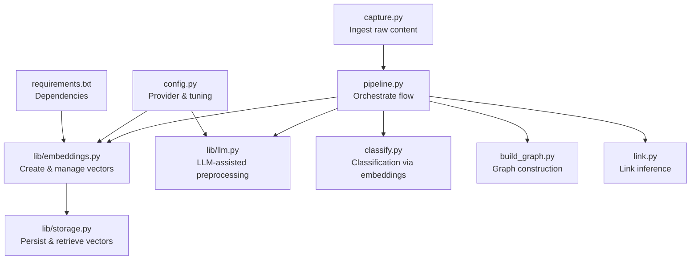
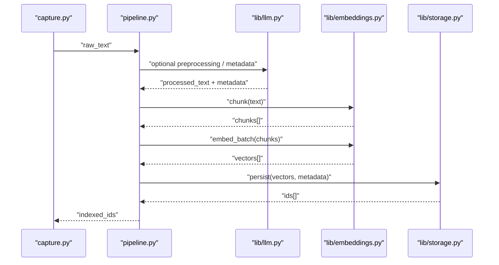
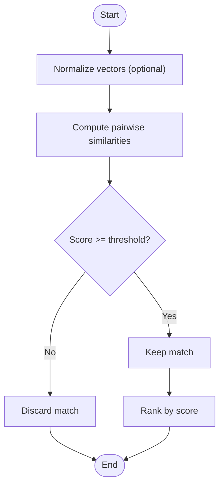
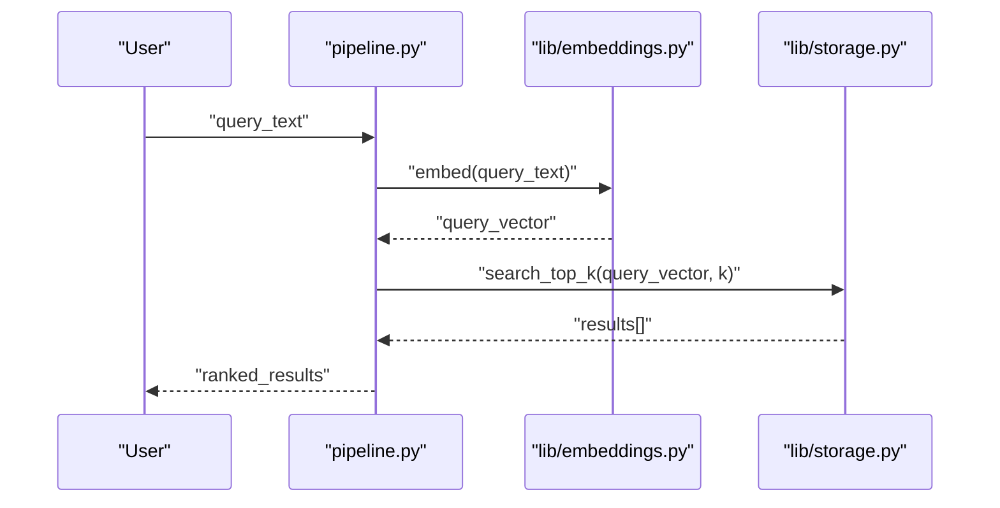
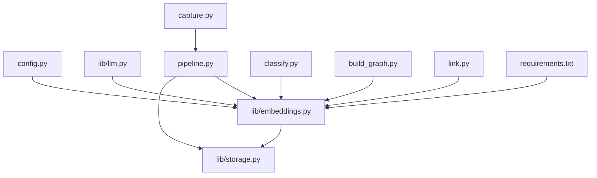

# Embedding Generation System

<cite>
**Referenced Files in This Document**
- [embeddings.py](file://lib/embeddings.py)
- [llm.py](file://lib/llm.py)
- [storage.py](file://lib/storage.py)
- [config.py](file://config.py)
- [pipeline.py](file://pipeline.py)
- [classify.py](file://classify.py)
- [build_graph.py](file://build_graph.py)
- [capture.py](file://capture.py)
- [link.py](file://link.py)
- [requirements.txt](file://requirements.txt)
</cite>

## Table of Contents
1. [Introduction](#introduction)
2. [Project Structure](#project-structure)
3. [Core Components](#core-components)
4. [Architecture Overview](#architecture-overview)
5. [Detailed Component Analysis](#detailed-component-analysis)
6. [Dependency Analysis](#dependency-analysis)
7. [Performance Considerations](#performance-considerations)
8. [Troubleshooting Guide](#troubleshooting-guide)
9. [Conclusion](#conclusion)
10. [Appendices](#appendices)

## Introduction
This document explains the embedding generation subsystem: how raw text is transformed into vectors, how those vectors are processed and stored, and how they enable semantic search and clustering within the system. It covers algorithms, vector dimensions, similarity metrics, batch processing, provider configuration, performance tuning, caching strategies, and integration with the LLM component and storage layer.

## Project Structure
The embedding subsystem spans several modules:
- lib/embeddings.py: Embedding creation, batching, normalization, and similarity utilities
- lib/llm.py: LLM integration for text summarization, chunking guidance, and metadata enrichment
- lib/storage.py: Vector persistence and retrieval interfaces
- config.py: Provider selection, model names, API keys, and tuning parameters
- pipeline.py: Orchestrates ingestion, chunking, embedding, and indexing
- classify.py: Uses embeddings for classification tasks
- build_graph.py: Builds knowledge graphs using embeddings for link inference
- capture.py: Captures raw content to be embedded
- link.py: Establishes relationships between documents via embeddings
- requirements.txt: External dependencies (e.g., embedding SDKs, vector stores)

**Diagram sources**
- [pipeline.py](file://pipeline.py)
- [embeddings.py](file://lib/embeddings.py)
- [llm.py](file://lib/llm.py)
- [storage.py](file://lib/storage.py)
- [classify.py](file://classify.py)
- [build_graph.py](file://build_graph.py)
- [capture.py](file://capture.py)
- [link.py](file://link.py)
- [config.py](file://config.py)
- [requirements.txt](file://requirements.txt)

**Section sources**
- [embeddings.py](file://lib/embeddings.py)
- [llm.py](file://lib/llm.py)
- [storage.py](file://lib/storage.py)
- [config.py](file://config.py)
- [pipeline.py](file://pipeline.py)
- [classify.py](file://classify.py)
- [build_graph.py](file://build_graph.py)
- [capture.py](file://capture.py)
- [link.py](file://link.py)
- [requirements.txt](file://requirements.txt)

## Core Components
- Embedding Provider Abstraction: Encapsulates different embedding backends (e.g., OpenAI, local models). Supports selecting a provider by name and loading credentials from configuration.
- Chunker: Splits raw text into semantically coherent chunks suitable for embedding.
- Vectorizer: Converts chunks to fixed-dimensional vectors; supports batch mode and optional normalization.
- Similarity Engine: Computes cosine similarity or other metrics across vectors for search and clustering.
- Storage Adapter: Persists vectors with metadata and supports retrieval by ID or similarity queries.
- Pipeline Orchestrator: Coordinates capture, chunking, embedding, and indexing steps.

Key responsibilities and interactions:
- Input text flows through the chunker to produce segments.
- Segments are sent to the vectorizer in batches to generate embeddings.
- Embeddings are normalized and persisted via the storage adapter.
- Queries are embedded and matched against stored vectors using the similarity engine.

**Section sources**
- [embeddings.py](file://lib/embeddings.py)
- [storage.py](file://lib/storage.py)
- [pipeline.py](file://pipeline.py)

## Architecture Overview
The embedding architecture integrates three layers:
- Ingestion Layer: Captures and preprocesses raw content.
- Embedding Layer: Chunks text, generates vectors, normalizes, and caches results.
- Storage and Retrieval Layer: Persists vectors and performs similarity search.

**Diagram sources**
- [capture.py](file://capture.py)
- [pipeline.py](file://pipeline.py)
- [llm.py](file://lib/llm.py)
- [embeddings.py](file://lib/embeddings.py)
- [storage.py](file://lib/storage.py)

## Detailed Component Analysis

### Embedding Provider and Model Configuration
- Provider selection: Choose an embedding provider by name; load model identifiers and API keys from configuration.
- Dimensions: Each provider defines a fixed output dimensionality; ensure consistency across the system.
- Normalization: Optional L2 normalization applied to improve cosine similarity stability.
- Batch size: Configurable to balance throughput and memory usage.

Configuration options typically include:
- provider: Name of the embedding backend
- model: Specific model identifier
- api_key: Secret key for authentication
- dimensions: Expected vector length
- normalize: Boolean flag for L2 normalization
- batch_size: Number of chunks per request
- timeout: Request timeout in seconds

**Section sources**
- [config.py](file://config.py)
- [embeddings.py](file://lib/embeddings.py)

### Text Chunking Strategy
- Splitting rules: Sentence boundaries, paragraph breaks, and token limits.
- Overlap: Optional overlap to preserve context across chunk boundaries.
- Metadata: Attach source IDs, timestamps, and provenance to each chunk.

Chunking ensures that embeddings represent meaningful units while minimizing fragmentation.

**Section sources**
- [embeddings.py](file://lib/embeddings.py)

### Vectorization and Similarity Metrics
- Algorithms: Provider-specific transformer-based encoders produce dense vectors.
- Dimensions: Fixed-length vectors determined by the chosen model.
- Similarity: Cosine similarity is standard; alternative metrics can be supported via adapters.
- Search: Top-k nearest neighbors returned based on similarity scores.

**Diagram sources**
- [embeddings.py](file://lib/embeddings.py)

**Section sources**
- [embeddings.py](file://lib/embeddings.py)

### Batch Processing Capabilities
- Batching: Groups multiple chunks into a single request to reduce overhead.
- Concurrency: Optional parallel requests with rate limiting.
- Retry logic: Exponential backoff for transient failures.
- Memory management: Streams large inputs to avoid peak memory spikes.

Batching improves throughput while maintaining accuracy and reliability.

**Section sources**
- [embeddings.py](file://lib/embeddings.py)

### Integration with Storage Layer
- Persistence: Vectors and metadata are stored with unique IDs.
- Indexing: An index is maintained for fast similarity queries.
- Retrieval: Supports lookup by ID and similarity search with top-k results.
- Versioning: Stores versioned embeddings to support model updates.

Storage operations are abstracted to allow swapping backends without changing higher-level logic.

**Section sources**
- [storage.py](file://lib/storage.py)

### Relationship with the LLM Component
- Preprocessing: LLM assists in cleaning text, extracting entities, and generating summaries.
- Metadata enrichment: Adds tags, categories, and relations to aid search and clustering.
- Guidance: Provides hints for chunking boundaries and relevance scoring.

The LLM enhances embedding quality by improving input coherence and enriching context.

**Section sources**
- [llm.py](file://lib/llm.py)
- [embeddings.py](file://lib/embeddings.py)

### Semantic Search Workflow
- Query embedding: Convert user query into a vector using the same provider and normalization.
- Similarity search: Compare query vector against stored vectors to find top matches.
- Ranking: Apply filters and re-ranking based on metadata and recency.

**Diagram sources**
- [pipeline.py](file://pipeline.py)
- [embeddings.py](file://lib/embeddings.py)
- [storage.py](file://lib/storage.py)

### Document Clustering Using Embeddings
- Clustering algorithm: Group similar vectors using distance thresholds or density-based methods.
- Cluster metadata: Assign labels and representative summaries.
- Usage: Powers topic discovery and navigation aids.

Clustering leverages embedding proximity to discover thematic groupings.

**Section sources**
- [embeddings.py](file://lib/embeddings.py)

### Classification and Graph Construction
- Classification: Use embeddings as features for supervised or unsupervised classification.
- Graph construction: Build nodes and edges based on embedding similarity and metadata relations.
- Link inference: Identify potential connections between documents using vector proximity.

These capabilities extend embeddings beyond search into reasoning and knowledge organization.

**Section sources**
- [classify.py](file://classify.py)
- [build_graph.py](file://build_graph.py)
- [link.py](file://link.py)

## Dependency Analysis
The embedding subsystem depends on configuration, LLM assistance, and storage abstraction. The following diagram shows core dependencies:

**Diagram sources**
- [config.py](file://config.py)
- [embeddings.py](file://lib/embeddings.py)
- [llm.py](file://lib/llm.py)
- [storage.py](file://lib/storage.py)
- [pipeline.py](file://pipeline.py)
- [classify.py](file://classify.py)
- [build_graph.py](file://build_graph.py)
- [capture.py](file://capture.py)
- [link.py](file://link.py)
- [requirements.txt](file://requirements.txt)

**Section sources**
- [embeddings.py](file://lib/embeddings.py)
- [storage.py](file://lib/storage.py)
- [pipeline.py](file://pipeline.py)
- [config.py](file://config.py)
- [llm.py](file://lib/llm.py)
- [requirements.txt](file://requirements.txt)

## Performance Considerations
- Batch sizing: Tune batch_size to maximize throughput without exceeding memory limits.
- Concurrency: Adjust parallelism based on provider rate limits and network latency.
- Normalization: Enable L2 normalization only when needed to reduce compute overhead.
- Caching: Cache embeddings for identical text to avoid redundant calls.
- Indexing: Maintain efficient indexes for fast similarity queries.
- Model selection: Choose providers/models balancing accuracy and speed.

[No sources needed since this section provides general guidance]

## Troubleshooting Guide
Common issues and resolutions:
- Provider errors: Validate API keys, model names, and quotas; implement retries with backoff.
- Dimension mismatch: Ensure all components use consistent vector dimensions.
- Slow queries: Check index health and consider precomputing popular queries.
- Memory pressure: Reduce batch sizes and enable streaming for large inputs.
- Stale embeddings: Implement versioning and migration strategies when updating models.

**Section sources**
- [embeddings.py](file://lib/embeddings.py)
- [storage.py](file://lib/storage.py)
- [config.py](file://config.py)

## Conclusion
The embedding generation subsystem transforms raw text into searchable and analyzable vectors, integrating seamlessly with LLM-assisted preprocessing and robust storage. By configuring providers, tuning performance, and leveraging similarity metrics, the system enables semantic search, classification, and clustering at scale.

[No sources needed since this section summarizes without analyzing specific files]

## Appendices

### Example: Creating Embeddings from Raw Text
- Steps:
  - Capture raw text.
  - Optionally preprocess with LLM.
  - Chunk text into segments.
  - Generate embeddings in batches.
  - Persist vectors with metadata.
  - Return indexed IDs for later retrieval.

**Section sources**
- [capture.py](file://capture.py)
- [pipeline.py](file://pipeline.py)
- [embeddings.py](file://lib/embeddings.py)
- [storage.py](file://lib/storage.py)

### Example: Batch Processing Workflow
- Steps:
  - Collect multiple chunks.
  - Send batched requests to the embedding provider.
  - Handle retries and rate limits.
  - Normalize and store results.

**Section sources**
- [embeddings.py](file://lib/embeddings.py)

### Example: Semantic Search Flow
- Steps:
  - Embed the query.
  - Perform similarity search against stored vectors.
  - Rank and filter results.
  - Return top-k matches.

**Section sources**
- [embeddings.py](file://lib/embeddings.py)
- [storage.py](file://lib/storage.py)
- [pipeline.py](file://pipeline.py)