# LLM Integration Layer

<cite>
**Referenced Files in This Document**
- [llm.py](file://lib/llm.py)
- [extract.py](file://lib/extract.py)
- [classify.py](file://classify.py)
- [pipeline.py](file://pipeline.py)
- [config.py](file://config.py)
- [models.py](file://lib/models.py)
- [embeddings.py](file://lib/embeddings.py)
- [storage.py](file://lib/storage.py)
- [requirements.txt](file://requirements.txt)
</cite>

## Table of Contents
1. [Introduction](#introduction)
2. [Project Structure](#project-structure)
3. [Core Components](#core-components)
4. [Architecture Overview](#architecture-overview)
5. [Detailed Component Analysis](#detailed-component-analysis)
6. [Dependency Analysis](#dependency-analysis)
7. [Performance Considerations](#performance-considerations)
8. [Troubleshooting Guide](#troubleshooting-guide)
9. [Conclusion](#conclusion)
10. [Appendices](#appendices)

## Introduction
This document describes the Large Language Model (LLM) integration layer that abstracts multiple model providers, standardizes prompt engineering, and unifies response processing across the system. It explains how the LLM layer integrates with classification and extraction pipelines, outlines supported providers and authentication patterns, and documents rate limiting, fallback strategies, monitoring, and performance optimizations. The goal is to make the LLM subsystem robust, observable, and easy to extend with new providers or prompts while keeping downstream consumers consistent.

## Project Structure
The LLM integration lives primarily under lib/llm.py and is consumed by higher-level modules such as extract.py and classify.py. Configuration for providers and runtime behavior is centralized in config.py. Data models used throughout are defined in lib/models.py. Supporting utilities include embeddings.py and storage.py. Dependencies are declared in requirements.txt.

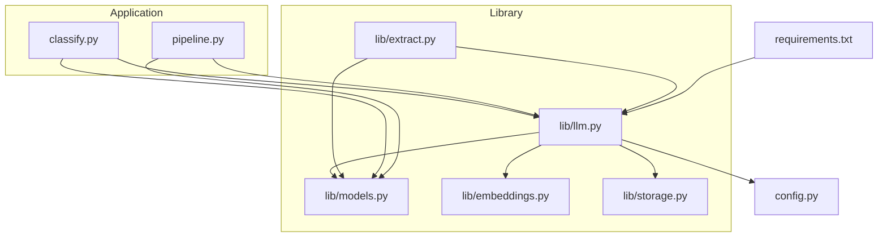

**Diagram sources**
- [llm.py](file://lib/llm.py)
- [extract.py](file://lib/extract.py)
- [classify.py](file://classify.py)
- [pipeline.py](file://pipeline.py)
- [config.py](file://config.py)
- [models.py](file://lib/models.py)
- [embeddings.py](file://lib/embeddings.py)
- [storage.py](file://lib/storage.py)
- [requirements.txt](file://requirements.txt)

**Section sources**
- [llm.py](file://lib/llm.py)
- [extract.py](file://lib/extract.py)
- [classify.py](file://classify.py)
- [pipeline.py](file://pipeline.py)
- [config.py](file://config.py)
- [models.py](file://lib/models.py)
- [embeddings.py](file://lib/embeddings.py)
- [storage.py](file://lib/storage.py)
- [requirements.txt](file://requirements.txt)

## Core Components
- Provider Abstraction: A unified interface for calling different LLM providers with a consistent API contract.
- Prompt Engineering: Centralized template management and rendering utilities to build structured prompts.
- Response Processing: Normalization, parsing, validation, and error mapping from provider-specific outputs to common types.
- Authentication and Secrets: Secure handling of credentials per provider via configuration.
- Rate Limiting and Retries: Configurable backoff, jitter, and retry policies to protect against throttling and transient failures.
- Monitoring and Observability: Structured logging, metrics, and tracing hooks for call lifecycle and outcomes.
- Pipeline Integration: Clean entry points for classification and extraction workflows to request LLM calls without coupling to provider specifics.

Key responsibilities and interactions are implemented in lib/llm.py and consumed by lib/extract.py and classify.py, with configuration sourced from config.py and data contracts defined in lib/models.py.

**Section sources**
- [llm.py](file://lib/llm.py)
- [extract.py](file://lib/extract.py)
- [classify.py](file://classify.py)
- [config.py](file://config.py)
- [models.py](file://lib/models.py)

## Architecture Overview
The LLM layer sits between application pipelines and external model providers. It abstracts provider differences, enforces consistent prompting, and normalizes responses. It also centralizes cross-cutting concerns like retries, rate limits, and observability.

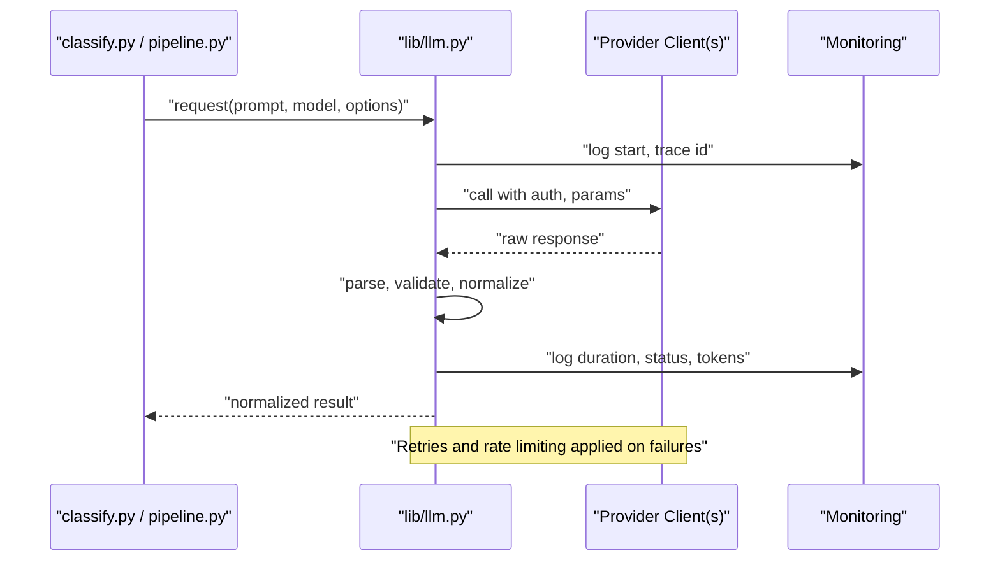

**Diagram sources**
- [llm.py](file://lib/llm.py)
- [classify.py](file://classify.py)
- [pipeline.py](file://pipeline.py)

## Detailed Component Analysis

### Provider Abstraction and Clients
- Unified client interface: Single method family to send prompts and receive normalized results.
- Provider selection: Determined by configuration; supports pluggable clients for different vendors.
- Authentication: Credentials loaded securely from configuration; per-provider keys or tokens.
- Error mapping: Provider exceptions mapped to standardized errors with actionable messages.

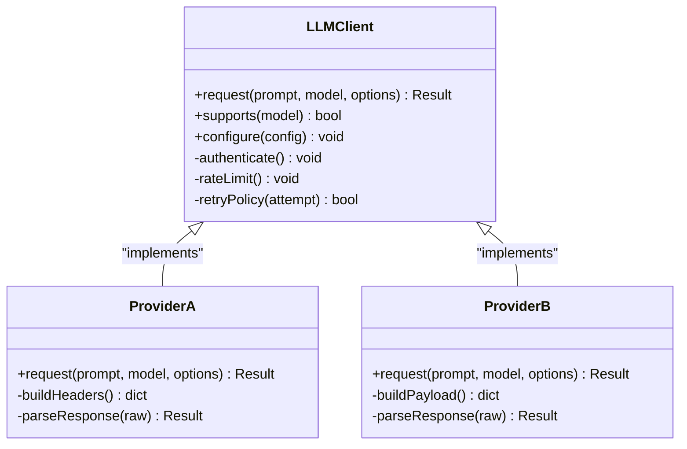

**Diagram sources**
- [llm.py](file://lib/llm.py)

**Section sources**
- [llm.py](file://lib/llm.py)

### Prompt Engineering Patterns
- Template registry: Centralized templates keyed by task (e.g., classification, extraction).
- Rendering: Context injection, variable substitution, and schema enforcement.
- Validation: Pre-flight checks to ensure required fields and constraints are met.
- Versioning: Template versioning to avoid breaking changes in production.

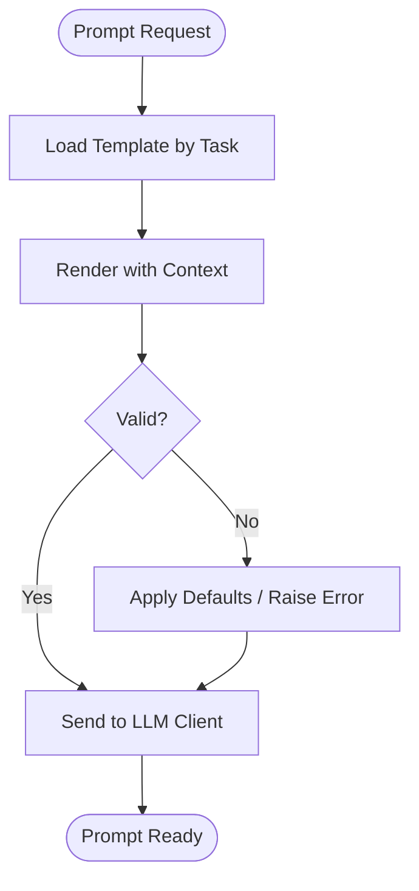

**Diagram sources**
- [llm.py](file://lib/llm.py)

**Section sources**
- [llm.py](file://lib/llm.py)

### Response Processing and Parsing
- Normalization: Convert provider-specific payloads into a common structure.
- Parsing: Extract content, metadata, and usage stats; handle JSON/text formats.
- Validation: Enforce schemas for structured outputs; coerce types where safe.
- Error Handling: Map provider errors to domain errors; surface actionable diagnostics.

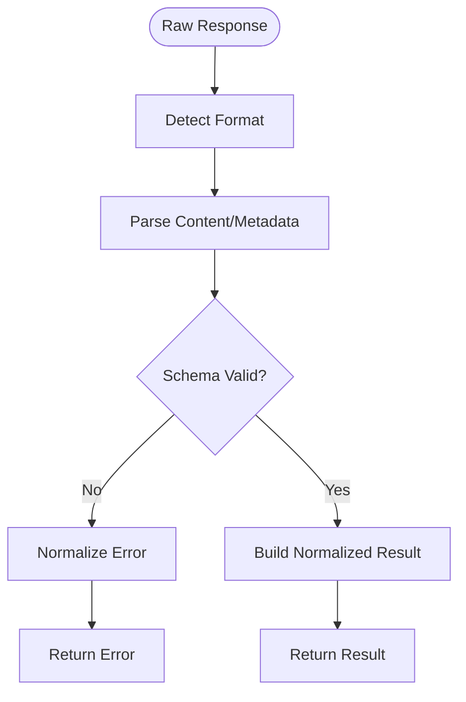

**Diagram sources**
- [llm.py](file://lib/llm.py)

**Section sources**
- [llm.py](file://lib/llm.py)

### Authentication Methods
- Configuration-driven secrets: Per-provider keys, tokens, or session configs.
- Secret loading: Secure retrieval from environment or secret stores.
- Rotation support: Ability to reload credentials without restarts.

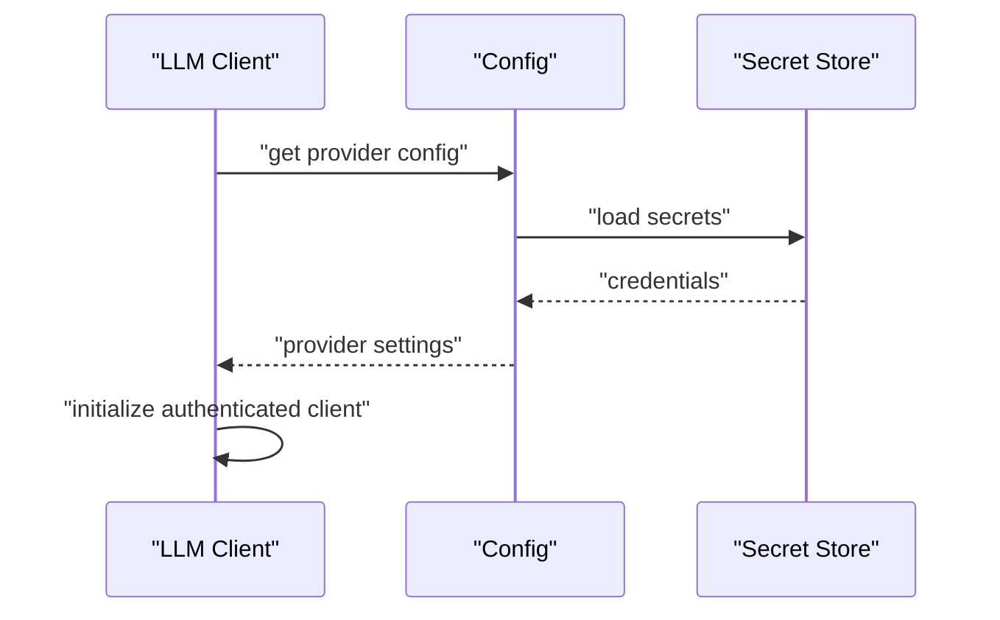

**Diagram sources**
- [llm.py](file://lib/llm.py)
- [config.py](file://config.py)

**Section sources**
- [llm.py](file://lib/llm.py)
- [config.py](file://config.py)

### Rate Limiting and Retry Strategies
- Global and per-provider rate limits: Tokens per minute, requests per second.
- Backoff policy: Exponential backoff with jitter and maximum attempts.
- Circuit breaker: Temporarily disable failing providers until recovery.

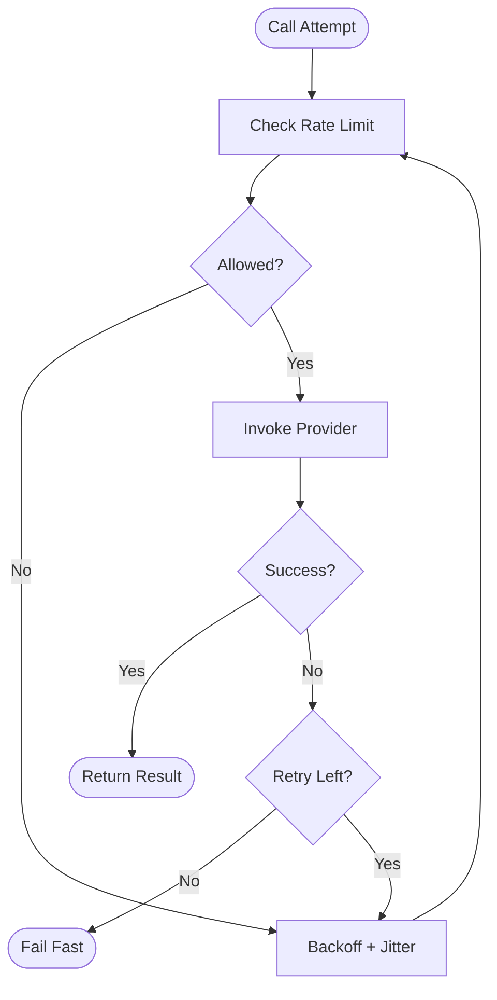

**Diagram sources**
- [llm.py](file://lib/llm.py)

**Section sources**
- [llm.py](file://lib/llm.py)

### Integration with Classification and Extraction Pipelines
- Classification: Uses LLM to categorize inputs based on templates and schemas.
- Extraction: Uses LLM to pull structured entities or fields from text.
- Pipeline orchestration: Coordinates steps, caching, and fallbacks.

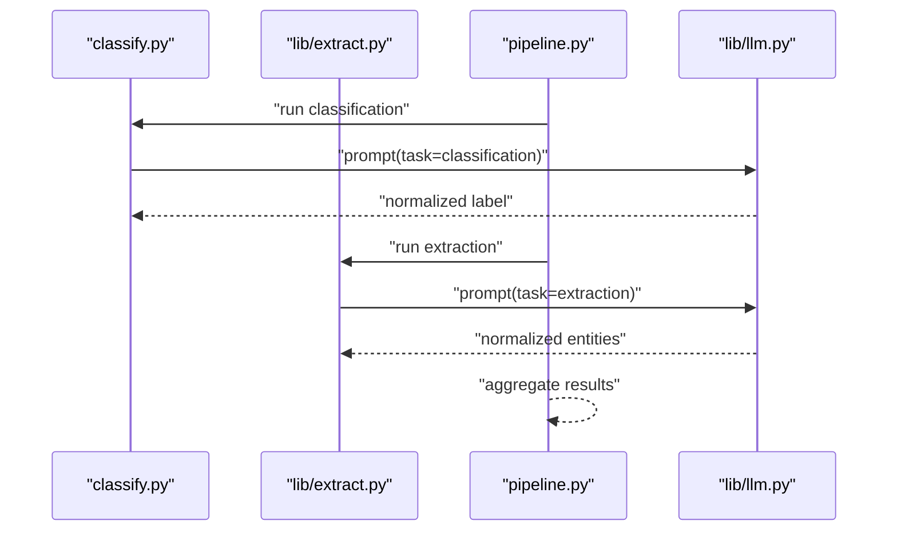

**Diagram sources**
- [classify.py](file://classify.py)
- [extract.py](file://lib/extract.py)
- [pipeline.py](file://pipeline.py)
- [llm.py](file://lib/llm.py)

**Section sources**
- [classify.py](file://classify.py)
- [extract.py](file://lib/extract.py)
- [pipeline.py](file://pipeline.py)
- [llm.py](file://lib/llm.py)

### Supported Model Providers and Capabilities
- Provider list: Defined via configuration; each provider exposes capabilities and constraints.
- Capability detection: Determine supported features (e.g., function calling, streaming).
- Fallback chain: Ordered list of providers to try when primary fails or is throttled.

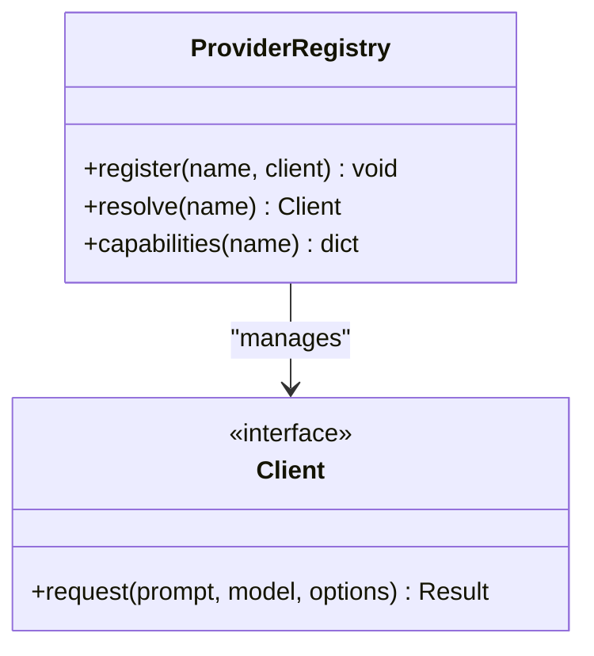

**Diagram sources**
- [llm.py](file://lib/llm.py)
- [config.py](file://config.py)

**Section sources**
- [llm.py](file://lib/llm.py)
- [config.py](file://config.py)

### Data Models and Contracts
- Common result type: Encapsulates content, metadata, and usage statistics.
- Error types: Standardized error classes for consistent handling upstream.
- Schema definitions: For structured outputs and validation.

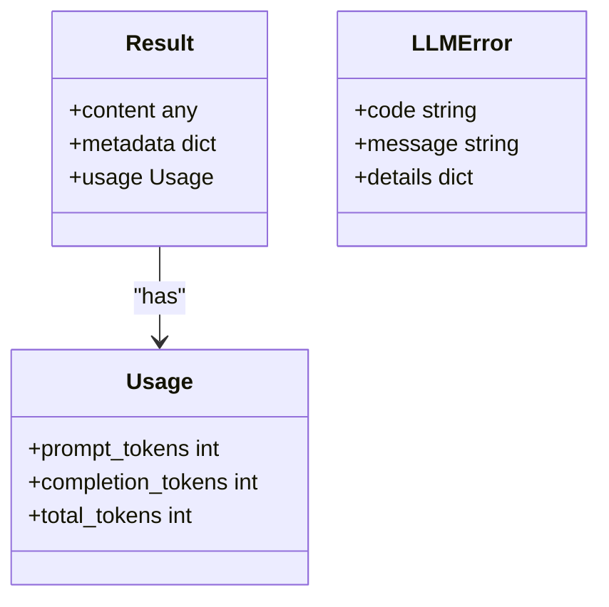

**Diagram sources**
- [models.py](file://lib/models.py)
- [llm.py](file://lib/llm.py)

**Section sources**
- [models.py](file://lib/models.py)
- [llm.py](file://lib/llm.py)

### Monitoring and Observability
- Structured logs: Include trace IDs, provider names, latency, token counts, and status.
- Metrics: Counters for success/failure, latency histograms, and rate limit events.
- Tracing: Span creation around LLM calls for distributed tracing systems.

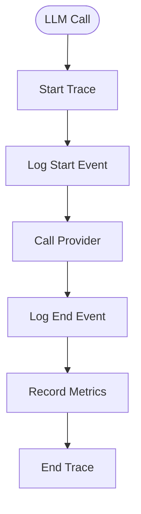

**Diagram sources**
- [llm.py](file://lib/llm.py)

**Section sources**
- [llm.py](file://lib/llm.py)

### Performance Optimization Techniques
- Caching: Cache repeated prompts or similar queries to reduce cost and latency.
- Streaming: Stream responses where supported to reduce time-to-first-token.
- Batching: Group independent requests when possible.
- Concurrency: Parallel calls with controlled concurrency limits.
- Token budgeting: Trim prompts and enforce token limits to stay within quotas.

[No sources needed since this section provides general guidance]

### Fallback Mechanisms
- Primary and secondary providers: Configure ordered fallbacks.
- Health checks: Periodic probes to mark providers unhealthy.
- Graceful degradation: Return cached or partial results when all providers fail.

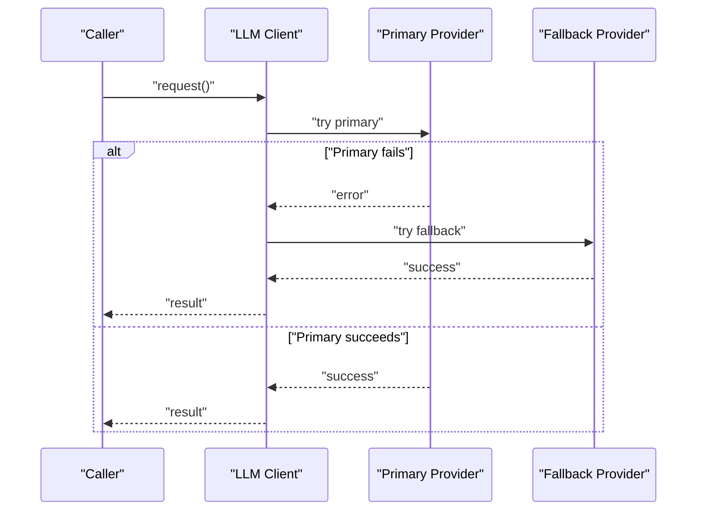

**Diagram sources**
- [llm.py](file://lib/llm.py)

**Section sources**
- [llm.py](file://lib/llm.py)

## Dependency Analysis
The LLM layer depends on configuration, data models, and optional utilities for embeddings and storage. Consumers include classification and pipeline modules.

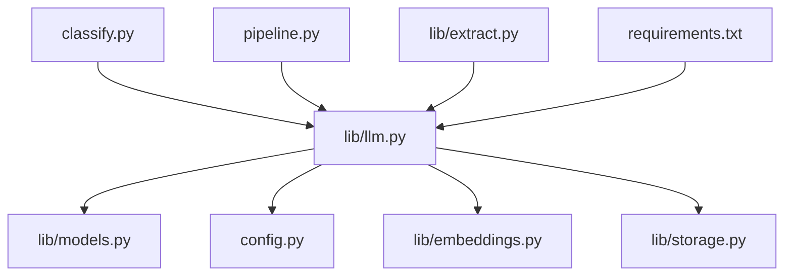

**Diagram sources**
- [llm.py](file://lib/llm.py)
- [models.py](file://lib/models.py)
- [config.py](file://config.py)
- [embeddings.py](file://lib/embeddings.py)
- [storage.py](file://lib/storage.py)
- [classify.py](file://classify.py)
- [pipeline.py](file://pipeline.py)
- [extract.py](file://lib/extract.py)
- [requirements.txt](file://requirements.txt)

**Section sources**
- [llm.py](file://lib/llm.py)
- [models.py](file://lib/models.py)
- [config.py](file://config.py)
- [embeddings.py](file://lib/embeddings.py)
- [storage.py](file://lib/storage.py)
- [classify.py](file://classify.py)
- [pipeline.py](file://pipeline.py)
- [extract.py](file://lib/extract.py)
- [requirements.txt](file://requirements.txt)

## Performance Considerations
- Prefer streaming for long responses to improve perceived latency.
- Use caching for deterministic prompts and stable outputs.
- Batch independent operations to maximize throughput.
- Tune concurrency to balance latency and resource usage.
- Monitor token usage and adjust prompt sizes to remain within quotas.
- Implement circuit breakers to prevent cascading failures.

[No sources needed since this section provides general guidance]

## Troubleshooting Guide
- Authentication failures: Verify provider credentials and scopes; check secret rotation.
- Rate limit errors: Inspect rate limit headers; adjust backoff and concurrency.
- Parsing errors: Validate response schemas; add defensive parsing and fallbacks.
- Timeouts: Increase timeouts cautiously; investigate network conditions.
- Monitoring gaps: Ensure logs, metrics, and traces are emitted consistently.

**Section sources**
- [llm.py](file://lib/llm.py)

## Conclusion
The LLM integration layer provides a robust abstraction over multiple providers, standardizing prompts, responses, authentication, rate limiting, and observability. It integrates cleanly with classification and extraction pipelines, enabling scalable and maintainable AI functionality. By following the patterns and recommendations outlined here, teams can extend providers, optimize performance, and ensure reliable operation under varying loads and failure conditions.

## Appendices

### Example Prompt Templates
- Classification template: Task description, input text, allowed labels, output format.
- Extraction template: Field definitions, constraints, examples, and JSON schema.
- Refinement template: Iterative improvement instructions with feedback loops.

[No sources needed since this section provides general guidance]

### Example Response Parsing
- JSON parsing with schema validation.
- Text extraction with regex or parser fallbacks.
- Metadata normalization for usage and provenance.

[No sources needed since this section provides general guidance]

### Example Error Handling Patterns
- Mapping provider codes to domain errors.
- Retrying only on transient failures.
- Returning user-friendly messages with diagnostic details for internal logs.

[No sources needed since this section provides general guidance]