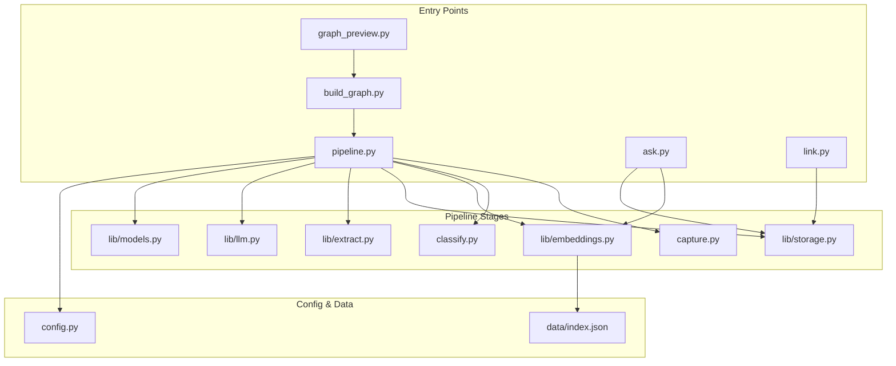
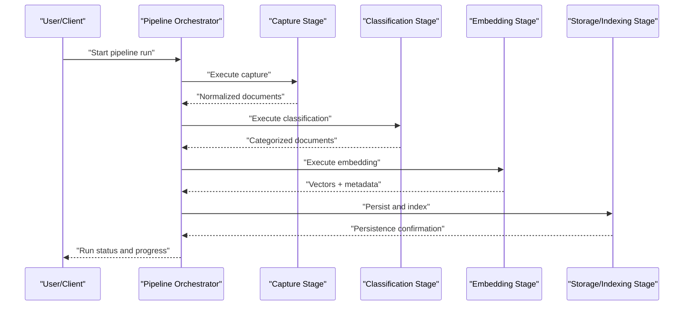
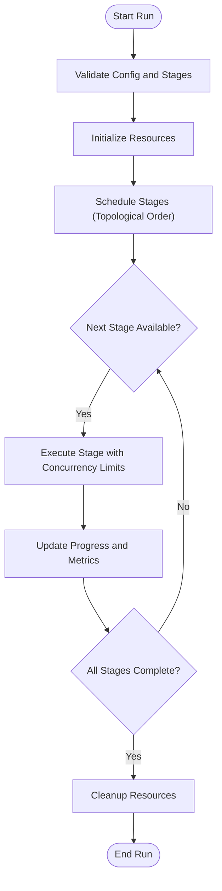
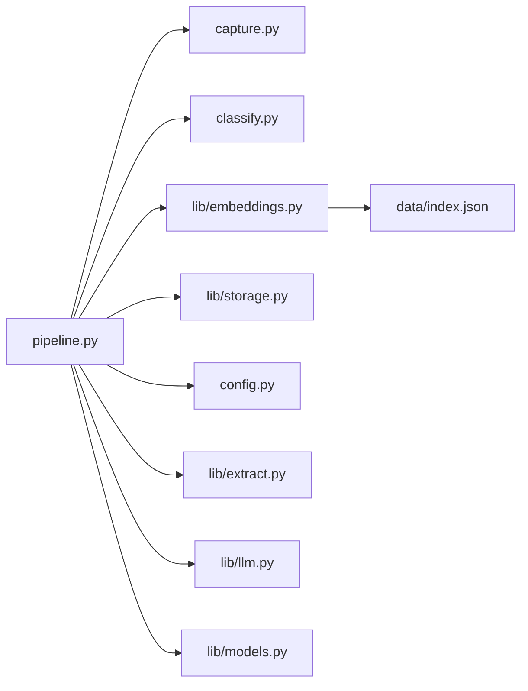

# Pipeline Orchestration Engine

<cite>
**Referenced Files in This Document**
- [pipeline.py](file://pipeline.py)
- [capture.py](file://capture.py)
- [classify.py](file://classify.py)
- [embeddings.py](file://lib/embeddings.py)
- [storage.py](file://lib/storage.py)
- [extract.py](file://lib/extract.py)
- [llm.py](file://lib/llm.py)
- [models.py](file://lib/models.py)
- [config.py](file://config.py)
- [build_graph.py](file://build_graph.py)
- [graph_preview.py](file://graph_preview.py)
- [ask.py](file://ask.py)
- [link.py](file://link.py)
- [index.json](file://data/index.json)
- [architecture.md](file://docs/architecture.md)
- [implementation-plan.md](file://docs/implementation-plan.md)
</cite>

## Table of Contents
1. [Introduction](#introduction)
2. [Project Structure](#project-structure)
3. [Core Components](#core-components)
4. [Architecture Overview](#architecture-overview)
5. [Detailed Component Analysis](#detailed-component-analysis)
6. [Dependency Analysis](#dependency-analysis)
7. [Performance Considerations](#performance-considerations)
8. [Troubleshooting Guide](#troubleshooting-guide)
9. [Conclusion](#conclusion)
10. [Appendices](#appendices)

## Introduction
This document explains the pipeline orchestration engine that coordinates document processing workflows across capture, classification, embedding, and storage stages. It covers the pipeline architecture, stage definitions, execution flow control, monitoring, parallel processing, resource management, debugging techniques for long-running pipelines, and extension points for adding new stages or integrating external tools. The goal is to make the system understandable for both technical and non-technical readers while providing actionable guidance for extending and operating the pipeline effectively.

## Project Structure
The repository organizes functionality into focused modules:
- Top-level scripts define entry points and orchestration logic (e.g., pipeline, graph building, preview).
- Library modules encapsulate domain logic such as embeddings, extraction, LLM integration, models, and storage.
- Configuration centralizes settings used by the pipeline and its stages.
- Data artifacts include an index file used by the retrieval layer.
- Documentation provides architectural context and implementation plans.

**Diagram sources**
- [pipeline.py](file://pipeline.py)
- [capture.py](file://capture.py)
- [classify.py](file://classify.py)
- [lib/embeddings.py](file://lib/embeddings.py)
- [lib/storage.py](file://lib/storage.py)
- [lib/extract.py](file://lib/extract.py)
- [lib/llm.py](file://lib/llm.py)
- [lib/models.py](file://lib/models.py)
- [config.py](file://config.py)
- [data/index.json](file://data/index.json)
- [build_graph.py](file://build_graph.py)
- [graph_preview.py](file://graph_preview.py)
- [ask.py](file://ask.py)
- [link.py](file://link.py)

**Section sources**
- [architecture.md](file://docs/architecture.md)
- [implementation-plan.md](file://docs/implementation-plan.md)

## Core Components
- Pipeline Orchestrator: Defines the sequence and dependencies of stages, manages execution state, progress tracking, and error handling.
- Stage Implementations:
  - Capture: Ingests raw documents from various sources and normalizes them.
  - Classification: Applies rules or models to categorize content.
  - Embedding: Generates vector representations for semantic search and retrieval.
  - Storage: Persists processed artifacts and metadata; indexes vectors for querying.
- Supporting Modules:
  - Extraction: Parses and extracts structured data from documents.
  - LLM Integration: Provides language model capabilities for enrichment or transformation.
  - Models: Encapsulates model loading, configuration, and inference helpers.
  - Storage Utilities: Handles persistence, indexing, and retrieval operations.
- Configuration: Centralized settings for pipeline behavior, stage options, and external integrations.

Key responsibilities:
- Define a clear stage interface with standardized inputs/outputs.
- Provide hooks for logging, metrics, and progress updates.
- Support configurable concurrency and resource limits per stage.
- Ensure idempotency and resumability for long-running jobs.

**Section sources**
- [pipeline.py](file://pipeline.py)
- [capture.py](file://capture.py)
- [classify.py](file://classify.py)
- [lib/embeddings.py](file://lib/embeddings.py)
- [lib/storage.py](file://lib/storage.py)
- [lib/extract.py](file://lib/extract.py)
- [lib/llm.py](file://lib/llm.py)
- [lib/models.py](file://lib/models.py)
- [config.py](file://config.py)

## Architecture Overview
The pipeline orchestrates a directed acyclic graph of stages. Each stage receives normalized input, performs processing, and emits output consumed by downstream stages. The orchestrator controls execution order, concurrency, retries, and monitoring.

**Diagram sources**
- [pipeline.py](file://pipeline.py)
- [capture.py](file://capture.py)
- [classify.py](file://classify.py)
- [lib/embeddings.py](file://lib/embeddings.py)
- [lib/storage.py](file://lib/storage.py)

## Detailed Component Analysis

### Pipeline Orchestrator
Responsibilities:
- Stage registration and dependency resolution.
- Execution scheduling with concurrency control.
- Progress reporting and event emission.
- Error propagation and retry policies.
- Checkpointing and resumption for long runs.

Execution flow highlights:
- Validates configuration and stage availability.
- Initializes resources (e.g., model loaders, storage connections).
- Iterates through stages in topological order.
- Aggregates metrics and logs per stage.
- Ensures cleanup on success or failure.

**Diagram sources**
- [pipeline.py](file://pipeline.py)

**Section sources**
- [pipeline.py](file://pipeline.py)

### Capture Stage
Responsibilities:
- Ingest documents from multiple sources (files, URLs, APIs).
- Normalize formats and extract basic metadata.
- Validate schema and handle malformed inputs gracefully.

Error handling:
- Skips invalid entries with warnings.
- Retries transient failures with backoff.
- Emits detailed diagnostics for failed captures.

Progress tracking:
- Reports count of ingested vs. skipped items.
- Provides per-source throughput metrics.

**Section sources**
- [capture.py](file://capture.py)

### Classification Stage
Responsibilities:
- Apply rule-based or model-driven classifiers.
- Enrich documents with category labels and confidence scores.
- Support multi-label classification when applicable.

Error handling:
- Fallback strategies when models are unavailable.
- Graceful degradation with default categories.

Progress tracking:
- Tracks classification accuracy proxies and latency.
- Logs distribution of categories for observability.

**Section sources**
- [classify.py](file://classify.py)

### Embedding Stage
Responsibilities:
- Generate embeddings for text chunks or full documents.
- Manage chunking strategies and token limits.
- Cache embeddings to avoid recomputation.

Parallelism:
- Batches requests to embedding services.
- Uses worker pools to maximize throughput.

Error handling:
- Retries on rate limits and network errors.
- Falls back to smaller chunks if needed.

Progress tracking:
- Reports tokens processed, vectors generated, and cache hits.

**Section sources**
- [lib/embeddings.py](file://lib/embeddings.py)

### Storage and Indexing Stage
Responsibilities:
- Persist documents, metadata, and embeddings.
- Build and update indices for efficient retrieval.
- Maintain versioning and consistency.

Error handling:
- Transactional writes where supported.
- Idempotent upserts to prevent duplicates.

Progress tracking:
- Monitors write throughput and index build progress.
- Exposes health checks for storage backends.

**Section sources**
- [lib/storage.py](file://lib/storage.py)
- [data/index.json](file://data/index.json)

### Supporting Modules
- Extraction: Parses documents into structured fields; handles diverse formats.
- LLM Integration: Provides prompts, responses, and safety guards.
- Models: Centralizes model lifecycle and configuration.
- Configuration: Supplies runtime parameters and feature flags.

**Section sources**
- [lib/extract.py](file://lib/extract.py)
- [lib/llm.py](file://lib/llm.py)
- [lib/models.py](file://lib/models.py)
- [config.py](file://config.py)

## Dependency Analysis
The pipeline orchestrator depends on stage implementations and shared utilities. Stages may depend on external services (embedding providers, storage backends). Clear interfaces minimize coupling and enable swapping implementations.

**Diagram sources**
- [pipeline.py](file://pipeline.py)
- [capture.py](file://capture.py)
- [classify.py](file://classify.py)
- [lib/embeddings.py](file://lib/embeddings.py)
- [lib/storage.py](file://lib/storage.py)
- [data/index.json](file://data/index.json)
- [config.py](file://config.py)
- [lib/extract.py](file://lib/extract.py)
- [lib/llm.py](file://lib/llm.py)
- [lib/models.py](file://lib/models.py)

**Section sources**
- [pipeline.py](file://pipeline.py)
- [lib/embeddings.py](file://lib/embeddings.py)
- [lib/storage.py](file://lib/storage.py)
- [config.py](file://config.py)

## Performance Considerations
- Parallel Processing:
  - Use worker pools per stage to exploit CPU/GPU resources.
  - Tune batch sizes for embedding generation to balance memory and throughput.
- Resource Management:
  - Limit concurrent I/O operations to avoid saturating storage/network.
  - Implement backpressure to prevent queue overflow.
- Caching:
  - Cache embeddings and intermediate results to reduce redundant work.
  - Use TTL-based eviction for ephemeral data.
- Monitoring:
  - Track latency percentiles, error rates, and throughput per stage.
  - Emit metrics for resource utilization (CPU, memory, GPU).
- Resumability:
  - Checkpoint at stage boundaries to resume after failures.
  - Deduplicate work using stable identifiers.

[No sources needed since this section provides general guidance]

## Troubleshooting Guide
Common issues and resolutions:
- Stage Timeouts:
  - Increase timeouts or reduce batch sizes.
  - Inspect upstream service health and rate limits.
- Memory Pressure:
  - Lower concurrency or chunk size.
  - Enable streaming processing for large documents.
- Storage Errors:
  - Verify credentials and connectivity.
  - Check disk space and index integrity.
- Embedding Failures:
  - Validate input length and encoding.
  - Retry with exponential backoff and fallback strategies.
- Debugging Long Runs:
  - Enable verbose logging per stage.
  - Export progress snapshots and metrics for analysis.

**Section sources**
- [pipeline.py](file://pipeline.py)
- [lib/embeddings.py](file://lib/embeddings.py)
- [lib/storage.py](file://lib/storage.py)

## Conclusion
The pipeline orchestration engine provides a robust framework for coordinating document processing workflows. By defining clear stage contracts, enforcing execution control, and offering comprehensive monitoring and extensibility, it supports scalable and maintainable document pipelines. Users can extend the system by implementing new stages adhering to the standard interface and leveraging built-in concurrency, caching, and resilience features.

[No sources needed since this section summarizes without analyzing specific files]

## Appendices

### Extension Points and Custom Stages
To add a new stage:
- Implement the stage interface with standardized input/output schemas.
- Register the stage with the orchestrator and declare dependencies.
- Provide configuration options for concurrency and resource limits.
- Include logging and metrics hooks for observability.

Integration patterns:
- External tools via HTTP/gRPC adapters.
- Plugin discovery mechanisms for dynamic stage loading.
- Feature flags to toggle experimental stages.

**Section sources**
- [pipeline.py](file://pipeline.py)
- [config.py](file://config.py)

### Graph Building and Preview
Graph construction utilities help visualize stage dependencies and validate configurations before execution. Preview tools allow inspecting expected outputs and identifying bottlenecks.

**Section sources**
- [build_graph.py](file://build_graph.py)
- [graph_preview.py](file://graph_preview.py)

### Retrieval and Query Interfaces
Query interfaces leverage embeddings and storage to support semantic search and retrieval workflows. They integrate with the pipeline’s indexed artifacts to provide fast and accurate results.

**Section sources**
- [ask.py](file://ask.py)
- [link.py](file://link.py)
- [lib/embeddings.py](file://lib/embeddings.py)
- [lib/storage.py](file://lib/storage.py)
- [data/index.json](file://data/index.json)