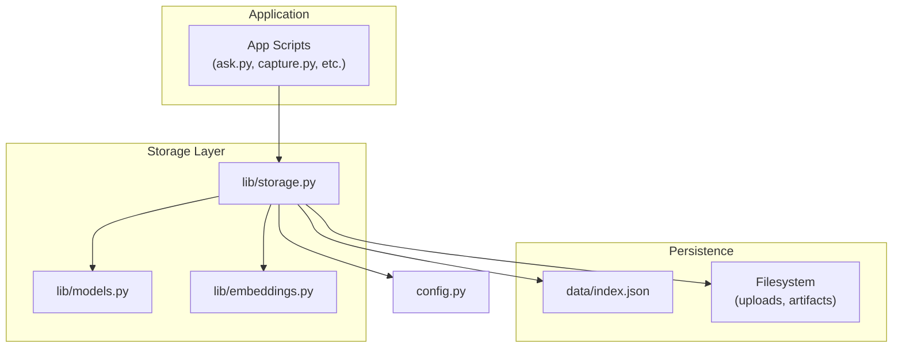
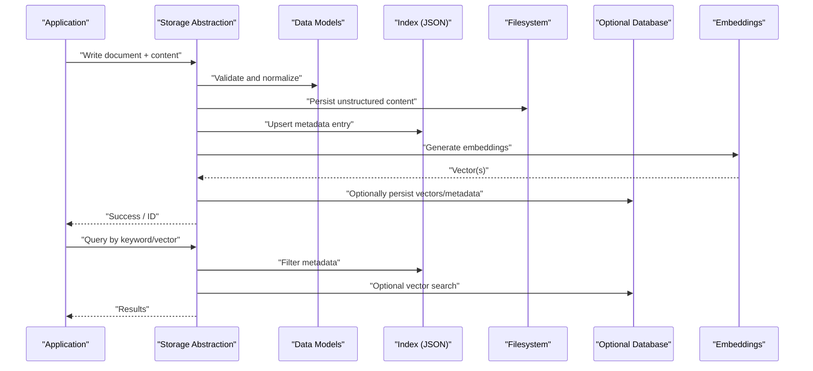
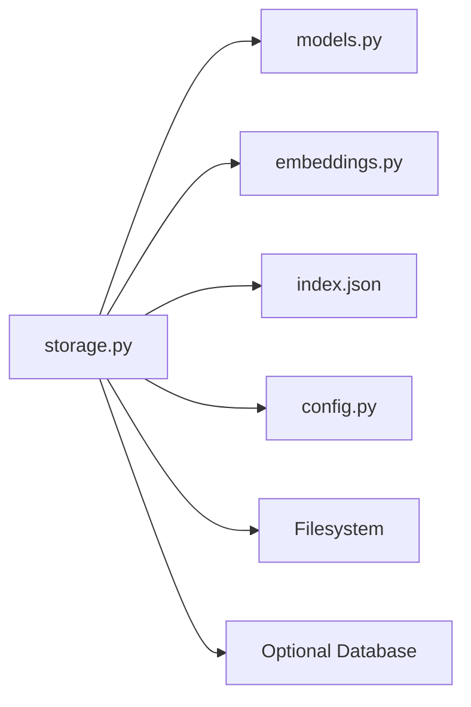

# Storage & Persistence Layer

<cite>
**Referenced Files in This Document**
- [storage.py](file://lib/storage.py)
- [models.py](file://lib/models.py)
- [embeddings.py](file://lib/embeddings.py)
- [index.json](file://data/index.json)
- [config.py](file://config.py)
- [README.md](file://README.md)
</cite>

## Table of Contents
1. [Introduction](#introduction)
2. [Project Structure](#project-structure)
3. [Core Components](#core-components)
4. [Architecture Overview](#architecture-overview)
5. [Detailed Component Analysis](#detailed-component-analysis)
6. [Dependency Analysis](#dependency-analysis)
7. [Performance Considerations](#performance-considerations)
8. [Troubleshooting Guide](#troubleshooting-guide)
9. [Conclusion](#conclusion)
10. [Appendices](#appendices)

## Introduction
This document explains the storage and persistence layer of the project, focusing on how structured metadata and unstructured content are stored, indexed, retrieved, and maintained over time. It covers file-based storage, database integration patterns, caching mechanisms, indexing strategies, query optimization, batch processing, lifecycle management, backup and migration procedures, and performance tuning for large datasets. The goal is to provide both a conceptual overview and practical guidance grounded in the repository’s implementation.

## Project Structure
The storage-related code resides primarily under lib/storage.py and lib/models.py, with supporting modules for embeddings and configuration. Persistent data is represented by an index file under data/index.json. The README provides context about the project’s purpose and usage.

**Diagram sources**
- [storage.py](file://lib/storage.py)
- [models.py](file://lib/models.py)
- [embeddings.py](file://lib/embeddings.py)
- [index.json](file://data/index.json)
- [config.py](file://config.py)

**Section sources**
- [README.md](file://README.md)

## Core Components
- Storage Abstraction: Centralized interface for reading/writing metadata and coordinating with filesystem and optional databases.
- Data Models: Typed definitions for entities such as documents, links, and embeddings.
- Embeddings Integration: Vector representation handling for semantic search and similarity retrieval.
- Index Management: JSON-based index for fast metadata lookup and relationships.
- Configuration: Settings that influence storage behavior (paths, limits, feature flags).

Key responsibilities include:
- Persisting structured metadata (documents, tags, timestamps, relations).
- Managing unstructured content (raw text, files, artifacts).
- Maintaining indexes for efficient queries and retrieval.
- Coordinating embedding generation and vector storage.
- Ensuring consistency across storage backends.

**Section sources**
- [storage.py](file://lib/storage.py)
- [models.py](file://lib/models.py)
- [embeddings.py](file://lib/embeddings.py)
- [index.json](file://data/index.json)
- [config.py](file://config.py)

## Architecture Overview
The storage layer follows a layered architecture:
- Application scripts call into the storage abstraction.
- The storage module orchestrates persistence using models and helpers.
- Filesystem stores raw artifacts; JSON index stores structured metadata and pointers.
- Optional database integration can be enabled via configuration for scalable querying.
- Embeddings module computes and persists vector representations for semantic search.

**Diagram sources**
- [storage.py](file://lib/storage.py)
- [models.py](file://lib/models.py)
- [embeddings.py](file://lib/embeddings.py)
- [index.json](file://data/index.json)
- [config.py](file://config.py)

## Detailed Component Analysis

### Storage Abstraction (lib/storage.py)
Responsibilities:
- Provide high-level APIs for CRUD operations on documents and related artifacts.
- Coordinate writes to filesystem and index; optionally write to a database.
- Manage transaction-like semantics to ensure consistency between metadata and content.
- Implement batching for bulk imports and updates.
- Handle retries and error propagation.

Design patterns:
- Repository pattern for data access.
- Strategy pattern for pluggable backends (filesystem vs. database).
- Builder or factory patterns for constructing model instances.

Operational flows:
- Write path: validate input -> persist content -> update index -> generate embeddings -> optional DB sync.
- Read path: filter index -> fetch content -> assemble results -> apply filters/sorting.

Error handling:
- Normalize I/O errors and serialization issues.
- Provide clear error messages and fallbacks when optional components fail.

Performance considerations:
- Batch writes to reduce I/O overhead.
- Lazy loading of large content blobs.
- Caching hot metadata entries in memory.

**Section sources**
- [storage.py](file://lib/storage.py)

### Data Models (lib/models.py)
Responsibilities:
- Define schemas for documents, links, tags, and embeddings.
- Enforce validation rules and default values.
- Provide serialization/deserialization utilities.

Key structures:
- Document: identifiers, timestamps, content references, tags, status.
- Link: source-target relationships and provenance.
- Embedding: vector fields and associated metadata.

Complexity:
- Validation is O(n) over fields.
- Serialization uses compact formats for efficiency.

Optimization opportunities:
- Use immutable records where possible.
- Defer heavy field computations until needed.

**Section sources**
- [models.py](file://lib/models.py)

### Embeddings Integration (lib/embeddings.py)
Responsibilities:
- Compute embeddings for text or derived features.
- Store vectors alongside or separate from metadata.
- Support similarity search via vector indices.

Integration points:
- Triggered after content ingestion or updates.
- Can run asynchronously for large batches.

Caching strategy:
- Cache computed embeddings keyed by content hash to avoid recomputation.

**Section sources**
- [embeddings.py](file://lib/embeddings.py)

### Index Management (data/index.json)
Purpose:
- Fast lookup of metadata, tags, and relationships.
- Acts as a lightweight search index for filtering and sorting.

Organization patterns:
- Flat list of entries with searchable fields.
- Secondary indexes for common queries (e.g., tag-to-doc mapping).

Indexing strategies:
- Full-text fields for keyword search.
- Tag and category fields for faceted filtering.
- Timestamp fields for temporal queries.

Query optimization techniques:
- Precompute popular facets.
- Use compound keys for frequent multi-field filters.
- Maintain index integrity on writes.

Backup and migration:
- Snapshot index periodically.
- Version schema changes and migrate entries incrementally.

**Section sources**
- [index.json](file://data/index.json)

### Configuration (config.py)
Controls:
- Storage paths for filesystem and index.
- Feature toggles for database and embedding services.
- Limits for batch sizes and timeouts.
- Logging and debugging options.

Best practices:
- Separate environment-specific settings.
- Validate configuration at startup.

**Section sources**
- [config.py](file://config.py)

## Dependency Analysis
The storage layer depends on models for schema enforcement, embeddings for vector operations, and configuration for runtime behavior. The index file serves as a persistent store for metadata, while the filesystem holds unstructured content. Optional database integration can be enabled via configuration.

**Diagram sources**
- [storage.py](file://lib/storage.py)
- [models.py](file://lib/models.py)
- [embeddings.py](file://lib/embeddings.py)
- [index.json](file://data/index.json)
- [config.py](file://config.py)

**Section sources**
- [storage.py](file://lib/storage.py)
- [models.py](file://lib/models.py)
- [embeddings.py](file://lib/embeddings.py)
- [index.json](file://data/index.json)
- [config.py](file://config.py)

## Performance Considerations
- Batch Processing: Group writes to minimize I/O; use transactions where supported.
- Caching: Cache frequently accessed metadata and embeddings; invalidate on updates.
- Indexing: Maintain secondary indexes for common queries; avoid over-indexing.
- Lazy Loading: Load large content on demand; stream responses when possible.
- Concurrency: Use read locks for concurrent reads; serialize writes to prevent corruption.
- Backpressure: Limit in-flight operations to prevent resource exhaustion.
- Monitoring: Track latency, throughput, and error rates; alert on anomalies.

[No sources needed since this section provides general guidance]

## Troubleshooting Guide
Common issues and resolutions:
- Index Corruption: Rebuild index from filesystem artifacts; verify checksums.
- Missing Content: Check filesystem paths and permissions; restore from backups.
- Embedding Failures: Retry with backoff; fall back to cached embeddings if available.
- Database Sync Errors: Inspect connection logs; retry failed transactions; reconcile state.
- Performance Degradation: Analyze query patterns; add or adjust indexes; tune batch sizes.

Diagnostic steps:
- Validate configuration and environment variables.
- Inspect logs for I/O and serialization errors.
- Run health checks on storage endpoints.
- Compare index size and entry counts against expectations.

**Section sources**
- [storage.py](file://lib/storage.py)
- [config.py](file://config.py)

## Conclusion
The storage and persistence layer combines file-based storage, JSON indexing, and optional database integration to support both structured metadata and unstructured content. By leveraging robust data models, efficient indexing, and careful performance tuning, the system scales to handle large datasets while maintaining reliability and query responsiveness. Backup strategies, migration procedures, and monitoring ensure long-term data integrity and operational stability.

[No sources needed since this section summarizes without analyzing specific files]

## Appendices

### Data Retrieval Operations
- Keyword Search: Filter index by text fields; return matching document IDs; fetch content lazily.
- Faceted Queries: Combine tag/category filters; leverage precomputed facets.
- Semantic Search: Use embeddings to find similar content; rank by cosine similarity.
- Temporal Queries: Filter by timestamp ranges; sort by recency.

### Batch Processing
- Ingestion Pipeline: Parse content -> validate -> persist -> index -> embed -> optional DB sync.
- Update Workflow: Detect changes -> update content -> refresh index -> recompute embeddings.
- Cleanup: Remove orphaned artifacts; prune expired entries; defragment index.

### Data Lifecycle Management
- Creation: Generate unique IDs; set initial timestamps; assign default tags.
- Updates: Preserve version history; maintain audit trails; propagate changes to indexes.
- Archival: Move inactive items to cold storage; update index pointers.
- Deletion: Soft delete by default; hard delete after retention policy; cascade to embeddings.

### Backup Strategies
- Incremental Backups: Snapshot only changed files and index deltas.
- Consistency Checks: Verify index-content alignment; repair mismatches.
- Offsite Replication: Mirror backups to secure locations; test restoration regularly.

### Data Migration Procedures
- Schema Versioning: Track versions in index header; apply migrations sequentially.
- Rollback Plan: Keep previous schema; revert on failure; validate post-migration.
- Zero-Downtime: Migrate in phases; switch readers/writers atomically.

### Performance Tuning for Large Datasets
- Index Sharding: Partition index by tag or date range.
- Vector Indexing: Use approximate nearest neighbor libraries for scalability.
- Connection Pooling: Reuse DB connections; tune pool sizes.
- Memory Management: Limit cache sizes; evict least recently used entries.

[No sources needed since this section provides general guidance]