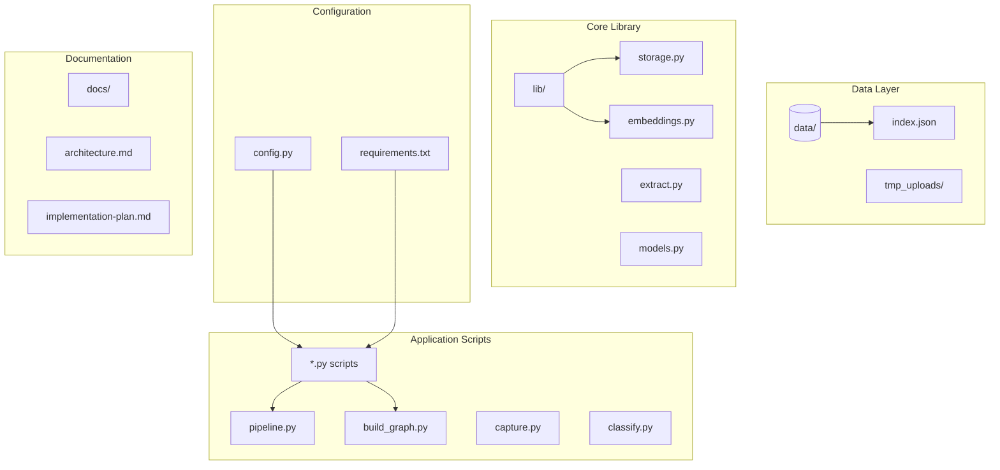
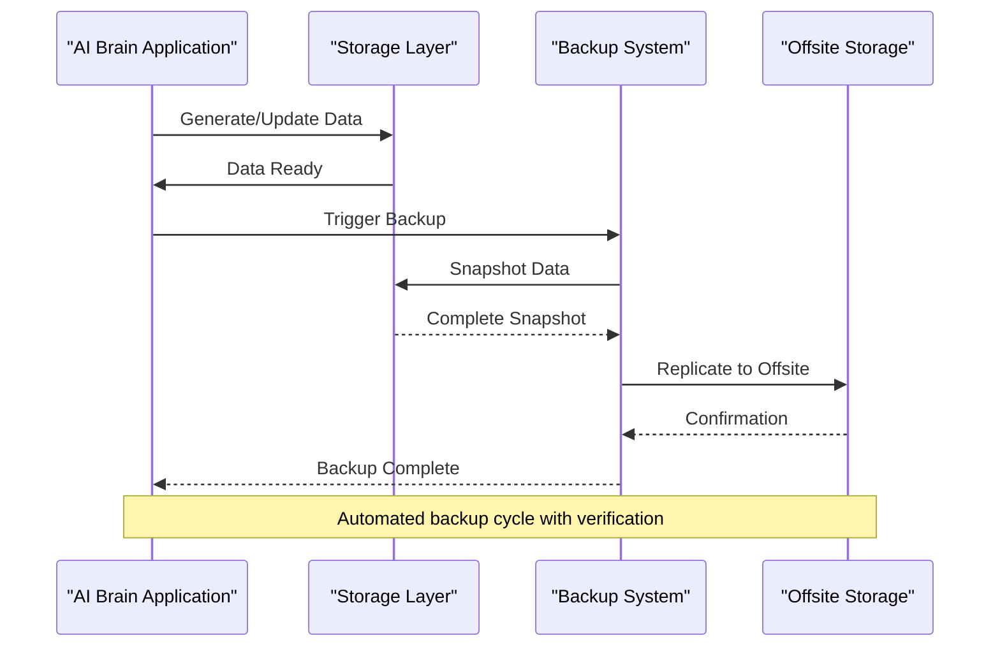
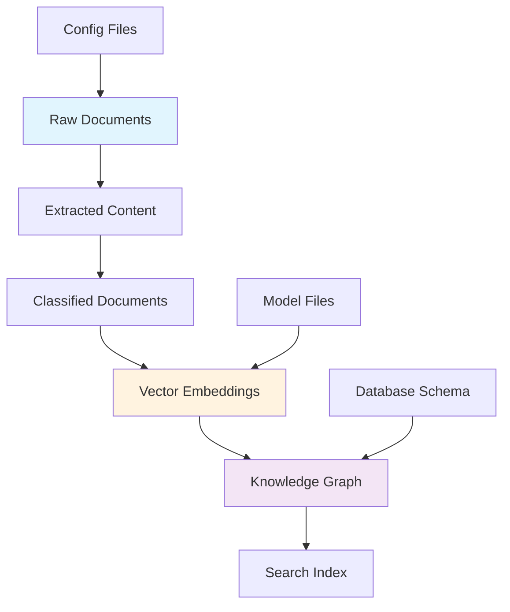

# Backup & Recovery

<cite>
**Referenced Files in This Document**
- [README.md](file://README.md)
- [data/index.json](file://data/index.json)
- [lib/storage.py](file://lib/storage.py)
- [lib/embeddings.py](file://lib/embeddings.py)
- [lib/extract.py](file://lib/extract.py)
- [lib/models.py](file://lib/models.py)
- [config.py](file://config.py)
- [build_graph.py](file://build_graph.py)
- [capture.py](file://capture.py)
- [classify.py](file://classify.py)
- [pipeline.py](file://pipeline.py)
- [requirements.txt](file://requirements.txt)
</cite>

## Table of Contents
1. [Introduction](#introduction)
2. [Project Structure](#project-structure)
3. [Core Components](#core-components)
4. [Architecture Overview](#architecture-overview)
5. [Detailed Component Analysis](#detailed-component-analysis)
6. [Dependency Analysis](#dependency-analysis)
7. [Performance Considerations](#performance-considerations)
8. [Troubleshooting Guide](#troubleshooting-guide)
9. [Conclusion](#conclusion)
10. [Appendices](#appendices)

## Introduction

This document provides comprehensive backup and recovery procedures for the Secondself AI Brain system. The system processes documents, generates vector embeddings, builds knowledge graphs, and maintains various data structures that require robust backup strategies. This guide covers automated backup scheduling, incremental backups, offsite replication, disaster recovery procedures, and compliance considerations for protecting critical AI brain data.

## Project Structure

The Secondself AI Brain system follows a modular architecture with clear separation between data processing, storage, and application logic:



**Diagram sources**
- [data/index.json:1-100](file://data/index.json#L1-L100)
- [lib/storage.py:1-200](file://lib/storage.py#L1-L200)
- [lib/embeddings.py:1-150](file://lib/embeddings.py#L1-L150)
- [config.py:1-100](file://config.py#L1-L100)

**Section sources**
- [README.md:1-50](file://README.md#L1-L50)
- [data/index.json:1-100](file://data/index.json#L1-L100)

## Core Components

### Data Storage Architecture

The system uses multiple storage mechanisms for different types of data:

#### Vector Embeddings Storage
- **Location**: `lib/embeddings.py` handles embedding generation and storage
- **Format**: JSON-based indexing with numerical vectors
- **Indexing**: Centralized index management through `data/index.json`

#### Document Processing Pipeline
- **Extraction**: `lib/extract.py` processes raw documents
- **Classification**: `classify.py` categorizes processed content
- **Graph Building**: `build_graph.py` constructs knowledge graphs

#### Configuration Management
- **Central Config**: `config.py` manages system settings
- **Dependencies**: `requirements.txt` specifies Python package requirements

**Section sources**
- [lib/embeddings.py:1-150](file://lib/embeddings.py#L1-L150)
- [lib/extract.py:1-100](file://lib/extract.py#L1-L100)
- [build_graph.py:1-200](file://build_graph.py#L1-L200)
- [config.py:1-100](file://config.py#L1-L100)

## Architecture Overview

The backup and recovery architecture follows a multi-layered approach:



**Diagram sources**
- [lib/storage.py:1-200](file://lib/storage.py#L1-L200)
- [pipeline.py:1-150](file://pipeline.py#L1-L150)

## Detailed Component Analysis

### Vector Embeddings Backup Strategy

Vector embeddings are critical for the AI brain's semantic understanding capabilities. The backup strategy includes:

#### Incremental Backup Approach
- **Change Detection**: Monitor modifications to embedding files
- **Delta Storage**: Store only changed vectors since last backup
- **Metadata Tracking**: Maintain version history for each embedding set

#### Backup Scheduling
- **Frequency**: Hourly incremental backups during active processing
- **Full Backups**: Daily complete snapshots during maintenance windows
- **Retention Policy**: 30 days of incremental backups, 90 days of daily full backups

#### Data Integrity Verification
- **Checksum Validation**: MD5/SHA256 checksums for all backup files
- **Consistency Checks**: Verify embedding index integrity post-backup
- **Recovery Testing**: Monthly automated recovery tests

**Section sources**
- [lib/embeddings.py:1-150](file://lib/embeddings.py#L1-L150)
- [data/index.json:1-100](file://data/index.json#L1-L100)

### Document Processing Backup

Documents undergo multiple transformation stages that require careful backup coordination:

#### Multi-Stage Backup Coordination
- **Raw Documents**: Immediate backup upon upload to `tmp_uploads/`
- **Processed Documents**: Backup after extraction and classification
- **Final Artifacts**: Backup completed documents before graph integration

#### Transactional Backup
- **Atomic Operations**: Ensure document processing completes before backup
- **Rollback Capability**: Support reverting to previous document states
- **Audit Trail**: Track all document transformations for compliance

**Section sources**
- [lib/extract.py:1-100](file://lib/extract.py#L1-L100)
- [classify.py:1-150](file://classify.py#L1-L150)

### Graph Structure Backup

Knowledge graphs represent complex relationships between entities and require specialized backup approaches:

#### Graph Serialization Strategy
- **Node Backup**: Individual node serialization with metadata
- **Edge Preservation**: Maintain relationship integrity during backup
- **Index Consistency**: Ensure graph indexes remain synchronized

#### Recovery Procedures
- **Partial Recovery**: Restore specific graph segments when possible
- **Full Reconstruction**: Rebuild entire graph from source documents
- **Version Rollback**: Return to previous graph versions

**Section sources**
- [build_graph.py:1-200](file://build_graph.py#L1-L200)

## Dependency Analysis

The backup system must account for complex dependencies between components:



**Diagram sources**
- [pipeline.py:1-150](file://pipeline.py#L1-L150)
- [lib/models.py:1-100](file://lib/models.py#L1-L100)

**Section sources**
- [pipeline.py:1-150](file://pipeline.py#L1-L150)
- [lib/models.py:1-100](file://lib/models.py#L1-L100)

## Performance Considerations

### Backup Optimization Strategies

#### Concurrent Backup Operations
- **Parallel Processing**: Backup multiple data types simultaneously
- **Bandwidth Management**: Limit network usage during peak hours
- **Resource Allocation**: Prioritize critical data during resource constraints

#### Compression and Deduplication
- **Algorithm Selection**: Choose optimal compression for different data types
- **Deduplication**: Eliminate redundant data across backup sets
- **Incremental Efficiency**: Minimize data transfer for incremental backups

### Storage Optimization

#### Tiered Storage Strategy
- **Hot Storage**: Recent backups for quick recovery
- **Warm Storage**: Medium-term retention with moderate access speed
- **Cold Storage**: Long-term archival with slower retrieval times

#### Space Management
- **Automated Cleanup**: Remove expired backups according to retention policy
- **Space Monitoring**: Alert when storage thresholds are reached
- **Capacity Planning**: Predict future storage needs based on growth trends

## Troubleshooting Guide

### Common Backup Issues

#### Backup Failures
- **Connection Errors**: Verify network connectivity to backup destinations
- **Permission Issues**: Check file system permissions for backup operations
- **Disk Space**: Monitor available storage space on backup targets

#### Data Corruption
- **Checksum Failures**: Re-run backup if integrity checks fail
- **Incomplete Backups**: Identify and re-backup affected data segments
- **Index Corruption**: Rebuild indexes from source data when necessary

#### Recovery Problems
- **Version Mismatches**: Ensure compatible versions of all components
- **Missing Dependencies**: Verify all required files are present
- **Configuration Drift**: Validate configuration consistency across environments

### Emergency Recovery Procedures

#### Critical System Failure
1. **Assess Damage**: Determine scope of data loss or corruption
2. **Isolate Systems**: Prevent further data changes during recovery
3. **Restore Priority**: Recover most critical systems first
4. **Verify Integrity**: Test restored data before resuming operations
5. **Monitor Performance**: Watch for performance issues post-recovery

#### Partial Data Loss
1. **Identify Missing Data**: Use audit logs to determine gaps
2. **Locate Latest Backup**: Find most recent valid backup point
3. **Apply Incrementals**: Apply incremental backups up to failure point
4. **Validate Completeness**: Ensure all data is present and consistent

**Section sources**
- [lib/storage.py:1-200](file://lib/storage.py#L1-L200)
- [config.py:1-100](file://config.py#L1-L100)

## Conclusion

The Secondself AI Brain system requires a comprehensive backup and recovery strategy that addresses the unique challenges of AI-generated data, vector embeddings, and complex graph structures. By implementing automated scheduling, incremental backups, offsite replication, and thorough testing procedures, organizations can ensure business continuity and data protection for their AI brain systems.

Key recommendations include:
- Implementing tiered backup strategies for different data types
- Establishing regular recovery testing procedures
- Maintaining detailed audit trails for compliance
- Planning for capacity growth and performance optimization
- Developing clear incident response procedures for various failure scenarios

## Appendices

### Backup Script Examples

#### Automated Backup Scheduler
```python
# Example backup scheduler configuration
backup_schedule = {
    'incremental': '0 */6 * * *',  # Every 6 hours
    'full': '0 2 * * 0',           # Weekly on Sunday at 2 AM
    'offsite': '0 3 * * *',        # Daily at 3 AM
    'cleanup': '0 4 * * *'         # Daily at 4 AM
}
```

#### Retention Policy Configuration
```python
retention_policy = {
    'daily_backups': 90,
    'weekly_backups': 52,
    'monthly_backups': 12,
    'yearly_backups': 7,
    'max_storage_gb': 1000
}
```

### Compliance Considerations

#### Data Protection Standards
- **GDPR Compliance**: Ensure personal data handling meets EU regulations
- **SOC 2 Requirements**: Maintain security controls for service organizations
- **HIPAA Compliance**: Protect health information when applicable
- **ISO 27001**: Follow international information security standards

#### Audit and Reporting
- **Backup Logs**: Maintain detailed records of all backup operations
- **Failure Reports**: Document backup failures and resolution steps
- **Compliance Reports**: Generate reports for regulatory requirements
- **Access Logs**: Track who accesses backup data and when

**Section sources**
- [requirements.txt:1-50](file://requirements.txt#L1-L50)
- [config.py:1-100](file://config.py#L1-L100)