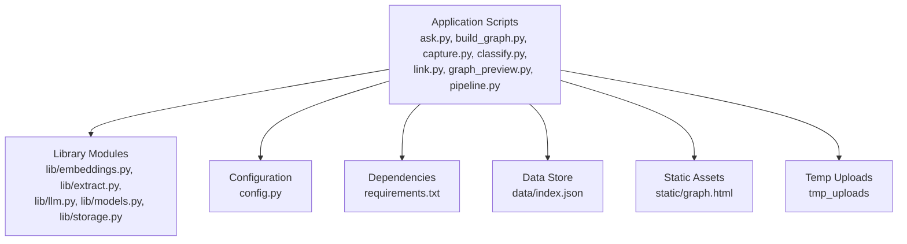
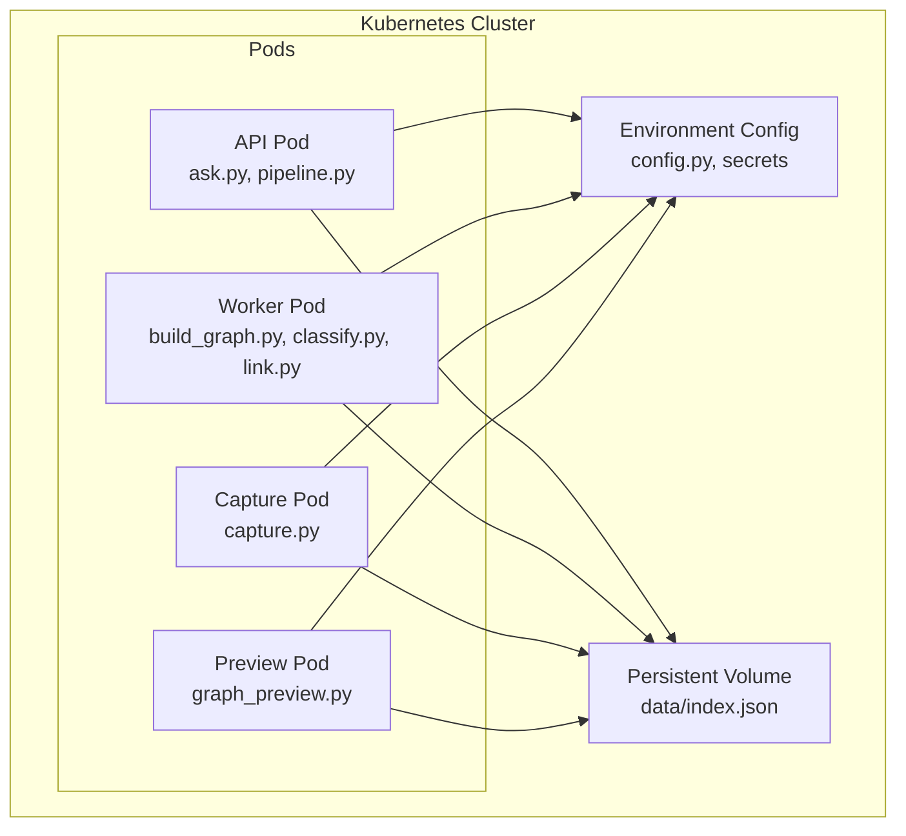
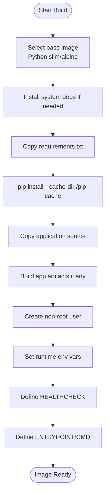
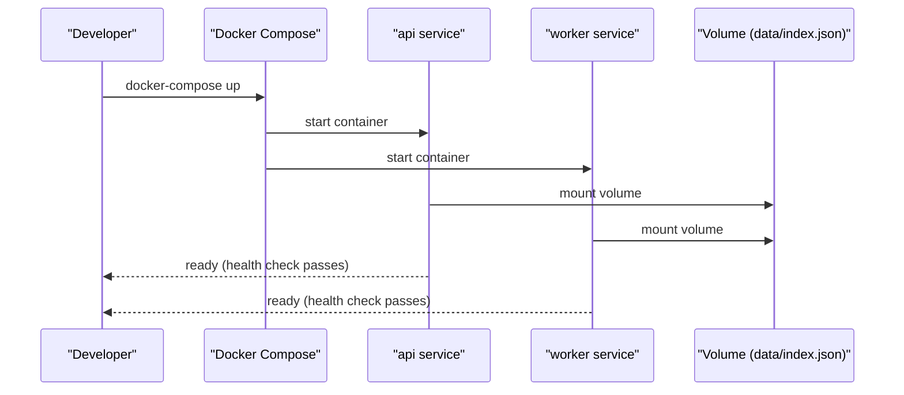
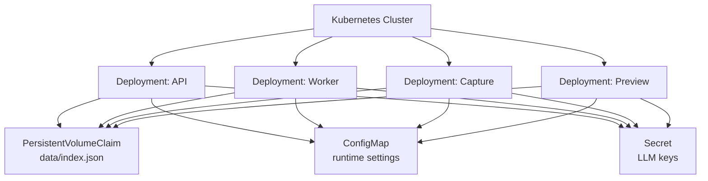
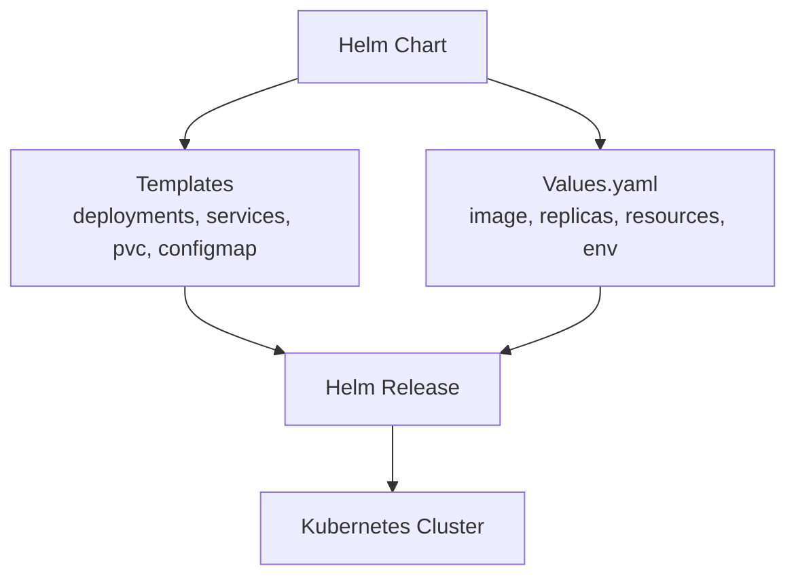
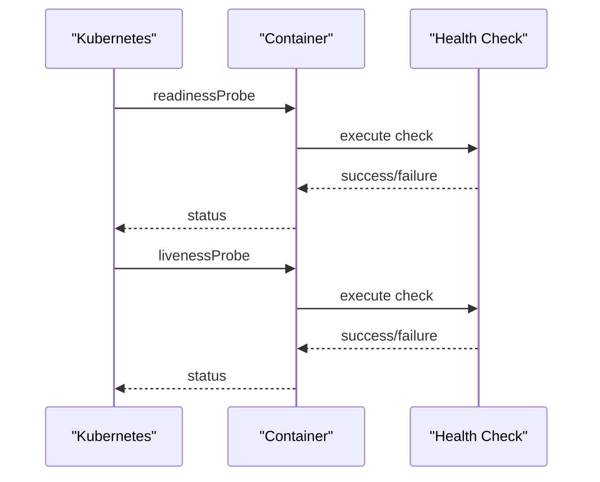
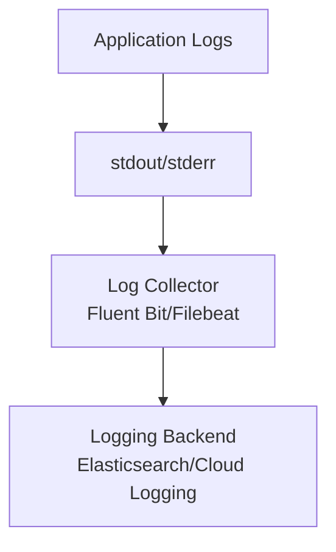
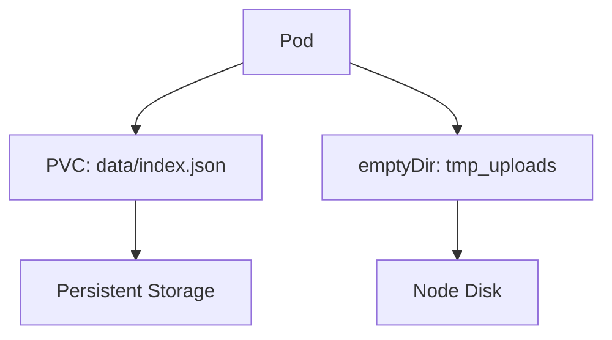
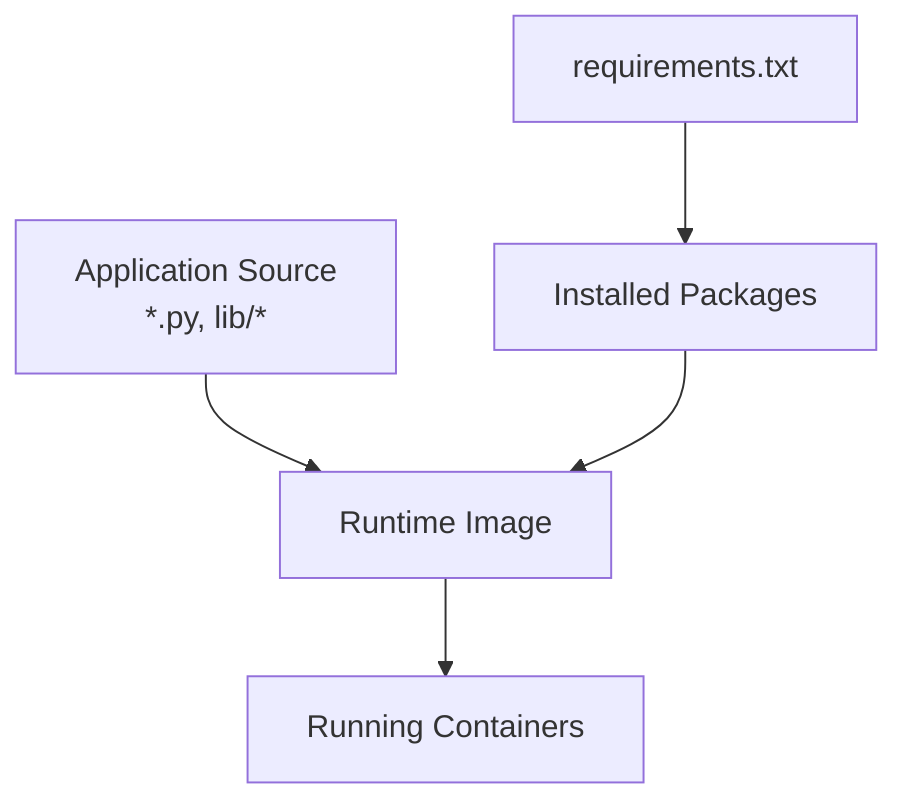

# Containerization & Docker

<cite>
**Referenced Files in This Document**
- [README.md](file://README.md)
- [requirements.txt](file://requirements.txt)
- [config.py](file://config.py)
- [pipeline.py](file://pipeline.py)
- [ask.py](file://ask.py)
- [build_graph.py](file://build_graph.py)
- [capture.py](file://capture.py)
- [classify.py](file://classify.py)
- [link.py](file://link.py)
- [graph_preview.py](file://graph_preview.py)
- [lib/embeddings.py](file://lib/embeddings.py)
- [lib/extract.py](file://lib/extract.py)
- [lib/llm.py](file://lib/llm.py)
- [lib/models.py](file://lib/models.py)
- [lib/storage.py](file://lib/storage.py)
- [data/index.json](file://data/index.json)
</cite>

## Table of Contents
1. [Introduction](#introduction)
2. [Project Structure](#project-structure)
3. [Core Components](#core-components)
4. [Architecture Overview](#architecture-overview)
5. [Detailed Component Analysis](#detailed-component-analysis)
6. [Dependency Analysis](#dependency-analysis)
7. [Performance Considerations](#performance-considerations)
8. [Troubleshooting Guide](#troubleshooting-guide)
9. [Conclusion](#conclusion)
10. [Appendices](#appendices)

## Introduction
This document provides comprehensive containerization guidance for deploying the Secondself AI Brain using Docker and Kubernetes. It covers multi-stage Docker builds, image optimization, security scanning, Docker Compose configurations for local development and production, Kubernetes manifests and Helm charts, health checks, logging, and persistent storage patterns. The guidance is tailored to the Python-based application structure visible in the repository and emphasizes practical, production-ready practices.

## Project Structure
The repository contains a Python application with multiple entry points and libraries:
- Entry scripts: ask.py, build_graph.py, capture.py, classify.py, link.py, graph_preview.py, pipeline.py
- Library modules under lib/: embeddings.py, extract.py, llm.py, models.py, storage.py
- Configuration: config.py
- Dependencies: requirements.txt
- Data: data/index.json (persistent index or metadata)
- Static assets: static/graph.html
- Temporary uploads: tmp_uploads

**Diagram sources**
- [README.md:1-200](file://README.md#L1-L200)
- [requirements.txt:1-200](file://requirements.txt#L1-L200)
- [config.py:1-200](file://config.py#L1-L200)
- [pipeline.py:1-200](file://pipeline.py#L1-L200)
- [ask.py:1-200](file://ask.py#L1-L200)
- [build_graph.py:1-200](file://build_graph.py#L1-L200)
- [capture.py:1-200](file://capture.py#L1-L200)
- [classify.py:1-200](file://classify.py#L1-L200)
- [link.py:1-200](file://link.py#L1-L200)
- [graph_preview.py:1-200](file://graph_preview.py#L1-L200)
- [lib/embeddings.py:1-200](file://lib/embeddings.py#L1-L200)
- [lib/extract.py:1-200](file://lib/extract.py#L1-L200)
- [lib/llm.py:1-200](file://lib/llm.py#L1-L200)
- [lib/models.py:1-200](file://lib/models.py#L1-L200)
- [lib/storage.py:1-200](file://lib/storage.py#L1-L200)
- [data/index.json:1-200](file://data/index.json#L1-L200)

**Section sources**
- [README.md:1-200](file://README.md#L1-L200)
- [requirements.txt:1-200](file://requirements.txt#L1-L200)
- [config.py:1-200](file://config.py#L1-L200)
- [pipeline.py:1-200](file://pipeline.py#L1-L200)
- [ask.py:1-200](file://ask.py#L1-L200)
- [build_graph.py:1-200](file://build_graph.py#L1-L200)
- [capture.py:1-200](file://capture.py#L1-L200)
- [classify.py:1-200](file://classify.py#L1-L200)
- [link.py:1-200](file://link.py#L1-L200)
- [graph_preview.py:1-200](file://graph_preview.py#L1-L200)
- [lib/embeddings.py:1-200](file://lib/embeddings.py#L1-L200)
- [lib/extract.py:1-200](file://lib/extract.py#L1-L200)
- [lib/llm.py:1-200](file://lib/llm.py#L1-L200)
- [lib/models.py:1-200](file://lib/models.py#L1-L200)
- [lib/storage.py:1-200](file://lib/storage.py#L1-L200)
- [data/index.json:1-200](file://data/index.json#L1-L200)

## Core Components
- Application entry points:
  - ask.py: likely handles query interactions
  - build_graph.py: constructs knowledge graphs or dependency graphs
  - capture.py: captures input data or media
  - classify.py: classifies content or entities
  - link.py: links related items or references
  - graph_preview.py: renders preview UI for graphs
  - pipeline.py: orchestrates end-to-end processing workflows
- Library modules:
  - lib/embeddings.py: embedding generation utilities
  - lib/extract.py: extraction logic for text or structured data
  - lib/llm.py: LLM integration helpers
  - lib/models.py: shared data models
  - lib/storage.py: persistence layer abstraction
- Configuration:
  - config.py: runtime configuration and environment variables
- Dependencies:
  - requirements.txt: Python package dependencies
- Data:
  - data/index.json: persistent index or metadata used by the app

These components inform how to structure Docker images, define services in Docker Compose, and expose health endpoints and logs in Kubernetes.

**Section sources**
- [pipeline.py:1-200](file://pipeline.py#L1-L200)
- [ask.py:1-200](file://ask.py#L1-L200)
- [build_graph.py:1-200](file://build_graph.py#L1-L200)
- [capture.py:1-200](file://capture.py#L1-L200)
- [classify.py:1-200](file://classify.py#L1-L200)
- [link.py:1-200](file://link.py#L1-L200)
- [graph_preview.py:1-200](file://graph_preview.py#L1-L200)
- [lib/embeddings.py:1-200](file://lib/embeddings.py#L1-L200)
- [lib/extract.py:1-200](file://lib/extract.py#L1-L200)
- [lib/llm.py:1-200](file://lib/llm.py#L1-L200)
- [lib/models.py:1-200](file://lib/models.py#L1-L200)
- [lib/storage.py:1-200](file://lib/storage.py#L1-L200)
- [config.py:1-200](file://config.py#L1-L200)
- [requirements.txt:1-200](file://requirements.txt#L1-L200)
- [data/index.json:1-200](file://data/index.json#L1-L200)

## Architecture Overview
The containerized architecture separates concerns into distinct containers:
- API/Worker containers running Python entry points
- Optional web server for static assets and previews
- Persistent volume for data/index.json
- External LLM or embedding service via environment configuration

[No sources needed since this diagram shows conceptual workflow, not actual code structure]

## Detailed Component Analysis

### Dockerfile Strategy
- Multi-stage build:
  - Stage 1: Build stage to install dependencies and cache wheels
  - Stage 2: Runtime stage with minimal base image and non-root user
- Optimization techniques:
  - Pin Python version and OS base image
  - Use .dockerignore to exclude unnecessary files
  - Copy only required project files
  - Cache pip dependencies by copying requirements.txt first
  - Prefer slim or alpine variants where compatible
- Security:
  - Run as non-root user
  - Avoid installing unnecessary packages
  - Scan images with Trivy or Snyk
- Health check:
  - Expose a lightweight HTTP endpoint or use a readiness probe that calls a simple script
- Logging:
  - Stream logs to stdout/stderr for collection by Kubernetes
- Entrypoint:
  - Use a small shell wrapper to set environment variables and exec the main process

[No sources needed since this diagram shows conceptual workflow, not actual code structure]

### Docker Compose for Local Development
- Services:
  - api: runs ask.py and pipeline.py
  - worker: runs build_graph.py, classify.py, link.py
  - capture: runs capture.py
  - preview: runs graph_preview.py
- Volumes:
  - Persist data/index.json across restarts
  - Mount tmp_uploads for temporary files
- Environment:
  - Configure LLM endpoints, model paths, and feature flags via config.py
- Networking:
  - Internal network for inter-service communication
- Health checks:
  - Simple HTTP probes or command-based checks
- Logging:
  - JSON logs to stdout for easy aggregation

[No sources needed since this diagram shows conceptual workflow, not actual code structure]

### Production Deployment with Kubernetes
- Deployments:
  - Separate deployments for API, Worker, Capture, Preview
- Services:
  - Expose API via ClusterIP or LoadBalancer
- ConfigMaps and Secrets:
  - Store configuration and sensitive values
- PersistentVolumeClaim:
  - Bind to data/index.json for durability
- Resource limits and requests:
  - CPU and memory constraints per container
- Probes:
  - Readiness and liveness probes for reliability
- Horizontal Pod Autoscaler:
  - Scale based on CPU/memory or custom metrics

[No sources needed since this diagram shows conceptual workflow, not actual code structure]

### Helm Chart Structure
- Templates:
  - deployment.yaml for each service
  - service.yaml for networking
  - pvc.yaml for persistent storage
  - configmap.yaml and secret.yaml for configuration
- Values:
  - Image tags, replicas, resource limits, environment variables
- Hooks:
  - Pre-install migrations or index initialization
- Rollouts:
  - Canary or blue-green strategies via rollout controller

[No sources needed since this diagram shows conceptual workflow, not actual code structure]

### Health Checks and Readiness
- Implement a lightweight endpoint or command that verifies:
  - Dependency availability (e.g., LLM connectivity)
  - Index file integrity (data/index.json)
  - Disk space for tmp_uploads
- Use Kubernetes readinessProbe and livenessProbe:
  - readinessProbe: HTTP GET or exec command
  - livenessProbe: periodic restart on failure

[No sources needed since this diagram shows conceptual workflow, not actual code structure]

### Logging Configuration
- Standardize log format:
  - JSON lines with timestamp, level, message, context
- Route logs to stdout/stderr:
  - Collect via Fluent Bit, Filebeat, or cloud-native logging
- Structured fields:
  - Include request IDs, user IDs, operation names
- Log rotation:
  - Rely on container runtime or sidecar for rotation

[No sources needed since this diagram shows conceptual workflow, not actual code structure]

### Volume Mounting for Persistent Data
- Mount data/index.json:
  - Use PVC to ensure durability across pod restarts
- Mount tmp_uploads:
  - Use emptyDir or hostPath for temporary storage
- Backup strategy:
  - Periodic snapshots of PVC

[No sources needed since this diagram shows conceptual workflow, not actual code structure]

## Dependency Analysis
- Python dependencies defined in requirements.txt should be pinned for reproducibility
- External services:
  - LLM providers configured via environment variables in config.py
- Internal module dependencies:
  - lib/* modules are imported by entry scripts
- Container layers:
  - Optimize by separating dependency installation from source copy

**Section sources**
- [requirements.txt:1-200](file://requirements.txt#L1-L200)
- [config.py:1-200](file://config.py#L1-L200)
- [lib/embeddings.py:1-200](file://lib/embeddings.py#L1-L200)
- [lib/extract.py:1-200](file://lib/extract.py#L1-L200)
- [lib/llm.py:1-200](file://lib/llm.py#L1-L200)
- [lib/models.py:1-200](file://lib/models.py#L1-L200)
- [lib/storage.py:1-200](file://lib/storage.py#L1-L200)

## Performance Considerations
- Image size:
  - Use slim or distroless bases where possible
  - Remove build-time dependencies from runtime image
- Layer caching:
  - Keep frequently changing files at the bottom of Dockerfile
- Concurrency:
  - Tune workers per container based on CPU limits
- Memory usage:
  - Monitor and set appropriate requests/limits
- I/O:
  - Minimize disk writes; prefer in-memory processing when feasible
- Network:
  - Reduce external calls; batch requests to LLM services

[No sources needed since this section provides general guidance]

## Troubleshooting Guide
- Common issues:
  - Missing environment variables in config.py
  - Permission errors on mounted volumes
  - LLM connectivity failures
- Debugging steps:
  - Inspect container logs
  - Exec into pods to verify file mounts
  - Validate health check endpoints
- Recovery actions:
  - Restart failed pods
  - Rebuild images after dependency updates
  - Rotate secrets and redeploy

**Section sources**
- [config.py:1-200](file://config.py#L1-L200)
- [lib/storage.py:1-200](file://lib/storage.py#L1-L200)
- [lib/llm.py:1-200](file://lib/llm.py#L1-L200)

## Conclusion
By following the containerization patterns outlined here—multi-stage builds, secure images, robust health checks, structured logging, and scalable Kubernetes deployments—you can reliably deploy the Secondself AI Brain in both local and production environments. Adopt Helm for consistent releases, enforce security scanning, and optimize resource allocation to achieve high availability and performance.

[No sources needed since this section summarizes without analyzing specific files]

## Appendices

### Example Dockerfile Outline
- Base image selection
- Dependency installation
- Source copy
- Non-root user creation
- Health check definition
- Entrypoint and command

**Section sources**
- [requirements.txt:1-200](file://requirements.txt#L1-L200)
- [config.py:1-200](file://config.py#L1-L200)
- [pipeline.py:1-200](file://pipeline.py#L1-L200)

### Example Docker Compose Services
- api, worker, capture, preview services
- Volume mounts for data and tmp_uploads
- Environment variables for configuration

**Section sources**
- [ask.py:1-200](file://ask.py#L1-L200)
- [build_graph.py:1-200](file://build_graph.py#L1-L200)
- [capture.py:1-200](file://capture.py#L1-L200)
- [classify.py:1-200](file://classify.py#L1-L200)
- [link.py:1-200](file://link.py#L1-L200)
- [graph_preview.py:1-200](file://graph_preview.py#L1-L200)
- [data/index.json:1-200](file://data/index.json#L1-L200)

### Example Kubernetes Resources
- Deployment templates for each service
- Service definitions
- PVC for persistent data
- ConfigMap and Secret for configuration

**Section sources**
- [config.py:1-200](file://config.py#L1-L200)
- [lib/storage.py:1-200](file://lib/storage.py#L1-L200)

### Example Helm Chart Values
- Image tags and replicas
- Resource limits and requests
- Environment variables and feature flags

**Section sources**
- [config.py:1-200](file://config.py#L1-L200)
- [requirements.txt:1-200](file://requirements.txt#L1-L200)