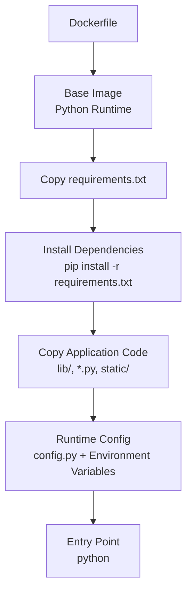
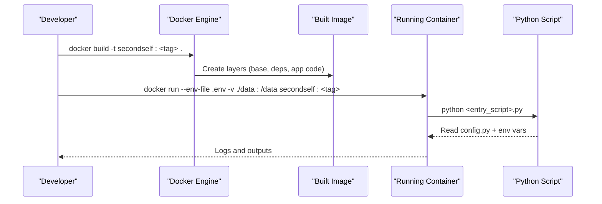
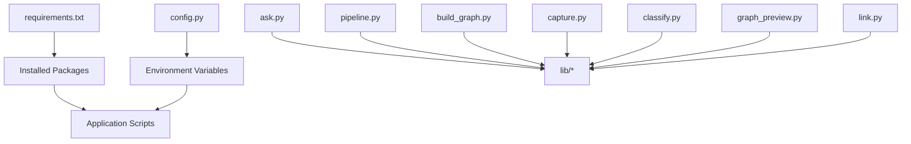

# Docker Basics & Image Building

<cite>
**Referenced Files in This Document**
- [README.md](file://README.md)
- [requirements.txt](file://requirements.txt)
- [config.py](file://config.py)
- [ask.py](file://ask.py)
- [build_graph.py](file://build_graph.py)
- [capture.py](file://capture.py)
- [classify.py](file://classify.py)
- [graph_preview.py](file://graph_preview.py)
- [link.py](file://link.py)
- [pipeline.py](file://pipeline.py)
</cite>

## Table of Contents
1. [Introduction](#introduction)
2. [Project Structure](#project-structure)
3. [Core Components](#core-components)
4. [Architecture Overview](#architecture-overview)
5. [Detailed Component Analysis](#detailed-component-analysis)
6. [Dependency Analysis](#dependency-analysis)
7. [Performance Considerations](#performance-considerations)
8. [Troubleshooting Guide](#troubleshooting-guide)
9. [Conclusion](#conclusion)
10. [Appendices](#appendices)

## Introduction
This document provides a practical, step-by-step guide to containerizing the Secondself AI Brain project with Docker. It covers creating a Dockerfile from scratch, selecting appropriate base images, installing dependencies via requirements.txt, configuring runtime settings through config.py, and optimizing image size using multi-stage builds. You will also learn how to write a .dockerignore file, apply layer optimization techniques, follow security best practices, tag images effectively, and test your container locally.

## Project Structure
The Secondself AI Brain project is a Python-based application with multiple entry points and shared libraries. For containerization, we focus on:
- Python entry scripts (e.g., ask.py, pipeline.py, build_graph.py, capture.py, classify.py, graph_preview.py, link.py)
- Shared logic under lib/
- Configuration via config.py
- Dependencies defined in requirements.txt
- Optional static assets under static/

**Diagram sources**
- [requirements.txt](file://requirements.txt)
- [config.py](file://config.py)
- [ask.py](file://ask.py)
- [build_graph.py](file://build_graph.py)
- [capture.py](file://capture.py)
- [classify.py](file://classify.py)
- [graph_preview.py](file://graph_preview.py)
- [link.py](file://link.py)
- [pipeline.py](file://pipeline.py)

**Section sources**
- [README.md](file://README.md)
- [requirements.txt](file://requirements.txt)
- [config.py](file://config.py)

## Core Components
- Base image selection: Choose a slim or distroless Python image for smaller footprint and fewer vulnerabilities.
- Dependency installation: Use requirements.txt to ensure reproducible installs; cache layers by copying requirements first.
- Configuration: Load settings from config.py and environment variables at runtime; avoid baking secrets into images.
- Entry points: Each script can serve as a container command (e.g., python ask.py). Select one per service image or use an orchestrator.

Key considerations:
- Pin dependency versions in requirements.txt for deterministic builds.
- Separate build-time and runtime dependencies when possible.
- Minimize copied files with .dockerignore to reduce image size and attack surface.

**Section sources**
- [requirements.txt](file://requirements.txt)
- [config.py](file://config.py)
- [ask.py](file://ask.py)
- [build_graph.py](file://build_graph.py)
- [capture.py](file://capture.py)
- [classify.py](file://classify.py)
- [graph_preview.py](file://graph_preview.py)
- [link.py](file://link.py)
- [pipeline.py](file://pipeline.py)

## Architecture Overview
A typical containerized workflow for this project:
- Build stage: Install system-level dependencies if needed and compile wheels.
- Runtime stage: Copy only necessary artifacts from the build stage into a minimal runtime image.
- Configuration: Provide config.py values via environment variables or mounted volumes.
- Execution: Run a specific entry script based on the intended task.

**Diagram sources**
- [requirements.txt](file://requirements.txt)
- [config.py](file://config.py)
- [ask.py](file://ask.py)
- [build_graph.py](file://build_graph.py)
- [capture.py](file://capture.py)
- [classify.py](file://classify.py)
- [graph_preview.py](file://graph_preview.py)
- [link.py](file://link.py)
- [pipeline.py](file://pipeline.py)

## Detailed Component Analysis

### Creating a Dockerfile from Scratch
- Start with a minimal Python base image.
- Set working directory and copy requirements.txt first to leverage Docker layer caching.
- Install dependencies using pip with flags that avoid unnecessary files and caches.
- Copy application code (lib/, *.py, static/) after dependencies are installed.
- Define environment variables for configuration and runtime behavior.
- Specify the entrypoint or default command to run the desired script.

Optimization tips:
- Use multi-stage builds to separate build-time tools from runtime dependencies.
- Clean up pip caches and temporary files in the same RUN layer to keep images small.
- Prefer non-root users for running containers.

**Section sources**
- [requirements.txt](file://requirements.txt)
- [config.py](file://config.py)
- [ask.py](file://ask.py)
- [build_graph.py](file://build_graph.py)
- [capture.py](file://capture.py)
- [classify.py](file://classify.py)
- [graph_preview.py](file://graph_preview.py)
- [link.py](file://link.py)
- [pipeline.py](file://pipeline.py)

### Multi-Stage Builds for Optimal Image Size
- Stage 1 (builder): Install build-time dependencies and compile wheels.
- Stage 2 (runtime): Copy only compiled wheels and runtime dependencies into a slim image.
- Benefits: Smaller images, reduced vulnerability surface, faster pulls.

Best practices:
- Name stages clearly (e.g., builder, runtime).
- Copy only what is needed from builder to runtime.
- Avoid copying source code into the runtime stage unless required.

**Section sources**
- [requirements.txt](file://requirements.txt)
- [config.py](file://config.py)
- [ask.py](file://ask.py)
- [build_graph.py](file://build_graph.py)
- [capture.py](file://capture.py)
- [classify.py](file://classify.py)
- [graph_preview.py](file://graph_preview.py)
- [link.py](file://link.py)
- [pipeline.py](file://pipeline.py)

### Base Image Selection Strategies
- Slim variants: Reduce size but may lack some system libraries.
- Alpine-based images: Very small but require musl compatibility checks.
- Distros with prebuilt wheels: Faster installs and fewer compilation steps.
- Security-focused images: Fewer packages and regular updates.

Guidelines:
- Match the Python version to your application’s needs.
- Prefer official Python images for consistency.
- Validate platform-specific binaries and wheel availability.

**Section sources**
- [requirements.txt](file://requirements.txt)
- [config.py](file://config.py)
- [ask.py](file://ask.py)
- [build_graph.py](file://build_graph.py)
- [capture.py](file://capture.py)
- [classify.py](file://classify.py)
- [graph_preview.py](file://graph_preview.py)
- [link.py](file://link.py)
- [pipeline.py](file://pipeline.py)

### Dependency Installation Using requirements.txt
- Ensure all dependencies are pinned to exact versions.
- Separate build-time and runtime dependencies where feasible.
- Use pip flags to avoid caching and unnecessary metadata.
- Validate installs locally before building images.

Layer caching strategy:
- Copy requirements.txt first and install dependencies before copying application code.
- Update requirements only when dependencies change to maximize cache hits.

**Section sources**
- [requirements.txt](file://requirements.txt)

### Environment Configuration Through config.py
- Load configuration from environment variables at runtime.
- Provide defaults in config.py and override via environment variables.
- Keep secrets out of images; pass them via environment variables or secret managers.
- Mount configuration files as read-only volumes when needed.

Security considerations:
- Never hardcode credentials in config.py or Dockerfiles.
- Use least-privilege principles for container user permissions.

**Section sources**
- [config.py](file://config.py)

### Examples of .dockerignore File Creation
Exclude:
- Version control directories (.git)
- Local virtual environments and caches (.venv, __pycache__, .pytest_cache)
- IDE and editor files (.vscode, .idea)
- OS-specific files (Thumbs.db, .DS_Store)
- Large data directories not needed in the image (tmp_uploads, logs)

Benefits:
- Faster builds due to smaller context
- Reduced image size and improved security

**Section sources**
- [README.md](file://README.md)

### Layer Optimization Techniques
- Order instructions to maximize cache hits (dependencies before code).
- Combine related commands in single RUN statements to reduce layers.
- Remove temporary files and caches within the same RUN layer.
- Use multi-stage builds to isolate build-time artifacts.

**Section sources**
- [requirements.txt](file://requirements.txt)
- [config.py](file://config.py)
- [ask.py](file://ask.py)
- [build_graph.py](file://build_graph.py)
- [capture.py](file://capture.py)
- [classify.py](file://classify.py)
- [graph_preview.py](file://graph_preview.py)
- [link.py](file://link.py)
- [pipeline.py](file://pipeline.py)

### Security Best Practices
- Run as a non-root user inside the container.
- Use minimal base images and remove unnecessary packages.
- Scan images for vulnerabilities regularly.
- Pass secrets securely via environment variables or secret management systems.
- Restrict network access and mount only required volumes.

**Section sources**
- [config.py](file://config.py)
- [requirements.txt](file://requirements.txt)

### Step-by-Step Instructions for Building Custom Images
- Prepare your repository with a Dockerfile and .dockerignore.
- Ensure requirements.txt is up-to-date and pinned.
- Build the image with a descriptive tag (e.g., secondself:latest or secondself:v1.0.0).
- Verify the image size and contents.
- Test locally by running the container with appropriate environment variables and volume mounts.

Tagging strategies:
- Semantic versioning for releases (e.g., v1.2.3).
- Branch-based tags for development (e.g., feature-x).
- Commit SHA tags for traceability.

**Section sources**
- [requirements.txt](file://requirements.txt)
- [config.py](file://config.py)
- [ask.py](file://ask.py)
- [build_graph.py](file://build_graph.py)
- [capture.py](file://capture.py)
- [classify.py](file://classify.py)
- [graph_preview.py](file://graph_preview.py)
- [link.py](file://link.py)
- [pipeline.py](file://pipeline.py)

### Local Testing Procedures
- Run the container interactively to debug issues.
- Mount local directories for data input/output (e.g., ./data:/data).
- Pass environment variables via --env or .env files.
- Inspect logs and exit codes to diagnose problems.
- Validate that config.py reads expected values from environment variables.

**Section sources**
- [config.py](file://config.py)
- [ask.py](file://ask.py)
- [build_graph.py](file://build_graph.py)
- [capture.py](file://capture.py)
- [classify.py](file://classify.py)
- [graph_preview.py](file://graph_preview.py)
- [link.py](file://link.py)
- [pipeline.py](file://pipeline.py)

## Dependency Analysis
The application relies on Python packages defined in requirements.txt. The entry scripts import shared modules from lib/. Configuration is centralized in config.py and consumed by various scripts.

**Diagram sources**
- [requirements.txt](file://requirements.txt)
- [config.py](file://config.py)
- [ask.py](file://ask.py)
- [build_graph.py](file://build_graph.py)
- [capture.py](file://capture.py)
- [classify.py](file://classify.py)
- [graph_preview.py](file://graph_preview.py)
- [link.py](file://link.py)
- [pipeline.py](file://pipeline.py)

**Section sources**
- [requirements.txt](file://requirements.txt)
- [config.py](file://config.py)
- [ask.py](file://ask.py)
- [build_graph.py](file://build_graph.py)
- [capture.py](file://capture.py)
- [classify.py](file://classify.py)
- [graph_preview.py](file://graph_preview.py)
- [link.py](file://link.py)
- [pipeline.py](file://pipeline.py)

## Performance Considerations
- Use multi-stage builds to minimize runtime image size.
- Pin dependencies to avoid rebuilds and ensure reproducibility.
- Leverage Docker layer caching by ordering instructions effectively.
- Avoid unnecessary files in the build context via .dockerignore.
- Monitor container resource usage and adjust CPU/memory limits accordingly.

[No sources needed since this section provides general guidance]

## Troubleshooting Guide
Common issues and resolutions:
- Missing dependencies: Ensure requirements.txt is complete and pinned; rebuild the image.
- Configuration errors: Verify environment variables match config.py expectations.
- Permission issues: Run as a non-root user and set correct file permissions.
- Volume mounting problems: Confirm paths exist and are accessible.
- Network connectivity: Check proxy settings and DNS resolution inside the container.

Debugging steps:
- Inspect container logs for error messages.
- Run the container interactively to reproduce issues locally.
- Validate image layers with docker history.
- Use docker inspect to review environment variables and mounts.

**Section sources**
- [config.py](file://config.py)
- [requirements.txt](file://requirements.txt)
- [ask.py](file://ask.py)
- [build_graph.py](file://build_graph.py)
- [capture.py](file://capture.py)
- [classify.py](file://classify.py)
- [graph_preview.py](file://graph_preview.py)
- [link.py](file://link.py)
- [pipeline.py](file://pipeline.py)

## Conclusion
By following the practices outlined in this document, you can create efficient, secure, and maintainable Docker images for the Secondself AI Brain project. Multi-stage builds, careful base image selection, layered optimizations, and robust configuration management will ensure reliable deployments and streamlined workflows.

[No sources needed since this section summarizes without analyzing specific files]

## Appendices

### Appendix A: Example Dockerfile Outline
- Stage 1 (builder): Install build-time dependencies and compile wheels.
- Stage 2 (runtime): Copy only necessary artifacts into a minimal Python image.
- Set environment variables for configuration.
- Define entrypoint to run the desired script.

[No sources needed since this section provides general guidance]

### Appendix B: Example .dockerignore Entries
- .git
- .venv
- __pycache__
- .pytest_cache
- .vscode
- .idea
- tmp_uploads
- logs

[No sources needed since this section provides general guidance]

### Appendix C: Tagging Strategy Recommendations
- Use semantic versioning for releases (e.g., v1.2.3).
- Use branch names for development (e.g., feature-x).
- Use commit SHAs for precise traceability.

[No sources needed since this section provides general guidance]