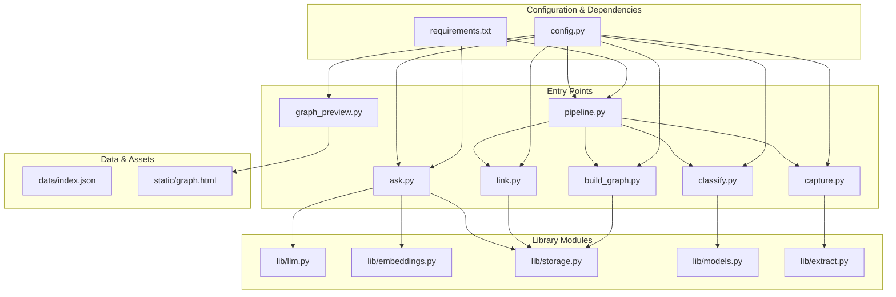
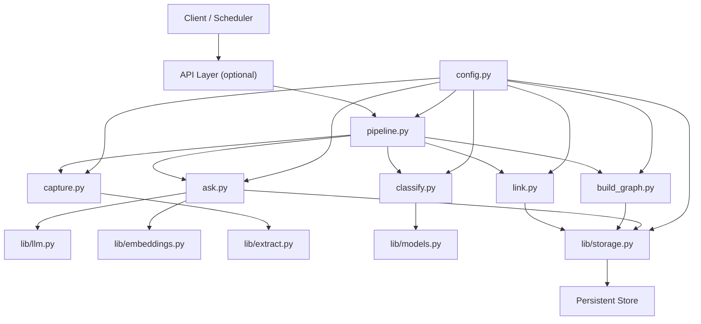
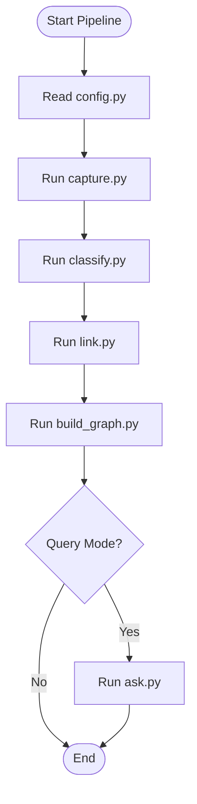
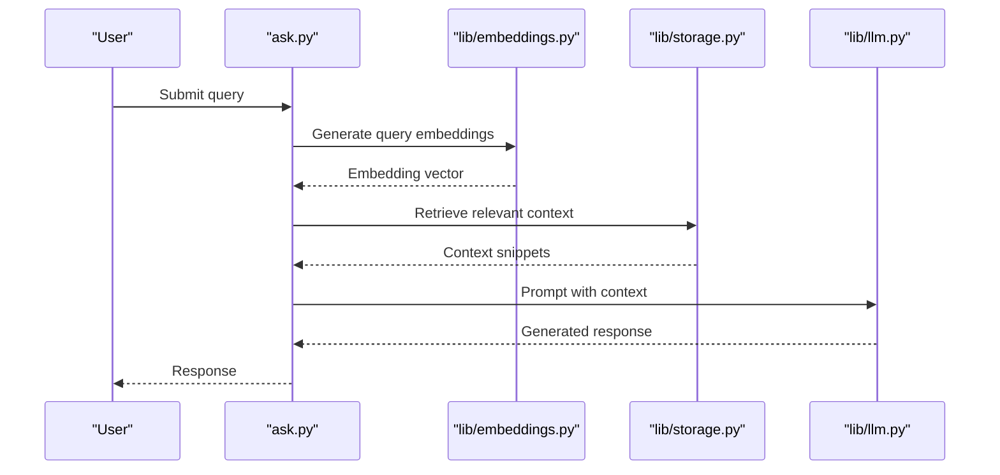
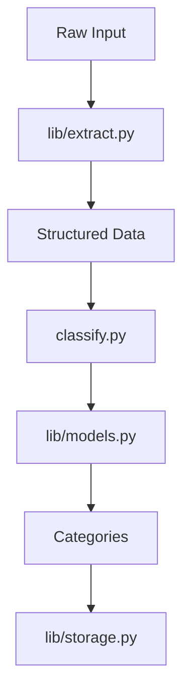
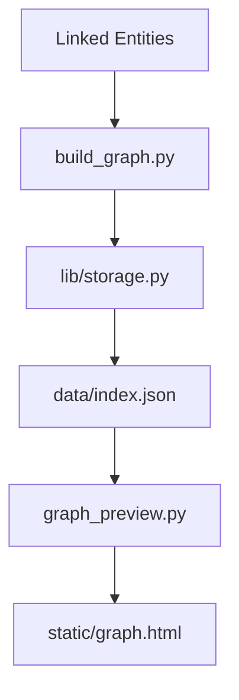
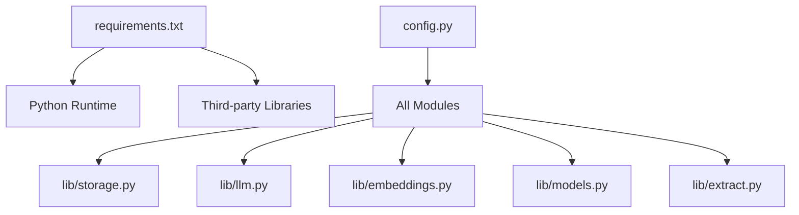

# Deployment Guide

<cite>
**Referenced Files in This Document**
- [README.md](file://README.md)
- [requirements.txt](file://requirements.txt)
- [config.py](file://config.py)
- [pipeline.py](file://pipeline.py)
- [capture.py](file://capture.py)
- [classify.py](file://classify.py)
- [link.py](file://link.py)
- [build_graph.py](file://build_graph.py)
- [graph_preview.py](file://graph_preview.py)
- [ask.py](file://ask.py)
- [lib/llm.py](file://lib/llm.py)
- [lib/embeddings.py](file://lib/embeddings.py)
- [lib/storage.py](file://lib/storage.py)
- [lib/models.py](file://lib/models.py)
- [lib/extract.py](file://lib/extract.py)
- [data/index.json](file://data/index.json)
- [static/graph.html](file://static/graph.html)
</cite>

## Table of Contents
1. [Introduction](#introduction)
2. [Project Structure](#project-structure)
3. [Core Components](#core-components)
4. [Architecture Overview](#architecture-overview)
5. [Detailed Component Analysis](#detailed-component-analysis)
6. [Dependency Analysis](#dependency-analysis)
7. [Performance Considerations](#performance-considerations)
8. [Troubleshooting Guide](#troubleshooting-guide)
9. [Conclusion](#conclusion)
10. [Appendices](#appendices)

## Introduction
This deployment guide provides production-ready guidance for deploying the Secondself AI Brain system. It covers environment setup, dependency management, configuration, containerization, cloud platform considerations, monitoring and logging, backup and recovery, scaling strategies, CI/CD pipelines, security hardening, performance tuning, and troubleshooting common issues. The goal is to enable reliable, secure, and scalable deployments across local, on-premises, and cloud environments.

## Project Structure
The repository is a Python-based application with modular components for data capture, classification, linking, graph building, querying, and visualization. Key directories and files include:
- Core scripts: pipeline orchestration, capture, classification, linking, graph building, preview, and question answering
- Library modules: LLM integration, embeddings, storage, models, and extraction utilities
- Configuration and dependencies: runtime settings and third-party packages
- Data and static assets: index file and frontend visualization

**Diagram sources**
- [pipeline.py](file://pipeline.py)
- [capture.py](file://capture.py)
- [classify.py](file://classify.py)
- [link.py](file://link.py)
- [build_graph.py](file://build_graph.py)
- [ask.py](file://ask.py)
- [graph_preview.py](file://graph_preview.py)
- [lib/llm.py](file://lib/llm.py)
- [lib/embeddings.py](file://lib/embeddings.py)
- [lib/storage.py](file://lib/storage.py)
- [lib/models.py](file://lib/models.py)
- [lib/extract.py](file://lib/extract.py)
- [config.py](file://config.py)
- [requirements.txt](file://requirements.txt)
- [data/index.json](file://data/index.json)
- [static/graph.html](file://static/graph.html)

**Section sources**
- [README.md](file://README.md)
- [requirements.txt](file://requirements.txt)
- [config.py](file://config.py)
- [pipeline.py](file://pipeline.py)
- [capture.py](file://capture.py)
- [classify.py](file://classify.py)
- [link.py](file://link.py)
- [build_graph.py](file://build_graph.py)
- [graph_preview.py](file://graph_preview.py)
- [ask.py](file://ask.py)
- [lib/llm.py](file://lib/llm.py)
- [lib/embeddings.py](file://lib/embeddings.py)
- [lib/storage.py](file://lib/storage.py)
- [lib/models.py](file://lib/models.py)
- [lib/extract.py](file://lib/extract.py)
- [data/index.json](file://data/index.json)
- [static/graph.html](file://static/graph.html)

## Core Components
- Pipeline orchestration: coordinates capture, classification, linking, and graph building steps
- Capture module: ingests raw content and prepares it for processing
- Classification module: applies model-based categorization to inputs
- Linking module: establishes relationships between entities and persists them
- Graph builder: constructs knowledge graphs from processed data
- Question answering: integrates LLMs and embeddings to answer queries against stored data
- Storage layer: manages persistence and retrieval of embeddings, models, and graph data
- Configuration: centralizes environment-specific settings and secrets
- Dependencies: pinned third-party libraries for reproducibility

Key responsibilities and interactions are defined by the entry-point scripts and library modules listed above.

**Section sources**
- [pipeline.py](file://pipeline.py)
- [capture.py](file://capture.py)
- [classify.py](file://classify.py)
- [link.py](file://link.py)
- [build_graph.py](file://build_graph.py)
- [ask.py](file://ask.py)
- [lib/storage.py](file://lib/storage.py)
- [config.py](file://config.py)
- [requirements.txt](file://requirements.txt)

## Architecture Overview
The system follows a modular architecture where entry-point scripts orchestrate data flows through specialized library modules. Configuration drives behavior across all components, while storage abstracts persistence concerns.

**Diagram sources**
- [pipeline.py](file://pipeline.py)
- [capture.py](file://capture.py)
- [classify.py](file://classify.py)
- [link.py](file://link.py)
- [build_graph.py](file://build_graph.py)
- [ask.py](file://ask.py)
- [lib/llm.py](file://lib/llm.py)
- [lib/embeddings.py](file://lib/embeddings.py)
- [lib/storage.py](file://lib/storage.py)
- [lib/models.py](file://lib/models.py)
- [lib/extract.py](file://lib/extract.py)
- [config.py](file://config.py)

## Detailed Component Analysis

### Pipeline Orchestration
The pipeline script coordinates sequential or conditional stages: capture, classify, link, build graph, and query. It reads configuration to determine execution paths and parameters.

**Diagram sources**
- [pipeline.py](file://pipeline.py)
- [capture.py](file://capture.py)
- [classify.py](file://classify.py)
- [link.py](file://link.py)
- [build_graph.py](file://build_graph.py)
- [ask.py](file://ask.py)
- [config.py](file://config.py)

**Section sources**
- [pipeline.py](file://pipeline.py)
- [config.py](file://config.py)

### Question Answering Flow
The question answering component integrates LLM calls with embedding generation and storage lookups to produce contextual responses.

**Diagram sources**
- [ask.py](file://ask.py)
- [lib/embeddings.py](file://lib/embeddings.py)
- [lib/storage.py](file://lib/storage.py)
- [lib/llm.py](file://lib/llm.py)

**Section sources**
- [ask.py](file://ask.py)
- [lib/embeddings.py](file://lib/embeddings.py)
- [lib/storage.py](file://lib/storage.py)
- [lib/llm.py](file://lib/llm.py)

### Data Extraction and Classification
Extraction transforms raw input into structured data, while classification assigns categories using models. Both rely on configuration and storage for consistency.

**Diagram sources**
- [lib/extract.py](file://lib/extract.py)
- [classify.py](file://classify.py)
- [lib/models.py](file://lib/models.py)
- [lib/storage.py](file://lib/storage.py)

**Section sources**
- [lib/extract.py](file://lib/extract.py)
- [classify.py](file://classify.py)
- [lib/models.py](file://lib/models.py)
- [lib/storage.py](file://lib/storage.py)

### Graph Building and Preview
Graph building aggregates linked entities and persists the resulting structure. A preview utility serves an interactive visualization via static assets.

**Diagram sources**
- [build_graph.py](file://build_graph.py)
- [lib/storage.py](file://lib/storage.py)
- [data/index.json](file://data/index.json)
- [graph_preview.py](file://graph_preview.py)
- [static/graph.html](file://static/graph.html)

**Section sources**
- [build_graph.py](file://build_graph.py)
- [lib/storage.py](file://lib/storage.py)
- [data/index.json](file://data/index.json)
- [graph_preview.py](file://graph_preview.py)
- [static/graph.html](file://static/graph.html)

## Dependency Analysis
Dependencies are managed via a requirements file that pins versions for reproducibility. Configuration centralizes environment variables and runtime options consumed by all modules.

**Diagram sources**
- [requirements.txt](file://requirements.txt)
- [config.py](file://config.py)
- [lib/storage.py](file://lib/storage.py)
- [lib/llm.py](file://lib/llm.py)
- [lib/embeddings.py](file://lib/embeddings.py)
- [lib/models.py](file://lib/models.py)
- [lib/extract.py](file://lib/extract.py)

**Section sources**
- [requirements.txt](file://requirements.txt)
- [config.py](file://config.py)

## Performance Considerations
- Use efficient storage backends and indexing for embeddings and graph data
- Cache frequent LLM prompts and results where appropriate
- Batch operations for capture and classification to reduce overhead
- Tune concurrency limits based on available CPU/GPU resources
- Monitor memory usage during embedding generation and model inference
- Optimize I/O by streaming large inputs and minimizing disk writes

[No sources needed since this section provides general guidance]

## Troubleshooting Guide
Common deployment issues and resolutions:
- Missing dependencies: ensure all packages from requirements are installed
- Configuration errors: validate environment variables and file paths
- Storage connectivity: verify permissions and backend availability
- LLM API failures: check credentials, rate limits, and network access
- Graph preview not loading: confirm static asset paths and server configuration
- Pipeline hangs: inspect logs for blocking operations and resource exhaustion

**Section sources**
- [requirements.txt](file://requirements.txt)
- [config.py](file://config.py)
- [lib/storage.py](file://lib/storage.py)
- [lib/llm.py](file://lib/llm.py)
- [graph_preview.py](file://graph_preview.py)
- [pipeline.py](file://pipeline.py)

## Conclusion
This guide outlines a comprehensive approach to deploying the Secondself AI Brain system in production. By following the recommended practices for environment setup, configuration, containerization, monitoring, security, and scaling, teams can achieve reliable and maintainable deployments across diverse platforms.

[No sources needed since this section summarizes without analyzing specific files]

## Appendices

### Environment Setup Requirements
- Python version compatible with requirements
- Access to required third-party services (LLM APIs, storage backends)
- Sufficient CPU/GPU resources for embedding and model operations
- Network access for external dependencies and APIs

**Section sources**
- [requirements.txt](file://requirements.txt)
- [config.py](file://config.py)

### Containerization Options
- Dockerize the application using a minimal base image
- Include only necessary dependencies and configurations
- Use multi-stage builds to reduce image size
- Mount persistent volumes for storage and indexes
- Configure environment variables via container orchestration

[No sources needed since this section provides general guidance]

### Cloud Platform Considerations
- Use managed services for storage and databases when possible
- Leverage auto-scaling groups for compute instances
- Implement health checks and readiness probes
- Secure secrets with cloud-native secret managers
- Enable centralized logging and metrics collection

[No sources needed since this section provides general guidance]

### Monitoring and Logging Setup
- Integrate structured logging across all modules
- Export metrics for key operations (capture, classify, link, build, query)
- Set up alerts for failures and performance degradation
- Centralize logs for analysis and auditing

[No sources needed since this section provides general guidance]

### Backup and Recovery Procedures
- Regularly back up storage backends and indexes
- Version control configuration and code changes
- Test recovery procedures periodically
- Maintain rollback plans for failed deployments

[No sources needed since this section provides general guidance]

### Scaling Considerations
- Horizontal scaling for stateless components
- Vertical scaling for GPU-intensive tasks
- Load balancing across multiple instances
- Database sharding and caching strategies

[No sources needed since this section provides general guidance]

### Security Hardening
- Restrict network access to required endpoints
- Rotate secrets regularly and use encrypted storage
- Validate and sanitize all inputs
- Implement least-privilege access controls
- Audit and monitor access patterns

[No sources needed since this section provides general guidance]

### CI/CD Pipeline Setup
- Automate testing and linting in pull requests
- Build container images on merge to main branch
- Deploy to staging environments automatically
- Promote releases after validation and approval

[No sources needed since this section provides general guidance]

### Example Docker Configuration
- Define a Dockerfile with Python base image
- Copy application code and install dependencies
- Expose necessary ports and set environment variables
- Run the application with appropriate command-line arguments

[No sources needed since this section provides general guidance]

### Environment-Specific Deployments
- Use separate configuration files for dev, staging, and production
- Manage environment variables per deployment target
- Implement feature flags for gradual rollouts
- Validate configurations before deployment

[No sources needed since this section provides general guidance]