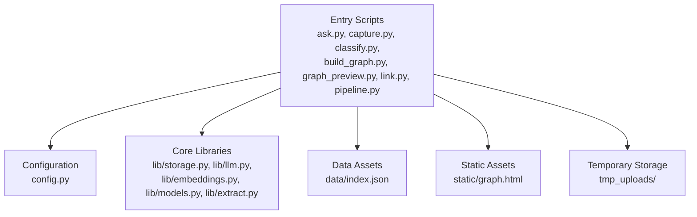
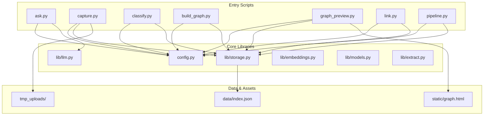

# Environment Setup

<cite>
**Referenced Files in This Document**
- [README.md](file://README.md)
- [requirements.txt](file://requirements.txt)
- [config.py](file://config.py)
- [lib/storage.py](file://lib/storage.py)
- [lib/llm.py](file://lib/llm.py)
- [pipeline.py](file://pipeline.py)
- [capture.py](file://capture.py)
- [classify.py](file://classify.py)
- [build_graph.py](file://build_graph.py)
- [ask.py](file://ask.py)
- [graph_preview.py](file://graph_preview.py)
- [link.py](file://link.py)
- [data/index.json](file://data/index.json)
</cite>

## Table of Contents
1. [Introduction](#introduction)
2. [Project Structure](#project-structure)
3. [Core Components](#core-components)
4. [Architecture Overview](#architecture-overview)
5. [Detailed Component Analysis](#detailed-component-analysis)
6. [Dependency Analysis](#dependency-analysis)
7. [Performance Considerations](#performance-considerations)
8. [Troubleshooting Guide](#troubleshooting-guide)
9. [Conclusion](#conclusion)
10. [Appendices](#appendices)

## Introduction
This document provides a comprehensive environment setup guide for the Secondself AI Brain system. It covers Python version requirements, system dependencies, package installation, configuration files, environment variables, credential management, and step-by-step instructions for development, staging, and production environments. It also includes database initialization, storage configuration, external service integrations, and troubleshooting guidance for common issues.

## Project Structure
The project is a Python-based knowledge graph and LLM-driven assistant with modular components:
- Entry points and scripts: ask.py, capture.py, classify.py, build_graph.py, graph_preview.py, link.py, pipeline.py
- Configuration and settings: config.py
- Core libraries: lib/ (storage, llm, embeddings, models, extract)
- Data assets: data/index.json
- Static assets: static/graph.html
- Temporary uploads: tmp_uploads/

**Section sources**
- [README.md](file://README.md)
- [requirements.txt](file://requirements.txt)
- [config.py](file://config.py)
- [lib/storage.py](file://lib/storage.py)
- [lib/llm.py](file://lib/llm.py)
- [pipeline.py](file://pipeline.py)
- [capture.py](file://capture.py)
- [classify.py](file://classify.py)
- [build_graph.py](file://build_graph.py)
- [ask.py](file://ask.py)
- [graph_preview.py](file://graph_preview.py)
- [link.py](file://link.py)
- [data/index.json](file://data/index.json)

## Core Components
- Configuration module: centralizes environment variables and runtime settings used by all scripts and libraries.
- Storage module: manages persistent storage backends and file operations.
- LLM integration module: handles external language model API calls and credentials.
- Pipeline orchestrator: coordinates ingestion, classification, graph building, and querying workflows.
- Entry scripts: provide CLI interfaces for capturing content, classifying items, building graphs, previewing graphs, linking entities, and asking questions.

Key responsibilities:
- Environment variable resolution and validation
- Secure credential handling
- Storage backend selection and initialization
- External service authentication and rate limiting
- Workflow orchestration and error propagation

**Section sources**
- [config.py](file://config.py)
- [lib/storage.py](file://lib/storage.py)
- [lib/llm.py](file://lib/llm.py)
- [pipeline.py](file://pipeline.py)

## Architecture Overview
The system follows a modular architecture where entry scripts invoke core libraries and rely on centralized configuration. The LLM integration layer abstracts external API interactions, while the storage layer abstracts persistence. The pipeline orchestrates multi-step processes such as ingestion, classification, and graph construction.

**Diagram sources**
- [config.py](file://config.py)
- [lib/storage.py](file://lib/storage.py)
- [lib/llm.py](file://lib/llm.py)
- [pipeline.py](file://pipeline.py)
- [ask.py](file://ask.py)
- [capture.py](file://capture.py)
- [classify.py](file://classify.py)
- [build_graph.py](file://build_graph.py)
- [graph_preview.py](file://graph_preview.py)
- [link.py](file://link.py)
- [data/index.json](file://data/index.json)
- [static/graph.html](file://static/graph.html)

## Detailed Component Analysis

### Configuration Module
- Purpose: Centralizes environment variables, secrets, and runtime flags.
- Responsibilities:
  - Load environment variables from OS or .env files
  - Provide typed accessors for keys like API tokens, storage paths, and feature flags
  - Validate required settings and raise clear errors when missing
- Best practices:
  - Use environment-specific overrides for dev/staging/prod
  - Avoid hardcoding secrets; prefer secure secret stores or injected env vars
  - Log minimal diagnostics without exposing sensitive values

**Section sources**
- [config.py](file://config.py)

### Storage Module
- Purpose: Abstracts storage backends and file operations.
- Responsibilities:
  - Initialize storage based on configuration (local filesystem, cloud buckets, etc.)
  - Manage temporary uploads and persistent indexes
  - Provide CRUD-like methods for documents and metadata
- Key considerations:
  - Ensure directories exist and permissions are correct
  - Handle retries and timeouts for remote storage
  - Normalize paths and filenames across platforms

**Section sources**
- [lib/storage.py](file://lib/storage.py)

### LLM Integration Module
- Purpose: Encapsulates external language model interactions.
- Responsibilities:
  - Authenticate using API keys or tokens from environment
  - Configure model parameters and endpoints
  - Implement retry logic and error handling for network failures
- Security:
  - Never log raw tokens
  - Support rotating keys and per-environment configurations

**Section sources**
- [lib/llm.py](file://lib/llm.py)

### Pipeline Orchestrator
- Purpose: Coordinates multi-step workflows across ingestion, classification, graph building, and querying.
- Responsibilities:
  - Sequence tasks with proper error handling and rollback strategies
  - Expose progress callbacks and logging hooks
  - Allow configurable stages to enable/disable features

**Section sources**
- [pipeline.py](file://pipeline.py)

### Entry Scripts
- ask.py: Query interface for natural language questions against the knowledge graph.
- capture.py: Ingest new content into the system and update indexes.
- classify.py: Classify items and assign labels or categories.
- build_graph.py: Construct or rebuild the knowledge graph from stored data.
- graph_preview.py: Render interactive graph previews using static assets.
- link.py: Link related entities and update relationships.

Each script reads configuration, invokes core libraries, and prints results or updates state.

**Section sources**
- [ask.py](file://ask.py)
- [capture.py](file://capture.py)
- [classify.py](file://classify.py)
- [build_graph.py](file://build_graph.py)
- [graph_preview.py](file://graph_preview.py)
- [link.py](file://link.py)

### Data Assets
- data/index.json: Central index or manifest used by storage and graph components.
- static/graph.html: Frontend template for graph visualization.

**Section sources**
- [data/index.json](file://data/index.json)
- [static/graph.html](file://static/graph.html)

## Dependency Analysis
- Python version: Use the version specified in the repository’s dependency manifest.
- Packages: Install via pip using the provided requirements file.
- System dependencies:
  - Ensure compilers or native libraries are present if any Python packages require them.
  - Verify platform-specific binaries for storage or LLM clients if applicable.

Installation steps:
- Create a virtual environment with the required Python version.
- Install dependencies from requirements.txt.
- Validate imports by running a simple import test for core modules.

Common pitfalls:
- Mismatched Python versions causing wheel incompatibilities.
- Missing system libraries leading to failed builds.
- Network restrictions preventing package downloads.

**Section sources**
- [requirements.txt](file://requirements.txt)

## Performance Considerations
- Prefer async I/O for LLM calls and remote storage where supported.
- Cache frequently accessed embeddings and graph nodes.
- Batch operations for large-scale indexing and classification.
- Tune concurrency limits to avoid rate-limiting external services.
- Monitor memory usage during graph construction and query processing.

[No sources needed since this section provides general guidance]

## Troubleshooting Guide
Common setup issues and resolutions:
- Python version mismatch:
  - Confirm the interpreter matches the required version.
  - Reinstall dependencies in a fresh virtual environment.
- Missing environment variables:
  - Ensure all required keys are set before running scripts.
  - Use a local .env file for development and inject securely in staging/prod.
- Storage path errors:
  - Verify directory existence and write permissions.
  - Check absolute vs relative paths across environments.
- LLM API failures:
  - Validate tokens and endpoint URLs.
  - Inspect rate limits and error responses; implement retries.
- Index corruption:
  - Rebuild the index using the graph builder script.
  - Backup and restore from known-good snapshots.

Diagnostic tips:
- Enable verbose logging in development mode.
- Run individual scripts with minimal configuration to isolate issues.
- Use health checks for storage and LLM connectivity.

**Section sources**
- [config.py](file://config.py)
- [lib/storage.py](file://lib/storage.py)
- [lib/llm.py](file://lib/llm.py)
- [build_graph.py](file://build_graph.py)

## Conclusion
Setting up the Secondself AI Brain system requires careful attention to Python version, dependencies, configuration, and credentials. By following the steps outlined here, you can reliably configure development, staging, and production environments, initialize storage and indexes, integrate external services, and troubleshoot common issues effectively.

[No sources needed since this section summarizes without analyzing specific files]

## Appendices

### Environment-Specific Setup Steps

#### Development
- Install Python and create a virtual environment.
- Install dependencies from requirements.txt.
- Set local environment variables and optional .env file.
- Initialize storage directories and ensure permissions.
- Seed data/index.json if required.
- Run entry scripts locally to validate functionality.

#### Staging
- Mirror production configuration except for secrets.
- Use staging-specific endpoints and credentials.
- Perform full pipeline runs to validate integrations.
- Monitor logs and performance metrics.

#### Production
- Deploy with hardened security practices.
- Inject secrets via secure secret managers or environment injection.
- Configure storage backends for durability and scalability.
- Set up monitoring, alerting, and backups.
- Run periodic maintenance jobs (index rebuilds, cleanup).

[No sources needed since this section provides general guidance]

### Credential Management
- Store secrets outside code repositories.
- Use environment variables or secret stores.
- Rotate keys regularly and audit access.
- Restrict permissions to minimum necessary.

[No sources needed since this section provides general guidance]

### Database Initialization
- If using a relational or document store, initialize schemas and migrations.
- Populate initial datasets as needed.
- Verify connectivity and read/write operations.

[No sources needed since this section provides general guidance]

### Storage Configuration
- Choose appropriate storage backend (local, cloud).
- Configure bucket names, regions, and access policies.
- Test upload/download and lifecycle rules.

[No sources needed since this section provides general guidance]

### External Service Integrations
- Register API accounts and obtain tokens.
- Configure endpoints and rate limits.
- Implement retries and fallbacks.

[No sources needed since this section provides general guidance]