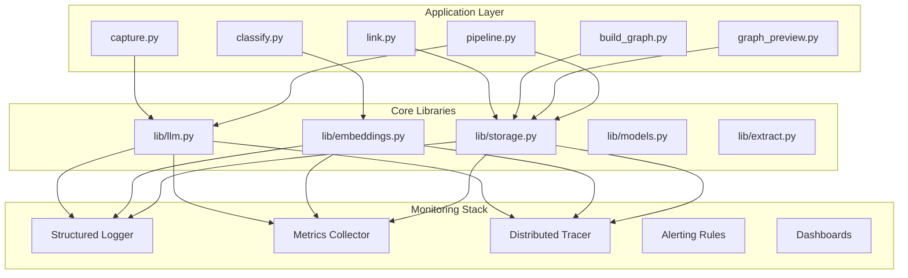
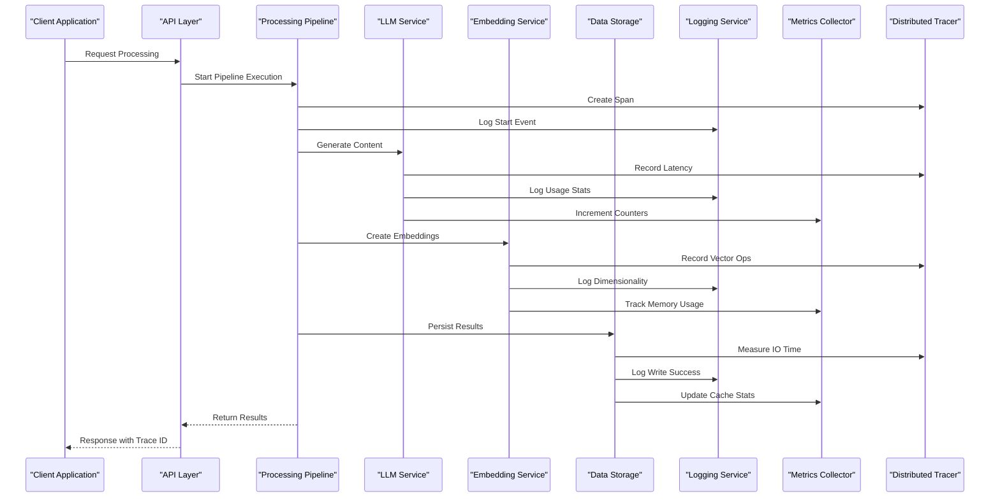
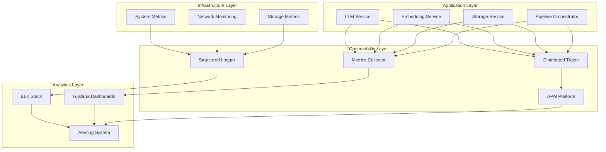

# Monitoring & Logging

<cite>
**Referenced Files in This Document**
- [README.md](file://README.md)
- [config.py](file://config.py)
- [pipeline.py](file://pipeline.py)
- [requirements.txt](file://requirements.txt)
- [lib/llm.py](file://lib/llm.py)
- [lib/embeddings.py](file://lib/embeddings.py)
- [lib/storage.py](file://lib/storage.py)
- [capture.py](file://capture.py)
- [classify.py](file://classify.py)
- [link.py](file://link.py)
- [build_graph.py](file://build_graph.py)
- [graph_preview.py](file://graph_preview.py)
</cite>

## Table of Contents
1. [Introduction](#introduction)
2. [Project Structure](#project-structure)
3. [Core Components](#core-components)
4. [Architecture Overview](#architecture-overview)
5. [Detailed Component Analysis](#detailed-component-analysis)
6. [Dependency Analysis](#dependency-analysis)
7. [Performance Considerations](#performance-considerations)
8. [Troubleshooting Guide](#troubleshooting-guide)
9. [Conclusion](#conclusion)
10. [Appendices](#appendices)

## Introduction

This document provides comprehensive monitoring and logging guidance for the Secondself AI Brain system. It covers log collection strategies, structured logging formats, log rotation policies, metrics collection setup, performance monitoring, alerting configuration, distributed tracing implementation, error tracking, debugging tools integration, dashboard creation examples, log aggregation with ELK stack or similar solutions, and custom metric definitions for application-specific KPIs.

The goal is to ensure observability across all components: data capture, embedding generation, LLM interactions, graph construction, and storage operations.

## Project Structure

Secondself AI Brain is a modular Python application with clear separation between core logic (in lib/), orchestration scripts at the root level, and static assets under static/. The monitoring strategy should align with this modularity:

- Core libraries (lib/) encapsulate business logic and should emit structured logs and metrics.
- Orchestration scripts (root-level .py files) coordinate workflows and should propagate context and errors.
- Configuration (config.py) centralizes settings, including logging and metrics endpoints.
- Data layer (storage.py) handles persistence and should log access patterns and failures.



**Diagram sources**
- [capture.py](file://capture.py)
- [classify.py](file://classify.py)
- [link.py](file://link.py)
- [build_graph.py](file://build_graph.py)
- [graph_preview.py](file://graph_preview.py)
- [pipeline.py](file://pipeline.py)
- [lib/llm.py](file://lib/llm.py)
- [lib/embeddings.py](file://lib/embeddings.py)
- [lib/storage.py](file://lib/storage.py)

**Section sources**
- [README.md](file://README.md)
- [config.py](file://config.py)

## Core Components

### Structured Logging Strategy

All components should use structured logging with consistent fields:
- Timestamp (ISO 8601 format)
- Level (DEBUG, INFO, WARNING, ERROR, CRITICAL)
- Module/Function name
- Request/Trace ID (for distributed tracing correlation)
- User/Session context (if applicable)
- Action description
- Key-value pairs for domain-specific metadata

Recommended logger initialization pattern:
- Centralized configuration via config.py
- JSON-formatted output for easy parsing
- Separate handlers for console, file, and external services
- Log rotation based on size and time

### Metrics Collection

Key metrics to collect:
- **LLM Performance**: Token usage, latency, cost per request
- **Embedding Generation**: Vector dimensionality, generation time, memory usage
- **Storage Operations**: Read/write latency, cache hit rates, disk usage
- **Pipeline Throughput**: Items processed per minute, success/failure rates
- **System Resources**: CPU, memory, GPU utilization

Implementation approach:
- Use Prometheus client library for metrics exposure
- Custom counters, histograms, and gauges per component
- Aggregation at pipeline level for end-to-end visibility

### Distributed Tracing

Implement OpenTelemetry for cross-service tracing:
- Trace spans for each major operation
- Context propagation across process boundaries
- Sampling strategies for high-volume environments
- Integration with APM tools (Jaeger, Zipkin, New Relic)

**Section sources**
- [config.py](file://config.py)
- [lib/llm.py](file://lib/llm.py)
- [lib/embeddings.py](file://lib/embeddings.py)
- [lib/storage.py](file://lib/storage.py)

## Architecture Overview

The monitoring architecture follows a layered approach with clear separation of concerns:



**Diagram sources**
- [pipeline.py](file://pipeline.py)
- [lib/llm.py](file://lib/llm.py)
- [lib/embeddings.py](file://lib/embeddings.py)
- [lib/storage.py](file://lib/storage.py)

## Detailed Component Analysis

### LLM Service Monitoring

The LLM service requires careful monitoring due to its resource-intensive nature and cost implications:

#### Key Metrics
- Token consumption (input/output)
- Request latency (p50, p95, p99)
- Error rates by model/provider
- Cost tracking per request
- Rate limiting events

#### Logging Format
```json
{
  "timestamp": "2024-01-01T00:00:00Z",
  "level": "INFO",
  "module": "lib.llm",
  "function": "generate_response",
  "trace_id": "abc123",
  "model": "gpt-4",
  "tokens_used": 150,
  "latency_ms": 2500,
  "cost_usd": 0.003,
  "status": "success"
}
```

#### Error Handling
- Retry logic with exponential backoff
- Circuit breaker pattern for provider outages
- Fallback models when primary fails
- Comprehensive error categorization

### Embedding Service Monitoring

Embedding generation involves vector operations that require specific monitoring:

#### Performance Metrics
- Vector dimensionality tracking
- Generation time per embedding
- Memory usage during batch operations
- Cache hit rates for repeated vectors
- GPU utilization (if applicable)

#### Storage Patterns
- Vector database query latency
- Similarity search performance
- Index rebuild frequency
- Storage growth rate

### Storage Layer Monitoring

Data persistence operations need detailed monitoring for capacity planning and performance optimization:

#### Critical Metrics
- Read/write operations per second
- Query latency distribution
- Cache effectiveness ratios
- Disk space utilization trends
- Backup completion status

#### Alerting Thresholds
- Disk usage > 80%
- Query latency > 100ms
- Error rate > 1%
- Backup failure detection

### Pipeline Orchestration Monitoring

The main pipeline coordinates multiple services and requires end-to-end visibility:

#### Pipeline Metrics
- Total processing time
- Step-by-step duration breakdown
- Success/failure rates per step
- Queue depth and processing backlog
- Resource utilization peaks

#### Debugging Support
- Step-level error isolation
- Partial result recovery
- State checkpointing
- Replay capability for failed runs

**Section sources**
- [lib/llm.py](file://lib/llm.py)
- [lib/embeddings.py](file://lib/embeddings.py)
- [lib/storage.py](file://lib/storage.py)
- [pipeline.py](file://pipeline.py)

## Dependency Analysis

The monitoring dependencies follow a clear hierarchy where lower-level components provide telemetry data to higher-level aggregators:



**Diagram sources**
- [config.py](file://config.py)
- [requirements.txt](file://requirements.txt)

**Section sources**
- [requirements.txt](file://requirements.txt)
- [config.py](file://config.py)

## Performance Considerations

### Logging Performance Impact
- Use async logging for high-throughput scenarios
- Implement log sampling for debug-level messages
- Batch metrics collection to reduce overhead
- Compress log files before transmission

### Metrics Collection Efficiency
- Aggregate metrics at source when possible
- Use appropriate histogram buckets for latency
- Implement metric cardinality limits
- Regular cleanup of unused metrics

### Tracing Overhead Management
- Sample traces based on error rate or latency
- Limit span depth to prevent explosion
- Use lightweight context propagation
- Optimize trace export frequency

### Storage Optimization
- Implement log rotation with compression
- Use time-based partitioning for queries
- Archive old logs to cold storage
- Monitor storage growth patterns

## Troubleshooting Guide

### Common Issues and Solutions

#### High Memory Usage
- Check for embedding vector accumulation
- Monitor LLM response buffering
- Inspect storage connection pools
- Review garbage collection patterns

#### Slow Query Performance
- Analyze vector similarity search patterns
- Check index rebuild schedules
- Monitor cache effectiveness
- Review database connection pooling

#### LLM Service Failures
- Verify API key validity and rate limits
- Check provider service status
- Monitor token quota consumption
- Implement fallback mechanisms

#### Storage Corruption
- Validate checksums on write operations
- Monitor disk health indicators
- Check backup integrity regularly
- Implement data validation pipelines

### Debug Tools Integration

#### Local Development
- Enable verbose logging with structured output
- Use interactive debugging with breakpoints
- Mock external services for testing
- Simulate high-load scenarios

#### Production Debugging
- Remote debugging with caution
- Live log streaming for critical issues
- Performance profiling tools
- Memory dump analysis

**Section sources**
- [lib/storage.py](file://lib/storage.py)
- [lib/llm.py](file://lib/llm.py)
- [lib/embeddings.py](file://lib/embeddings.py)

## Conclusion

Effective monitoring and logging for the Secondself AI Brain system requires a comprehensive approach that covers all layers from infrastructure to application code. By implementing structured logging, comprehensive metrics collection, distributed tracing, and proactive alerting, teams can maintain high availability and performance while quickly diagnosing issues.

The key principles are:
- Consistency in logging formats and metric naming
- Proactive alerting based on meaningful thresholds
- Comprehensive tracing for distributed operations
- Regular review and optimization of monitoring overhead
- Integration with existing DevOps toolchains

## Appendices

### A. Recommended Tool Stack

#### Logging
- **Structured Logger**: Python's built-in logging with JSON formatting
- **Log Aggregation**: Elasticsearch + Kibana or Loki + Grafana
- **Log Rotation**: Logrotate or application-level rotation

#### Metrics
- **Collection**: Prometheus client library
- **Storage**: Prometheus or TimescaleDB
- **Visualization**: Grafana dashboards
- **Alerting**: Prometheus Alertmanager

#### Tracing
- **Instrumentation**: OpenTelemetry SDK
- **Backend**: Jaeger, Zipkin, or commercial APM
- **Sampling**: Adaptive sampling based on load

### B. Dashboard Examples

#### System Health Dashboard
- Overall system status indicators
- Resource utilization trends
- Error rate monitoring
- Pipeline throughput metrics

#### LLM Performance Dashboard
- Token usage trends
- Latency percentiles
- Cost tracking
- Provider reliability

#### Storage Dashboard
- Database performance metrics
- Cache effectiveness
- Storage growth projections
- Backup status indicators

### C. Alerting Rules

#### Critical Alerts
- Service unavailability (> 5 minutes)
- Error rate spikes (> 10% increase)
- Resource exhaustion warnings (> 90% usage)
- Data loss detection

#### Warning Alerts
- Performance degradation (> 50% latency increase)
- Memory leaks detection
- Disk space warnings (> 80% usage)
- Failed job retries

### D. Log Retention Policies

| Log Type | Retention Period | Storage Tier |
|----------|------------------|--------------|
| Error Logs | 90 days | Hot storage |
| Access Logs | 30 days | Warm storage |
| Audit Logs | 1 year | Cold storage |
| Debug Logs | 7 days | Temporary storage |
| Metrics | 1 year | Time-series DB |