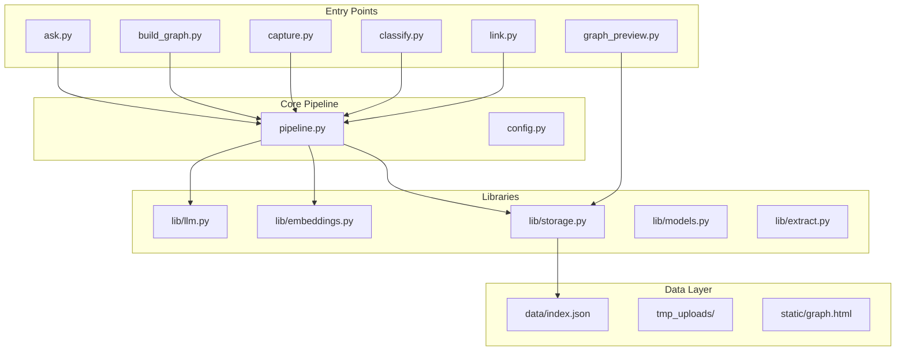
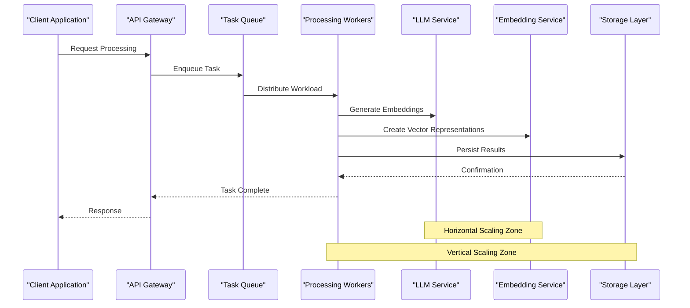
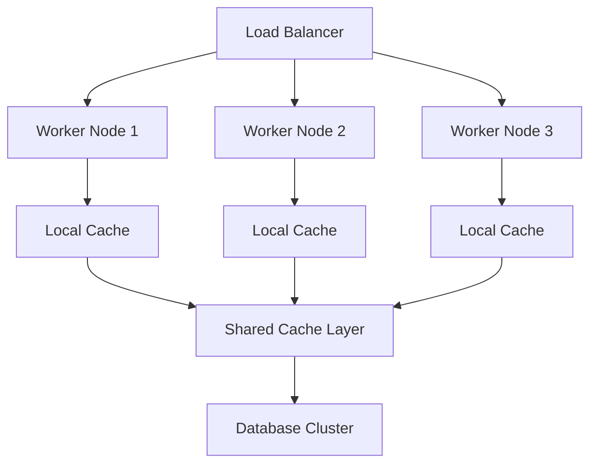
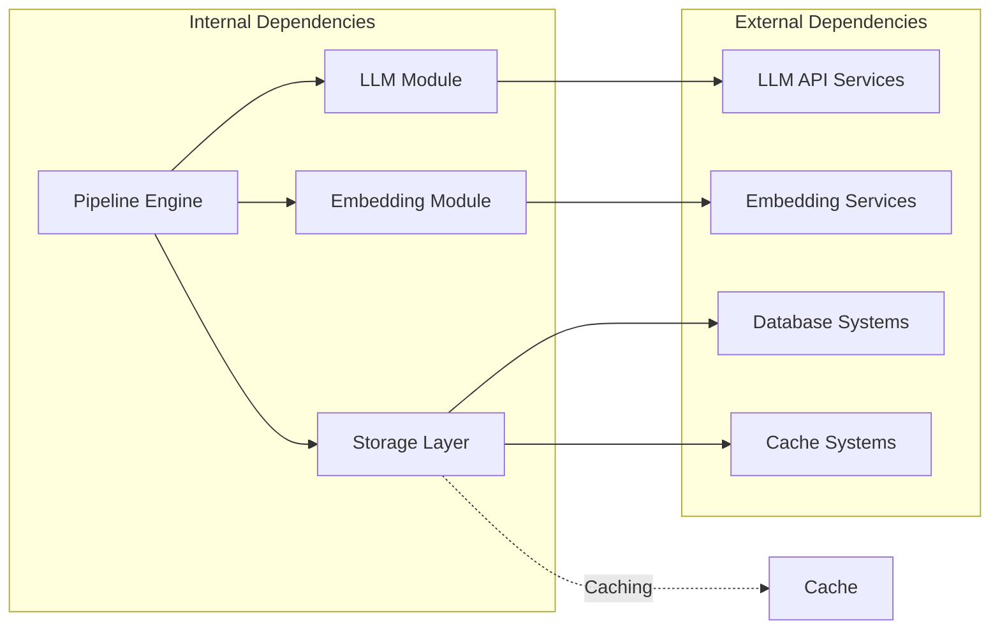

# Scaling & Performance

<cite>
**Referenced Files in This Document**
- [README.md](file://README.md)
- [config.py](file://config.py)
- [pipeline.py](file://pipeline.py)
- [lib/llm.py](file://lib/llm.py)
- [lib/embeddings.py](file://lib/embeddings.py)
- [lib/storage.py](file://lib/storage.py)
- [build_graph.py](file://build_graph.py)
- [capture.py](file://capture.py)
- [classify.py](file://classify.py)
- [link.py](file://link.py)
- [graph_preview.py](file://graph_preview.py)
- [ask.py](file://ask.py)
- [requirements.txt](file://requirements.txt)
</cite>

## Table of Contents
1. [Introduction](#introduction)
2. [Project Structure](#project-structure)
3. [Core Components](#core-components)
4. [Architecture Overview](#architecture-overview)
5. [Detailed Component Analysis](#detailed-component-analysis)
6. [Dependency Analysis](#dependency-analysis)
7. [Performance Considerations](#performance-considerations)
8. [Troubleshooting Guide](#troubleshooting-guide)
9. [Conclusion](#conclusion)
10. [Appendices](#appendices)

## Introduction

The Secondself AI Brain system is a sophisticated knowledge graph construction and query platform that leverages Large Language Models (LLMs) and embedding generation to create interconnected semantic networks from various data sources. This document provides comprehensive guidance on scaling and performance optimization strategies for production deployments of this system.

The system architecture supports both horizontal and vertical scaling approaches, with built-in mechanisms for load balancing, caching, and resource optimization. Understanding these scaling patterns is crucial for maintaining optimal performance as the system grows in complexity and user demand increases.

## Project Structure

The Secondself AI Brain follows a modular architecture with clear separation of concerns:



**Diagram sources**
- [pipeline.py](file://pipeline.py)
- [lib/llm.py](file://lib/llm.py)
- [lib/embeddings.py](file://lib/embeddings.py)
- [lib/storage.py](file://lib/storage.py)

**Section sources**
- [README.md](file://README.md)
- [requirements.txt](file://requirements.txt)

## Core Components

### LLM Integration Layer
The LLM component handles all interactions with external language model APIs, implementing retry logic, rate limiting, and response caching to optimize performance and reduce API costs.

### Embedding Generation Engine
This module manages vector embedding creation for text content, supporting multiple embedding providers and implementing batch processing capabilities for improved throughput.

### Storage Abstraction Layer
The storage layer provides unified access to different data backends, including local filesystem, databases, and cloud storage solutions, with built-in caching mechanisms.

### Graph Construction Pipeline
The main orchestration layer coordinates data ingestion, processing, and graph building operations with support for concurrent processing and error recovery.

**Section sources**
- [lib/llm.py](file://lib/llm.py)
- [lib/embeddings.py](file://lib/embeddings.py)
- [lib/storage.py](file://lib/storage.py)
- [pipeline.py](file://pipeline.py)

## Architecture Overview

The system follows a microservices-inspired architecture with clear separation between data ingestion, processing, and serving layers:



**Diagram sources**
- [pipeline.py](file://pipeline.py)
- [lib/llm.py](file://lib/llm.py)
- [lib/embeddings.py](file://lib/embeddings.py)
- [lib/storage.py](file://lib/storage.py)

## Detailed Component Analysis

### Horizontal Scaling Strategies

#### Stateless Service Design
The system is designed with stateless components that can be easily replicated across multiple instances:

- **API Gateway**: Load balancer configuration for distributing incoming requests
- **Processing Workers**: Independent workers that can scale horizontally based on queue depth
- **Cache Layer**: Distributed cache implementation for shared session and result caching

#### Database Sharding
For high-throughput scenarios, implement database sharding strategies:

- **Time-based Sharding**: Split data by time periods for temporal queries
- **Content-based Sharding**: Distribute data based on content type or category
- **Geographic Sharding**: Place data closer to users for reduced latency

#### Message Queue Scaling
Implement scalable message queuing with:

- **Auto-scaling Workers**: Dynamically adjust worker count based on queue length
- **Priority Queues**: Handle urgent tasks with higher priority
- **Dead Letter Queues**: Manage failed tasks for retry or analysis

### Vertical Scaling Optimization

#### Memory Management
Optimize memory usage through:

- **Object Pooling**: Reuse expensive objects like database connections
- **Memory-mapped Files**: For large dataset processing
- **Garbage Collection Tuning**: Configure GC parameters for workload characteristics

#### CPU Optimization
Enhance CPU utilization with:

- **Vectorization**: Use NumPy operations for numerical computations
- **Parallel Processing**: Leverage multiprocessing for CPU-bound tasks
- **Algorithm Optimization**: Choose efficient algorithms for specific use cases

#### I/O Optimization
Improve I/O performance through:

- **Asynchronous I/O**: Non-blocking operations for network and disk access
- **Connection Pooling**: Reuse database and API connections
- **Buffer Management**: Optimize buffer sizes for different workloads

### Load Balancing Configuration

#### HTTP Load Balancer Setup
Configure load balancing for web-facing components:



**Diagram sources**
- [config.py](file://config.py)
- [lib/storage.py](file://lib/storage.py)

#### Session Affinity
Implement sticky sessions for stateful operations:

- **Cookie-based Affinity**: Route requests to same instance for session continuity
- **IP Hashing**: Distribute based on client IP address
- **Header-based Routing**: Custom routing rules for specific request types

### Caching Mechanisms

#### Multi-level Caching Strategy
Implement hierarchical caching for optimal performance:

1. **L1 Cache**: In-memory cache for frequently accessed data
2. **L2 Cache**: Distributed cache (Redis/Memcached) for shared data
3. **L3 Cache**: Database query results and computed embeddings
4. **CDN Cache**: Static assets and generated graphs

#### Cache Invalidation Strategies
Manage cache consistency with:

- **TTL-based Expiration**: Time-to-live for cached entries
- **Event-driven Invalidation**: Update cache on data changes
- **Version-based Caching**: Use content hashes for automatic invalidation

**Section sources**
- [config.py](file://config.py)
- [lib/storage.py](file://lib/storage.py)

## Dependency Analysis

The system's dependency structure reveals key scaling opportunities:



**Diagram sources**
- [lib/llm.py](file://lib/llm.py)
- [lib/embeddings.py](file://lib/embeddings.py)
- [lib/storage.py](file://lib/storage.py)
- [pipeline.py](file://pipeline.py)

**Section sources**
- [requirements.txt](file://requirements.txt)
- [lib/llm.py](file://lib/llm.py)
- [lib/embeddings.py](file://lib/embeddings.py)

## Performance Considerations

### Embedding Generation Optimization

#### Batch Processing
Optimize embedding generation through batch operations:

- **Batch Size Tuning**: Find optimal batch size for memory and throughput balance
- **Async Processing**: Process embeddings asynchronously to avoid blocking
- **Result Caching**: Cache embeddings for identical inputs to avoid recomputation

#### Model Selection
Choose appropriate embedding models based on requirements:

- **Accuracy vs Speed**: Balance between embedding quality and generation speed
- **Model Quantization**: Use quantized models for faster inference
- **Model Distillation**: Apply distillation techniques for smaller, faster models

### LLM API Call Optimization

#### Rate Limiting and Retry Logic
Implement robust API call management:

- **Exponential Backoff**: Progressive delay between retries
- **Circuit Breaker Pattern**: Prevent cascading failures
- **Request Batching**: Combine multiple requests when possible

#### Response Caching
Cache LLM responses to reduce API calls:

- **Prompt-based Caching**: Cache responses for identical prompts
- **Partial Caching**: Cache intermediate results for complex queries
- **TTL Management**: Set appropriate expiration times for cached responses

### Graph Operations Optimization

#### Indexing Strategies
Optimize graph traversal with proper indexing:

- **Node Indexing**: Create indexes for frequently queried node properties
- **Edge Indexing**: Index relationships for faster traversal
- **Materialized Views**: Pre-compute common query patterns

#### Query Optimization
Improve graph query performance:

- **Query Planning**: Analyze and optimize complex graph queries
- **Lazy Loading**: Load graph segments on-demand
- **Pagination**: Implement efficient pagination for large result sets

### Memory Optimization Techniques

#### Object Lifecycle Management
Manage object lifecycles effectively:

- **Reference Counting**: Monitor and manage object references
- **Weak References**: Use weak references for circular dependencies
- **Memory Profiling**: Regular profiling to identify memory leaks

#### Data Structure Optimization
Choose appropriate data structures:

- **Sparse Matrices**: Use sparse representations for large datasets
- **Memory-efficient Types**: Use appropriate data types for memory savings
- **Streaming Processing**: Process large datasets without loading entirely into memory

### Concurrent Processing Patterns

#### Async/Await Implementation
Implement asynchronous processing:

- **Non-blocking I/O**: Use async I/O for network and disk operations
- **Task Scheduling**: Efficiently schedule and manage concurrent tasks
- **Resource Pooling**: Pool expensive resources like database connections

#### Parallel Processing
Leverage parallel execution:

- **Process Pooling**: Use process pools for CPU-bound tasks
- **Thread Safety**: Ensure thread-safe operations in multi-threaded environments
- **Work Distribution**: Distribute work evenly across available processors

### Resource Utilization Monitoring

#### Metrics Collection
Implement comprehensive monitoring:

- **System Metrics**: CPU, memory, disk, and network usage
- **Application Metrics**: Request rates, error rates, and response times
- **Business Metrics**: User engagement and system effectiveness

#### Alerting and Scaling
Set up proactive scaling:

- **Threshold-based Alerts**: Trigger alerts when metrics exceed thresholds
- **Auto-scaling Policies**: Automatically scale resources based on demand
- **Capacity Planning**: Plan for future growth based on trends

## Troubleshooting Guide

### Common Performance Issues

#### High Memory Usage
Symptoms and solutions:

- **Memory Leaks**: Identify and fix object retention issues
- **Large Object Loading**: Optimize data loading strategies
- **Cache Overflows**: Tune cache sizes and eviction policies

#### Slow API Responses
Diagnostic steps:

- **Network Latency**: Check network connectivity and latency
- **Database Queries**: Optimize slow database queries
- **External API Calls**: Monitor and optimize third-party API usage

#### Bottleneck Identification
Tools and techniques:

- **Profiling Tools**: Use Python profilers to identify bottlenecks
- **Distributed Tracing**: Track requests across service boundaries
- **Resource Monitoring**: Monitor system resources during peak loads

### Debugging Strategies

#### Logging and Diagnostics
Implement effective debugging:

- **Structured Logging**: Use structured logs for better analysis
- **Correlation IDs**: Track requests across services
- **Error Tracking**: Centralize error collection and analysis

#### Performance Testing
Conduct thorough testing:

- **Load Testing**: Simulate realistic user loads
- **Stress Testing**: Push system beyond normal operating conditions
- **Soak Testing**: Run extended tests to identify memory issues

**Section sources**
- [config.py](file://config.py)
- [lib/storage.py](file://lib/storage.py)

## Conclusion

The Secondself AI Brain system is designed with scalability and performance as core principles. By implementing the horizontal and vertical scaling strategies outlined in this document, organizations can ensure their AI brain remains responsive and cost-effective as it grows.

Key recommendations include:

1. **Start with Horizontal Scaling**: Design stateless services that can be easily replicated
2. **Implement Comprehensive Caching**: Use multi-level caching to reduce latency and costs
3. **Monitor Resource Utilization**: Continuously monitor and optimize resource usage
4. **Plan for Growth**: Design systems that can scale predictably with increased demand

The modular architecture of the system makes it well-suited for modern deployment patterns, including containerization and orchestration platforms like Kubernetes. By following the guidelines in this document, teams can achieve optimal performance while maintaining system reliability and cost-effectiveness.

## Appendices

### A. Auto-scaling Configuration Examples

#### Kubernetes HPA Configuration
```yaml
apiVersion: autoscaling/v2beta2
kind: HorizontalPodAutoscaler
metadata:
  name: ai-brain-worker
spec:
  scaleTargetRef:
    apiVersion: apps/v1
    kind: Deployment
    name: ai-brain-worker
  minReplicas: 3
  maxReplicas: 50
  metrics:
  - type: Resource
    resource:
      name: cpu
      target:
        type: Utilization
        averageUtilization: 70
  - type: Resource
    resource:
      name: memory
      target:
        type: Utilization
        averageUtilization: 80
```

### B. Performance Benchmarking Guidelines

#### Benchmarking Methodology
- **Baseline Testing**: Establish performance baselines before changes
- **A/B Testing**: Compare performance improvements systematically
- **Continuous Benchmarking**: Integrate benchmarks into CI/CD pipelines

#### Key Metrics to Track
- **Latency**: P50, P95, P99 response times
- **Throughput**: Requests per second under various loads
- **Resource Usage**: CPU, memory, and I/O utilization
- **Error Rates**: Failure rates under normal and stress conditions

### C. Monitoring Dashboard Setup

#### Essential Metrics
- **System Health**: CPU, memory, disk, and network usage
- **Application Performance**: Request rates, error rates, response times
- **Business Metrics**: User activity, data processing volumes
- **Cost Metrics**: API usage, storage consumption, compute hours

**Section sources**
- [config.py](file://config.py)
- [lib/storage.py](file://lib/storage.py)
- [requirements.txt](file://requirements.txt)