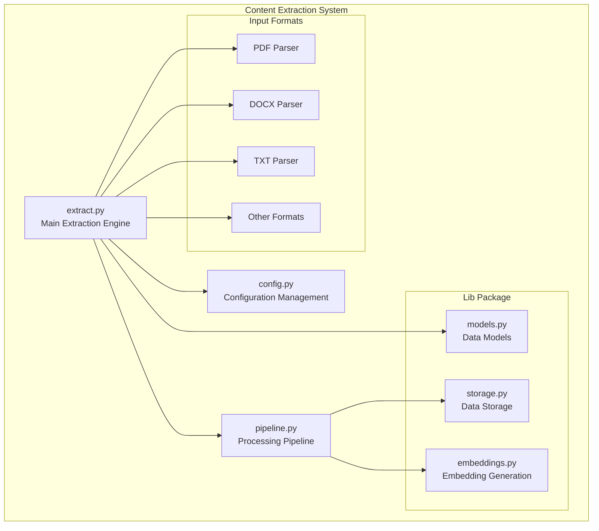
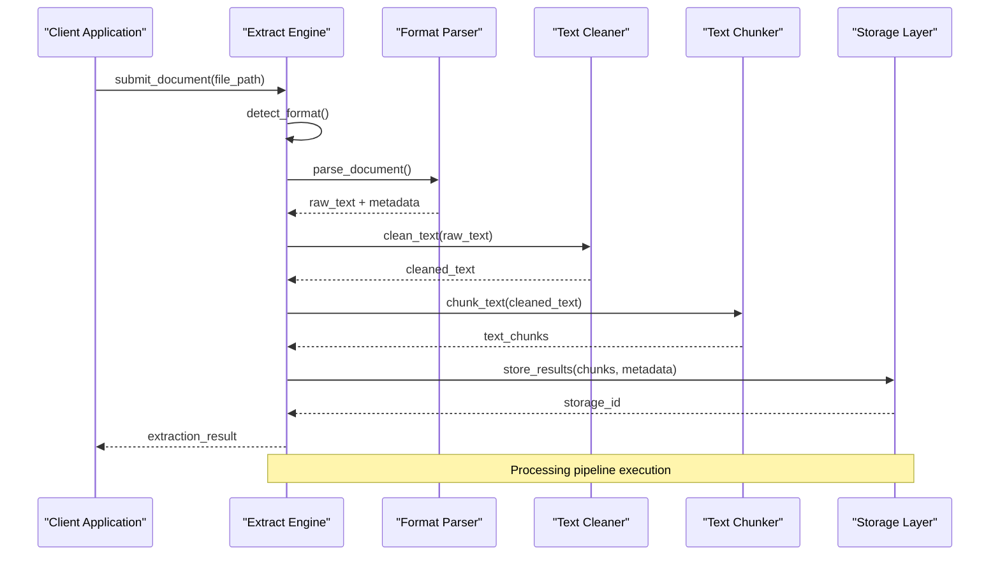
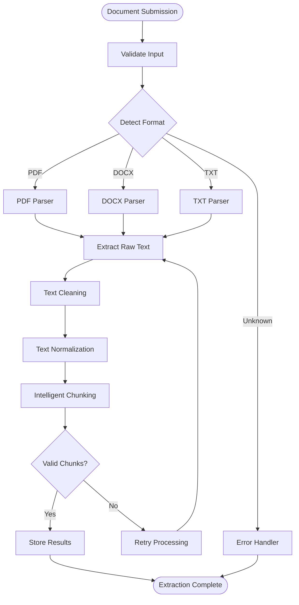
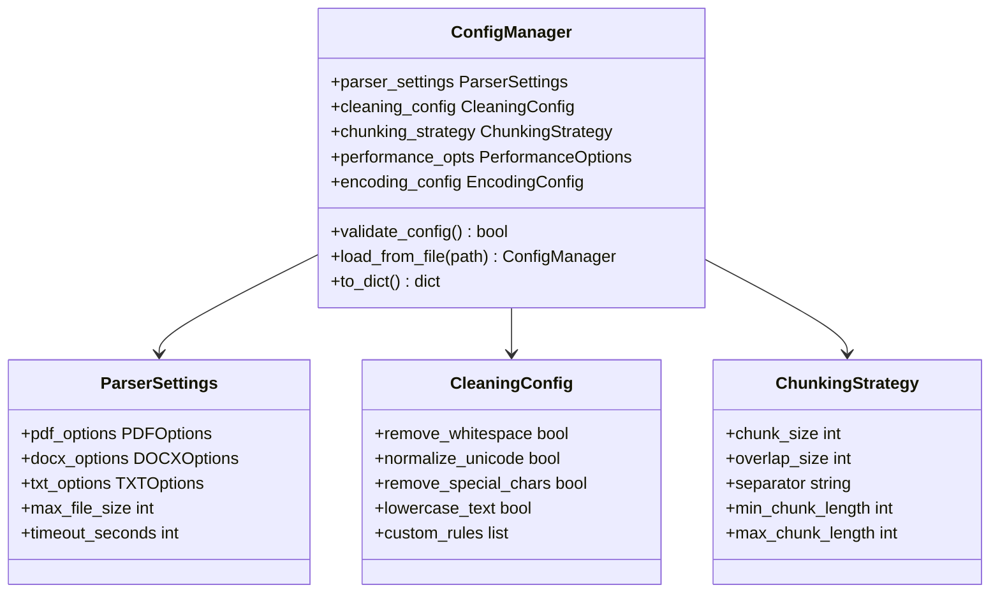

# Content Extraction & Processing

<cite>
**Referenced Files in This Document**
- [extract.py](file://lib/extract.py)
- [config.py](file://config.py)
- [pipeline.py](file://pipeline.py)
- [models.py](file://lib/models.py)
- [storage.py](file://lib/storage.py)
- [embeddings.py](file://lib/embeddings.py)
- [requirements.txt](file://requirements.txt)
</cite>

## Table of Contents
1. [Introduction](#introduction)
2. [Project Structure](#project-structure)
3. [Core Components](#core-components)
4. [Architecture Overview](#architecture-overview)
5. [Detailed Component Analysis](#detailed-component-analysis)
6. [Document Format Support](#document-format-support)
7. [Text Preprocessing Pipeline](#text-preprocessing-pipeline)
8. [Chunking Strategies](#chunking-strategies)
9. [Configuration Options](#configuration-options)
10. [Performance Optimization](#performance-optimization)
11. [Troubleshooting Guide](#troubleshooting-guide)
12. [Conclusion](#conclusion)

## Introduction

The Content Extraction & Processing component is a sophisticated document parsing and text transformation system designed to handle multiple document formats and convert raw content into structured, searchable text. This system supports various input formats including PDF, DOCX, TXT, and other common document types, applying advanced preprocessing techniques and intelligent chunking strategies to optimize downstream processing tasks such as embedding generation and semantic search.

The component follows a modular architecture that separates concerns between format-specific parsers, text cleaning utilities, and chunking algorithms, enabling easy extension for new document formats and processing techniques.

## Project Structure

The content extraction system is organized within a modular Python package structure:



**Diagram sources**
- [extract.py](file://lib/extract.py)
- [config.py](file://config.py)
- [pipeline.py](file://pipeline.py)
- [models.py](file://lib/models.py)
- [storage.py](file://lib/storage.py)
- [embeddings.py](file://lib/embeddings.py)

**Section sources**
- [extract.py](file://lib/extract.py)
- [config.py](file://config.py)
- [pipeline.py](file://pipeline.py)

## Core Components

The content extraction system consists of several core components that work together to process documents efficiently:

### Extract Engine
The main extraction engine handles document ingestion, format detection, and delegates to appropriate parsers based on file type. It manages the overall lifecycle of document processing and coordinates between different processing stages.

### Configuration Manager
Provides centralized configuration management for extraction parameters, encoding settings, cleaning options, and performance tuning parameters.

### Processing Pipeline
Orchestrates the sequential processing steps from raw document ingestion through text cleaning, normalization, and chunking operations.

### Data Models
Defines structured representations for extracted content, metadata, and processing results.

### Storage Layer
Handles persistence of processed content and intermediate results.

### Embedding Generator
Converts processed text chunks into vector embeddings for semantic search capabilities.

**Section sources**
- [extract.py](file://lib/extract.py)
- [config.py](file://config.py)
- [pipeline.py](file://pipeline.py)
- [models.py](file://lib/models.py)

## Architecture Overview

The content extraction system follows a pipeline-based architecture with clear separation of concerns:



**Diagram sources**
- [extract.py](file://lib/extract.py)
- [pipeline.py](file://pipeline.py)
- [storage.py](file://lib/storage.py)

## Detailed Component Analysis

### Extract Engine Analysis

The extract engine serves as the primary interface for document processing, handling format detection and coordinating the extraction workflow.

#### Key Responsibilities:
- File format detection and validation
- Parser selection and delegation
- Error handling and logging
- Progress tracking and callbacks
- Resource management for large files

#### Processing Workflow:


**Diagram sources**
- [extract.py](file://lib/extract.py)
- [pipeline.py](file://pipeline.py)

**Section sources**
- [extract.py](file://lib/extract.py)

### Configuration Management

The configuration system provides flexible parameter management for all aspects of content extraction and processing.

#### Configuration Categories:
- **Parser Settings**: Format-specific parsing options
- **Cleaning Parameters**: Text normalization and cleanup rules
- **Chunking Strategy**: Size, overlap, and boundary detection
- **Performance Tuning**: Memory limits, concurrency, caching
- **Encoding Handling**: Character set detection and conversion

#### Default Configuration Structure:


**Diagram sources**
- [config.py](file://config.py)
- [models.py](file://lib/models.py)

**Section sources**
- [config.py](file://config.py)

## Document Format Support

The system supports multiple document formats through specialized parsers that handle format-specific challenges and optimizations.

### PDF Processing
PDF parsing handles complex layouts, embedded fonts, images, and metadata extraction. The parser uses advanced techniques to maintain document structure while extracting readable text.

#### PDF Features:
- Multi-column layout detection
- Font and encoding handling
- Image and table extraction
- Metadata preservation
- Password-protected document support

### DOCX Processing
Word document processing maintains formatting hierarchy, tables, lists, and embedded objects while converting to clean text format.

#### DOCX Features:
- Heading hierarchy preservation
- Table structure extraction
- List and bullet point handling
- Embedded object references
- Style and formatting metadata

### TXT Processing
Plain text processing includes encoding detection, line ending normalization, and basic text cleanup operations.

#### TXT Features:
- Automatic encoding detection
- Line ending standardization
- Whitespace normalization
- Special character handling

### Other Format Support
Extensible architecture allows adding support for additional formats like RTF, ODT, HTML, and custom formats.

**Section sources**
- [extract.py](file://lib/extract.py)
- [models.py](file://lib/models.py)

## Text Preprocessing Pipeline

The text preprocessing pipeline applies systematic transformations to ensure consistent, high-quality text output suitable for downstream processing.

### Cleaning Operations:
1. **Whitespace Normalization**: Standardizes spacing and removes excessive whitespace
2. **Unicode Normalization**: Ensures consistent character representation
3. **Special Character Removal**: Filters out non-text characters while preserving meaningful symbols
4. **Case Normalization**: Optional lowercase conversion for consistency
5. **Language Detection**: Identifies document language for appropriate processing
6. **Noise Reduction**: Removes headers, footers, page numbers, and other artifacts

### Text Normalization:
- **Sentence Boundary Detection**: Accurate sentence splitting for better chunking
- **Paragraph Reconstruction**: Maintains logical paragraph structure
- **List Item Processing**: Converts structured lists to readable text
- **Table Conversion**: Transforms tabular data to linear text format

### Quality Assurance:
- **Text Validation**: Ensures extracted text meets minimum quality standards
- **Character Encoding Verification**: Validates proper UTF-8 encoding
- **Length Filtering**: Removes excessively short or long segments
- **Duplicate Detection**: Identifies and removes repeated content

**Section sources**
- [pipeline.py](file://pipeline.py)
- [models.py](file://lib/models.py)

## Chunking Strategies

Intelligent chunking algorithms divide processed text into optimal segments for embedding generation and semantic search.

### Chunking Algorithms:

#### Fixed-Size Chunking
Splits text into uniform-sized chunks with configurable overlap for context preservation.

#### Semantic Chunking
Uses natural language processing to identify logical boundaries like sentences, paragraphs, and sections.

#### Hybrid Chunking
Combines multiple strategies to balance context preservation with processing efficiency.

### Chunking Parameters:
- **Chunk Size**: Target size for individual chunks (words, characters, or tokens)
- **Overlap**: Percentage of overlapping content between chunks
- **Boundary Detection**: Intelligent breaking points at logical text boundaries
- **Minimum Length**: Minimum acceptable chunk length to avoid noise
- **Maximum Length**: Maximum chunk size to prevent memory issues

### Chunk Metadata:
Each chunk includes metadata for context preservation and retrieval optimization:
- Original position and source document reference
- Chunk type and confidence score
- Language and encoding information
- Processing timestamp and version

**Section sources**
- [pipeline.py](file://pipeline.py)
- [models.py](file://lib/models.py)

## Configuration Options

Comprehensive configuration system allows fine-tuning of all aspects of content extraction and processing.

### Parser Configuration:
```yaml
parsers:
  pdf:
    max_pages: 1000
    extract_images: false
    extract_tables: true
    font_cache_size: 100
  docx:
    extract_comments: false
    extract_footnotes: true
    preserve_formatting: false
  txt:
    encoding_detection: true
    fallback_encoding: utf-8
```

### Cleaning Configuration:
```yaml
cleaning:
  remove_whitespace: true
  normalize_unicode: true
  remove_special_chars: false
  lowercase_text: false
  custom_replacements:
    - pattern: "\\s+"
      replacement: " "
    - pattern: "[^\\w\\s]"
      replacement: ""
```

### Chunking Configuration:
```yaml
chunking:
  strategy: hybrid
  chunk_size: 500
  overlap: 0.1
  min_length: 50
  max_length: 1000
  separator: "\n\n"
```

### Performance Configuration:
```yaml
performance:
  max_memory_mb: 512
  timeout_seconds: 300
  retry_attempts: 3
  cache_enabled: true
  cache_size: 1000
```

**Section sources**
- [config.py](file://config.py)

## Performance Optimization

The system implements several optimization strategies to handle large documents and high-volume processing efficiently.

### Memory Management:
- **Streaming Processing**: Processes documents in chunks to minimize memory usage
- **Lazy Loading**: Defers expensive operations until needed
- **Resource Cleanup**: Automatic cleanup of temporary files and memory
- **Garbage Collection**: Optimized garbage collection triggers

### Caching Strategies:
- **Parser Cache**: Reuses parsed document structures
- **Text Cache**: Stores cleaned text to avoid reprocessing
- **Embedding Cache**: Caches generated embeddings for reuse
- **Metadata Cache**: Persists document metadata across sessions

### Concurrency Control:
- **Parallel Processing**: Concurrent processing of independent documents
- **Batch Processing**: Efficient batch operations for multiple files
- **Queue Management**: Prioritized processing queue for resource allocation
- **Throttling**: Rate limiting to prevent system overload

### Scaling Considerations:
- **Horizontal Scaling**: Support for distributed processing across multiple nodes
- **Vertical Scaling**: Optimized single-node performance for large documents
- **Cloud Integration**: Cloud-native deployment patterns
- **Monitoring**: Comprehensive performance metrics and alerting

**Section sources**
- [pipeline.py](file://pipeline.py)
- [storage.py](file://lib/storage.py)

## Troubleshooting Guide

Common issues and their solutions when working with the content extraction system.

### Common Issues:

#### Memory Errors
**Problem**: Out of memory errors when processing large documents
**Solution**: 
- Reduce chunk size and increase overlap
- Enable streaming mode for large files
- Increase system memory limits
- Use pagination for very large documents

#### Encoding Problems
**Problem**: Garbled text or character encoding errors
**Solution**:
- Configure automatic encoding detection
- Set appropriate fallback encodings
- Verify source document encoding
- Use Unicode normalization

#### Performance Issues
**Problem**: Slow processing times or system slowdown
**Solution**:
- Enable caching mechanisms
- Optimize chunking parameters
- Use parallel processing where possible
- Monitor system resources

#### Format-Specific Issues
**Problem**: Incomplete or incorrect extraction from specific formats
**Solution**:
- Update parser libraries to latest versions
- Configure format-specific options
- Check for password protection or encryption
- Verify document integrity

### Debugging Techniques:
- Enable detailed logging for extraction processes
- Use validation tools to check extracted content quality
- Implement progress tracking for long-running operations
- Monitor system resource usage during processing

**Section sources**
- [extract.py](file://lib/extract.py)
- [pipeline.py](file://pipeline.py)

## Conclusion

The Content Extraction & Processing component provides a robust, scalable solution for transforming diverse document formats into structured, searchable text. Through its modular architecture, comprehensive format support, intelligent preprocessing, and optimized chunking strategies, it enables efficient content processing for applications requiring semantic search, document analysis, and knowledge base construction.

The system's flexibility in configuration allows adaptation to specific use cases while maintaining high performance and reliability. With comprehensive error handling, monitoring capabilities, and extensibility for new formats and processing techniques, it serves as a solid foundation for content-driven applications.

Future enhancements could include improved AI-powered content understanding, enhanced metadata extraction, and integration with additional document formats and cloud storage services.