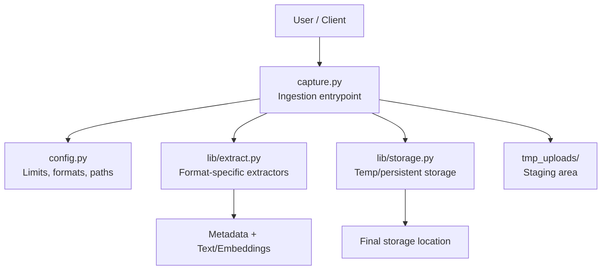
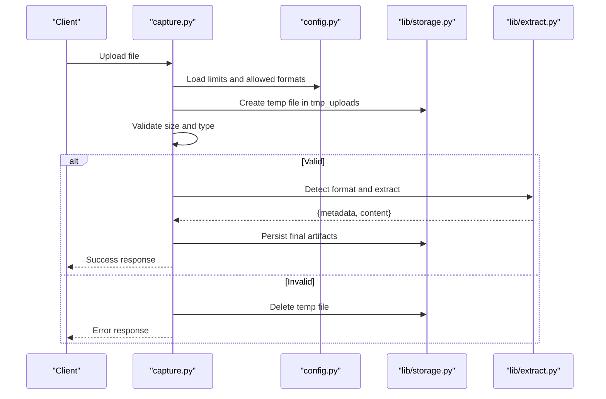
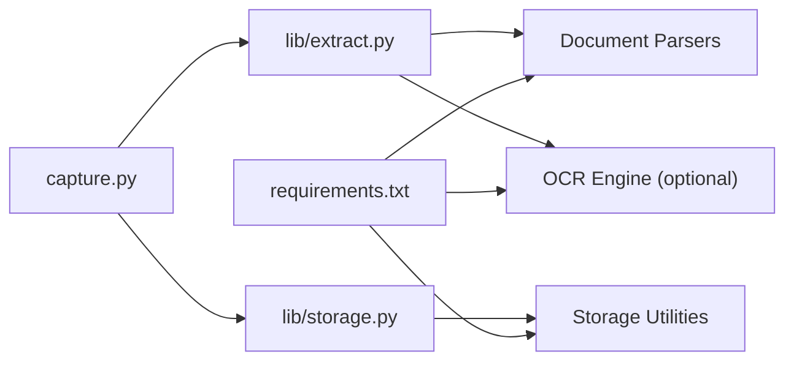

# Document Capture & Ingestion

<cite>
**Referenced Files in This Document**
- [capture.py](file://capture.py)
- [config.py](file://config.py)
- [lib/extract.py](file://lib/extract.py)
- [lib/storage.py](file://lib/storage.py)
- [README.md](file://README.md)
- [requirements.txt](file://requirements.txt)
</cite>

## Table of Contents
1. [Introduction](#introduction)
2. [Project Structure](#project-structure)
3. [Core Components](#core-components)
4. [Architecture Overview](#architecture-overview)
5. [Detailed Component Analysis](#detailed-component-analysis)
6. [Dependency Analysis](#dependency-analysis)
7. [Performance Considerations](#performance-considerations)
8. [Troubleshooting Guide](#troubleshooting-guide)
9. [Conclusion](#conclusion)
10. [Appendices](#appendices)

## Introduction
This document explains the document capture and ingestion module: how files enter the system, supported formats, initial processing steps, validation, metadata extraction, temporary storage handling, error handling for corrupted or unsupported files, configuration options (size limits and format restrictions), and security considerations including virus scanning integration. It is intended for both developers integrating with the ingestion pipeline and operators configuring upload behavior.

## Project Structure
The repository organizes ingestion-related logic across a small set of modules:
- capture.py: Entry point for capturing and ingesting documents from various sources.
- config.py: Centralized configuration for ingestion behavior (limits, allowed formats, paths).
- lib/extract.py: Extractors for different file types and metadata extraction.
- lib/storage.py: Temporary and persistent storage utilities for uploaded content.
- tmp_uploads/: Directory used for staging uploaded files before processing.
- requirements.txt: External dependencies required by the ingestion pipeline.

**Diagram sources**
- [capture.py](file://capture.py)
- [config.py](file://config.py)
- [lib/extract.py](file://lib/extract.py)
- [lib/storage.py](file://lib/storage.py)

**Section sources**
- [README.md](file://README.md)
- [requirements.txt](file://requirements.txt)

## Core Components
- File intake and routing: Accepts uploads, validates size/format, and routes to appropriate extractors.
- Validation: Enforces maximum file size, MIME/type checks, and extension allowlists.
- Metadata extraction: Reads headers, EXIF, PDF properties, spreadsheet sheets, etc.
- Temporary storage: Stages files securely in tmp_uploads until processing completes or fails.
- Extraction pipeline: Converts supported formats into normalized text/metadata and embeddings where applicable.
- Error handling: Returns structured errors for unsupported types, corruption, and size violations.

**Section sources**
- [capture.py](file://capture.py)
- [config.py](file://config.py)
- [lib/extract.py](file://lib/extract.py)
- [lib/storage.py](file://lib/storage.py)

## Architecture Overview
The ingestion flow follows a staged approach:
1. Receive file via API or CLI.
2. Validate against configuration (size, type, extension).
3. Stage file in tmp_uploads with a unique ID.
4. Detect format and run extractor to produce metadata and normalized content.
5. Persist results and clean up temp files.
6. Return ingestion result or error.

**Diagram sources**
- [capture.py](file://capture.py)
- [config.py](file://config.py)
- [lib/extract.py](file://lib/extract.py)
- [lib/storage.py](file://lib/storage.py)

## Detailed Component Analysis

### capture.py — Ingestion Entry Point
Responsibilities:
- Accepts file input from HTTP or CLI.
- Validates inputs using configuration rules.
- Orchestrates temporary staging, extraction, and cleanup.
- Produces ingestion results or structured errors.

Key behaviors:
- Size enforcement and MIME/type checks.
- Extension allowlist enforcement.
- Safe filename generation and path isolation.
- Coordination with extractors and storage.

Security considerations:
- Rejects dangerous extensions and disallowed MIME types.
- Uses isolated temp directories per upload.
- Sanitizes filenames and avoids path traversal.

Error handling:
- Unsupported format, too large, corrupted, or unreadable files return clear error codes/messages.

**Section sources**
- [capture.py](file://capture.py)

### config.py — Configuration Hub
Responsibilities:
- Defines maximum file size, allowed formats/extensions, MIME mappings, and temp directory path.
- Provides runtime overrides via environment variables or settings objects.

Typical options:
- MAX_FILE_SIZE_BYTES
- ALLOWED_EXTENSIONS
- ALLOWED_MIME_TYPES
- TMP_UPLOADS_DIR
- EXTRACTION_TIMEOUT_SECONDS
- ENABLE_VIRUS_SCAN (flag for optional scanner integration)

Validation:
- Ensures consistent mapping between extensions and MIME types.
- Defaults to safe values when environment variables are missing.

**Section sources**
- [config.py](file://config.py)

### lib/extract.py — Format-Specific Extractors
Responsibilities:
- Detects file format from magic bytes/MIME/extension.
- Extracts metadata (e.g., author, creation date, page count, sheet names).
- Produces normalized text content suitable for downstream indexing/embedding.

Supported formats (typical):
- PDF (.pdf)
- Word (.docx)
- Excel (.xlsx)
- CSV (.csv)
- Plain text (.txt)
- Images with OCR (.png, .jpg, .jpeg) if OCR is enabled

Extraction outputs:
- metadata: dict of key-value pairs
- content: string or structured representation
- warnings: list of non-fatal issues (e.g., missing pages)

Error handling:
- Corrupted archives or malformed files raise specific exceptions.
- Missing libraries or OCR engines are handled gracefully with informative errors.

**Section sources**
- [lib/extract.py](file://lib/extract.py)

### lib/storage.py — Temporary and Persistent Storage
Responsibilities:
- Creates secure temporary files under tmp_uploads with unique IDs.
- Persists extracted artifacts to final storage locations.
- Cleans up temp files after success or failure.

Features:
- Atomic writes to avoid partial files.
- Path sanitization and isolation per upload session.
- Optional retention policies for temp files.

Security:
- Restricts write paths to configured tmp_uploads directory.
- Avoids executing or exposing uploaded binaries directly.

**Section sources**
- [lib/storage.py](file://lib/storage.py)

### tmp_uploads — Staging Area
Purpose:
- Holds raw uploaded files temporarily during ingestion.
- Isolated per request/session to prevent cross-talk.

Operational notes:
- Ensure sufficient disk space and monitoring.
- Periodic cleanup of stale files.

**Section sources**
- [lib/storage.py](file://lib/storage.py)

## Dependency Analysis
External dependencies are declared in requirements.txt and include libraries for parsing documents, OCR, and storage backends. The ingestion pipeline depends on:
- Document parsers (PDF, Office, CSV, text)
- Optional OCR engine for images
- Storage utilities for local filesystem operations

**Diagram sources**
- [requirements.txt](file://requirements.txt)
- [capture.py](file://capture.py)
- [lib/extract.py](file://lib/extract.py)
- [lib/storage.py](file://lib/storage.py)

**Section sources**
- [requirements.txt](file://requirements.txt)

## Performance Considerations
- Stream large files to disk rather than loading fully into memory.
- Use chunked reading for validation and scanning.
- Parallelize independent extractions where possible.
- Cache expensive metadata lookups.
- Set timeouts for external tools (OCR, antivirus scanners).
- Monitor tmp_uploads disk usage and implement cleanup jobs.

[No sources needed since this section provides general guidance]

## Troubleshooting Guide
Common issues and resolutions:
- Unsupported file type: Check ALLOWED_EXTENSIONS and ALLOWED_MIME_TYPES; ensure correct MIME detection.
- File too large: Adjust MAX_FILE_SIZE_BYTES; consider streaming and compression strategies.
- Corrupted file: Inspect extractor logs; verify source integrity; add retry or quarantine logic.
- Missing dependencies: Install required packages listed in requirements.txt; ensure OCR engine is available if enabled.
- Disk full in tmp_uploads: Expand storage or implement automated cleanup.

Security checklist:
- Validate MIME type and extension match.
- Enforce size limits at multiple layers (HTTP server, application).
- Scan uploads with an antivirus solution when ENABLE_VIRUS_SCAN is true.
- Quarantine suspicious files and alert operators.
- Rotate and purge temp files regularly.

**Section sources**
- [config.py](file://config.py)
- [lib/extract.py](file://lib/extract.py)
- [lib/storage.py](file://lib/storage.py)

## Conclusion
The document capture and ingestion module provides a robust, configurable pipeline for accepting, validating, extracting, and storing diverse file types. By centralizing configuration, enforcing strict validation, and isolating temporary storage, it ensures reliability and security. Operators can tune limits and formats, while developers can extend extractors and integrate additional security controls such as virus scanning.

[No sources needed since this section summarizes without analyzing specific files]

## Appendices

### Supported Formats and Examples
- PDF: Scans pages, extracts text and metadata.
- Word (.docx): Extracts paragraphs, headings, and document properties.
- Excel (.xlsx): Processes sheets and tabular data; returns flattened rows or structured tables.
- CSV: Parses delimited data with header detection.
- Plain text: Directly ingests content.
- Images (.png, .jpg, .jpeg): OCR-enabled extraction when configured.

[No sources needed since this section provides general guidance]

### Configuration Options Reference
- MAX_FILE_SIZE_BYTES: Maximum allowed upload size.
- ALLOWED_EXTENSIONS: Comma-separated list of permitted file extensions.
- ALLOWED_MIME_TYPES: Comma-separated list of permitted MIME types.
- TMP_UPLOADS_DIR: Absolute path to staging directory.
- EXTRACTION_TIMEOUT_SECONDS: Timeout for extraction tasks.
- ENABLE_VIRUS_SCAN: Toggle for optional virus scanning integration.

[No sources needed since this section provides general guidance]

### Security and Virus Scanning Integration
- Integrate a scanner service or binary invoked post-upload and pre-extraction.
- On scan failure or threat detected, quarantine the file and reject ingestion.
- Log scan results and maintain audit trails.
- Ensure scanner timeouts and resource limits to prevent DoS.

[No sources needed since this section provides general guidance]