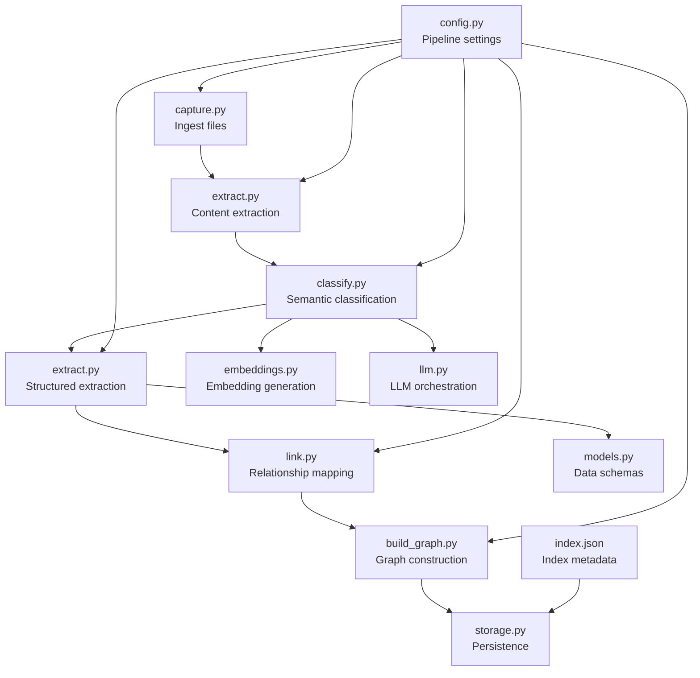
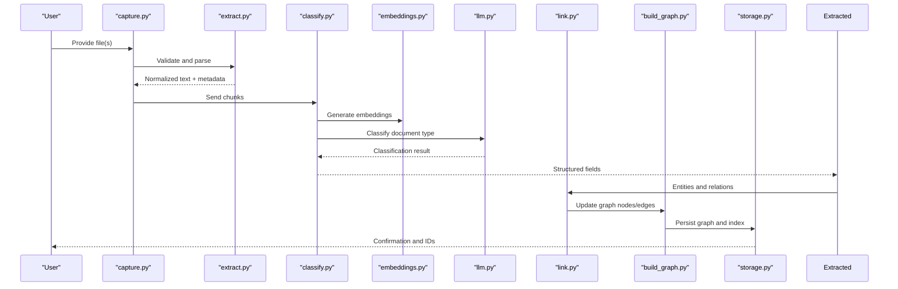
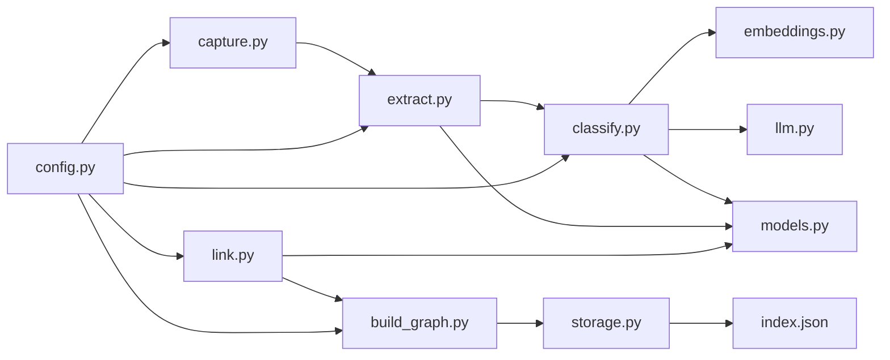

# Document Processing Pipeline

<cite>
**Referenced Files in This Document**
- [README.md](file://README.md)
- [pipeline.py](file://pipeline.py)
- [capture.py](file://capture.py)
- [classify.py](file://classify.py)
- [extract.py](file://lib/extract.py)
- [link.py](file://link.py)
- [build_graph.py](file://build_graph.py)
- [config.py](file://config.py)
- [storage.py](file://lib/storage.py)
- [embeddings.py](file://lib/embeddings.py)
- [llm.py](file://lib/llm.py)
- [models.py](file://lib/models.py)
- [index.json](file://data/index.json)
</cite>

## Table of Contents
1. [Introduction](#introduction)
2. [Project Structure](#project-structure)
3. [Core Components](#core-components)
4. [Architecture Overview](#architecture-overview)
5. [Detailed Component Analysis](#detailed-component-analysis)
6. [Dependency Analysis](#dependency-analysis)
7. [Performance Considerations](#performance-considerations)
8. [Troubleshooting Guide](#troubleshooting-guide)
9. [Conclusion](#conclusion)
10. [Appendices](#appendices)

## Introduction
This document explains the end-to-end document processing pipeline that ingests files, extracts content, classifies documents, extracts structured information, and links entities into a knowledge graph. It covers configuration options, error handling strategies, performance tuning parameters, and integration with the storage system to produce structured data for downstream consumption.

## Project Structure
The repository implements a modular pipeline with clear separation of concerns:
- Ingestion and capture utilities
- Content extraction from various file types
- Semantic classification using LLMs and embeddings
- Structured extraction and relationship mapping
- Graph construction and persistence
- Configuration and models for consistent behavior

**Diagram sources**
- [capture.py](file://capture.py)
- [extract.py](file://lib/extract.py)
- [classify.py](file://classify.py)
- [link.py](file://link.py)
- [build_graph.py](file://build_graph.py)
- [storage.py](file://lib/storage.py)
- [embeddings.py](file://lib/embeddings.py)
- [llm.py](file://lib/llm.py)
- [models.py](file://lib/models.py)
- [config.py](file://config.py)
- [index.json](file://data/index.json)

**Section sources**
- [README.md](file://README.md)
- [pipeline.py](file://pipeline.py)
- [config.py](file://config.py)

## Core Components
- Capture: Accepts local files or streams and validates inputs before ingestion.
- Extract: Parses different formats (text, PDFs, markdown, code) into normalized text and metadata.
- Classify: Determines document type and domain using LLM prompts and embeddings.
- Extract (structured): Pulls entities, attributes, and relationships based on schema.
- Link: Maps extracted entities to existing nodes and resolves conflicts.
- Build Graph: Assembles edges and updates the knowledge graph structure.
- Storage: Persists documents, embeddings, and graph structures; maintains index metadata.
- Config: Centralizes pipeline settings such as chunk sizes, model selection, and thresholds.
- Models: Defines typed schemas for documents, entities, and relationships.

**Section sources**
- [capture.py](file://capture.py)
- [extract.py](file://lib/extract.py)
- [classify.py](file://classify.py)
- [link.py](file://link.py)
- [build_graph.py](file://build_graph.py)
- [storage.py](file://lib/storage.py)
- [config.py](file://config.py)
- [models.py](file://lib/models.py)

## Architecture Overview
The pipeline follows a staged workflow:
1. File ingestion and validation
2. Content normalization and chunking
3. Semantic classification and embedding generation
4. Structured extraction via LLM prompts
5. Relationship mapping and entity linking
6. Graph assembly and persistence
7. Index update for retrieval

**Diagram sources**
- [capture.py](file://capture.py)
- [extract.py](file://lib/extract.py)
- [classify.py](file://classify.py)
- [embeddings.py](file://lib/embeddings.py)
- [llm.py](file://lib/llm.py)
- [link.py](file://link.py)
- [build_graph.py](file://build_graph.py)
- [storage.py](file://lib/storage.py)

## Detailed Component Analysis

### Stage 1: File Ingestion and Validation
- Responsibilities:
  - Accept input files and verify format support
  - Normalize paths and handle temporary uploads
  - Emit ingestion events and track progress
- Configuration:
  - Supported MIME types and extensions
  - Max file size limits
  - Temporary directory path
- Error Handling:
  - Reject unsupported formats with descriptive errors
  - Retry on transient I/O failures
  - Log ingestion failures with file identifiers

**Section sources**
- [capture.py](file://capture.py)
- [config.py](file://config.py)

### Stage 2: Content Extraction
- Responsibilities:
  - Parse text, markdown, code, and binary formats
  - Clean and normalize content (whitespace, encoding)
  - Chunk large documents while preserving context
- Configuration:
  - Chunk size and overlap
  - Encoding fallbacks
  - Parser-specific options per format
- Error Handling:
  - Graceful degradation when parsers fail
  - Partial extraction with warnings
  - Preserve original bytes for reprocessing

**Section sources**
- [extract.py](file://lib/extract.py)
- [config.py](file://config.py)

### Stage 3: Semantic Classification
- Responsibilities:
  - Determine document category and domain
  - Generate embeddings for similarity search
  - Apply confidence thresholds and fallback rules
- Configuration:
  - Model selection and temperature
  - Embedding dimensions and provider
  - Thresholds for classification confidence
- Error Handling:
  - Fallback to rule-based classification if LLM fails
  - Retries with backoff for API errors
  - Record classification uncertainty

**Section sources**
- [classify.py](file://classify.py)
- [embeddings.py](file://lib/embeddings.py)
- [llm.py](file://lib/llm.py)
- [config.py](file://config.py)

### Stage 4: Structured Extraction
- Responsibilities:
  - Extract entities, attributes, and relationships based on schema
  - Enforce data types and constraints
  - Produce normalized JSON-like structures
- Configuration:
  - Schema definitions and field mappings
  - Prompt templates and extraction strategies
  - Validation strictness levels
- Error Handling:
  - Coerce invalid values with defaults
  - Flag missing required fields
  - Maintain extraction provenance

**Section sources**
- [extract.py](file://lib/extract.py)
- [models.py](file://lib/models.py)
- [config.py](file://config.py)

### Stage 5: Relationship Mapping and Entity Linking
- Responsibilities:
  - Map extracted entities to existing nodes
  - Resolve duplicates and merge attributes
  - Create edges representing relationships
- Configuration:
  - Similarity thresholds for entity matching
  - Merge policies and conflict resolution
  - Edge type definitions
- Error Handling:
  - Handle ambiguous matches with human-in-the-loop flags
  - Log unresolved references
  - Rollback partial link operations

**Section sources**
- [link.py](file://link.py)
- [config.py](file://config.py)

### Stage 6: Graph Construction and Persistence
- Responsibilities:
  - Assemble nodes and edges into a graph structure
  - Persist graph components and metadata
  - Update index for efficient retrieval
- Configuration:
  - Storage backend settings
  - Indexing strategy and refresh policy
  - Batch sizes for writes
- Error Handling:
  - Transactional writes where supported
  - Retry failed writes with exponential backoff
  - Integrity checks post-persist

**Section sources**
- [build_graph.py](file://build_graph.py)
- [storage.py](file://lib/storage.py)
- [index.json](file://data/index.json)
- [config.py](file://config.py)

### End-to-End Orchestration
- Responsibilities:
  - Coordinate stages with configurable pipelines
  - Manage state and intermediate artifacts
  - Expose hooks for monitoring and metrics
- Configuration:
  - Pipeline stages order and branching
  - Parallelism and concurrency limits
  - Checkpointing and resume behavior
- Error Handling:
  - Stage-level retries and compensations
  - Aggregated error reporting
  - Audit logs for each stage

**Section sources**
- [pipeline.py](file://pipeline.py)
- [config.py](file://config.py)

## Dependency Analysis
The pipeline modules depend on shared libraries for LLM calls, embeddings, and storage. The following diagram shows key dependencies:

**Diagram sources**
- [capture.py](file://capture.py)
- [extract.py](file://lib/extract.py)
- [classify.py](file://classify.py)
- [embeddings.py](file://lib/embeddings.py)
- [llm.py](file://lib/llm.py)
- [models.py](file://lib/models.py)
- [link.py](file://link.py)
- [build_graph.py](file://build_graph.py)
- [storage.py](file://lib/storage.py)
- [index.json](file://data/index.json)
- [config.py](file://config.py)

**Section sources**
- [pipeline.py](file://pipeline.py)
- [config.py](file://config.py)

## Performance Considerations
- Chunking Strategy:
  - Tune chunk size and overlap to balance accuracy and throughput
  - Use adaptive chunking for dense vs sparse content
- Concurrency:
  - Parallelize extraction and embedding generation within safe limits
  - Backpressure to avoid overwhelming LLM providers
- Caching:
  - Cache embeddings and classification results by content hash
  - Deduplicate identical chunks across documents
- Storage Optimization:
  - Batch writes and use upserts to reduce overhead
  - Compress large payloads where appropriate
- Monitoring:
  - Track latency and error rates per stage
  - Alert on threshold breaches

[No sources needed since this section provides general guidance]

## Troubleshooting Guide
Common issues and resolutions:
- Ingestion Failures:
  - Verify file permissions and supported formats
  - Check temporary directory space and cleanup policies
- Extraction Errors:
  - Inspect parser logs and fallback behaviors
  - Re-run with verbose mode to identify problematic sections
- Classification Instability:
  - Adjust confidence thresholds and model parameters
  - Review prompt templates and few-shot examples
- Linking Ambiguities:
  - Lower similarity thresholds or require explicit confirmation
  - Review merge policies and conflict resolution rules
- Storage Issues:
  - Validate connection settings and credentials
  - Ensure index consistency after batch operations

**Section sources**
- [capture.py](file://capture.py)
- [extract.py](file://lib/extract.py)
- [classify.py](file://classify.py)
- [link.py](file://link.py)
- [storage.py](file://lib/storage.py)
- [config.py](file://config.py)

## Conclusion
The document processing pipeline integrates ingestion, extraction, classification, structured extraction, linking, and graph construction into a cohesive workflow. With robust configuration, error handling, and performance tuning, it produces reliable structured data and a navigable knowledge graph for downstream applications.

[No sources needed since this section summarizes without analyzing specific files]

## Appendices

### Configuration Reference
- Ingestion:
  - Supported formats, max file size, temp directory
- Extraction:
  - Chunk size, overlap, encoding fallbacks, parser options
- Classification:
  - Model selection, temperature, embedding provider, confidence thresholds
- Extraction (structured):
  - Schema definitions, prompt templates, validation strictness
- Linking:
  - Similarity thresholds, merge policies, edge types
- Graph and Storage:
  - Backend settings, indexing strategy, batch sizes, integrity checks
- Pipeline Orchestration:
  - Stage order, parallelism, checkpointing, resume behavior

**Section sources**
- [config.py](file://config.py)

### Data Models Reference
- Document:
  - Fields for title, content, metadata, timestamps
- Entity:
  - Type, attributes, provenance, confidence scores
- Relationship:
  - Source/target IDs, relation type, strength, evidence

**Section sources**
- [models.py](file://lib/models.py)