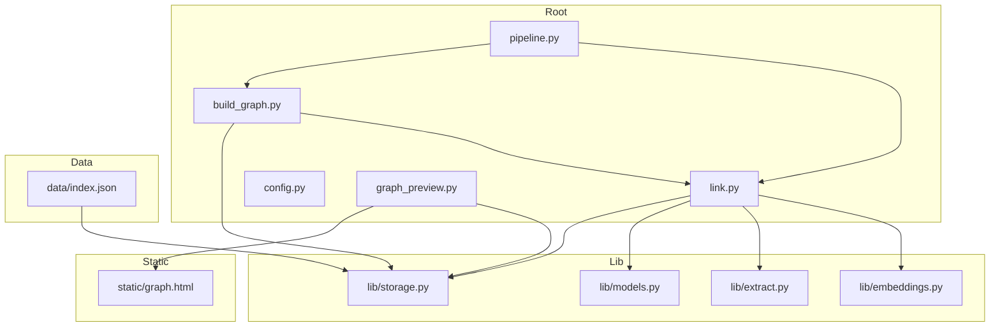
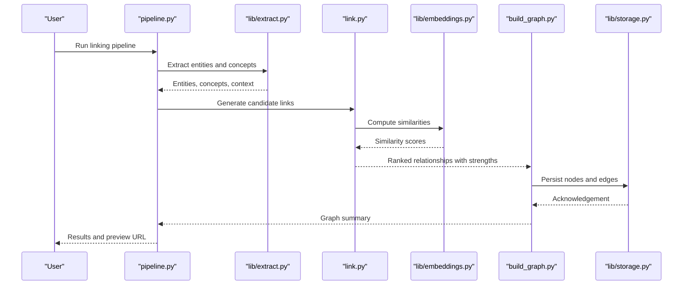
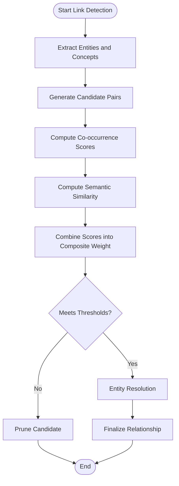
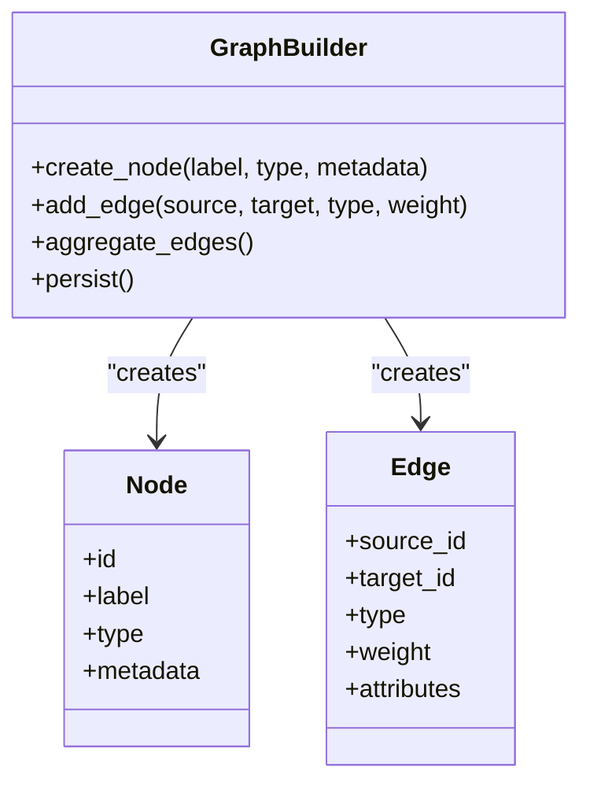
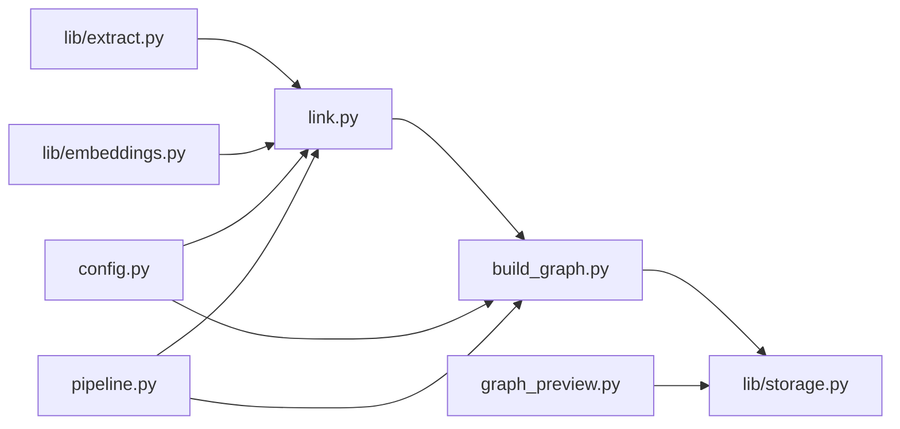

# Relationship Mapping & Linking

<cite>
**Referenced Files in This Document**
- [link.py](file://link.py)
- [build_graph.py](file://build_graph.py)
- [config.py](file://config.py)
- [embeddings.py](file://lib/embeddings.py)
- [extract.py](file://lib/extract.py)
- [models.py](file://lib/models.py)
- [storage.py](file://lib/storage.py)
- [pipeline.py](file://pipeline.py)
- [graph_preview.py](file://graph_preview.py)
- [static/graph.html](file://static/graph.html)
- [data/index.json](file://data/index.json)
</cite>

## Table of Contents
1. [Introduction](#introduction)
2. [Project Structure](#project-structure)
3. [Core Components](#core-components)
4. [Architecture Overview](#architecture-overview)
5. [Detailed Component Analysis](#detailed-component-analysis)
6. [Dependency Analysis](#dependency-analysis)
7. [Performance Considerations](#performance-considerations)
8. [Troubleshooting Guide](#troubleshooting-guide)
9. [Conclusion](#conclusion)
10. [Appendices](#appendices)

## Introduction
This document explains the relationship mapping and linking component that identifies connections between documents, entities, and concepts to build a knowledge graph. It covers how links are detected, how graphs are constructed, how relationship strength is calculated, configuration options for sensitivity and filtering, performance considerations for large-scale operations, and conflict resolution strategies. The goal is to make the system’s behavior transparent and actionable for both technical and non-technical readers.

## Project Structure
The repository implements a modular pipeline:
- Extraction and embedding utilities under lib/
- Graph construction and linking logic at the root
- Configuration and storage abstractions
- Visualization and preview tools
- Data artifacts for indexing and persistence

**Diagram sources**
- [link.py](file://link.py)
- [build_graph.py](file://build_graph.py)
- [config.py](file://config.py)
- [pipeline.py](file://pipeline.py)
- [graph_preview.py](file://graph_preview.py)
- [lib/embeddings.py](file://lib/embeddings.py)
- [lib/extract.py](file://lib/extract.py)
- [lib/models.py](file://lib/models.py)
- [lib/storage.py](file://lib/storage.py)
- [data/index.json](file://data/index.json)
- [static/graph.html](file://static/graph.html)

**Section sources**
- [link.py](file://link.py)
- [build_graph.py](file://build_graph.py)
- [config.py](file://config.py)
- [pipeline.py](file://pipeline.py)
- [graph_preview.py](file://graph_preview.py)
- [lib/embeddings.py](file://lib/embeddings.py)
- [lib/extract.py](file://lib/extract.py)
- [lib/models.py](file://lib/models.py)
- [lib/storage.py](file://lib/storage.py)
- [data/index.json](file://data/index.json)
- [static/graph.html](file://static/graph.html)

## Core Components
- Link detection engine: Identifies candidate relationships by analyzing extracted text, entity mentions, and semantic similarity.
- Graph builder: Assembles nodes (documents, entities, concepts) and edges (relationships), computes edge weights, and persists the graph.
- Embedding service: Produces vector representations used for semantic matching and clustering.
- Storage layer: Persists nodes, edges, and metadata; supports querying and updates.
- Configuration: Controls sensitivity thresholds, entity resolution rules, and relationship filters.
- Pipeline orchestrator: Coordinates extraction, linking, graph building, and preview steps.

Key responsibilities:
- Candidate generation from co-occurrence and semantic signals
- Strength calculation via similarity metrics and contextual features
- Conflict detection and resolution across overlapping or contradictory links
- Filtering and pruning based on thresholds and policies

**Section sources**
- [link.py](file://link.py)
- [build_graph.py](file://build_graph.py)
- [lib/embeddings.py](file://lib/embeddings.py)
- [lib/extract.py](file://lib/extract.py)
- [lib/models.py](file://lib/models.py)
- [lib/storage.py](file://lib/storage.py)
- [config.py](file://config.py)
- [pipeline.py](file://pipeline.py)

## Architecture Overview
The linking subsystem integrates with extraction and storage to produce a navigable knowledge graph.

**Diagram sources**
- [pipeline.py](file://pipeline.py)
- [lib/extract.py](file://lib/extract.py)
- [link.py](file://link.py)
- [lib/embeddings.py](file://lib/embeddings.py)
- [build_graph.py](file://build_graph.py)
- [lib/storage.py](file://lib/storage.py)

## Detailed Component Analysis

### Link Detection Engine
Responsibilities:
- Candidate generation using co-occurrence windows, named entity mentions, and semantic similarity
- Scoring and ranking of potential relationships
- Filtering by type, domain, and confidence thresholds
- Integration with entity resolution to avoid duplicates

Algorithm highlights:
- Co-occurrence scoring based on proximity within extracted segments
- Semantic similarity computed via embeddings
- Contextual weighting from surrounding terms and metadata
- Threshold-based pruning to control precision/recall trade-offs

Configuration options:
- Sensitivity thresholds for similarity and co-occurrence
- Entity resolution rules (e.g., normalization, alias handling)
- Relationship type filters and allowed categories
- Minimum support counts and maximum edges per node

**Diagram sources**
- [link.py](file://link.py)
- [lib/extract.py](file://lib/extract.py)
- [lib/embeddings.py](file://lib/embeddings.py)

**Section sources**
- [link.py](file://link.py)
- [lib/extract.py](file://lib/extract.py)
- [lib/embeddings.py](file://lib/embeddings.py)

### Graph Construction Methods
Responsibilities:
- Node creation for documents, entities, and concepts
- Edge creation with types and weights
- Aggregation and deduplication of relationships
- Persistence to storage backend

Construction patterns:
- Incremental updates when new content arrives
- Batch processing for large datasets
- Versioned snapshots for auditability

Strength calculation:
- Composite score combining similarity, co-occurrence frequency, and contextual relevance
- Decay functions for temporal or recency effects
- Normalization to maintain consistent scales across runs

**Diagram sources**
- [build_graph.py](file://build_graph.py)
- [lib/models.py](file://lib/models.py)
- [lib/storage.py](file://lib/storage.py)

**Section sources**
- [build_graph.py](file://build_graph.py)
- [lib/models.py](file://lib/models.py)
- [lib/storage.py](file://lib/storage.py)

### Relationship Strength Calculation
Approach:
- Normalize individual signals (semantic similarity, co-occurrence count, contextual cues)
- Apply configurable weights to combine into a composite strength
- Enforce minimum thresholds to filter weak links
- Optionally adjust weights based on domain-specific heuristics

Example outputs:
- Strong semantic match with high co-occurrence yields high strength
- Weak semantic match but frequent co-occurrence yields moderate strength
- Low co-occurrence and low similarity pruned by threshold

**Section sources**
- [link.py](file://link.py)
- [build_graph.py](file://build_graph.py)

### Integration with Knowledge Graph
- Nodes represent documents, entities, and concepts
- Edges represent typed relationships with weights
- Indexing supports fast traversal and query
- Preview tool visualizes connectivity and highlights strong links

Visualization:
- Interactive graph rendered via static/graph.html
- Filters by relationship type and strength
- Drill-down into source contexts

**Section sources**
- [graph_preview.py](file://graph_preview.py)
- [static/graph.html](file://static/graph.html)
- [data/index.json](file://data/index.json)

## Dependency Analysis
The linking subsystem depends on extraction, embeddings, and storage modules. The graph builder coordinates these components to produce a persistent knowledge graph.

**Diagram sources**
- [lib/extract.py](file://lib/extract.py)
- [lib/embeddings.py](file://lib/embeddings.py)
- [link.py](file://link.py)
- [build_graph.py](file://build_graph.py)
- [lib/storage.py](file://lib/storage.py)
- [config.py](file://config.py)
- [pipeline.py](file://pipeline.py)
- [graph_preview.py](file://graph_preview.py)

**Section sources**
- [link.py](file://link.py)
- [build_graph.py](file://build_graph.py)
- [config.py](file://config.py)
- [lib/embeddings.py](file://lib/embeddings.py)
- [lib/extract.py](file://lib/extract.py)
- [lib/storage.py](file://lib/storage.py)
- [pipeline.py](file://pipeline.py)
- [graph_preview.py](file://graph_preview.py)

## Performance Considerations
- Candidate generation optimization:
  - Use locality-sensitive hashing or approximate nearest neighbors for large corpora
  - Limit co-occurrence windows to reduce combinatorial explosion
- Embedding computation:
  - Batch embeddings and reuse vectors where possible
  - Cache embeddings keyed by stable identifiers
- Graph construction:
  - Incremental updates instead of full rebuilds
  - Parallelize independent tasks (e.g., similarity computations)
- Storage:
  - Use efficient indexing structures for fast queries
  - Partition data by domain or time to reduce scan costs
- Memory management:
  - Stream processing for large inputs
  - Garbage collect intermediate results aggressively

[No sources needed since this section provides general guidance]

## Troubleshooting Guide
Common issues and resolutions:
- Too many weak links:
  - Increase similarity and co-occurrence thresholds
  - Tighten relationship type filters
- Missing expected links:
  - Lower thresholds cautiously
  - Expand co-occurrence windows
  - Verify entity normalization rules
- Slow performance:
  - Enable batching and caching
  - Reduce candidate pairs via pre-filtering
  - Scale compute resources for embedding generation
- Conflicting relationships:
  - Inspect strength distributions and adjust weights
  - Apply conflict resolution policy (e.g., prefer higher strength, more recent, or domain-prioritized)

Operational checks:
- Validate configuration values and ranges
- Review logs for failed embeddings or storage writes
- Ensure index consistency after updates

**Section sources**
- [config.py](file://config.py)
- [lib/storage.py](file://lib/storage.py)
- [link.py](file://link.py)
- [build_graph.py](file://build_graph.py)

## Conclusion
The relationship mapping and linking component combines extraction, embeddings, and graph construction to identify and persist meaningful connections across documents, entities, and concepts. With configurable sensitivity, robust strength calculation, and scalable design, it supports both precise and broad linking strategies. Proper tuning and operational practices ensure reliable performance and high-quality knowledge graphs.

[No sources needed since this section summarizes without analyzing specific files]

## Appendices

### Configuration Options Summary
- Link detection sensitivity:
  - Similarity threshold
  - Co-occurrence threshold
  - Composite weight coefficients
- Entity resolution:
  - Normalization rules
  - Alias mapping
  - Deduplication strategy
- Relationship filtering:
  - Allowed types
  - Minimum support counts
  - Maximum edges per node
- Performance:
  - Batch size for embeddings
  - Candidate pair limits
  - Caching toggles

**Section sources**
- [config.py](file://config.py)
- [link.py](file://link.py)
- [build_graph.py](file://build_graph.py)

### Example Relationships
- Document-to-entity: A research paper references a specific algorithm concept.
- Entity-to-concept: A named entity maps to an abstract idea with supporting evidence.
- Concept-to-concept: Two concepts are linked through shared terminology and context.

These examples illustrate how extracted signals translate into typed, weighted edges in the knowledge graph.

**Section sources**
- [lib/extract.py](file://lib/extract.py)
- [link.py](file://link.py)
- [build_graph.py](file://build_graph.py)