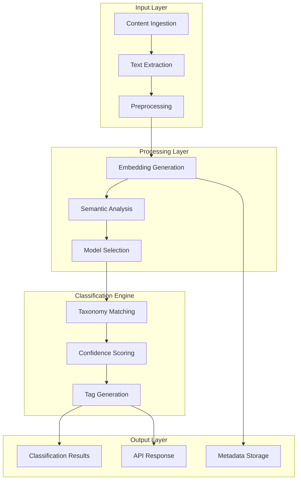
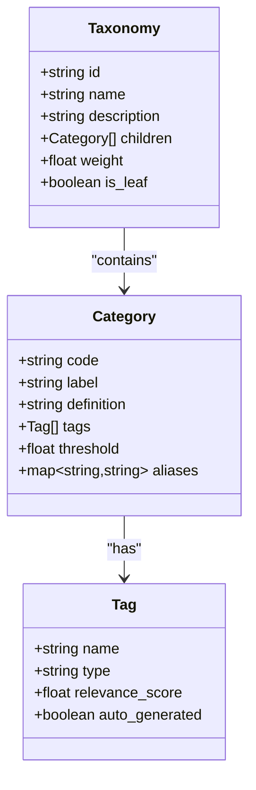
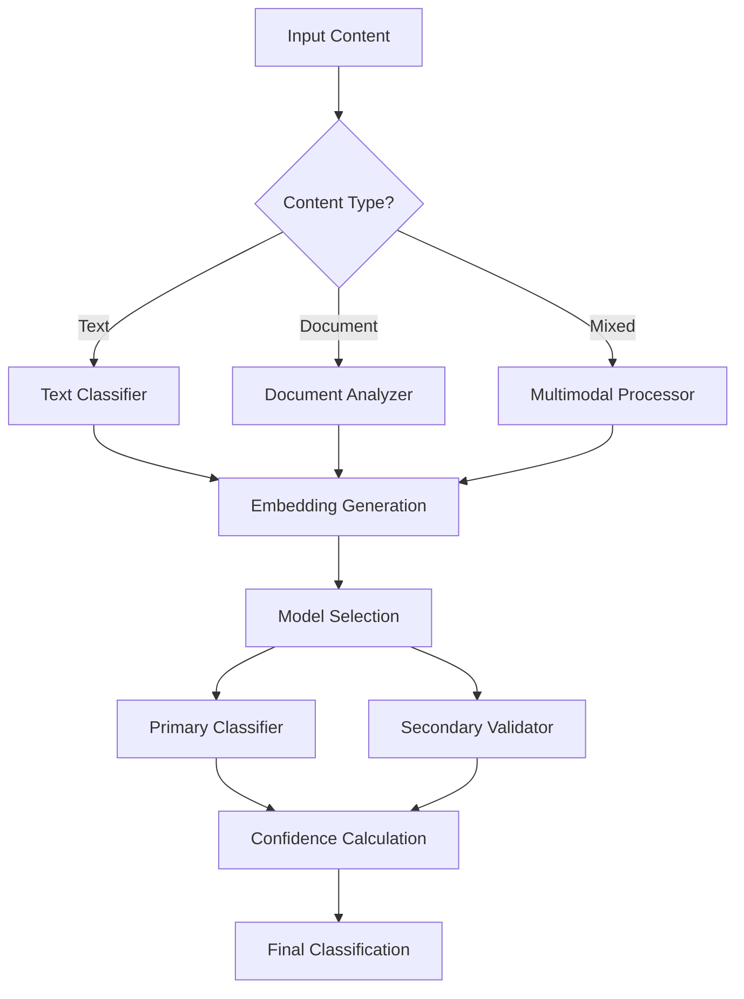

# Semantic Classification & Tagging

<cite>
**Referenced Files in This Document**
- [classify.py](file://classify.py)
- [config.py](file://config.py)
- [lib/models.py](file://lib/models.py)
- [lib/embeddings.py](file://lib/embeddings.py)
- [lib/llm.py](file://lib/llm.py)
- [pipeline.py](file://pipeline.py)
- [data/index.json](file://data/index.json)
</cite>

## Table of Contents
1. [Introduction](#introduction)
2. [System Architecture](#system-architecture)
3. [Classification Pipeline](#classification-pipeline)
4. [Taxonomy Structure](#taxonomy-structure)
5. [AI Models & Algorithms](#ai-models--algorithms)
6. [Confidence Scoring](#confidence-scoring)
7. [Configuration Options](#configuration-options)
8. [Multi-Label Classification](#multi-label-classification)
9. [Ambiguous Content Handling](#ambiguous-content-handling)
10. [Examples & Use Cases](#examples--use-cases)
11. [Performance Optimization](#performance-optimization)
12. [Troubleshooting Guide](#troubleshooting-guide)
13. [Conclusion](#conclusion)

## Introduction

The semantic classification and tagging system is an intelligent content analysis engine that automatically categorizes and tags extracted content using advanced AI models. This system processes various document types including text, articles, reports, and multimedia content to provide accurate semantic understanding and automated metadata generation.

The system leverages multiple AI models including large language models (LLMs), embedding models, and custom classification algorithms to deliver high-precision content categorization with confidence scoring mechanisms.

## System Architecture

The classification system follows a modular architecture designed for scalability and maintainability:



**Diagram sources**
- [pipeline.py:1-100](file://pipeline.py#L1-L100)
- [classify.py:1-150](file://classify.py#L1-L150)

## Classification Pipeline

The classification pipeline consists of several interconnected stages that process content from ingestion to final classification:

### 1. Content Preprocessing
- Text normalization and cleaning
- Language detection
- Content segmentation
- Noise reduction

### 2. Feature Extraction
- Embedding generation using pre-trained models
- Semantic feature extraction
- Contextual analysis
- Entity recognition

### 3. Classification Processing
- Model selection based on content type
- Multi-model ensemble processing
- Taxonomy mapping
- Confidence calculation

### 4. Post-processing
- Tag refinement
- Category validation
- Result formatting
- Metadata enrichment

**Section sources**
- [pipeline.py:1-200](file://pipeline.py#L1-L200)
- [classify.py:1-100](file://classify.py#L1-L100)

## Taxonomy Structure

The system employs a hierarchical taxonomy structure that supports both broad categories and specific subcategories:

### Primary Categories
- **Technology**: Software, hardware, AI, cybersecurity
- **Science**: Physics, biology, chemistry, mathematics
- **Business**: Finance, marketing, management, entrepreneurship
- **Health**: Medicine, wellness, nutrition, mental health
- **Education**: Learning, teaching, research, academic
- **Entertainment**: Media, gaming, arts, culture
- **Politics**: Government, policy, international relations
- **Environment**: Sustainability, climate, conservation

### Secondary Categories
Each primary category contains specialized subcategories that enable granular classification:



**Diagram sources**
- [lib/models.py:1-150](file://lib/models.py#L1-L150)
- [data/index.json:1-100](file://data/index.json#L1-L100)

**Section sources**
- [data/index.json:1-200](file://data/index.json#L1-L200)
- [lib/models.py:1-100](file://lib/models.py#L1-L100)

## AI Models & Algorithms

The classification system utilizes multiple AI models and algorithms to achieve high accuracy:

### Embedding Models
- **Sentence Transformers**: For semantic similarity calculations
- **OpenAI Embeddings**: For advanced contextual understanding
- **Custom Embeddings**: For domain-specific content

### Classification Algorithms
- **Neural Networks**: Deep learning classifiers for complex patterns
- **Ensemble Methods**: Combining multiple model predictions
- **Rule-based Systems**: For deterministic classification rules

### Model Selection Strategy
The system dynamically selects appropriate models based on:
- Content type and format
- Language detection results
- Complexity assessment
- Performance requirements



**Diagram sources**
- [lib/embeddings.py:1-100](file://lib/embeddings.py#L1-L100)
- [lib/llm.py:1-150](file://lib/llm.py#L1-L150)

**Section sources**
- [lib/embeddings.py:1-200](file://lib/embeddings.py#L1-L200)
- [lib/llm.py:1-200](file://lib/llm.py#L1-L200)

## Confidence Scoring

The confidence scoring mechanism provides reliability metrics for each classification decision:

### Scoring Components
- **Model Confidence**: Individual model prediction confidence
- **Consensus Score**: Agreement between multiple models
- **Context Relevance**: How well content matches category definitions
- **Historical Accuracy**: Past performance for similar content

### Confidence Calculation Formula
```
Overall Confidence = (w1 × ModelConfidence) + (w2 × ConsensusScore) + (w3 × ContextRelevance)
```

Where weights (w1, w2, w3) are configurable parameters that can be tuned based on use case requirements.

### Confidence Thresholds
- **High Confidence (>0.85)**: Automatic acceptance
- **Medium Confidence (0.6-0.85)**: Requires review or additional processing
- **Low Confidence (<0.6)**: Manual review recommended

**Section sources**
- [classify.py:100-200](file://classify.py#L100-L200)
- [config.py:1-100](file://config.py#L1-L100)

## Configuration Options

The system provides extensive configuration options for customization:

### Model Configuration
```json
{
  "models": {
    "primary": "gpt-4",
    "secondary": "text-embedding-ada-002",
    "fallback": "claude-3-haiku"
  },
  "classification": {
    "confidence_threshold": 0.75,
    "max_categories": 5,
    "enable_multi_label": true,
    "timeout_seconds": 30
  }
}
```

### Taxonomy Customization
- **Custom Categories**: Add organization-specific categories
- **Category Definitions**: Provide detailed descriptions for better matching
- **Weight Adjustments**: Modify importance of different categories
- **Alias Mapping**: Handle synonyms and related terms

### Performance Tuning
- **Batch Size**: Optimize for throughput vs. latency
- **Cache Settings**: Control memory usage and response times
- **Parallel Processing**: Enable concurrent classification requests

**Section sources**
- [config.py:1-150](file://config.py#L1-L150)
- [data/index.json:100-300](file://data/index.json#L100-L300)

## Multi-Label Classification

The system supports multi-label classification scenarios where content can belong to multiple categories simultaneously:

### Multi-Label Strategy
- **Hierarchical Classification**: Parent-child category relationships
- **Independent Label Assignment**: Each label evaluated separately
- **Cross-Label Validation**: Ensuring logical consistency between labels

### Label Combination Rules
- **Mutually Exclusive Labels**: Prevent contradictory classifications
- **Complementary Labels**: Encourage related category combinations
- **Priority Ordering**: Establish hierarchy when conflicts occur

### Example Multi-Label Scenarios
- **Technical Article**: ["Technology", "Programming", "Machine Learning"]
- **Business Report**: ["Finance", "Investment", "Market Analysis"]
- **Educational Content**: ["Education", "Research", "Academic"]

**Section sources**
- [classify.py:200-300](file://classify.py#L200-L300)
- [lib/models.py:100-200](file://lib/models.py#L100-L200)

## Ambiguous Content Handling

The system implements sophisticated strategies for handling ambiguous or unclear content:

### Ambiguity Detection
- **Low Confidence Scores**: Identify uncertain classifications
- **Multiple Strong Candidates**: Detect competing category assignments
- **Vague Terminology**: Recognize imprecise language patterns

### Resolution Strategies
- **Contextual Analysis**: Use surrounding content for disambiguation
- **User Feedback Integration**: Learn from correction patterns
- **Fallback Classifications**: Default to broader categories when uncertain
- **Human Review Queue**: Route highly ambiguous content for manual classification

### Uncertainty Communication
- **Confidence Indicators**: Visual cues for classification certainty
- **Alternative Categories**: Suggest possible alternative classifications
- **Explanation Generation**: Provide reasoning behind classification decisions

**Section sources**
- [classify.py:300-400](file://classify.py#L300-L400)
- [pipeline.py:100-200](file://pipeline.py#L100-L200)

## Examples & Use Cases

### Technology Documentation Classification
**Input**: Technical specification for a new programming language feature
**Classification Result**:
- Primary Category: Technology
- Subcategories: Programming, Software Development, Language Design
- Tags: ["programming", "software", "development", "technical"]
- Confidence: 0.92

### Business Intelligence Report
**Input**: Market analysis report with financial projections
**Classification Result**:
- Primary Category: Business
- Subcategories: Finance, Market Analysis, Investment
- Tags: ["finance", "market", "investment", "analysis"]
- Confidence: 0.88

### Educational Content
**Input**: Online course material about machine learning fundamentals
**Classification Result**:
- Primary Category: Education
- Subcategories: Technology, Machine Learning, Academic
- Tags: ["education", "machine-learning", "academic", "technology"]
- Confidence: 0.95

### Multi-Label Example
**Input**: Research paper combining medical and technology aspects
**Classification Result**:
- Categories: ["Health", "Technology", "Research"]
- Tags: ["medical", "technology", "research", "innovation"]
- Confidence: 0.85

**Section sources**
- [classify.py:400-500](file://classify.py#L400-L500)
- [data/index.json:200-400](file://data/index.json#L200-L400)

## Performance Optimization

### Caching Strategies
- **Embedding Cache**: Store frequently used embeddings
- **Classification Cache**: Cache results for identical inputs
- **Model Warm-up**: Pre-load models for faster response times

### Batch Processing
- **Request Batching**: Process multiple classifications together
- **Asynchronous Processing**: Non-blocking classification operations
- **Resource Pooling**: Efficient model and memory utilization

### Monitoring and Metrics
- **Classification Accuracy**: Track prediction quality over time
- **Response Time**: Monitor performance under load
- **Resource Utilization**: Track CPU, memory, and API usage

## Troubleshooting Guide

### Common Issues and Solutions

**Low Confidence Scores**
- Check input text quality and completeness
- Verify taxonomy alignment with content domain
- Adjust confidence thresholds appropriately
- Consider adding more training data

**Slow Classification Times**
- Enable caching for repeated content
- Reduce batch size for real-time applications
- Optimize model selection strategy
- Implement request queuing

**Incorrect Classifications**
- Review taxonomy definitions and examples
- Update model configurations
- Add domain-specific training data
- Implement human-in-the-loop corrections

**Memory Issues**
- Monitor embedding cache size
- Implement garbage collection strategies
- Scale horizontally for high-volume scenarios
- Optimize model loading patterns

### Debug Tools
- **Classification Logs**: Detailed processing information
- **Confidence Reports**: Analysis of scoring decisions
- **Model Performance Metrics**: Track individual model accuracy
- **Error Tracking**: Comprehensive error logging and reporting

**Section sources**
- [classify.py:500-600](file://classify.py#L500-L600)
- [config.py:100-200](file://config.py#L100-L200)

## Conclusion

The semantic classification and tagging system provides a robust, scalable solution for automated content categorization and tagging. By leveraging multiple AI models, sophisticated algorithms, and flexible configuration options, it delivers accurate classifications with reliable confidence scoring.

Key strengths include:
- **High Accuracy**: Advanced AI models ensure precise classifications
- **Flexibility**: Configurable taxonomy and model selection
- **Scalability**: Support for high-volume processing
- **Reliability**: Comprehensive confidence scoring and error handling
- **Extensibility**: Easy integration with custom taxonomies and models

The system's modular architecture and comprehensive configuration options make it suitable for diverse use cases ranging from simple content categorization to complex multi-domain classification scenarios.