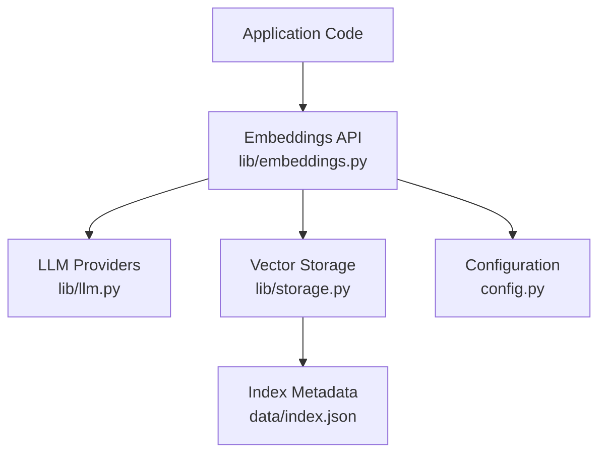
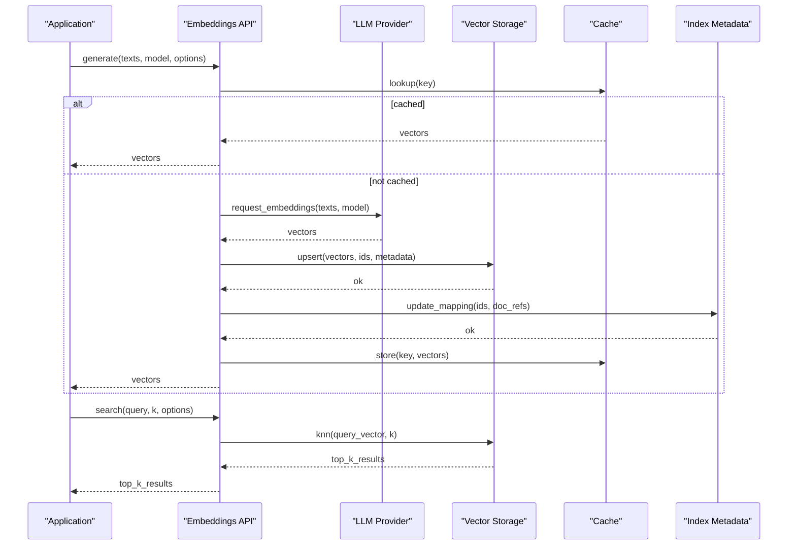
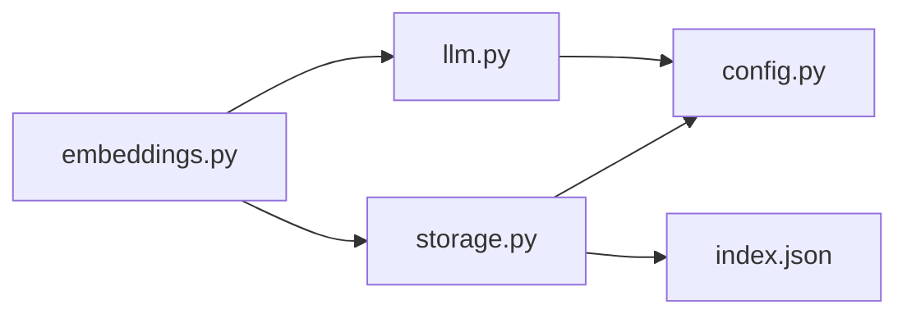

# Embedding System

<cite>
**Referenced Files in This Document**
- [lib/embeddings.py](file://lib/embeddings.py)
- [lib/llm.py](file://lib/llm.py)
- [lib/storage.py](file://lib/storage.py)
- [config.py](file://config.py)
- [data/index.json](file://data/index.json)
- [README.md](file://README.md)
</cite>

## Table of Contents
1. [Introduction](#introduction)
2. [Project Structure](#project-structure)
3. [Core Components](#core-components)
4. [Architecture Overview](#architecture-overview)
5. [Detailed Component Analysis](#detailed-component-analysis)
6. [Dependency Analysis](#dependency-analysis)
7. [Performance Considerations](#performance-considerations)
8. [Troubleshooting Guide](#troubleshooting-guide)
9. [Conclusion](#conclusion)
10. [Appendices](#appendices)

## Introduction
This document explains the embedding system component: how text embeddings are generated, stored, and used across the application; integration with multiple LLM providers for embedding generation; vector storage strategies; similarity search capabilities; configuration options for different embedding models; batch processing techniques; performance optimizations; examples of creation, retrieval, and comparison operations; caching mechanisms; error handling; and fallback strategies when embedding services are unavailable.

## Project Structure
The embedding system is implemented primarily within the lib package and integrates with configuration and data layers:
- lib/embeddings.py: Core embedding orchestration, model selection, batching, caching, and similarity search interfaces.
- lib/llm.py: Provider abstraction for LLM-based embedding generation (e.g., OpenAI, Azure, local models).
- lib/storage.py: Vector storage and indexing utilities, persistence, and retrieval.
- config.py: Centralized configuration for embedding models, providers, and runtime behavior.
- data/index.json: Index metadata and mapping for stored vectors and documents.

**Diagram sources**
- [lib/embeddings.py](file://lib/embeddings.py)
- [lib/llm.py](file://lib/llm.py)
- [lib/storage.py](file://lib/storage.py)
- [config.py](file://config.py)
- [data/index.json](file://data/index.json)

**Section sources**
- [lib/embeddings.py](file://lib/embeddings.py)
- [lib/llm.py](file://lib/llm.py)
- [lib/storage.py](file://lib/storage.py)
- [config.py](file://config.py)
- [data/index.json](file://data/index.json)

## Core Components
- Embedding Orchestration: Coordinates model selection, provider routing, batching, caching, and error/fallback logic.
- LLM Provider Abstraction: Encapsulates calls to external embedding APIs with retries, timeouts, and rate limiting.
- Vector Storage: Manages vector indexes, persistence, and efficient similarity search.
- Configuration: Defines model parameters, provider credentials, cache settings, and performance tuning.
- Index Metadata: Tracks document-to-vector mappings and index versioning.

Key responsibilities:
- Generate embeddings for single texts or batches.
- Store vectors with stable identifiers and metadata.
- Retrieve vectors by ID and perform k-nearest neighbor searches.
- Cache results to reduce latency and cost.
- Handle provider failures gracefully with fallbacks.

**Section sources**
- [lib/embeddings.py](file://lib/embeddings.py)
- [lib/llm.py](file://lib/llm.py)
- [lib/storage.py](file://lib/storage.py)
- [config.py](file://config.py)
- [data/index.json](file://data/index.json)

## Architecture Overview
The embedding system follows a layered architecture:
- Application Layer: Calls the Embeddings API for generation, retrieval, and search.
- Embeddings Layer: Orchestrates provider selection, batching, caching, and error handling.
- Provider Layer: Communicates with LLM providers via standardized interfaces.
- Storage Layer: Persists vectors and maintains indexes for fast similarity search.
- Configuration Layer: Supplies model and runtime settings.

**Diagram sources**
- [lib/embeddings.py](file://lib/embeddings.py)
- [lib/llm.py](file://lib/llm.py)
- [lib/storage.py](file://lib/storage.py)
- [data/index.json](file://data/index.json)

## Detailed Component Analysis

### Embeddings Orchestration
Responsibilities:
- Model resolution and validation against configuration.
- Batching strategy to optimize throughput and respect provider limits.
- Caching layer to avoid redundant computations.
- Error handling and fallback to alternative providers/models.
- Similarity search coordination with storage backend.

Typical operations:
- create_embeddings(texts, model, options): returns vectors with IDs and metadata.
- retrieve_embedding(id): fetches vector by identifier.
- similarity_search(query, k, options): returns nearest neighbors with scores.
- batch_create(texts_batch, model, options): optimized path for large inputs.

Optimization considerations:
- Adaptive batching based on provider constraints and payload size.
- Parallel requests where allowed by provider policies.
- Result deduplication using content hashing.

Error handling:
- Retry with exponential backoff for transient errors.
- Fallback to secondary provider/model if primary fails.
- Graceful degradation with partial results and logging.

**Section sources**
- [lib/embeddings.py](file://lib/embeddings.py)

### LLM Provider Abstraction
Responsibilities:
- Unified interface for multiple embedding providers.
- Authentication and credential management.
- Request formatting and response parsing.
- Rate limiting and throttling controls.
- Health checks and capability discovery.

Supported patterns:
- Provider selection by model name or explicit provider tag.
- Configurable timeouts and retry policies.
- Local vs remote provider support.

Provider-specific notes:
- Ensure consistent vector dimensions per model.
- Normalize responses to a common schema.
- Track usage metrics for cost and performance monitoring.

**Section sources**
- [lib/llm.py](file://lib/llm.py)

### Vector Storage
Responsibilities:
- Persist vectors with unique IDs and associated metadata.
- Maintain an index for efficient similarity search.
- Support CRUD operations for vectors and metadata.
- Provide k-nearest neighbor queries with distance metrics.
- Manage index versioning and migration.

Storage strategies:
- In-memory index for development/testing.
- Disk-backed index for persistence.
- Optional external vector database integration.

Operations:
- upsert(vector_id, vector, metadata): insert or update.
- get(vector_id): retrieve vector and metadata.
- delete(vector_id): remove vector and references.
- knn(query_vector, k, metric): return top-k matches with scores.
- list(): enumerate stored vectors and metadata.

Index metadata:
- Tracks document references, timestamps, and schema versions.
- Enables filtering and faceted search over metadata.

**Section sources**
- [lib/storage.py](file://lib/storage.py)
- [data/index.json](file://data/index.json)

### Configuration
Responsibilities:
- Define default embedding models and providers.
- Configure cache settings (TTL, max size, eviction policy).
- Set batch sizes, concurrency limits, and timeouts.
- Enable/disable features like retries and fallbacks.
- Provide environment-specific overrides.

Common options:
- model.default: primary embedding model name.
- providers.<name>.credentials: authentication details.
- cache.enabled, cache.ttl_seconds, cache.max_entries.
- batch.size, batch.concurrency, batch.timeout_ms.
- storage.backend, storage.path, storage.index_version.

Validation:
- Ensure required fields are present.
- Validate provider availability and credentials format.
- Check model compatibility and dimension consistency.

**Section sources**
- [config.py](file://config.py)

### Index Metadata
Responsibilities:
- Map vector IDs to original document references.
- Record schema versions and transformation history.
- Support incremental updates and rollbacks.

Structure highlights:
- Entries include id, doc_ref, created_at, updated_at, metadata.
- Versioned index allows safe migrations.

**Section sources**
- [data/index.json](file://data/index.json)

## Dependency Analysis
The embedding system has clear separation of concerns:
- Embeddings orchestrator depends on LLM provider abstraction and storage.
- LLM provider abstraction depends on configuration for credentials and model settings.
- Storage depends on configuration for backend selection and paths.
- Index metadata is managed by storage and read/written by orchestrator.

**Diagram sources**
- [lib/embeddings.py](file://lib/embeddings.py)
- [lib/llm.py](file://lib/llm.py)
- [lib/storage.py](file://lib/storage.py)
- [config.py](file://config.py)
- [data/index.json](file://data/index.json)

**Section sources**
- [lib/embeddings.py](file://lib/embeddings.py)
- [lib/llm.py](file://lib/llm.py)
- [lib/storage.py](file://lib/storage.py)
- [config.py](file://config.py)
- [data/index.json](file://data/index.json)

## Performance Considerations
- Batch Processing: Group texts to maximize throughput while respecting provider limits.
- Caching: Use content hashes to avoid recomputation; tune TTL and capacity.
- Concurrency: Parallelize requests where permitted; monitor rate limits.
- Indexing: Choose appropriate distance metrics and index structures for query speed.
- Memory Management: Stream large payloads; avoid loading entire indexes into memory.
- Monitoring: Track latency, error rates, and provider usage for optimization.

[No sources needed since this section provides general guidance]

## Troubleshooting Guide
Common issues and resolutions:
- Provider Unavailable: Enable fallback provider/model; verify credentials and endpoints.
- Rate Limit Exceeded: Reduce concurrency; implement backoff and queueing.
- Dimension Mismatch: Ensure consistent model selection; validate input preprocessing.
- Cache Misses: Increase cache size or adjust TTL; check key generation logic.
- Index Corruption: Rebuild index from persisted vectors; validate metadata integrity.
- High Latency: Optimize batch size; enable compression; consider local providers.

Operational tips:
- Log provider responses and errors with correlation IDs.
- Periodically test provider health and rotate credentials.
- Monitor index growth and prune stale entries.

**Section sources**
- [lib/embeddings.py](file://lib/embeddings.py)
- [lib/llm.py](file://lib/llm.py)
- [lib/storage.py](file://lib/storage.py)
- [config.py](file://config.py)

## Conclusion
The embedding system provides a robust, configurable, and scalable foundation for generating, storing, and querying text embeddings. By abstracting LLM providers, implementing efficient storage and caching, and offering flexible configuration, it supports diverse use cases and environments. Proper operational practices and monitoring ensure reliability and performance under varying loads and provider conditions.

[No sources needed since this section summarizes without analyzing specific files]

## Appendices

### Example Workflows
- Create Embeddings:
  - Input: texts array, model name, options (batch_size, cache_enabled).
  - Process: resolve model, check cache, call provider, store vectors, update index.
  - Output: vectors with IDs and metadata.

- Retrieve Embedding:
  - Input: vector_id.
  - Process: lookup in storage, optional cache refresh.
  - Output: vector and metadata.

- Similarity Search:
  - Input: query text, k, metric.
  - Process: generate query vector, run knn, return top-k with scores.
  - Output: ranked list of matching vectors and metadata.

### Configuration Reference
- Models: define supported embedding models and their providers.
- Providers: configure authentication, endpoints, and limits.
- Cache: set enabled flag, TTL, and maximum entries.
- Storage: select backend, path, and index version.
- Runtime: batch size, concurrency, timeouts, retries.

[No sources needed since this section provides general guidance]