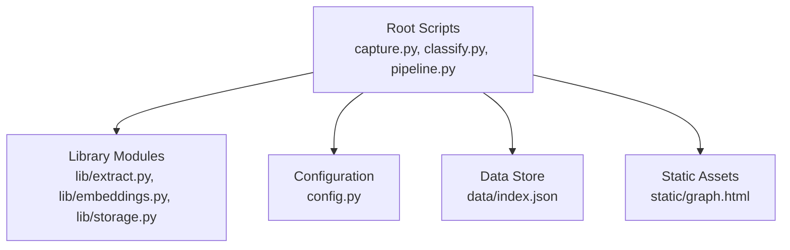
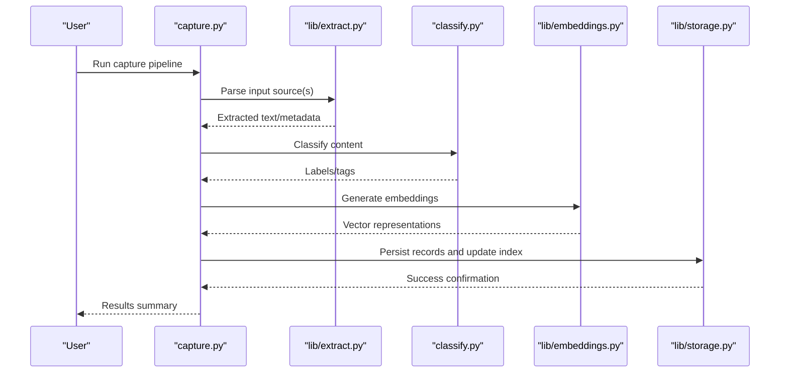
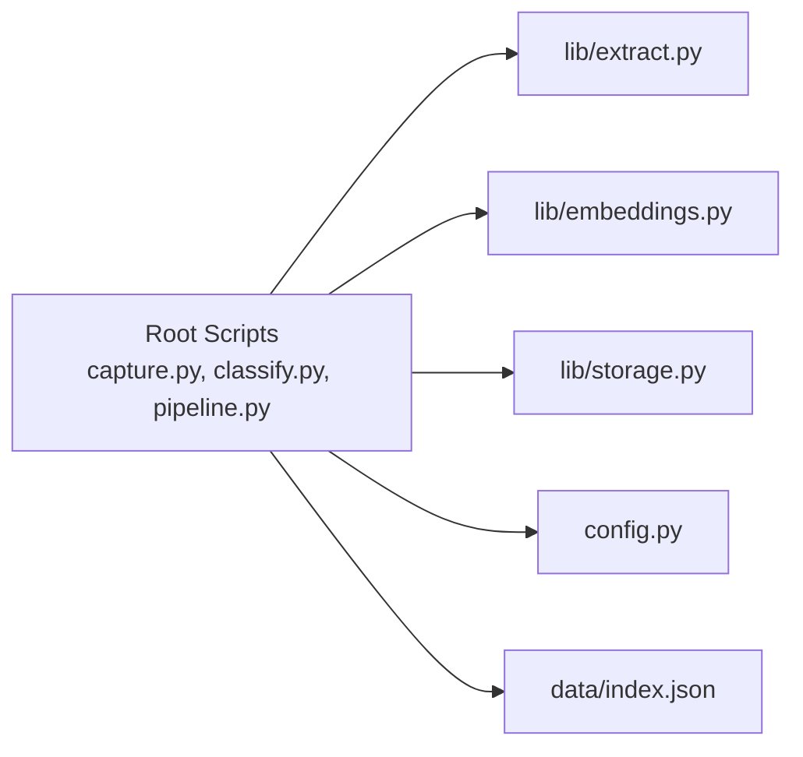

# Getting Started

<cite>
**Referenced Files in This Document**
- [README.md](file://README.md)
- [requirements.txt](file://requirements.txt)
- [config.py](file://config.py)
- [capture.py](file://capture.py)
- [classify.py](file://classify.py)
- [pipeline.py](file://pipeline.py)
- [lib/extract.py](file://lib/extract.py)
- [lib/embeddings.py](file://lib/embeddings.py)
- [lib/storage.py](file://lib/storage.py)
- [data/index.json](file://data/index.json)
</cite>

## Table of Contents
1. [Introduction](#introduction)
2. [Project Structure](#project-structure)
3. [Core Components](#core-components)
4. [Architecture Overview](#architecture-overview)
5. [Detailed Component Analysis](#detailed-component-analysis)
6. [Dependency Analysis](#dependency-analysis)
7. [Performance Considerations](#performance-considerations)
8. [Troubleshooting Guide](#troubleshooting-guide)
9. [Conclusion](#conclusion)
10. [Appendices](#appendices)

## Introduction
This guide helps you set up and run the Secondself AI Brain system to capture documents, classify content, and generate embeddings for retrieval and analysis. You will install dependencies, configure the environment, run the capture pipeline, and verify that your data is indexed and searchable.

## Project Structure
The project is organized into scripts for running workflows, a library module for core logic, static assets, and data storage:
- Scripts at the root drive the main workflows (capture, classification, embedding generation, graph building).
- The lib directory contains reusable modules for extraction, embeddings, LLM integration, models, and storage.
- Static assets include a graph preview page.
- Data is stored under data, with an index file used by the system.

**Diagram sources**
- [capture.py](file://capture.py)
- [classify.py](file://classify.py)
- [pipeline.py](file://pipeline.py)
- [lib/extract.py](file://lib/extract.py)
- [lib/embeddings.py](file://lib/embeddings.py)
- [lib/storage.py](file://lib/storage.py)
- [config.py](file://config.py)
- [data/index.json](file://data/index.json)
- [static/graph.html](file://static/graph.html)

**Section sources**
- [README.md](file://README.md)
- [requirements.txt](file://requirements.txt)

## Core Components
- Configuration: Centralized settings for API keys, paths, and behavior flags.
- Capture Pipeline: Ingests documents from local files or URLs, extracts text, and persists results.
- Classification: Assigns categories or tags to extracted content using configured rules or LLM prompts.
- Embeddings: Generates vector representations for semantic search and retrieval.
- Storage: Persists structured records and indexes for fast lookup.

Key responsibilities:
- config.py defines environment variables and defaults.
- capture.py orchestrates ingestion and extraction.
- classify.py applies classification logic.
- pipeline.py coordinates multi-step processing.
- lib/embeddings.py computes embeddings.
- lib/storage.py manages persistence and indexing.

**Section sources**
- [config.py](file://config.py)
- [capture.py](file://capture.py)
- [classify.py](file://classify.py)
- [pipeline.py](file://pipeline.py)
- [lib/embeddings.py](file://lib/embeddings.py)
- [lib/storage.py](file://lib/storage.py)

## Architecture Overview
The system follows a modular pipeline:
- Input sources feed into capture.py which uses lib/extract.py to parse content.
- Classified output flows through classify.py to assign labels.
- lib/embeddings.py generates vectors for each record.
- lib/storage.py writes records and updates indexes.

**Diagram sources**
- [capture.py](file://capture.py)
- [lib/extract.py](file://lib/extract.py)
- [classify.py](file://classify.py)
- [lib/embeddings.py](file://lib/embeddings.py)
- [lib/storage.py](file://lib/storage.py)

## Detailed Component Analysis

### Installation and Environment Setup
- Python version: Use a recent stable release compatible with the listed requirements.
- Virtual environment: Create and activate a virtual environment to isolate dependencies.
- Dependencies: Install packages from requirements.txt.
- Environment variables: Configure required keys and paths via config.py or your OS environment.

Steps:
1. Create a virtual environment and activate it.
2. Install dependencies from requirements.txt.
3. Set environment variables for API keys and paths as defined in config.py.
4. Verify installation by running a simple import or help command if available.

Verification:
- Confirm that imports succeed without errors.
- Ensure environment variables are loaded by config.py.

**Section sources**
- [requirements.txt](file://requirements.txt)
- [config.py](file://config.py)

### Configuration File Setup
- Location: config.py centralizes configuration.
- Keys typically include:
  - API credentials for LLM providers.
  - Paths for input/output directories.
  - Feature toggles for classification and embedding options.
- Best practices:
  - Use environment variables for secrets.
  - Provide sensible defaults in config.py.
  - Validate critical settings at startup.

Example tasks:
- Add your LLM provider API key.
- Set the input directory for documents to capture.
- Enable/disable classification or embedding steps.

**Section sources**
- [config.py](file://config.py)

### Initial Data Capture Workflow
Capture workflow overview:
- Input sources can be local files or URLs.
- Extraction parses content into structured text and metadata.
- Classification assigns categories or tags.
- Embeddings are generated for semantic retrieval.
- Storage persists records and updates the index.

Steps:
1. Place documents in the configured input directory or provide URLs.
2. Run the capture script to ingest and process documents.
3. Inspect outputs in the configured storage location.
4. Verify index entries in data/index.json.

Common commands:
- Run capture pipeline with default settings.
- Specify custom input sources or output paths.
- Re-run to update existing records.

**Section sources**
- [capture.py](file://capture.py)
- [lib/extract.py](file://lib/extract.py)
- [lib/storage.py](file://lib/storage.py)
- [data/index.json](file://data/index.json)

### Basic Usage Patterns
- Capturing documents:
  - Point capture.py to a directory or list of files/URLs.
  - Review logs for parsing status and errors.
- Classifying content:
  - Run classify.py to apply labeling rules or prompts.
  - Check updated records for assigned categories.
- Generating embeddings:
  - Execute embedding generation step to create vectors.
  - Confirm vectors are stored alongside records.

Tips:
- Start with a small dataset to validate the pipeline.
- Use verbose logging to diagnose issues early.
- Keep inputs consistent in format for reliable extraction.

**Section sources**
- [capture.py](file://capture.py)
- [classify.py](file://classify.py)
- [lib/embeddings.py](file://lib/embeddings.py)

### Viewing Results
- Index inspection:
  - Open data/index.json to see recorded entries and metadata.
- Graph preview:
  - Use static/graph.html to visualize relationships if enabled.
- Querying:
  - Use provided scripts or APIs to search by keywords or semantic similarity.

**Section sources**
- [data/index.json](file://data/index.json)
- [static/graph.html](file://static/graph.html)

## Dependency Analysis
The system relies on external libraries for extraction, embeddings, and storage. Key runtime dependencies are declared in requirements.txt. Internal modules are imported by the root scripts to orchestrate workflows.

**Diagram sources**
- [capture.py](file://capture.py)
- [classify.py](file://classify.py)
- [pipeline.py](file://pipeline.py)
- [lib/extract.py](file://lib/extract.py)
- [lib/embeddings.py](file://lib/embeddings.py)
- [lib/storage.py](file://lib/storage.py)
- [config.py](file://config.py)
- [data/index.json](file://data/index.json)

**Section sources**
- [requirements.txt](file://requirements.txt)

## Performance Considerations
- Batch processing: Process multiple documents together to reduce overhead.
- Incremental updates: Only reprocess changed files to save time.
- Embedding caching: Cache vectors when possible to avoid recomputation.
- Resource limits: Monitor memory usage during large extractions and embedding generation.

[No sources needed since this section provides general guidance]

## Troubleshooting Guide
Common setup issues:
- Missing dependencies: Ensure all packages from requirements.txt are installed.
- Environment variables: Verify API keys and paths are correctly set in config.py or OS environment.
- Input path errors: Confirm the configured input directory exists and contains readable files.
- Network timeouts: Check connectivity to external services (e.g., LLM providers).

Verification steps:
- Run a minimal capture with one document to confirm end-to-end flow.
- Inspect data/index.json for new entries after capture.
- Validate classification outputs and embedding vectors exist.

Error handling tips:
- Enable verbose logging to capture detailed traces.
- Isolate failures by running individual steps (extraction, classification, embeddings).
- Review storage permissions and disk space availability.

**Section sources**
- [config.py](file://config.py)
- [capture.py](file://capture.py)
- [lib/storage.py](file://lib/storage.py)

## Conclusion
You now have the essential steps to install, configure, and run the Secondself AI Brain system. Use the capture pipeline to ingest documents, classify content, and generate embeddings for retrieval. Follow the troubleshooting tips to resolve common issues and verify your setup with small test cases before scaling up.

[No sources needed since this section summarizes without analyzing specific files]

## Appendices

### Quick Command Reference
- Install dependencies: Use the package manager with requirements.txt.
- Run capture: Execute the capture script with default or custom parameters.
- Classify content: Run the classification script to label records.
- Generate embeddings: Trigger embedding generation for semantic search.

[No sources needed since this section provides general guidance]