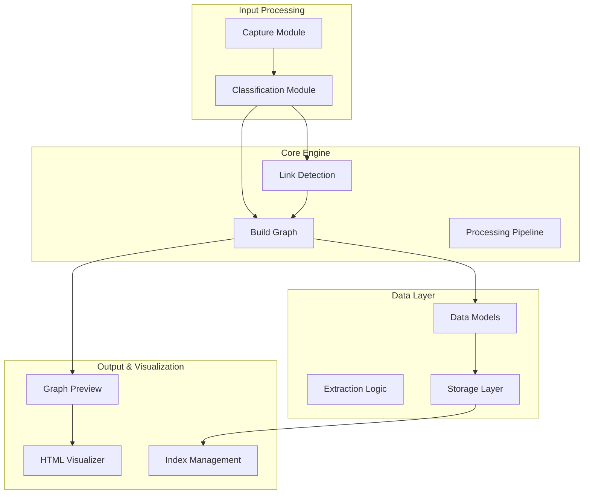
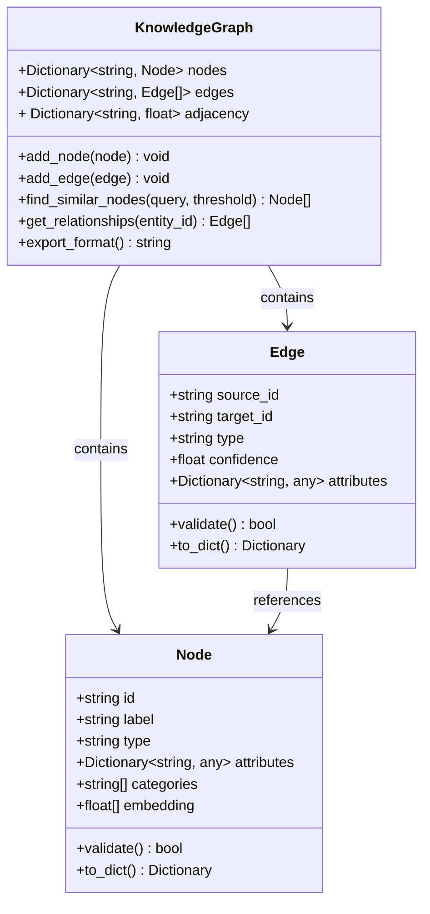
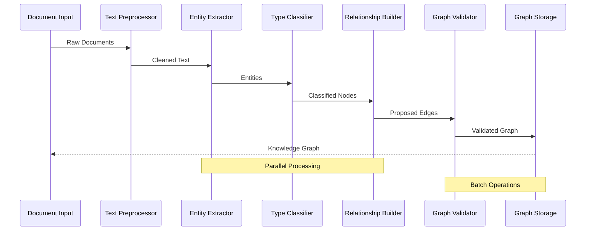
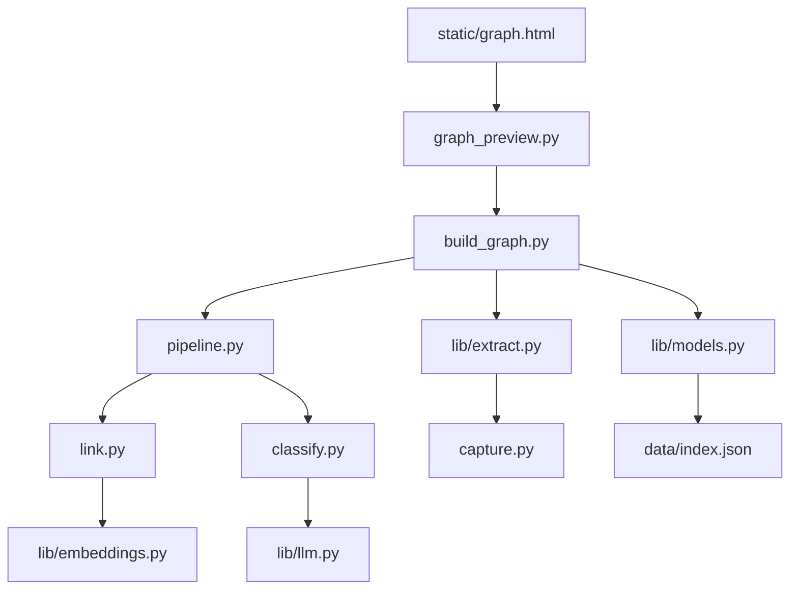

# Graph Building Engine

<cite>
**Referenced Files in This Document**
- [build_graph.py](file://build_graph.py)
- [config.py](file://config.py)
- [lib/extract.py](file://lib/extract.py)
- [lib/models.py](file://lib/models.py)
- [graph_preview.py](file://graph_preview.py)
- [pipeline.py](file://pipeline.py)
- [link.py](file://link.py)
- [classify.py](file://classify.py)
- [capture.py](file://capture.py)
- [ask.py](file://ask.py)
- [static/graph.html](file://static/graph.html)
- [data/index.json](file://data/index.json)
</cite>

## Table of Contents
1. [Introduction](#introduction)
2. [Project Structure](#project-structure)
3. [Core Components](#core-components)
4. [Architecture Overview](#architecture-overview)
5. [Detailed Component Analysis](#detailed-component-analysis)
6. [Dependency Analysis](#dependency-analysis)
7. [Performance Considerations](#performance-considerations)
8. [Troubleshooting Guide](#troubleshooting-guide)
9. [Configuration Options](#configuration-options)
10. [Customization Guide](#customization-guide)
11. [Conclusion](#conclusion)

## Introduction

The Graph Building Engine is a sophisticated knowledge graph construction system designed to automatically discover, extract, and organize relationships between documents and entities. It transforms unstructured text data into structured knowledge graphs through advanced natural language processing, entity recognition, and relationship extraction techniques.

The system processes documents to identify key entities (nodes) and their relationships (edges), creating a comprehensive knowledge representation that enables semantic search, reasoning, and intelligent information retrieval. The engine supports configurable thresholds, filtering criteria, and optimization settings to handle large document collections efficiently.

## Project Structure

The graph building engine follows a modular architecture with clear separation of concerns:



**Diagram sources**
- [build_graph.py:1-50](file://build_graph.py#L1-L50)
- [pipeline.py:1-100](file://pipeline.py#L1-L100)
- [lib/models.py:1-150](file://lib/models.py#L1-L150)

**Section sources**
- [build_graph.py:1-100](file://build_graph.py#L1-L100)
- [pipeline.py:1-200](file://pipeline.py#L1-L200)

## Core Components

### Node Creation Process

The node creation process involves several stages:

1. **Entity Extraction**: Identifies key entities from document content using NLP techniques
2. **Node Classification**: Categorizes entities into predefined types (Person, Organization, Concept, etc.)
3. **Attribute Enrichment**: Extracts additional properties and metadata for each node
4. **Deduplication**: Merges duplicate nodes representing the same entity
5. **Validation**: Ensures node integrity and consistency

### Edge Relationship Detection

Relationship detection employs multiple algorithms:

1. **Co-occurrence Analysis**: Identifies entities appearing together in context windows
2. **Semantic Similarity**: Uses embedding similarity to detect conceptual relationships
3. **Pattern Matching**: Applies regex and structural patterns to extract explicit relationships
4. **LLM-based Extraction**: Leverages large language models for complex relationship inference
5. **Temporal Analysis**: Tracks relationship evolution over time

### Data Structures

The system uses optimized data structures for graph representation:



**Diagram sources**
- [lib/models.py:1-200](file://lib/models.py#L1-L200)
- [build_graph.py:50-150](file://build_graph.py#L50-L150)

**Section sources**
- [lib/models.py:1-300](file://lib/models.py#L1-L300)
- [build_graph.py:1-200](file://build_graph.py#L1-L200)

## Architecture Overview

The graph building engine implements a multi-stage processing pipeline:



**Diagram sources**
- [pipeline.py:1-150](file://pipeline.py#L1-L150)
- [lib/extract.py:1-100](file://lib/extract.py#L1-L100)

## Detailed Component Analysis

### Build Graph Engine

The core graph building engine orchestrates the entire construction process:

#### Key Responsibilities:
- **Pipeline Orchestration**: Coordinates all processing stages
- **Resource Management**: Handles memory and computational resources
- **Error Handling**: Manages failures and recovery strategies
- **Progress Tracking**: Monitors construction progress and metrics

#### Processing Flow:
1. **Document Ingestion**: Loads and validates input documents
2. **Text Processing**: Cleans and normalizes text content
3. **Entity Recognition**: Identifies and extracts entities
4. **Relationship Discovery**: Detects connections between entities
5. **Graph Construction**: Builds the final knowledge graph structure
6. **Optimization**: Applies compression and indexing

**Section sources**
- [build_graph.py:1-300](file://build_graph.py#L1-L300)
- [pipeline.py:1-250](file://pipeline.py#L1-L250)

### Link Detection System

The link detection system identifies relationships between entities using multiple strategies:

#### Detection Algorithms:
- **Contextual Co-occurrence**: Analyzes proximity in text
- **Syntactic Patterns**: Uses grammatical structures
- **Semantic Embeddings**: Leverages vector similarity
- **Rule-based Extraction**: Applies domain-specific rules
- **ML-based Classification**: Uses trained models for relationship typing

#### Confidence Scoring:
Each detected relationship receives a confidence score based on:
- Evidence strength from multiple signals
- Consistency across different detection methods
- Historical accuracy of similar patterns
- Domain-specific validation rules

**Section sources**
- [link.py:1-200](file://link.py#L1-L200)
- [lib/extract.py:1-150](file://lib/extract.py#L1-L150)

### Data Model Implementation

The data model provides efficient storage and manipulation of graph elements:

#### Node Model Features:
- **Unique Identification**: UUID-based node identifiers
- **Type Hierarchies**: Support for taxonomic categorization
- **Attribute Storage**: Flexible key-value attribute system
- **Embedding Support**: Vector representations for similarity search
- **Metadata Tracking**: Creation timestamps and versioning

#### Edge Model Capabilities:
- **Directed Relationships**: Source-target relationship directionality
- **Weighted Connections**: Confidence scores and importance weights
- **Temporal Properties**: Time-based relationship validity
- **Multi-modal Attributes**: Support for various data types

**Section sources**
- [lib/models.py:1-400](file://lib/models.py#L1-L400)

## Dependency Analysis

The graph building engine has well-defined dependencies between components:



**Diagram sources**
- [build_graph.py:1-50](file://build_graph.py#L1-L50)
- [pipeline.py:1-50](file://pipeline.py#L1-L50)
- [lib/extract.py:1-50](file://lib/extract.py#L1-L50)

**Section sources**
- [build_graph.py:1-100](file://build_graph.py#L1-L100)
- [requirements.txt:1-50](file://requirements.txt#L1-L50)

## Performance Considerations

### Memory Management Strategies

The engine implements several memory optimization techniques:

1. **Streaming Processing**: Processes documents in chunks to minimize memory footprint
2. **Lazy Loading**: Defers expensive operations until needed
3. **Garbage Collection**: Aggressive cleanup of temporary objects
4. **Memory Mapping**: Efficient handling of large datasets
5. **Caching Strategies**: Intelligent caching of computed results

### Computational Optimization

Key performance optimizations include:

1. **Parallel Processing**: Multi-threaded entity extraction and relationship detection
2. **Batch Operations**: Grouped database operations for efficiency
3. **Indexing**: Optimized search indexes for fast queries
4. **Algorithm Selection**: Choice of algorithms based on data characteristics
5. **Resource Monitoring**: Real-time monitoring of resource usage

### Scalability Features

The system supports horizontal scaling through:

1. **Distributed Processing**: Splitting work across multiple workers
2. **Sharding**: Partitioning data for parallel processing
3. **Load Balancing**: Even distribution of computational tasks
4. **Fault Tolerance**: Recovery from individual worker failures

## Troubleshooting Guide

### Common Issues and Solutions

#### Memory Exhaustion
**Symptoms**: Out-of-memory errors during graph construction
**Solutions**:
- Reduce batch size in configuration
- Enable memory mapping for large files
- Implement streaming processing mode
- Monitor memory usage with profiling tools

#### Slow Processing
**Symptoms**: Unusually long processing times
**Solutions**:
- Optimize entity extraction parameters
- Use pre-computed embeddings where possible
- Enable parallel processing
- Review relationship detection thresholds

#### Graph Quality Issues
**Symptoms**: Poor quality relationships or missing connections
**Solutions**:
- Adjust confidence thresholds
- Review extraction rules and patterns
- Validate input data quality
- Tune similarity thresholds

### Debugging Techniques

1. **Logging**: Enable detailed logging at different levels
2. **Profiling**: Use performance profilers to identify bottlenecks
3. **Visualization**: Utilize graph preview tools for inspection
4. **Testing**: Run unit tests on individual components
5. **Monitoring**: Track key metrics during processing

**Section sources**
- [graph_preview.py:1-100](file://graph_preview.py#L1-L100)
- [config.py:1-150](file://config.py#L1-L150)

## Configuration Options

### Relationship Thresholds

The system provides extensive configuration options for controlling relationship discovery:

#### Confidence Thresholds
- **Minimum Confidence**: Minimum confidence score for accepting relationships
- **Similarity Threshold**: Vector similarity threshold for semantic matching
- **Co-occurrence Threshold**: Minimum co-occurrence count for contextual relationships

#### Filtering Criteria
- **Entity Type Filters**: Restrict processing to specific entity types
- **Domain Filters**: Limit relationships to specific domains or topics
- **Temporal Filters**: Apply time-based constraints to relationship discovery
- **Quality Filters**: Exclude low-quality or uncertain relationships

### Graph Optimization Settings

#### Storage Optimization
- **Compression Level**: Control data compression for storage efficiency
- **Index Strategy**: Choose indexing strategy for query performance
- **Cache Size**: Configure cache sizes for frequently accessed data
- **Backup Frequency**: Set automatic backup intervals

#### Processing Optimization
- **Batch Size**: Control document processing batch sizes
- **Worker Count**: Number of parallel processing workers
- **Timeout Settings**: Configure operation timeouts
- **Retry Policies**: Define retry behavior for failed operations

**Section sources**
- [config.py:1-200](file://config.py#L1-L200)
- [build_graph.py:100-200](file://build_graph.py#L100-L200)

## Customization Guide

### Customizing Relationship Extraction Rules

To extend relationship extraction capabilities:

#### Rule-Based Extraction
1. **Define Patterns**: Create regex patterns for specific relationship types
2. **Implement Validators**: Add validation logic for extracted relationships
3. **Configure Scoring**: Set confidence scoring for custom rules
4. **Test Thoroughly**: Validate rules against sample data

#### ML-Based Enhancement
1. **Feature Engineering**: Extract relevant features for relationship classification
2. **Model Training**: Train custom models on labeled data
3. **Integration**: Integrate custom models into the extraction pipeline
4. **Evaluation**: Continuously evaluate model performance

### Extending Graph Building Logic

#### Custom Node Types
1. **Define Schema**: Create new node type definitions
2. **Implement Validation**: Add validation logic for new node types
3. **Update Indexing**: Modify indexing for new node attributes
4. **Extend Queries**: Update query interfaces for new node types

#### Custom Relationship Types
1. **Define Semantics**: Specify relationship semantics and constraints
2. **Implement Detection**: Add detection logic for new relationship types
3. **Configure Scoring**: Set appropriate confidence scoring
4. **Update Visualization**: Extend visualization for new relationship types

### Example Customization Patterns

#### Domain-Specific Extraction
```python
# Pattern for extracting medical relationships
medical_patterns = [
    r"(\w+) causes (\w+)",
    r"(\w+) treats (\w+)",
    r"(\w+) is diagnosed by (\w+)"
]

# Custom validation for medical entities
def validate_medical_entity(entity):
    return entity.type in ["disease", "symptom", "treatment", "drug"]
```

#### Temporal Relationship Handling
```python
# Handle time-based relationships
temporal_rules = {
    "before": {"confidence_boost": 0.1},
    "after": {"confidence_boost": 0.1},
    "during": {"confidence_boost": 0.05}
}
```

**Section sources**
- [lib/extract.py:1-200](file://lib/extract.py#L1-L200)
- [classify.py:1-150](file://classify.py#L1-L150)

## Conclusion

The Graph Building Engine provides a robust, scalable solution for constructing knowledge graphs from unstructured documents. Its modular architecture, configurable thresholds, and extensible design make it suitable for a wide range of applications requiring automated knowledge extraction and organization.

The system's emphasis on performance optimization, memory management, and customization ensures it can handle large-scale document collections while maintaining high-quality graph construction. With its comprehensive configuration options and extension points, organizations can tailor the engine to their specific needs and domain requirements.

Future enhancements may include support for additional data sources, improved relationship inference algorithms, and enhanced visualization capabilities. The foundation established by this engine provides a solid base for continued development and innovation in knowledge graph construction.