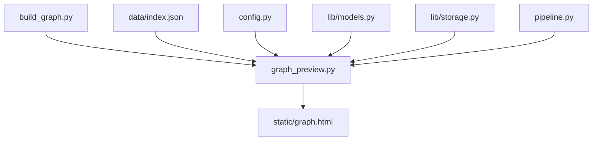
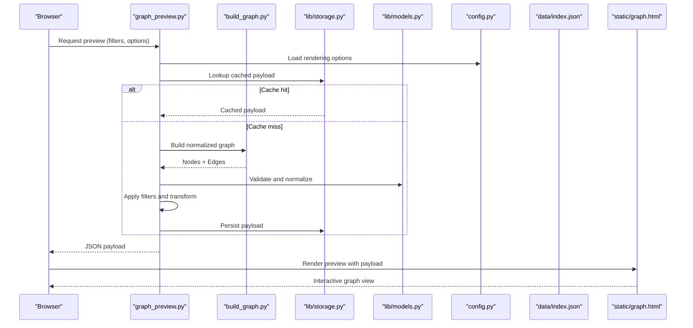
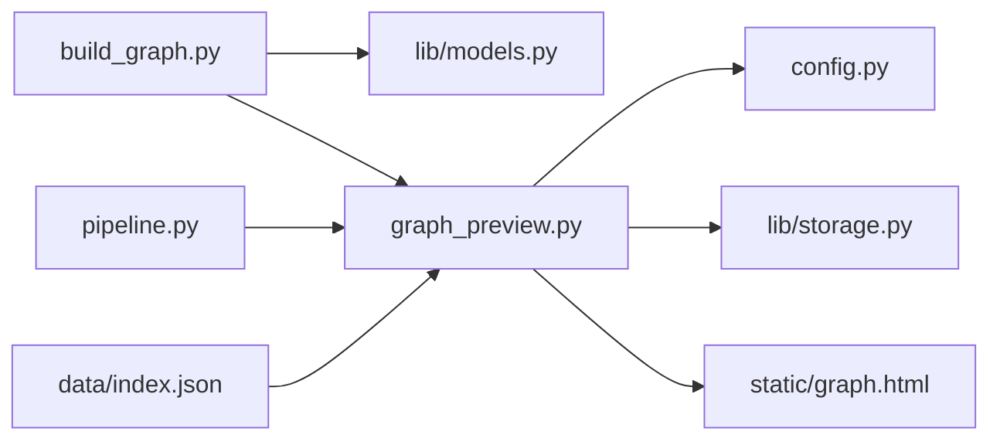
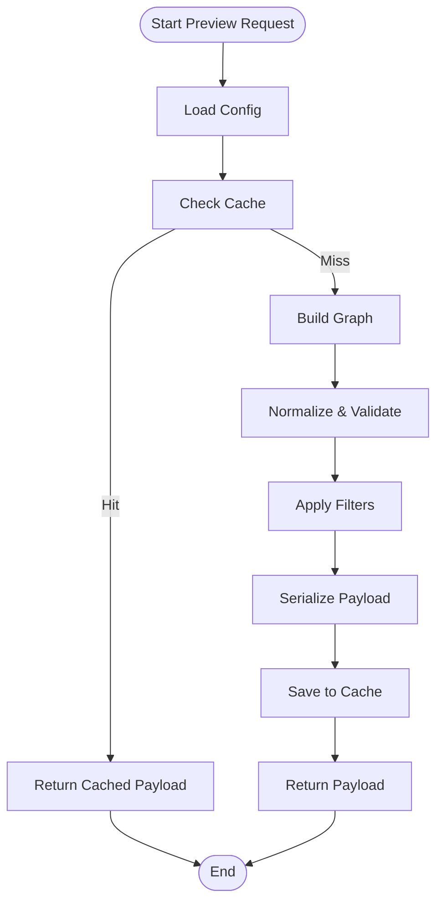

# Graph Preview System

<cite>
**Referenced Files in This Document**
- [graph_preview.py](file://graph_preview.py)
- [build_graph.py](file://build_graph.py)
- [static/graph.html](file://static/graph.html)
- [data/index.json](file://data/index.json)
- [config.py](file://config.py)
- [lib/models.py](file://lib/models.py)
- [lib/storage.py](file://lib/storage.py)
- [pipeline.py](file://pipeline.py)
</cite>

## Table of Contents
1. [Introduction](#introduction)
2. [Project Structure](#project-structure)
3. [Core Components](#core-components)
4. [Architecture Overview](#architecture-overview)
5. [Detailed Component Analysis](#detailed-component-analysis)
6. [Dependency Analysis](#dependency-analysis)
7. [Performance Considerations](#performance-considerations)
8. [Troubleshooting Guide](#troubleshooting-guide)
9. [Conclusion](#conclusion)
10. [Appendices](#appendices)

## Introduction
This document explains the graph preview system: how graph data is processed and prepared for visualization, the preview generation workflow, data transformation steps, and integration with the web interface. It also covers configuration options for rendering, filtering, export formats, customization examples, caching strategies, and error handling for malformed graph data.

## Project Structure
The graph preview system spans Python modules that build and manage graph data, a static HTML page for rendering, and shared configuration and storage utilities. The key files are:
- graph_preview.py: orchestrates preview generation and data preparation
- build_graph.py: constructs the underlying graph structure from sources
- static/graph.html: client-side renderer and UI for interactive previews
- data/index.json: index or metadata used by the preview pipeline
- config.py: global settings controlling rendering and behavior
- lib/models.py: data models used across the pipeline
- lib/storage.py: persistence helpers for cached outputs
- pipeline.py: end-to-end processing flow that feeds the preview

**Diagram sources**
- [graph_preview.py](file://graph_preview.py)
- [build_graph.py](file://build_graph.py)
- [static/graph.html](file://static/graph.html)
- [data/index.json](file://data/index.json)
- [config.py](file://config.py)
- [lib/models.py](file://lib/models.py)
- [lib/storage.py](file://lib/storage.py)
- [pipeline.py](file://pipeline.py)

**Section sources**
- [graph_preview.py](file://graph_preview.py)
- [build_graph.py](file://build_graph.py)
- [static/graph.html](file://static/graph.html)
- [data/index.json](file://data/index.json)
- [config.py](file://config.py)
- [lib/models.py](file://lib/models.py)
- [lib/storage.py](file://lib/storage.py)
- [pipeline.py](file://pipeline.py)

## Core Components
- Graph Builder: Produces nodes and edges from raw inputs and normalizes them into a consistent schema.
- Preview Generator: Transforms the normalized graph into a lightweight payload optimized for browser rendering.
- Web Renderer: Renders the preview in the browser using the prepared payload and supports filtering and export.
- Configuration Manager: Centralizes rendering options, filters, and export format settings.
- Storage/Caching Layer: Persists intermediate results to avoid recomputation and speed up previews.
- Pipeline Orchestrator: Coordinates building, transforming, caching, and serving the preview.

Key responsibilities:
- Normalize heterogeneous graph data into a stable node/edge model.
- Apply filters (by type, label, date range, etc.) before serialization.
- Serialize to JSON for the web renderer and optionally to other export formats.
- Cache payloads keyed by input fingerprint and filter parameters.

**Section sources**
- [graph_preview.py](file://graph_preview.py)
- [build_graph.py](file://build_graph.py)
- [static/graph.html](file://static/graph.html)
- [config.py](file://config.py)
- [lib/models.py](file://lib/models.py)
- [lib/storage.py](file://lib/storage.py)
- [pipeline.py](file://pipeline.py)

## Architecture Overview
The preview system follows a clear pipeline:
1. Build phase creates a canonical graph representation.
2. Transform phase applies filters and prepares a render-ready payload.
3. Cache layer checks for existing payloads; if missing, compute and store.
4. Web renderer consumes the payload and provides interactive features.

**Diagram sources**
- [graph_preview.py](file://graph_preview.py)
- [build_graph.py](file://build_graph.py)
- [lib/storage.py](file://lib/storage.py)
- [lib/models.py](file://lib/models.py)
- [config.py](file://config.py)
- [data/index.json](file://data/index.json)
- [static/graph.html](file://static/graph.html)

## Detailed Component Analysis

### Graph Builder
Responsibilities:
- Ingests raw sources and constructs nodes and edges.
- Normalizes fields (IDs, labels, types, timestamps).
- Deduplicates and resolves references.

Data flow:
- Input sources -> normalization -> canonical nodes/edges -> validation.

Optimization opportunities:
- Incremental updates when only subsets change.
- Parallel ingestion for large datasets.

Error handling:
- Reject malformed records with detailed diagnostics.
- Provide fallback defaults for optional fields.

**Section sources**
- [build_graph.py](file://build_graph.py)
- [lib/models.py](file://lib/models.py)

### Preview Generator
Responsibilities:
- Applies filters (type, label, time window, custom predicates).
- Computes layout hints and aggregation summaries.
- Serializes to a compact JSON payload for the renderer.

Processing logic:
- Filter nodes/edges -> compute aggregates -> assemble payload -> cache key derivation.

Export formats:
- JSON (default), CSV, and optionally SVG/PNG snapshots via the renderer.

Customization:
- Add new filters by extending predicate functions.
- Inject additional payload fields for advanced UI features.

**Section sources**
- [graph_preview.py](file://graph_preview.py)
- [config.py](file://config.py)

### Web Renderer (static/graph.html)
Responsibilities:
- Consumes the JSON payload and renders an interactive graph.
- Supports client-side filtering, search, zoom, and export.
- Displays metadata and tooltips based on payload fields.

Integration points:
- Fetches payload from the backend endpoint.
- Emits events for user actions (filter changes, export triggers).

Extensibility:
- Add new visual encodings by mapping payload fields to visual properties.
- Integrate third-party libraries for specialized layouts.

**Section sources**
- [static/graph.html](file://static/graph.html)

### Configuration Manager
Responsibilities:
- Centralizes rendering options (theme, layout, density).
- Defines default filters and allowed values.
- Controls export formats and file naming conventions.

Configuration keys:
- Rendering: theme, layout algorithm, node size scaling.
- Filtering: default predicates, allowed types, date ranges.
- Export: supported formats, compression, filename patterns.

**Section sources**
- [config.py](file://config.py)

### Storage and Caching
Responsibilities:
- Stores computed payloads keyed by input fingerprint and filter parameters.
- Provides TTL-based expiration and invalidation hooks.
- Ensures thread-safe access and atomic writes.

Cache strategy:
- Key = hash(normalized inputs + active filters + options).
- On cache miss, compute and persist; on hit, return immediately.

**Section sources**
- [lib/storage.py](file://lib/storage.py)

### Pipeline Orchestrator
Responsibilities:
- Coordinates build, transform, cache, and serve phases.
- Validates inputs and returns structured errors.
- Exposes endpoints or functions for preview generation.

Flow:
- Validate request -> resolve config -> check cache -> build/transform -> cache -> respond.

**Section sources**
- [pipeline.py](file://pipeline.py)
- [graph_preview.py](file://graph_preview.py)

### Data Model
Responsibilities:
- Defines canonical Node and Edge schemas.
- Provides validation and conversion utilities.
- Enforces constraints (unique IDs, required fields).

Complexity considerations:
- O(n) validation pass over nodes/edges.
- Efficient lookups via indexed maps for joins and aggregations.

**Section sources**
- [lib/models.py](file://lib/models.py)

## Dependency Analysis
The preview system has clear separation between data construction, transformation, caching, and rendering. Coupling is minimized through well-defined interfaces and payloads.

**Diagram sources**
- [build_graph.py](file://build_graph.py)
- [lib/models.py](file://lib/models.py)
- [graph_preview.py](file://graph_preview.py)
- [config.py](file://config.py)
- [lib/storage.py](file://lib/storage.py)
- [static/graph.html](file://static/graph.html)
- [pipeline.py](file://pipeline.py)
- [data/index.json](file://data/index.json)

**Section sources**
- [graph_preview.py](file://graph_preview.py)
- [build_graph.py](file://build_graph.py)
- [lib/models.py](file://lib/models.py)
- [lib/storage.py](file://lib/storage.py)
- [config.py](file://config.py)
- [static/graph.html](file://static/graph.html)
- [pipeline.py](file://pipeline.py)
- [data/index.json](file://data/index.json)

## Performance Considerations
- Caching: Use content-addressable keys combining input fingerprint and filter/options to maximize hits.
- Lazy loading: Defer heavy computations until needed; stream payload chunks for large graphs.
- Aggregation: Precompute summary statistics (counts, distributions) to reduce client-side load.
- Serialization: Prefer compact JSON; enable compression where appropriate.
- Rendering: Limit initial node count with clustering or sampling; allow progressive refinement.

[No sources needed since this section provides general guidance]

## Troubleshooting Guide
Common issues and resolutions:
- Malformed graph data:
  - Validate against canonical models; reject records with missing required fields.
  - Log detailed diagnostics including record IDs and field names.
- Cache misses or stale data:
  - Invalidate cache on upstream changes; verify key derivation includes all relevant parameters.
- Renderer errors:
  - Ensure payload conforms to expected schema; add defensive checks in the client.
- Performance regressions:
  - Profile build and transform phases; consider incremental updates and parallelism.

Error handling patterns:
- Wrap I/O and parsing in try/catch blocks with typed exceptions.
- Return structured error responses with actionable messages.
- Provide fallback payloads with partial data when possible.

**Section sources**
- [lib/models.py](file://lib/models.py)
- [lib/storage.py](file://lib/storage.py)
- [graph_preview.py](file://graph_preview.py)

## Conclusion
The graph preview system delivers a robust, configurable, and performant pipeline for preparing and visualizing graph data. By separating concerns across builder, transformer, cache, and renderer layers, it enables easy customization, reliable performance, and resilient error handling. Extending filters, exports, and visual encodings can be achieved by following the established interfaces and payload contracts.

[No sources needed since this section summarizes without analyzing specific files]

## Appendices

### Configuration Options Reference
- Rendering:
  - theme: color scheme and style presets
  - layout: force-directed, hierarchical, grid
  - node_size_scale: multiplier for node radii
- Filtering:
  - default_types: allowed node/edge types
  - date_range: start/end timestamps
  - custom_predicates: user-defined filter expressions
- Export:
  - formats: json, csv, svg, png
  - compression: true/false
  - filename_pattern: template for generated files

**Section sources**
- [config.py](file://config.py)

### Customization Examples
- Adding a new filter:
  - Implement a predicate function and register it in the filter registry.
  - Update the UI to expose the filter parameter.
- Changing export behavior:
  - Extend the serializer to support additional formats.
  - Wire export triggers in the renderer to call the new handler.
- Enhancing visuals:
  - Map new payload fields to visual attributes (color, shape, tooltip).
  - Integrate additional layout algorithms for specialized graphs.

[No sources needed since this section provides general guidance]

### Data Flow Sequence

**Diagram sources**
- [graph_preview.py](file://graph_preview.py)
- [lib/storage.py](file://lib/storage.py)
- [lib/models.py](file://lib/models.py)
- [config.py](file://config.py)