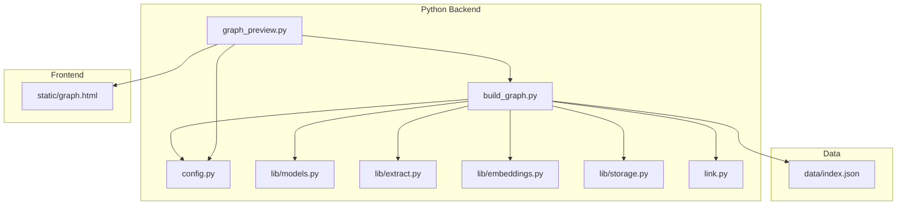
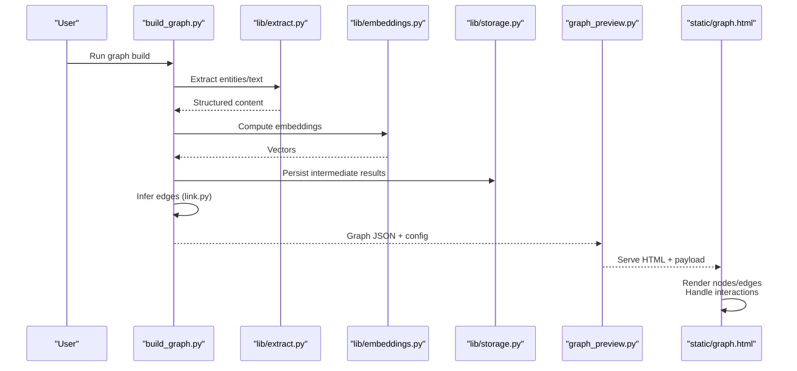
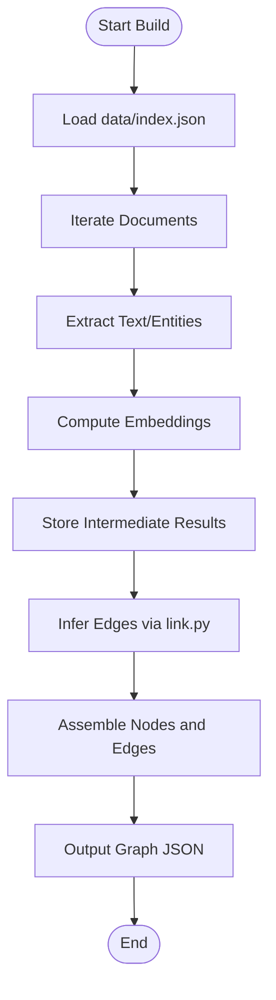
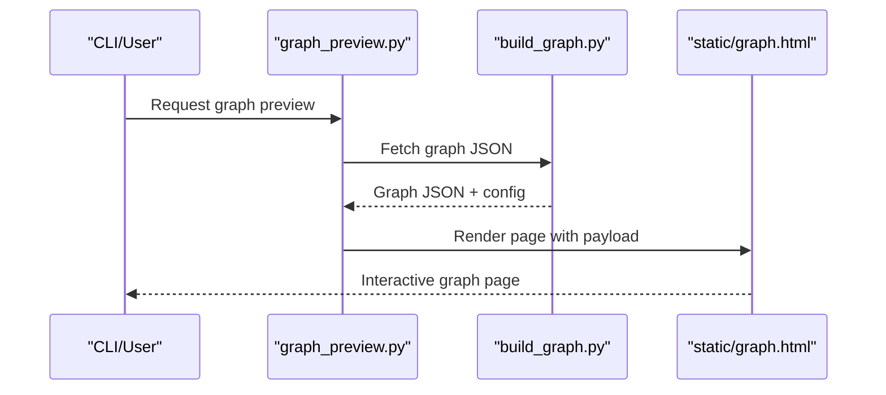
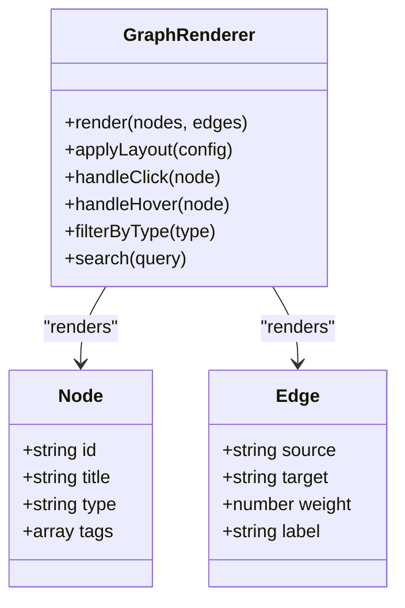
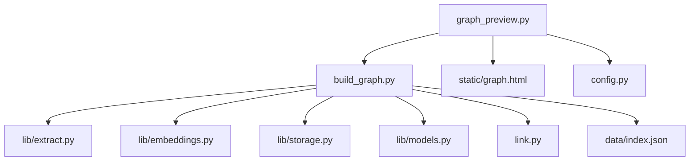

# Graph Visualization

<cite>
**Referenced Files in This Document**
- [build_graph.py](file://build_graph.py)
- [graph_preview.py](file://graph_preview.py)
- [static/graph.html](file://static/graph.html)
- [data/index.json](file://data/index.json)
- [config.py](file://config.py)
- [lib/models.py](file://lib/models.py)
- [lib/extract.py](file://lib/extract.py)
- [lib/embeddings.py](file://lib/embeddings.py)
- [lib/storage.py](file://lib/storage.py)
- [link.py](file://link.py)
- [README.md](file://README.md)
</cite>

## Table of Contents
1. [Introduction](#introduction)
2. [Project Structure](#project-structure)
3. [Core Components](#core-components)
4. [Architecture Overview](#architecture-overview)
5. [Detailed Component Analysis](#detailed-component-analysis)
6. [Dependency Analysis](#dependency-analysis)
7. [Performance Considerations](#performance-considerations)
8. [Troubleshooting Guide](#troubleshooting-guide)
9. [Conclusion](#conclusion)
10. [Appendices](#appendices)

## Introduction
This document explains the graph visualization system that discovers relationships between documents, constructs a knowledge graph, and renders it as an interactive HTML-based visualization. It covers how nodes and edges are created, how the graph is built from extracted content and embeddings, how the browser interface displays and allows interaction with the graph, and how to configure layout, styling, and interactions. It also includes guidance for customizing appearance, adding new elements, performance considerations for large datasets, and browser compatibility requirements.

## Project Structure
The graph visualization system spans Python scripts for building and previewing graphs, a static HTML page for rendering, and supporting libraries for extraction, embeddings, models, and storage. The key files involved are:
- build_graph.py: Orchestrates graph construction from data sources.
- graph_preview.py: Serves or generates the interactive graph view.
- static/graph.html: The client-side visualization and interaction logic.
- data/index.json: Index metadata used by the graph builder.
- config.py: Configuration options for behavior and defaults.
- lib/models.py, lib/extract.py, lib/embeddings.py, lib/storage.py: Core processing utilities.
- link.py: Utilities for linking and relationship discovery.

**Diagram sources**
- [build_graph.py](file://build_graph.py)
- [graph_preview.py](file://graph_preview.py)
- [static/graph.html](file://static/graph.html)
- [data/index.json](file://data/index.json)
- [config.py](file://config.py)
- [lib/models.py](file://lib/models.py)
- [lib/extract.py](file://lib/extract.py)
- [lib/embeddings.py](file://lib/embeddings.py)
- [lib/storage.py](file://lib/storage.py)
- [link.py](file://link.py)

**Section sources**
- [README.md](file://README.md)

## Core Components
- Graph Builder (build_graph.py): Reads index and source data, extracts text and entities, computes embeddings, identifies relationships, and produces a graph structure suitable for visualization.
- Preview Server (graph_preview.py): Generates or serves the HTML page with embedded graph data and configuration, enabling interactive exploration.
- Visualization Interface (static/graph.html): Renders nodes and edges, supports zoom/pan, filtering, search, and click interactions; consumes JSON payloads produced by the backend.
- Data Index (data/index.json): Provides metadata about documents and their locations, titles, and identifiers used to construct nodes.
- Configuration (config.py): Centralizes settings such as thresholds, layout parameters, and UI options.
- Libraries (lib/*): Provide extraction, embedding computation, model access, and storage utilities consumed by the builder and previewer.
- Linking Utilities (link.py): Implements heuristics or algorithms to discover relationships between documents based on content similarity, shared entities, or semantic proximity.

Key responsibilities:
- Node creation: Each document becomes a node with attributes like id, title, type, and optional tags.
- Edge creation: Relationships are inferred via extraction results, embeddings similarity, and linking rules.
- Rendering: The HTML interface visualizes the graph with configurable layout and styling.

**Section sources**
- [build_graph.py](file://build_graph.py)
- [graph_preview.py](file://graph_preview.py)
- [static/graph.html](file://static/graph.html)
- [data/index.json](file://data/index.json)
- [config.py](file://config.py)
- [lib/models.py](file://lib/models.py)
- [lib/extract.py](file://lib/extract.py)
- [lib/embeddings.py](file://lib/embeddings.py)
- [lib/storage.py](file://lib/storage.py)
- [link.py](file://link.py)

## Architecture Overview
The system follows a clear separation between data processing and visualization:
- Data ingestion and indexing feed into the graph builder.
- The builder uses extraction and embeddings to infer relationships and assemble a graph.
- The preview server packages the graph and configuration into an HTML page.
- The browser renders the graph interactively using JavaScript.

**Diagram sources**
- [build_graph.py](file://build_graph.py)
- [lib/extract.py](file://lib/extract.py)
- [lib/embeddings.py](file://lib/embeddings.py)
- [lib/storage.py](file://lib/storage.py)
- [link.py](file://link.py)
- [graph_preview.py](file://graph_preview.py)
- [static/graph.html](file://static/graph.html)

## Detailed Component Analysis

### Graph Builder (build_graph.py)
Responsibilities:
- Load index metadata and source documents.
- Orchestrate extraction and embedding pipelines.
- Apply linking strategies to create edges.
- Output a structured graph representation for visualization.

Processing flow:
- Read index entries and resolve file paths.
- Extract textual content and entities.
- Generate embeddings for each document.
- Compare embeddings and apply thresholds to determine edges.
- Aggregate nodes and edges into a final graph object.

**Diagram sources**
- [build_graph.py](file://build_graph.py)
- [data/index.json](file://data/index.json)
- [lib/extract.py](file://lib/extract.py)
- [lib/embeddings.py](file://lib/embeddings.py)
- [lib/storage.py](file://lib/storage.py)
- [link.py](file://link.py)

**Section sources**
- [build_graph.py](file://build_graph.py)
- [data/index.json](file://data/index.json)
- [lib/extract.py](file://lib/extract.py)
- [lib/embeddings.py](file://lib/embeddings.py)
- [lib/storage.py](file://lib/storage.py)
- [link.py](file://link.py)

### Preview Server (graph_preview.py)
Responsibilities:
- Prepare the graph payload and configuration.
- Serve or generate the HTML page with embedded data.
- Optionally expose endpoints to refresh or filter the graph.

Interaction:
- Receives graph JSON from the builder.
- Injects configuration options into the HTML template.
- Returns the rendered page to the browser.

**Diagram sources**
- [graph_preview.py](file://graph_preview.py)
- [build_graph.py](file://build_graph.py)
- [static/graph.html](file://static/graph.html)

**Section sources**
- [graph_preview.py](file://graph_preview.py)
- [static/graph.html](file://static/graph.html)

### Visualization Interface (static/graph.html)
Responsibilities:
- Parse the injected graph JSON.
- Render nodes and edges using a canvas/SVG approach.
- Implement interactions: zoom, pan, drag, click, hover, search, filter.
- Apply styling and layout configurations from the backend.

Key features:
- Node attributes display (title, type, tags).
- Edge labels and weights.
- Dynamic filtering by node type or edge weight.
- Search highlighting and focus-to-node actions.

**Diagram sources**
- [static/graph.html](file://static/graph.html)

**Section sources**
- [static/graph.html](file://static/graph.html)

### Data Index (data/index.json)
Purpose:
- Defines document entries with identifiers, paths, titles, and metadata.
- Used by the builder to iterate over sources and create nodes.

Structure highlights:
- Array of entries with unique ids and file references.
- Optional fields for categories, tags, and timestamps.

**Section sources**
- [data/index.json](file://data/index.json)

### Configuration (config.py)
Purpose:
- Centralizes thresholds for edge creation (similarity cutoffs).
- Defines default layout parameters (force-directed settings, spacing).
- Specifies UI options (colors, labels visibility, interaction toggles).

Usage:
- Consumed by both builder and preview server to ensure consistent behavior.

**Section sources**
- [config.py](file://config.py)

### Libraries (lib/models.py, lib/extract.py, lib/embeddings.py, lib/storage.py)
- models.py: Model definitions and schemas for nodes, edges, and metadata.
- extract.py: Text parsing, entity recognition, and content normalization.
- embeddings.py: Vector generation for documents and similarity computations.
- storage.py: Caching and persistence of intermediate results to speed up builds.

These modules provide reusable functionality for the builder and preview pipeline.

**Section sources**
- [lib/models.py](file://lib/models.py)
- [lib/extract.py](file://lib/extract.py)
- [lib/embeddings.py](file://lib/embeddings.py)
- [lib/storage.py](file://lib/storage.py)

### Linking Utilities (link.py)
Purpose:
- Implements relationship inference strategies.
- Combines embedding similarity with entity overlap and rule-based checks.
- Produces weighted edges reflecting confidence or relevance.

**Section sources**
- [link.py](file://link.py)

## Dependency Analysis
The graph system has clear dependencies:
- build_graph.py depends on extraction, embeddings, storage, models, and linking utilities.
- graph_preview.py depends on the builder output and the HTML template.
- static/graph.html depends on the injected JSON payload and configuration.

**Diagram sources**
- [build_graph.py](file://build_graph.py)
- [graph_preview.py](file://graph_preview.py)
- [static/graph.html](file://static/graph.html)
- [data/index.json](file://data/index.json)
- [config.py](file://config.py)
- [lib/models.py](file://lib/models.py)
- [lib/extract.py](file://lib/extract.py)
- [lib/embeddings.py](file://lib/embeddings.py)
- [lib/storage.py](file://lib/storage.py)
- [link.py](file://link.py)

**Section sources**
- [build_graph.py](file://build_graph.py)
- [graph_preview.py](file://graph_preview.py)
- [static/graph.html](file://static/graph.html)
- [data/index.json](file://data/index.json)
- [config.py](file://config.py)
- [lib/models.py](file://lib/models.py)
- [lib/extract.py](file://lib/extract.py)
- [lib/embeddings.py](file://lib/embeddings.py)
- [lib/storage.py](file://lib/storage.py)
- [link.py](file://link.py)

## Performance Considerations
- Batch processing: Process documents in batches to reduce memory pressure during extraction and embedding.
- Caching: Use storage utilities to cache embeddings and intermediate results; invalidate only when sources change.
- Similarity threshold tuning: Adjust thresholds to limit edge count and avoid dense graphs.
- Lazy loading: Defer heavy computations until user interactions require them (e.g., expanding clusters).
- Canvas vs SVG: Prefer canvas rendering for large graphs to improve frame rates.
- Pagination and sampling: For very large datasets, sample subsets or paginate nodes/edges.
- Browser limits: Be mindful of DOM size and memory usage; virtualize lists if needed.

[No sources needed since this section provides general guidance]

## Troubleshooting Guide
Common issues and resolutions:
- Missing index entries: Ensure data/index.json contains valid paths and ids; verify file accessibility.
- Empty graph: Check extraction logs and embedding outputs; confirm thresholds are not too strict.
- Slow rendering: Reduce node/edge counts, enable lazy loading, switch to canvas rendering.
- Interaction failures: Validate JSON payload structure; ensure required fields exist for nodes and edges.
- Styling inconsistencies: Confirm config values are applied; check CSS overrides in the HTML template.

Debugging steps:
- Inspect network payload for graph JSON correctness.
- Log extraction and embedding steps to identify failures.
- Use browser developer tools to inspect event handlers and performance metrics.

**Section sources**
- [data/index.json](file://data/index.json)
- [static/graph.html](file://static/graph.html)
- [config.py](file://config.py)

## Conclusion
The graph visualization system integrates document extraction, embeddings, and linking to produce an interactive knowledge graph. The builder constructs nodes and edges, while the preview server delivers a rich HTML interface for exploration. With configurable layout, styling, and interactions, users can tailor the visualization to their needs. Performance optimizations and careful threshold tuning ensure scalability for larger datasets.

[No sources needed since this section summarizes without analyzing specific files]

## Appendices

### Configuration Options
- Layout: Force-directed parameters, spacing, clustering radius.
- Styling: Node colors by type, edge colors by weight, label visibility.
- Interactions: Enable/disable zoom, pan, drag, hover tooltips, click actions.
- Thresholds: Similarity cutoffs for edge creation, minimum edge weight.

Apply these via config.py and pass them to the HTML renderer.

**Section sources**
- [config.py](file://config.py)
- [static/graph.html](file://static/graph.html)

### Customization Examples
- Add a new node type: Extend models and update builder to assign types; adjust renderer styles accordingly.
- Customize edge labels: Modify link.py to compute labels and inject into edge objects; update HTML to display them.
- Introduce clustering: Add clustering logic in the builder and render grouped nodes with collapsible sections.

[No sources needed since this section provides general guidance]

### Browser Compatibility Requirements
- Modern browsers with ES6+ support.
- Canvas API for efficient rendering.
- Web Workers optional for background processing.
- Avoid legacy IE-specific features; use polyfills if necessary.

[No sources needed since this section provides general guidance]