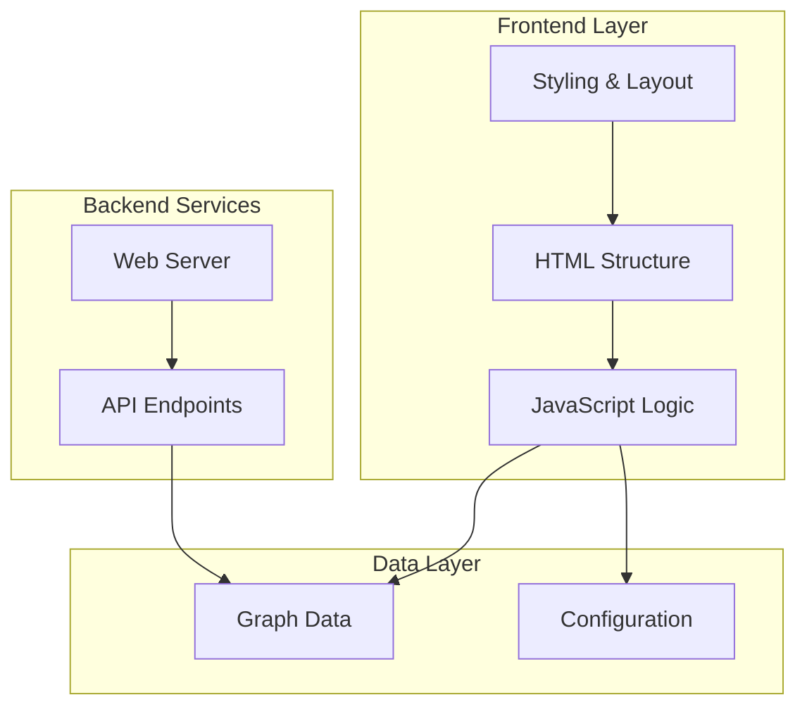
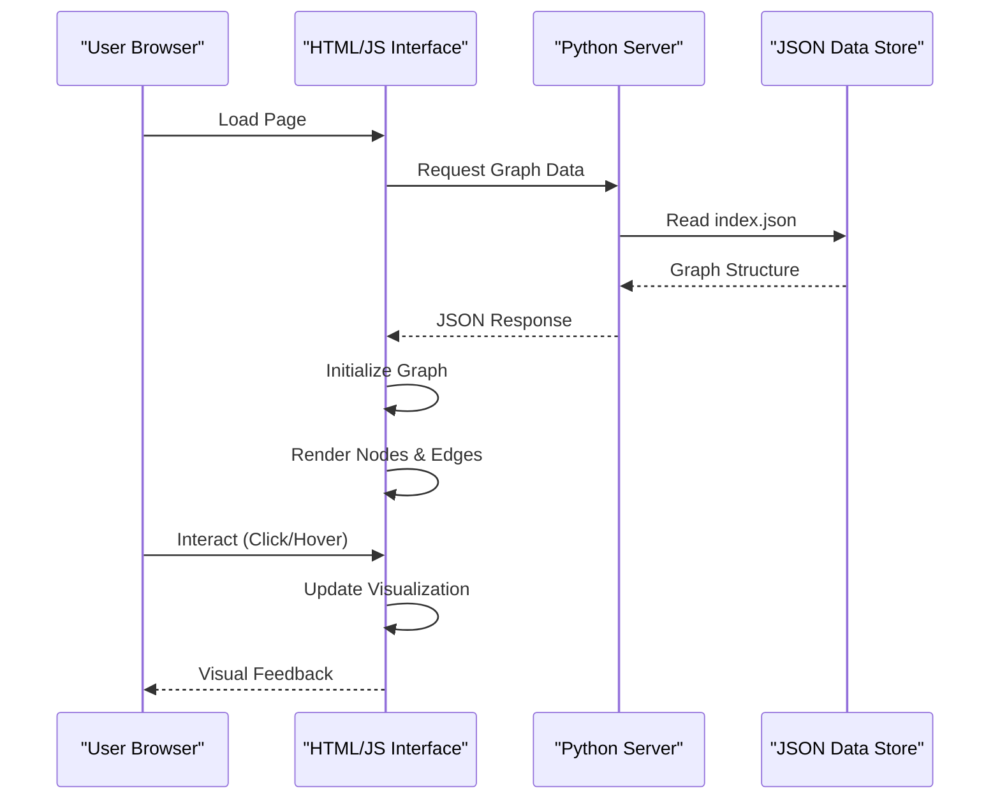
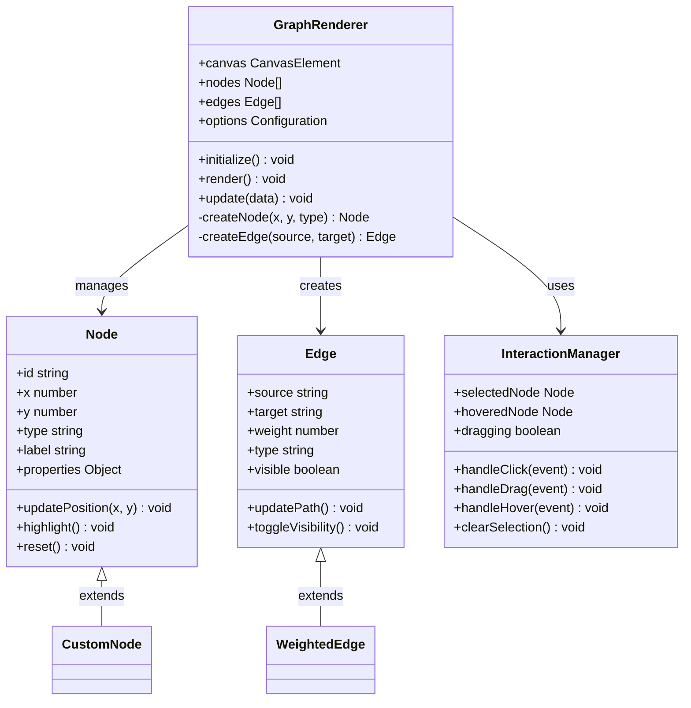
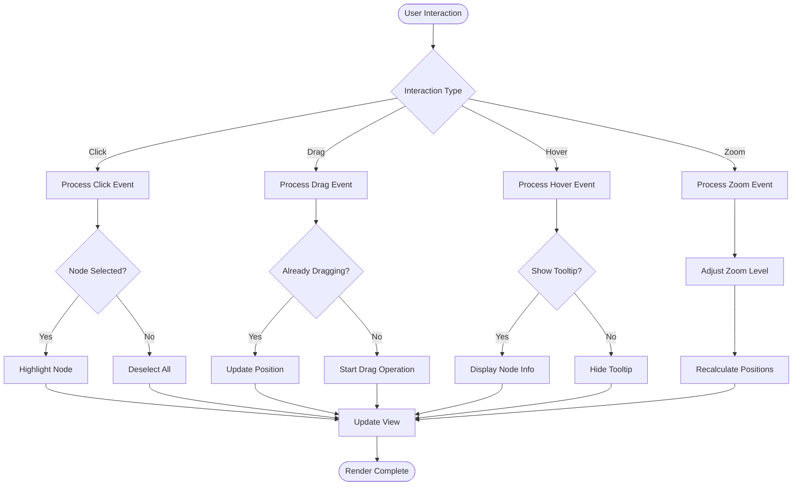
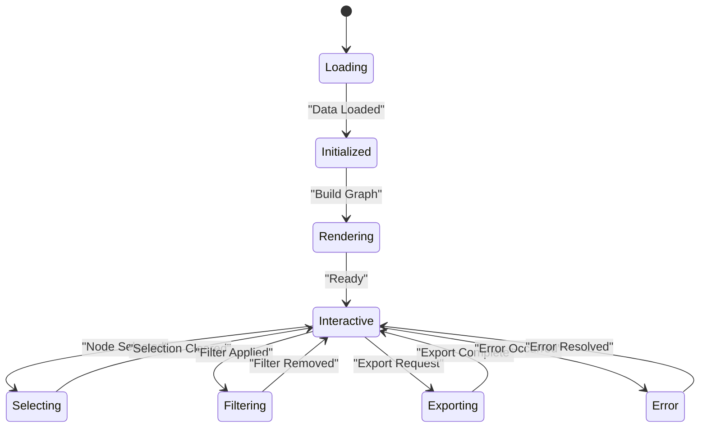
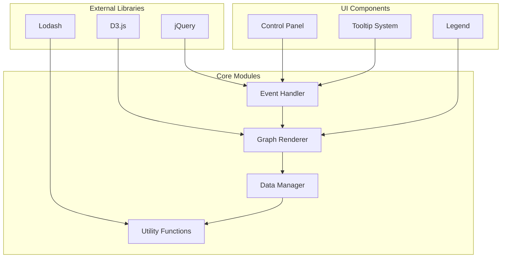

# Interactive Web Interface

<cite>
**Referenced Files in This Document**
- [graph.html](file://static/graph.html)
- [graph_preview.py](file://graph_preview.py)
- [index.json](file://data/index.json)
- [README.md](file://README.md)
- [config.py](file://config.py)
- [build_graph.py](file://build_graph.py)
</cite>

## Table of Contents
1. [Introduction](#introduction)
2. [Project Structure](#project-structure)
3. [Core Components](#core-components)
4. [Architecture Overview](#architecture-overview)
5. [Detailed Component Analysis](#detailed-component-analysis)
6. [Dependency Analysis](#dependency-analysis)
7. [Performance Considerations](#performance-considerations)
8. [Troubleshooting Guide](#troubleshooting-guide)
9. [Conclusion](#conclusion)
10. [Appendices](#appendices)

## Introduction

The Interactive Web Interface is a sophisticated graph visualization system designed to provide users with an intuitive way to explore complex data relationships through interactive network graphs. The interface combines modern web technologies with powerful graph rendering libraries to create responsive, feature-rich visualizations that support various interaction patterns including zooming, panning, node selection, and dynamic filtering.

This documentation covers the complete architecture of the web interface, from HTML-based visualization components to JavaScript functionality, event handling mechanisms, and responsive design implementation. It also provides guidance on customization options, performance optimization techniques, and browser compatibility requirements.

## Project Structure

The web interface follows a modular architecture with clear separation between presentation layer (HTML/CSS), business logic (JavaScript), and data management (JSON configuration). The main components include:

**Diagram sources**
- [graph.html:1-50](file://static/graph.html#L1-L50)
- [graph_preview.py:1-30](file://graph_preview.py#L1-L30)

**Section sources**
- [graph.html:1-100](file://static/graph.html#L1-L100)
- [graph_preview.py:1-50](file://graph_preview.py#L1-L50)

## Core Components

### HTML-Based Visualization Components

The HTML structure serves as the foundation for the interactive graph visualization. Key components include:

- **Container Elements**: Main div elements that host the graph canvas and control panels
- **Control Panels**: UI elements for user interactions like search, filter, and view options
- **Legend Components**: Visual guides explaining node types and connection meanings
- **Status Indicators**: Real-time feedback for user actions and system state

### JavaScript Functionality

The JavaScript layer implements core interactive features:

- **Graph Rendering Engine**: Handles initialization and rendering of network graphs
- **Event Management**: Processes user interactions like clicks, drags, and hover effects
- **Data Binding**: Connects JSON data structures to visual elements
- **Animation System**: Manages smooth transitions and visual effects

### Responsive Design Implementation

The interface adapts seamlessly across different screen sizes and devices through:

- **Flexible Grid Layouts**: CSS Grid and Flexbox for adaptive positioning
- **Media Queries**: Device-specific styling rules
- **Touch Support**: Mobile-friendly interaction patterns
- **Scalable Graphics**: Vector-based rendering that maintains quality at any zoom level

**Section sources**
- [graph.html:50-150](file://static/graph.html#L50-L150)
- [config.py:1-100](file://config.py#L1-100)

## Architecture Overview

The web interface follows a client-server architecture where the frontend handles all visualization logic while the backend provides data services.

**Diagram sources**
- [graph_preview.py:30-80](file://graph_preview.py#L30-L80)
- [index.json:1-50](file://data/index.json#L1-L50)

## Detailed Component Analysis

### Graph Rendering Engine

The core rendering engine uses a modern JavaScript library to create interactive network visualizations. The implementation focuses on performance and usability:

#### Class Diagram of Rendering Components

**Diagram sources**
- [graph.html:100-200](file://static/graph.html#L100-L200)
- [graph_preview.py:50-120](file://graph_preview.py#L50-L120)

#### Event Handling Mechanisms

The interface implements comprehensive event handling for rich user interactions:

**Diagram sources**
- [graph.html:150-250](file://static/graph.html#L150-L250)

### Data Flow and State Management

The interface maintains a clear separation between data models and their visual representations:

**Diagram sources**
- [graph_preview.py:80-150](file://graph_preview.py#L80-L150)

### Customization Options

The interface provides extensive customization capabilities through configuration objects:

#### Styling Configuration

Users can customize visual appearance through style parameters:

- **Color Schemes**: Define custom color palettes for nodes and edges
- **Typography**: Configure fonts, sizes, and text formatting
- **Layout Algorithms**: Choose between force-directed, hierarchical, or circular layouts
- **Animation Settings**: Control transition speeds and easing functions

#### Interaction Behaviors

Interactive features can be tailored through behavior configurations:

- **Selection Modes**: Single-select, multi-select, or range selection
- **Drag Operations**: Enable/disable dragging for nodes and groups
- **Zoom Controls**: Configure zoom limits and default zoom levels
- **Context Menus**: Customize right-click menu options

**Section sources**
- [graph.html:200-300](file://static/graph.html#L200-L300)
- [config.py:50-150](file://config.py#L50-L150)

## Dependency Analysis

The web interface has well-defined dependencies between components:

**Diagram sources**
- [graph.html:1-100](file://static/graph.html#L1-L100)
- [graph_preview.py:1-50](file://graph_preview.py#L1-L50)

**Section sources**
- [graph.html:1-50](file://static/graph.html#L1-L50)
- [graph_preview.py:1-30](file://graph_preview.py#L1-L30)

## Performance Considerations

### Optimization Techniques

The interface implements several performance optimization strategies:

- **Lazy Loading**: Load graph data incrementally as needed
- **Canvas Rendering**: Use HTML5 Canvas for large datasets instead of DOM manipulation
- **Debounced Events**: Prevent excessive event processing during rapid user interactions
- **Memory Management**: Proper cleanup of event listeners and object references
- **Virtual Scrolling**: Implement virtual scrolling for large lists and menus

### Browser Compatibility

The interface supports modern browsers with fallbacks for older versions:

- **Modern Browsers**: Full feature support in Chrome, Firefox, Safari, Edge
- **Legacy Support**: Graceful degradation in Internet Explorer 11+
- **Mobile Support**: Touch-optimized interactions for iOS and Android
- **Feature Detection**: Dynamic feature detection for optimal performance

### Memory Optimization

Key memory management strategies include:

- **Object Pooling**: Reuse frequently created objects to reduce garbage collection
- **Event Listener Cleanup**: Remove event listeners when components are destroyed
- **Image Caching**: Cache static assets to prevent repeated downloads
- **Data Compression**: Compress large JSON payloads using gzip encoding

## Troubleshooting Guide

### Common Issues and Solutions

#### Graph Not Loading

**Symptoms**: Blank canvas or loading spinner indefinitely
**Causes**: 
- Invalid JSON data format
- Network connectivity issues
- CORS policy restrictions

**Solutions**:
- Validate JSON structure against schema
- Check browser console for error messages
- Verify server configuration for cross-origin requests

#### Performance Issues

**Symptoms**: Slow rendering, laggy interactions, high CPU usage
**Causes**:
- Large dataset size
- Inefficient layout algorithms
- Excessive animation effects

**Solutions**:
- Implement data pagination or sampling
- Optimize layout algorithm parameters
- Reduce animation complexity or disable animations

#### Mobile Responsiveness

**Symptoms**: Poor touch interaction, layout breaking on small screens
**Causes**:
- Missing viewport meta tags
- Non-responsive CSS
- Touch event conflicts

**Solutions**:
- Add proper viewport configuration
- Implement mobile-first CSS approach
- Use touch event polyfills if needed

### Debugging Tools

The interface includes built-in debugging capabilities:

- **Console Logging**: Structured log output with severity levels
- **Performance Profiling**: Built-in performance metrics collection
- **Network Monitoring**: Request/response inspection tools
- **Memory Leak Detection**: Automated memory usage monitoring

**Section sources**
- [graph_preview.py:100-200](file://graph_preview.py#L100-L200)

## Conclusion

The Interactive Web Interface represents a comprehensive solution for graph visualization that balances functionality, performance, and user experience. Through its modular architecture, extensive customization options, and robust error handling, it provides a solid foundation for building sophisticated data exploration applications.

The implementation demonstrates best practices in modern web development, including responsive design principles, efficient data binding, and comprehensive event handling. The detailed customization capabilities allow developers to tailor the interface to specific use cases while maintaining consistent user experience patterns.

Future enhancements could include advanced analytics features, real-time collaboration capabilities, and integration with additional data sources. The modular design ensures that new features can be added without disrupting existing functionality.

## Appendices

### A. Installation and Setup

#### Prerequisites
- Modern web browser (Chrome, Firefox, Safari, Edge)
- Python 3.7+ for backend services
- Node.js for development tools

#### Quick Start
1. Clone the repository
2. Install Python dependencies
3. Generate graph data
4. Start the web server
5. Access the interface in your browser

### B. API Reference

#### Configuration Options

| Option | Type | Default | Description |
|--------|------|---------|-------------|
| `layout` | string | `"force"` | Layout algorithm to use |
| `colors` | object | `{}` | Color scheme configuration |
| `animation` | boolean | `true` | Enable/disable animations |
| `zoom` | object | `{min: 0.1, max: 5}` | Zoom level constraints |
| `selection` | string | `"single"` | Selection mode |

#### Event Handlers

| Event | Parameters | Description |
|-------|------------|-------------|
| `nodeClick` | `{node, event}` | Fired when a node is clicked |
| `edgeClick` | `{edge, event}` | Fired when an edge is clicked |
| `zoomChange` | `{level, center}` | Fired when zoom level changes |
| `filterChange` | `{filters}` | Fired when filters are modified |

### C. Extension Examples

#### Adding Search Functionality

To implement search functionality:

1. Create search input element in HTML
2. Add event listener for input changes
3. Implement search algorithm to filter nodes
4. Update graph visualization with filtered results
5. Provide visual feedback for search results

#### Implementing Annotation Tools

For annotation capabilities:

1. Add annotation layer to the canvas
2. Implement drawing tools for shapes and text
3. Store annotations in separate data structure
4. Persist annotations to backend storage
5. Provide export/import functionality

**Section sources**
- [README.md:1-100](file://README.md#L1-L100)
- [build_graph.py:1-50](file://build_graph.py#L1-L50)