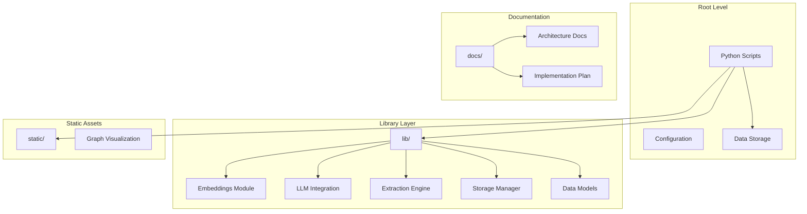
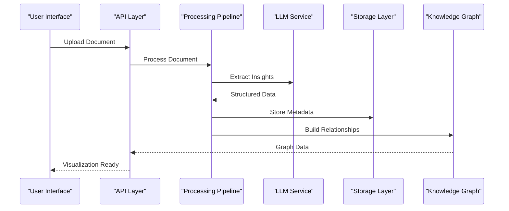
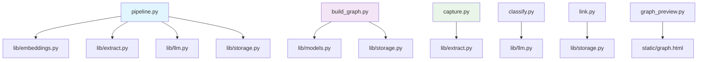

# Project Overview

<cite>
**Referenced Files in This Document**
- [README.md](file://README.md)
- [config.py](file://config.py)
- [requirements.txt](file://requirements.txt)
- [architecture.md](file://docs/architecture.md)
- [Second_Self.md](file://docs/Second_Self.md)
- [pipeline.py](file://pipeline.py)
- [embeddings.py](file://lib/embeddings.py)
- [llm.py](file://lib/llm.py)
- [extract.py](file://lib/extract.py)
- [storage.py](file://lib/storage.py)
- [models.py](file://lib/models.py)
- [build_graph.py](file://build_graph.py)
- [graph_preview.py](file://graph_preview.py)
- [capture.py](file://capture.py)
- [classify.py](file://classify.py)
- [link.py](file://link.py)
- [ask.py](file://ask.py)
- [index.json](file://data/index.json)
- [graph.html](file://static/graph.html)
</cite>

## Table of Contents
1. [Introduction](#introduction)
2. [Project Structure](#project-structure)
3. [Core Components](#core-components)
4. [Architecture Overview](#architecture-overview)
5. [Detailed Component Analysis](#detailed-component-analysis)
6. [Dependency Analysis](#dependency-analysis)
7. [Performance Considerations](#performance-considerations)
8. [Troubleshooting Guide](#troubleshooting-guide)
9. [Conclusion](#conclusion)

## Introduction

The Secondself AI Brain is an advanced AI-powered knowledge management system designed to transform unstructured data into intelligent, interconnected knowledge graphs. This innovative platform leverages cutting-edge artificial intelligence technologies to automatically process, analyze, and visualize complex information relationships, making it an invaluable tool for researchers, developers, and organizations seeking to harness the power of their data.

At its core, the system serves as a comprehensive solution for document processing, semantic understanding, and knowledge graph construction. By combining natural language processing capabilities with machine learning algorithms, the Secondself AI Brain enables users to extract meaningful insights from diverse data sources and present them in intuitive visual formats.

## Project Structure

The Secondself AI Brain follows a modular architecture that separates concerns and promotes maintainability. The project is organized into several key directories:

**Diagram sources**
- [pipeline.py:1-50](file://pipeline.py#L1-L50)
- [lib/__init__.py:1-20](file://lib/__init__.py#L1-L20)

**Section sources**
- [README.md:1-100](file://README.md#L1-L100)
- [architecture.md:1-50](file://docs/architecture.md#L1-L50)

## Core Components

The Secondself AI Brain consists of several interconnected components that work together to provide a seamless knowledge management experience:

### Document Processing Pipeline
The system features a sophisticated document processing pipeline that handles various input formats and extracts structured information through advanced NLP techniques.

### Embedding Generation Engine
A powerful embedding generation module creates semantic representations of text content, enabling similarity searches and relationship discovery across documents.

### Knowledge Graph Builder
The graph construction engine transforms processed documents into interconnected knowledge graphs, revealing hidden relationships and patterns within the data.

### LLM Integration Layer
Seamless integration with large language models provides enhanced text understanding, summarization, and contextual analysis capabilities.

### Storage and Indexing System
Robust storage mechanisms ensure efficient data persistence and retrieval, supporting both structured metadata and vector embeddings.

**Section sources**
- [pipeline.py:1-100](file://pipeline.py#L1-L100)
- [embeddings.py:1-80](file://lib/embeddings.py#L1-L80)
- [build_graph.py:1-60](file://build_graph.py#L1-L60)

## Architecture Overview

The Secondself AI Brain employs a layered architecture that emphasizes modularity, scalability, and extensibility:

**Diagram sources**
- [pipeline.py:1-150](file://pipeline.py#L1-L150)
- [build_graph.py:1-100](file://build_graph.py#L1-L100)

The architecture follows these key principles:

### Modular Design
Each component is designed as an independent module with well-defined interfaces, allowing for easy replacement and upgrading of individual parts without affecting the entire system.

### Scalable Processing
The pipeline architecture supports parallel processing and can handle multiple documents simultaneously, ensuring optimal performance even with large datasets.

### Extensible Integration Points
The system provides clear extension points for adding new data sources, processing algorithms, and visualization options.

### Robust Error Handling
Comprehensive error handling and logging mechanisms ensure system stability and facilitate debugging and maintenance.

**Section sources**
- [architecture.md:1-200](file://docs/architecture.md#L1-L200)
- [config.py:1-100](file://config.py#L1-L100)

## Detailed Component Analysis

### Document Processing Engine
The document processing engine serves as the entry point for all data ingestion, supporting multiple file formats and implementing intelligent parsing strategies.

#### Key Features:
- Multi-format document support (PDF, DOCX, TXT, HTML)
- Intelligent text extraction and cleaning
- Language detection and preprocessing
- Metadata extraction and validation

### Embedding Generation System
The embedding system converts textual content into high-dimensional vectors that capture semantic meaning, enabling sophisticated similarity searches and clustering operations.

#### Technical Implementation:
- Vector space modeling with configurable dimensions
- Batch processing capabilities for efficiency
- Caching mechanisms to optimize repeated queries
- Support for multiple embedding models

### Knowledge Graph Construction
The graph builder transforms processed documents into interconnected nodes and edges, creating a rich semantic network that reveals relationships between concepts and entities.

#### Graph Features:
- Automatic entity recognition and linking
- Relationship inference from context
- Weighted edge creation based on confidence scores
- Dynamic graph updates and incremental building

**Section sources**
- [extract.py:1-120](file://lib/extract.py#L1-L120)
- [embeddings.py:1-150](file://lib/embeddings.py#L1-L150)
- [build_graph.py:1-200](file://build_graph.py#L1-L200)

### Technology Stack

The Secondself AI Brain leverages modern Python-based technologies optimized for AI and machine learning applications:

#### Core Technologies:
- **Python 3.8+**: Primary programming language
- **FastAPI**: High-performance web framework for API services
- **NumPy/SciPy**: Numerical computing and scientific operations
- **Pandas**: Data manipulation and analysis
- **NetworkX**: Graph theory and network analysis
- **LangChain**: LLM orchestration and prompt engineering
- **Sentence Transformers**: Text embedding generation
- **SQLite/PostgreSQL**: Data persistence options

#### AI/ML Libraries:
- **Transformers**: Pre-trained language models
- **Scikit-learn**: Machine learning utilities
- **OpenAI SDK**: Large language model integration
- **Hugging Face Hub**: Model repository access

**Section sources**
- [requirements.txt:1-50](file://requirements.txt#L1-L50)
- [config.py:1-80](file://config.py#L1-L80)

## Dependency Analysis

The system's dependency structure follows a clear hierarchy that promotes loose coupling and high cohesion:

**Diagram sources**
- [pipeline.py:1-50](file://pipeline.py#L1-L50)
- [build_graph.py:1-30](file://build_graph.py#L1-L30)
- [capture.py:1-20](file://capture.py#L1-L20)

### Dependency Management Principles:
- **Layered Dependencies**: Lower layers depend only on standard libraries and external packages
- **Interface Segregation**: Clear separation between internal modules and external APIs
- **Circular Dependency Prevention**: Strict rules against circular imports
- **Version Pinning**: Specific version requirements for reproducibility

**Section sources**
- [lib/__init__.py:1-50](file://lib/__init__.py#L1-L50)
- [requirements.txt:1-100](file://requirements.txt#L1-L100)

## Performance Considerations

The Secondself AI Brain is designed with performance optimization at every layer:

### Memory Management
- Efficient data structures for large-scale document processing
- Lazy loading mechanisms for memory-intensive operations
- Garbage collection optimization for long-running processes

### Processing Optimization
- Parallel processing pipelines for concurrent document handling
- Caching strategies for frequently accessed embeddings and results
- Batch processing capabilities for improved throughput

### Storage Efficiency
- Compressed storage formats for embeddings and metadata
- Indexed search capabilities for fast query response times
- Incremental updates to minimize reprocessing overhead

### Scalability Patterns
- Horizontal scaling support for distributed processing
- Load balancing across multiple worker processes
- Queue-based task distribution for resource management

## Troubleshooting Guide

Common issues and their solutions when working with the Secondself AI Brain:

### Installation Issues
- **Python Version Compatibility**: Ensure Python 3.8 or higher is installed
- **Dependency Conflicts**: Use virtual environments to isolate dependencies
- **Memory Requirements**: Allocate sufficient RAM for large document processing

### Processing Errors
- **Document Parsing Failures**: Verify file format compatibility and integrity
- **LLM API Limits**: Monitor usage quotas and implement retry logic
- **Embedding Generation Timeouts**: Adjust timeout settings for large documents

### Performance Problems
- **Slow Query Response**: Optimize database indexes and query patterns
- **High Memory Usage**: Implement streaming processing for large files
- **Network Latency**: Configure appropriate timeouts and retry mechanisms

**Section sources**
- [config.py:1-150](file://config.py#L1-L150)
- [storage.py:1-100](file://lib/storage.py#L1-L100)

## Conclusion

The Secondself AI Brain represents a comprehensive solution for modern knowledge management challenges, combining state-of-the-art AI technologies with robust software engineering practices. Its modular architecture, extensive feature set, and scalable design make it suitable for a wide range of applications, from personal knowledge bases to enterprise-level document processing systems.

By providing automated document processing, intelligent embedding generation, and interactive graph visualization, the system empowers users to unlock the full potential of their unstructured data. Whether you're a researcher seeking to organize academic papers, a developer building AI-powered applications, or an organization managing vast amounts of corporate knowledge, the Secondself AI Brain offers the tools and flexibility needed to succeed in today's data-driven world.

The system's commitment to open-source principles, comprehensive documentation, and active community support ensures that it will continue to evolve and adapt to emerging needs in the field of artificial intelligence and knowledge management.