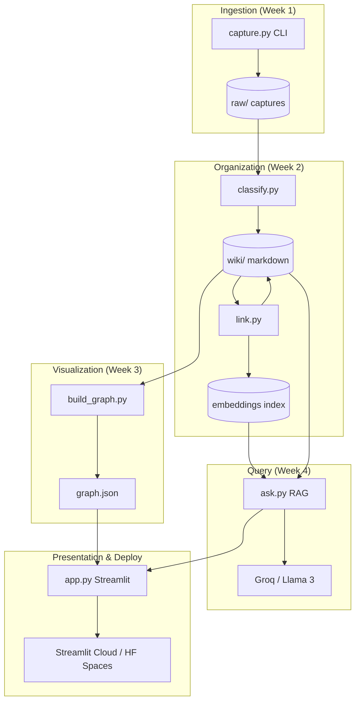
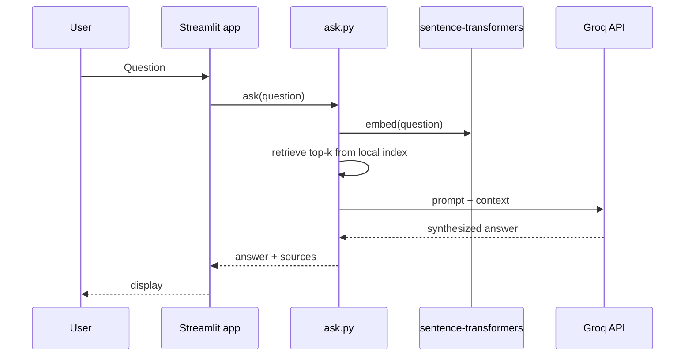
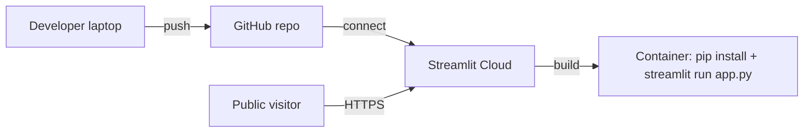

# SecondSelf — System Architecture

This document describes **how** to build SecondSelf: a personal AI second brain that captures knowledge, self-organizes via PARA and embeddings, visualizes relationships as an interactive graph, and answers questions with retrieval-augmented generation (RAG) over your own notes—deployed as a single public web app.

---

## 1. Vision and Scope

### 1.1 Problem

Traditional note apps optimize for **input** but not **retrieval** or **synthesis**. Captures accumulate; folders and tags decay; knowledge does not compound.

### 1.2 Product Definition

SecondSelf is **not** a generic notes app or chatbot. It is a pipeline plus experience:

| Stage | Capability |
|-------|------------|
| Capture | One command ingests note, URL, or file into immutable raw storage |
| Organize | LLM assigns PARA category, tags, summary; embeddings link related wiki notes |
| Visualize | Force-directed graph from wiki links with hover, drag, zoom |
| Query | Natural-language Q&A grounded in retrieved wiki content |
| Ship | Streamlit app (graph + ask) on a public URL |

### 1.3 Out of Scope (MVP)

- Multi-user auth and tenancy (single-user brain; deployment may be public read-only or demo)
- Real-time collaborative editing
- Mobile-native clients
- Paid LLM tiers (MVP targets free Groq + local embeddings)

---

## 2. High-Level Architecture



### 2.1 Architectural Style

- **Modular monolith**: Python modules invoked by CLI and imported by Streamlit; no microservices for MVP.
- **File-system as source of truth**: `raw/` append-only captures; `wiki/` curated markdown with front matter and wikilinks.
- **Batch + on-demand**: Classification/linking run as pipeline scripts; graph rebuild on demand; ask() at request time in the app.

---

## 3. Repository and Directory Layout

```
secondself/
├── raw/                      # Week 1: immutable captures (JSON or markdown envelopes)
├── wiki/                     # Week 2+: organized notes (PARA paths, links, metadata)
├── data/                     # Optional: embedding cache, FAISS/chroma index (recommended)
│   ├── embeddings.pkl
│   └── index/                # if using vector store abstraction
├── graph.json                # Week 3: exported nodes/edges for UI
├── capture.py                # Week 1
├── classify.py               # Week 2.1
├── link.py                   # Week 2.2
├── build_graph.py            # Week 3.1
├── ask.py                    # Week 4.1
├── app.py                    # Week 4.2 Streamlit
├── pipeline.py               # Optional: orchestrate classify → link → build_graph
├── config.py                 # Paths, thresholds, API keys from env
├── requirements.txt
├── README.md
├── architecture.md           # This document
├── implementation-plan.md    # Phase-wise build plan
└── edge-case.md              # Corner cases
```

**Design choice**: Keep `wiki/` human-readable (Markdown + YAML front matter) so the brain survives without the app and diffs cleanly in Git.

---

## 4. Data Models

### 4.1 Raw Capture (`raw/`)

Each capture is a self-contained record:

```yaml
# Envelope (JSON file: raw/{id}.json OR raw/{timestamp}_{id}.md with front matter)
id: "uuid-v4"
captured_at: "ISO-8601 UTC"
source_type: "note" | "link" | "file"
content: "string or extracted text"
metadata:
  original_filename: optional
  url: optional
  mime_type: optional
  file_path_ref: optional   # relative path if binary stored alongside
```

**Rules**

- **Unique ID**: UUID v4 (or ULID for sortable IDs).
- **Timestamp**: UTC ISO-8601 at capture time.
- **Files**: Store binary under `raw/files/{id}/` or inline text extraction for PDFs (future: pdfplumber/pymupdf).

### 4.2 Wiki Note (`wiki/`)

Organized note produced from raw (or updated on re-classify):

```yaml
---
id: "same-as-raw-or-wiki-id"
raw_id: "uuid linking back to raw"
para: "Projects" | "Areas" | "Resources" | "Archives"
tags: ["tag1", "tag2"]
summary: "One-line summary"
title: "Human title"
created_at: ISO-8601
updated_at: ISO-8601
links: ["other-note-id", ...]   # optional mirror of wikilinks
embedding_version: "model-name@version"
---

# Title

Body with [[wikilink-to-other-id]] auto-inserted by link.py
```

**PARA path convention** (recommended):

```
wiki/
  Projects/{slug}.md
  Areas/{slug}.md
  Resources/{slug}.md
  Archives/{slug}.md
```

### 4.3 Graph Export (`graph.json`)

```json
{
  "meta": { "generated_at": "ISO-8601", "note_count": 0, "edge_count": 0 },
  "nodes": [
    {
      "id": "note-uuid",
      "label": "Title",
      "para": "Resources",
      "tags": ["..."],
      "summary": "...",
      "path": "wiki/Resources/foo.md"
    }
  ],
  "edges": [
    { "source": "id-a", "target": "id-b", "type": "wikilink" | "similarity" }
  ]
}
```

Separate **wikilink edges** (explicit) from **similarity edges** (optional visual distinction in UI).

### 4.4 Embedding Index

In-memory or persisted map:

```
note_id → float[] vector (dimension = model output, e.g. 384)
```

Persist to `data/embeddings.pkl` or use `numpy` `.npy` + JSON id list to avoid recomputation on every run.

---

## 5. Component Specifications

### 5.1 `capture.py` — The Archivist (Week 1)

**Responsibility**: Single entry point for all ingestion.

**Interface**

```text
python capture.py note "text..."
python capture.py link "https://..."
python capture.py file "./path/to/doc.pdf"
```

**Behavior**

1. Parse CLI args; detect type.
2. For links: optionally fetch title/description (httpx + readability-lite or manual store URL only for MVP).
3. Generate `id`, `captured_at`.
4. Write envelope to `raw/`.
5. Print capture id and path (for scripting).

**Dependencies**: `uuid`, `datetime`, `pathlib`, optional `httpx`.

---

### 5.2 `classify.py` — The Sorting Hat (Week 2.1)

**Responsibility**: Transform unprocessed raw items into wiki notes with PARA + tags + summary.

**Flow**

1. List `raw/` items without corresponding `wiki/` entry (or `--force` reprocess).
2. For each item, build LLM prompt with PARA definitions and raw content (truncate to token budget).
3. Call Groq API (Llama 3) with structured output request (JSON schema: `para`, `tags`, `summary`, `title`).
4. Write markdown file under correct PARA folder; set `raw_id` in front matter.
5. Log failures; skip or quarantine malformed responses.

**Configuration** (`config.py`)

- `GROQ_API_KEY` from environment
- Model id, max tokens, temperature (low for classification)

**Idempotency**: Key wiki files by `raw_id` or `id` to avoid duplicates on re-run.

---

### 5.3 `link.py` — Connect the Dots (Week 2.2)

**Responsibility**: Embedding generation and automatic wikilink insertion between related notes.

**Flow**

1. Load all wiki notes; extract plain text (front matter stripped).
2. Encode with `sentence-transformers` (local, e.g. `all-MiniLM-L6-v2`).
3. Update embedding cache for new/changed notes (hash body to detect changes).
4. For each new/changed note, compute cosine similarity against all others in `wiki/`.
5. If `similarity >= THRESHOLD` (start ~0.75–0.85; tune on real data), append `[[linked-id-or-slug]]` in a "Related" section or inline per product taste.
6. Optionally write symmetric links (both notes link to each other).
7. Persist embeddings.

**Performance**: For N < few thousand notes, brute-force similarity is fine; use matrix multiply (`numpy`) for batch.

---

### 5.4 `build_graph.py` — The Cartographer (Week 3.1)

**Responsibility**: Derive graph structure from wiki.

**Flow**

1. Walk `wiki/**/*.md`.
2. Parse front matter + wikilink regex `\[\[([^\]]+)\]\]`.
3. Resolve link targets to note ids (by id, slug, or filename).
4. Emit `graph.json` with nodes and edges.
5. Include orphan nodes (no edges) so the graph is complete.

**Validation**: Report unresolved links in stderr for manual fix.

---

### 5.5 Interactive Graph (Week 3.2)

**Responsibility**: Render `graph.json` in the browser.

**Options**

| Library | Pros | Integration with Streamlit |
|---------|------|----------------------------|
| vis-network | Fast setup, good physics | `st.components.v1.html` embed |
| Cytoscape.js | Rich styling | Same embed pattern |

**UX requirements**

- Force-directed layout, drag nodes, zoom/pan
- Hover tooltip: title, summary, snippet of body
- Optional: color by PARA category

**Data path**: App reads `graph.json` at startup or offers "Rebuild graph" button that shells out to `build_graph.py`.

---

### 5.6 `ask.py` — The Oracle (Week 4.1)

**Responsibility**: RAG Q&A over personal wiki.

**Algorithm**

```text
ask(question: str) -> { answer: str, sources: [{ id, title, path, score }] }

1. Embed question with same model as link.py
2. Retrieve top-k notes by cosine similarity (k = 5–10)
3. Build context block: title + summary + truncated body per note
4. Prompt LLM (Groq): "Answer using ONLY the following notes; cite note titles; say if insufficient"
5. Return answer + source list for UI
```

**Guardrails**

- Max context length; truncate notes by relevance chunking (future).
- Temperature moderate-low for factual synthesis.
- Empty wiki → graceful message.

---

### 5.7 `app.py` — Streamlit Shell (Week 4.2)

**Layout (suggested)**

- **Sidebar**: PARA stats, "Run pipeline", link to GitHub
- **Tab 1 — Brain**: Embedded graph (full width)
- **Tab 2 — Ask**: Text input, submit, answer markdown, expandable sources

**Runtime**

- Load `graph.json` for visualization
- Import `ask()` from `ask.py`
- Secrets: `st.secrets` / env for `GROQ_API_KEY` on Streamlit Cloud

**Optional pipeline buttons** (demo mode): subprocess `classify.py`, `link.py`, `build_graph.py` with spinner (document security implications on public deploy—prefer local-only pipeline for production brain).

---

## 6. End-to-End Pipelines

### 6.1 Happy Path (Developer Machine)

```text
capture → raw/
python classify.py        → wiki/
python link.py            → wiki/ (updated links) + data/embeddings
python build_graph.py     → graph.json
streamlit run app.py      → local UI
python -c "from ask import ask; print(ask('...'))"
```

### 6.2 Optional `pipeline.py`

Single command for Weeks 2–3 refresh:

```text
python pipeline.py --from raw --steps classify,link,graph
```

---

## 7. Technology Stack

| Layer | Choice | Rationale |
|-------|--------|-----------|
| Language | Python 3.10+ | Spec alignment, ML ecosystem |
| Capture CLI | argparse or typer | Simple one-command UX |
| LLM | Groq + Llama 3 | Free tier, fast inference |
| Embeddings | sentence-transformers | Local, no API cost |
| Wiki format | Markdown + YAML front matter | Portable, Git-friendly |
| Graph UI | vis-network or Cytoscape.js | Spec requirement |
| App host | Streamlit | Rapid full-stack for graph + ask |
| Deploy | Streamlit Community Cloud or HF Spaces | Public URL |
| HTTP (links) | httpx | Optional metadata fetch |
| Config | python-dotenv + env vars | Keys not in repo |

### 7.1 `requirements.txt` (indicative)

```
streamlit
groq
sentence-transformers
torch  # CPU ok for MiniLM
pyyaml
python-frontmatter
numpy
httpx
typer  # optional
```

Pin versions in implementation for reproducible deploys.

---

## 8. External Integrations



**Groq**: Used in `classify.py` and `ask.py`. Rate limits → batch classify with sleep/backoff; cache classifications in wiki files.

**No embedding API**: Keeps cost at zero and privacy local.

---

## 9. Configuration and Secrets

| Variable | Used by | Notes |
|----------|---------|-------|
| `GROQ_API_KEY` | classify, ask | Required for LLM features |
| `SIMILARITY_THRESHOLD` | link | Default 0.80 |
| `TOP_K_RETRIEVAL` | ask | Default 8 |
| `EMBEDDING_MODEL` | link, ask | e.g. `all-MiniLM-L6-v2` |
| `RAW_DIR`, `WIKI_DIR` | all | Override for tests |

Never commit `.env`; document `.env.example`.

---

## 10. Deployment Architecture



**Artifacts on deploy**

- Code + `requirements.txt`
- `graph.json` may be committed or built in CI (for static demo, commit generated graph from your notes)
- Wiki content: **personal data** — for public portfolio, use sanitized demo wiki or private deploy

**Secrets**: Configure `GROQ_API_KEY` in Streamlit secrets.

**Cold start**: sentence-transformers model download on first run—cache in deployment or use smaller model; document first-load delay.

---

## 11. Cross-Cutting Concerns

### 11.1 Observability

- Structured logging in each script (`logging` module): capture id, paths, API errors.
- `classify.py`: log token usage approximations.

### 11.2 Error Handling

- LLM JSON parse failures → retry once with "JSON only" reminder; else skip item to `raw/failed/`.
- Missing `graph.json` → app shows instructions to run `build_graph.py`.
- Groq outage → ask() returns error with retry message.

### 11.3 Security (Public URL)

- Do not expose arbitrary file upload on public app without auth.
- If pipeline subprocess is enabled in cloud app, disable or protect (admin password) to prevent RCE via captured files.
- Sanitize HTML when embedding graph tooltips.

### 11.4 Privacy

- User's brain data lives in repo or private volume; clarify in README for deployers.

---

## 12. Mapping Architecture to Weekly Milestones

| Week | Badge | Architecture components | Primary artifacts |
|------|-------|-------------------------|-------------------|
| 1 | Archivist | `capture.py`, `raw/`, `wiki/` scaffold | 10+ raw captures |
| 2 | Librarian | `classify.py`, `link.py`, embedding cache | 15+ wiki notes, links |
| 3 | Cartographer | `build_graph.py`, graph UI embed | `graph.json`, interactive graph |
| 4 | Oracle | `ask.py`, `app.py`, deploy | Public URL, E2E RAG |

---

## 13. Testing Strategy

| Level | What | How |
|-------|------|-----|
| Manual E2E | Full pipeline | Real notes, not fixtures |
| Unit | Wikilink parse, similarity, front matter | pytest on small markdown samples |
| Integration | classify with mocked Groq | Optional vcr/mock |
| UI | Graph load, ask bar | Manual + Streamlit app test mode |

Acceptance criteria from `Second_Self.md` map directly to E2E checks before each weekly badge.

---

## 14. Future Extensions (Post-MVP)

- Incremental capture from browser extension
- PDF/text extraction pipeline in `capture.py`
- Chunk-level RAG with citations to paragraphs
- SQLite metadata index for faster search
- Private auth (OAuth) for multi-device capture
- Scheduled pipeline (GitHub Action cron) to refresh graph

---

## 15. Architecture Decision Records (Summary)

| Decision | Choice | Alternatives rejected |
|----------|--------|------------------------|
| Storage | File-based raw/wiki | DB-first ( heavier for MVP) |
| PARA | LLM-assigned | Manual folders only |
| Linking | Embedding similarity + wikilinks | Manual tags |
| UI | Streamlit monolith | Separate React SPA (more work) |
| LLM host | Groq | OpenAI paid, local llama.cpp (heavier) |
| Graph format | JSON export | Live parse in browser (slower) |

---

## 16. Success Criteria (System Level)

The architecture is satisfied when:

1. One command captures note, link, and file with timestamp + unique ID.
2. Raw pipeline produces PARA-organized wiki with tags, summaries, and auto-links without manual tagging.
3. `graph.json` drives an interactive force-directed graph with hover, drag, and zoom on real notes.
4. `ask()` returns answers synthesized from retrieved wiki content via Groq.
5. A single Streamlit deployment exposes graph + ask on a public URL with documented setup in README.

This document is the reference for `implementation-plan.md`, `edge-case.md`, and phased implementation in Cursor.
