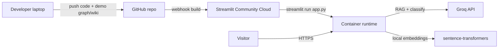

# SecondSelf — Streamlit Deployment Plan

Deploy the SecondSelf web app (`app.py`) to **Streamlit Community Cloud** so visitors get a public URL with the knowledge graph and **Ask your brain** RAG search.

**Entry point:** `streamlit run app.py`  
**Target platform:** [Streamlit Community Cloud](https://streamlit.io/cloud) (primary)  
**References:** [architecture.md §10](./architecture.md), [implementation-plan.md §Phase 8](./implementation-plan.md), [edge-case.md §7](./edge-case.md)

---

## 1. What gets deployed

| Component | Role on deploy |
|-----------|----------------|
| `app.py` | Main Streamlit UI — graph, ask bar, sidebar capture/pipeline |
| `graph_component.py` + `static/` | Interactive vis-network graph (inlined JSON in iframe) |
| `ask.py` + `lib/` | RAG retrieval and Groq answer synthesis |
| `classify.py`, `link.py`, `build_graph.py` | Invoked in-process by sidebar pipeline buttons |
| `config.py` | Paths, thresholds, API key |
| `requirements.txt` | Pinned Python dependencies (includes `torch`, `sentence-transformers`) |

**Data artifacts** (not generated at build time on Streamlit Cloud):

| Artifact | Default location | Deploy note |
|----------|------------------|-------------|
| `wiki/` | PARA Markdown notes | **Personal data** — use a sanitized demo set for public deploy |
| `graph.json` | Project root | Required for graph; commit a demo export or rebuild locally first |
| `data/embeddings.pkl` | Embedding cache | Gitignored; rebuilt by `link.py` if wiki is present |

---

## 2. Prerequisites

### Accounts and keys

- [ ] GitHub account with a **public** repo (or private repo + Streamlit Cloud access)
- [ ] [Streamlit Community Cloud](https://share.streamlit.io/) account linked to GitHub
- [ ] [Groq API key](https://console.groq.com/) for classification and RAG (`GROQ_API_KEY`)

### Local environment (verify before cloud deploy)

- Python **3.10+**
- Dependencies installed: `python -m pip install -r requirements.txt`
- App runs locally:

  ```powershell
  streamlit run app.py
  ```

### Privacy gate (mandatory for public URL)

Per [edge-case DEP-01](./edge-case.md) and [README](../README.md):

- [ ] **Do not** commit `.env`, real `raw/` captures, or personal `wiki/` notes
- [ ] Use a **sanitized demo dataset** (fictional notes, no secrets, no PII)
- [ ] Scan demo wiki for passwords, API keys, or private content ([ASK-08](./edge-case.md))

---

## 3. Pre-deployment checklist

### 3.1 Prepare demo data

Because `.gitignore` excludes `wiki/`, `graph.json`, and `raw/`, a cloud deploy starts with **no brain** unless you commit demo artifacts.

**Option A — Commit sanitized demo (recommended for portfolio/demo URL)**

1. Create `wiki/demo/` or populate `wiki/Projects`, `wiki/Areas`, etc. with fictional Markdown notes.
2. Run locally:

   ```powershell
   python link.py
   python build_graph.py
   ```

3. Force-add demo files (adjust paths to your demo layout):

   ```powershell
   git add -f graph.json
   git add -f wiki/
   git add -f data/embeddings.pkl
   ```

   Only force-add files you intend to publish. Keep personal data out of the repo.

**Option B — Private / personal deploy**

- Connect Streamlit Cloud to a **private** repo and accept that filesystem writes (capture, pipeline) are **ephemeral** on Community Cloud — data resets on redeploy/restart unless you use external storage (out of MVP scope).

### 3.2 Pin and verify dependencies

- [ ] `requirements.txt` is pinned (already at repo root)
- [ ] Test a **clean** install in a fresh venv before pushing

Expected heavy packages:

| Package | Deploy impact |
|---------|---------------|
| `torch==2.13.0` | Large wheel; may approach Streamlit Cloud memory limits |
| `sentence-transformers==4.1.0` | Downloads `all-MiniLM-L6-v2` on first embedding use (~90 MB) |
| `streamlit==1.45.1` | Platform runtime |

**First-load delay:** Cold start + model download can take **1–3 minutes**. Document this on your demo page or README.

### 3.3 Streamlit secrets → environment (implemented)

`config.py` maps Streamlit Cloud / `.streamlit/secrets.toml` values into `os.environ` before reading configuration keys. No extra wiring is required in `app.py`.

Local override order: `.env` first, then `st.secrets` fills any unset keys.

### 3.4 Harden public deployment (implemented)

When `PUBLIC_DEMO=true` (env or Streamlit secrets), `app.py` hides **Capture** and **Process new captures** in the sidebar ([APP-03](./edge-case.md)). Stats and the main graph/ask UI remain available.

Set in Streamlit secrets for the public app:

```toml
PUBLIC_DEMO = "true"
```

### 3.5 Optional Streamlit config

Create `.streamlit/config.toml`:

```toml
[server]
headless = true

[browser]
gatherUsageStats = false

[theme]
base = "dark"
```

Create `.streamlit/secrets.toml` **locally only** (gitignored — see `.streamlit/secrets.toml.example`):

```toml
GROQ_API_KEY = "your_key_here"
PUBLIC_DEMO = "true"
```

Never commit real secrets.

### 3.6 Repository layout verification

Confirm these paths exist in the branch you deploy:

```
app.py
requirements.txt
config.py
graph_component.py
static/graph_component.html
static/theme.css
ask.py
lib/
classify.py
link.py
build_graph.py
graph.json          # demo export (if using Option A)
wiki/               # demo notes (if using Option A)
```

---

## 4. Deploy to Streamlit Community Cloud

### Step 1 — Push to GitHub

```powershell
git add .
git commit -m "Prepare SecondSelf for Streamlit Cloud deploy"
git push -u origin main
```

Use your default branch name (`main` or `master`) consistently below.

### Step 2 — Create the app

1. Go to [share.streamlit.io](https://share.streamlit.io/) → **Create app**
2. Select the GitHub repository and branch
3. **Main file path:** `app.py`
4. **App URL:** choose a subdomain (e.g. `secondself-demo`)

### Step 3 — Advanced settings

| Setting | Value |
|---------|--------|
| Python version | **3.10** or **3.11** (match local) |
| Secrets | Paste TOML (see §5) |
| Dependencies | Auto-detected from `requirements.txt` |

If the build fails on memory during `pip install`, consider:

- Python 3.11 (sometimes smaller resolver footprint)
- CPU-only torch is already implied by the default PyPI wheel
- As a last resort, split demo to graph-only deploy using `graph_preview.py` (no RAG / no torch)

### Step 4 — Deploy and watch logs

1. Click **Deploy**
2. Open **Manage app → Logs**
3. Wait for `pip install` to finish, then `streamlit run app.py`

Common log milestones:

```
Installing requirements ...
You can now view your Streamlit app in your browser.
```

### Step 5 — Configure secrets

In **App settings → Secrets**, paste:

```toml
GROQ_API_KEY = "gsk_xxxxxxxxxxxxxxxx"
PUBLIC_DEMO = "true"

# Optional overrides (defaults shown in .env.example)
# SIMILARITY_THRESHOLD = "0.80"
# TOP_K_RETRIEVAL = "8"
# EMBEDDING_MODEL = "all-MiniLM-L6-v2"
```

Save — the app reboots automatically.

---

## 5. Post-deploy smoke test

Run through this checklist on the **live URL**:

| # | Test | Expected |
|---|------|----------|
| 1 | App loads without traceback | Dark-themed SecondSelf header visible |
| 2 | Knowledge graph | Nodes/edges render; PARA filter chips work |
| 3 | Empty graph handling | If no `graph.json`, friendly message (UI-01) — not a crash |
| 4 | Ask your brain | Question returns answer + source expanders |
| 5 | Missing API key | Graph still works; ask shows clear config error (APP-01) |
| 6 | Refresh graph | Header button reloads graph state |
| 7 | Public demo mode | Capture / pipeline hidden when `PUBLIC_DEMO=true` |
| 8 | Cold start | First ask after idle may be slow — acceptable with spinner |

**Sample ask queries** (adjust to your demo wiki):

- "What are my career goals?"
- "Summarize my active projects"

---

## 6. Troubleshooting

### Build fails: out of memory or torch install error

- **Symptom:** Logs stop during `torch` or `sentence-transformers` install
- **Fix:** Redeploy; ensure no duplicate heavy deps; consider Hugging Face Spaces (more RAM on free tier) or a graph-only preview app

### App crashes on first Ask

- **Symptom:** `OSError` / model download failure
- **Fix:** Confirm outbound network allowed; check `EMBEDDING_MODEL` spelling; retry after model cache warms ([LNK-08](./edge-case.md))

### Ask returns "GROQ_API_KEY is not configured"

- **Fix:** Verify secrets TOML key name matches exactly; confirm §3.3 secrets bridge is merged; reboot app from Streamlit dashboard

### Graph is empty but wiki exists in repo

- **Symptom:** Zero nodes
- **Fix:** Rebuild `graph.json` locally, recommit, push ([DEP-03](./edge-case.md))

### vis-network does not load (blocked CDN)

- **Symptom:** Blank graph iframe, console CDN errors
- **Fix:** Corporate networks may block `unpkg.com`; for restricted deploys, vendor `vis-network` into `static/` (see architecture §5.5, UI-03)

### Pipeline button fails on Cloud

- **Expected on ephemeral filesystem:** Writes to `raw/` / `wiki/` may work briefly but are lost on restart
- **Fix:** Keep `PUBLIC_DEMO=true`; run full pipeline locally and push updated demo artifacts

### Groq rate limits / quota abuse

- Monitor Groq dashboard; use a restricted key for demo; consider rate limiting ask submissions in a future iteration ([DEP-04](./edge-case.md))

---

## 7. Deployment architecture



**What Streamlit Cloud provides**

- HTTPS public URL
- Secret injection via `st.secrets`
- Ephemeral container filesystem
- Automatic rebuild on git push

**What it does not provide (MVP)**

- Persistent disk for captures
- Background jobs for scheduled pipeline runs
- Authentication / multi-user isolation

---

## 8. Updating the live app

### Code changes

```powershell
git push origin main
```

Streamlit Cloud rebuilds automatically (usually 2–5 minutes).

### Demo content changes

1. Edit demo `wiki/` locally
2. `python pipeline.py process`
3. Force-add and push `graph.json` (+ `wiki/`, `data/embeddings.pkl` if needed)
4. Verify smoke tests on live URL

### Secret rotation

1. Revoke old Groq key in Groq console
2. Update Streamlit **Secrets** with new `GROQ_API_KEY`
3. Save and confirm ask still works

---

## 9. Alternative: Hugging Face Spaces

If Streamlit Cloud memory limits block `torch`:

1. Create a **Streamlit** Space on [huggingface.co/new-space](https://huggingface.co/new-space)
2. Push the same repo; set `app.py` as entry
3. Add `GROQ_API_KEY` under **Settings → Repository secrets**
4. Apply the same §3.3 secrets bridge (HF exposes secrets as env vars in some runtimes — verify with `os.environ.get("GROQ_API_KEY")` in logs)

Architecture treats HF Spaces as an equivalent target ([architecture.md §10](./architecture.md)).

---

## 10. Release checklist (copy before go-live)

```
Pre-deploy
[ ] Sanitized demo wiki + graph.json committed (or private deploy acknowledged)
[ ] .env NOT in repo; .gitignore verified
[ ] st.secrets bridge in `config.py` (already merged)
[ ] PUBLIC_DEMO=true for public URL
[ ] Local smoke: streamlit run app.py

Streamlit Cloud
[ ] Repo connected; main file = app.py
[ ] Python 3.10+
[ ] Secrets: GROQ_API_KEY, PUBLIC_DEMO
[ ] Build logs clean

Post-deploy
[ ] Graph renders on public URL
[ ] Ask returns grounded answer with sources
[ ] Capture/pipeline disabled on public demo
[ ] Live URL added to README.md
```

---

## 11. Success criteria

Deployment is complete when:

1. A **public HTTPS URL** serves `app.py`
2. The **knowledge graph** loads from committed or generated `graph.json`
3. **Ask your brain** returns answers using `GROQ_API_KEY` from Streamlit secrets
4. No personal data or API keys are exposed in the repository
5. README documents the live demo link and first-load delay

**Badge:** The Oracle — *Ship SecondSelf* ([implementation-plan.md §Phase 8](./implementation-plan.md))
