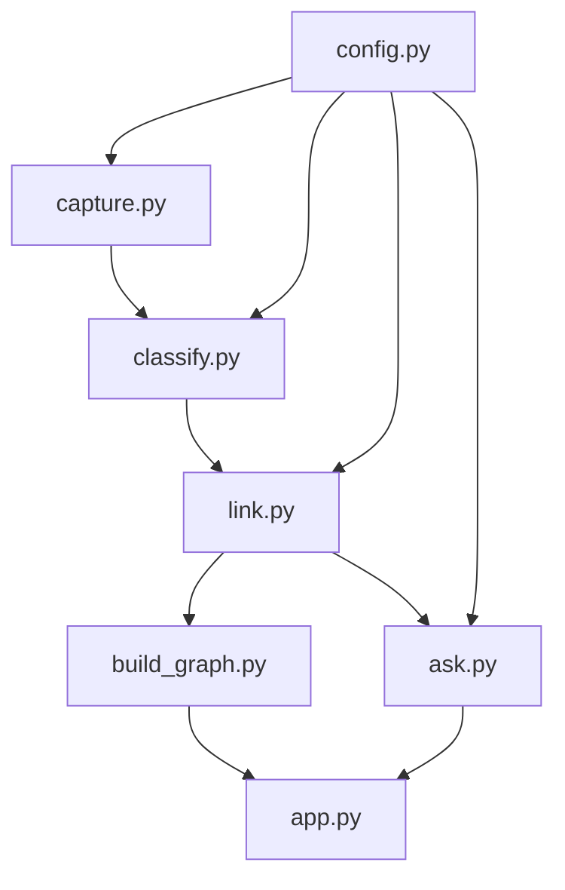

# SecondSelf — Phase-Wise Implementation Plan

This plan turns [Second_Self.md](./Second_Self.md) and [architecture.md](./architecture.md) into executable phases. Each phase has **goals**, **tasks**, **commands**, **acceptance criteria**, and **outputs** that feed the next phase.

**Principles**

- Build on **your own real notes**, not dummy fixtures.
- Each week’s output is the next week’s input (`raw/` → `wiki/` → `graph.json` → deployed app).
- Ship the weekly badge before moving on.

---

## Phase overview

| Phase | Name | Maps to | Badge / milestone |
|-------|------|---------|-------------------|
| **0** | Project setup | Scaffold | — |
| **1** | Capture pipeline | Week 1 | The Archivist |
| **2** | Auto-classify (PARA) | Week 2.1 | (part of Librarian) |
| **3** | Auto-link (embeddings) | Week 2.2 | The Librarian |
| **4** | Graph build + interactive UI | Week 3 | The Cartographer |
| **5** | RAG `ask()` + Streamlit app | Week 4 | The Oracle |
| **6** | Local integration testing | — | — |
| **7** | Local E2E + acceptance sign-off | — | All weekly ACs |
| **8** | Deploy (public URL) | Week 4.2 | Ship SecondSelf |
| **9** | Production verification + README/GitHub | Final deliverables | Project complete |

```mermaid
flowchart LR
    P0[Phase 0 Setup]
    P1[Phase 1 Capture]
    P2[Phase 2 Classify]
    P3[Phase 3 Link]
    P4[Phase 4 Graph]
    P5[Phase 5 Ask + App]
    P6[Phase 6 Integration tests]
    P7[Phase 7 E2E local]
    P8[Phase 8 Deploy]
    P9[Phase 9 Prod + README]

    P0 --> P1 --> P2 --> P3 --> P4 --> P5 --> P6 --> P7 --> P8 --> P9
```



---

## Phase 0 — Project setup

**Goal:** Repo structure, dependencies, configuration, and tooling so later phases only add feature code.

### Tasks

1. Create directory layout per architecture:
   - `raw/`, `wiki/` (with PARA subfolders: `Projects/`, `Areas/`, `Resources/`, `Archives/`)
   - `data/` (embedding cache; add `.gitkeep`)
   - `raw/files/` (binary attachments from capture)
2. Add `config.py`:
   - Paths: `RAW_DIR`, `WIKI_DIR`, `DATA_DIR`, `GRAPH_PATH`
   - Env: `GROQ_API_KEY`, `SIMILARITY_THRESHOLD` (default `0.80`), `TOP_K_RETRIEVAL` (default `8`), `EMBEDDING_MODEL` (default `all-MiniLM-L6-v2`)
   - Load via `python-dotenv` from `.env`
3. Create `requirements.txt` with pinned versions (minimum set):
   - `streamlit`, `groq`, `sentence-transformers`, `torch`, `pyyaml`, `python-frontmatter`, `numpy`, `httpx`, `python-dotenv`
   - Optional: `typer` for CLI ergonomics
4. Add `.gitignore`: `.env`, `__pycache__/`, `.venv/`, `data/embeddings.pkl`, large personal blobs if desired
5. Add `.env.example` documenting all env vars (no secrets)
6. Add placeholder `README.md` (expanded in Phase 9)
7. Create virtual environment and verify install:
   - `python -m venv .venv`
   - `pip install -r requirements.txt`
8. Obtain Groq API key (needed from Phase 2 onward); store in local `.env` only

### Acceptance criteria

- [x] Folders exist: `raw/`, `wiki/{Projects,Areas,Resources,Archives}/`, `data/`
- [x] `config.py` reads env with documented defaults
- [x] `pip install -r requirements.txt` succeeds on Python 3.10+
- [x] `.env` is gitignored; `.env.example` is committed

### Outputs

- Empty scaffold ready for `capture.py`

---

## Phase 1 — Capture pipeline (Week 1 — The Archivist)

**Goal:** One command captures a note, link, or file into `raw/` with timestamp + unique ID.

**Reference:** architecture §5.1, Second_Self Week 1.

### Tasks

1. Implement `capture.py` CLI:
   - Subcommands or args: `note`, `link`, `file`
   - Generate UUID v4 and UTC ISO-8601 `captured_at`
   - Write envelope to `raw/{id}.json` (schema per architecture §4.1)
2. **Note:** store text in `content`
3. **Link:** store URL in `metadata.url`; optional httpx fetch of page title into content (MVP: URL + fetched text or placeholder)
4. **File:** copy binary to `raw/files/{id}/`; set `metadata.original_filename`, `mime_type`, `file_path_ref`; for `.txt`/`.md` read text into `content`
5. Print `id` and file path on success; non-zero exit on error
6. Capture **10+ real items** (mix of note, link, file)

### Commands (verification)

```bash
python capture.py note "Idea: weekly review template"
python capture.py link "https://example.com/article"
python capture.py file "./path/to/document.pdf"
dir raw   # or ls raw/
```

### Acceptance criteria

- [x] `raw/` and `wiki/` folder structure exists
- [x] One command captures note, link, AND file
- [x] Every capture has timestamp + unique ID
- [x] 10+ real items in `raw/` (not test lorem ipsum)

### Outputs

- Populated `raw/` → input to Phase 2

**Badge:** The Archivist — *Ship the Capture Pipeline*

---

## Phase 2 — Auto-classify (Week 2.1 — Sorting Hat)

**Goal:** Every unprocessed raw capture becomes a PARA-organized wiki note with tags and one-line summary.

**Reference:** architecture §5.2, Second_Self Week 2.1.

### Prerequisites

- `GROQ_API_KEY` in `.env`
- Phase 1 raw captures available

### Tasks

1. Implement `classify.py`:
   - Scan `raw/*.json` (or agreed format)
   - Skip raw items that already have wiki entry (match on `raw_id` in front matter)
   - `--force` to re-classify
2. Build PARA prompt (define Projects / Areas / Resources / Archives in prompt)
3. Call Groq (Llama 3) with low temperature; request JSON: `title`, `para`, `tags`, `summary`, optional `body` polish from raw content
4. Parse JSON; on failure retry once; on second failure log and move/skip to quarantine pattern (optional `raw/failed/`)
5. Write `wiki/{Para}/{slug}.md` with YAML front matter (architecture §4.2): `id`, `raw_id`, `para`, `tags`, `summary`, `title`, timestamps
6. Slug from title (safe filename)
7. Run on all Phase 1 captures; add more captures if total wiki notes will be &lt; 15 before Phase 3 completes

### Commands

```bash
python classify.py
python classify.py --force   # optional re-run
```

### Acceptance criteria

- [x] Any raw capture → category + tags + summary automatically
- [x] PARA categorization working (files land under correct subfolder)
- [x] Idempotent re-run does not duplicate notes (unless `--force`)

### Outputs

- Organized `wiki/` without links yet → input to Phase 3

---

## Phase 3 — Auto-link (Week 2.2 — Connect the Dots)

**Goal:** Embeddings for each wiki note; auto-insert links when similarity exceeds threshold.

**Reference:** architecture §5.3, Second_Self Week 2.2.

### Tasks

1. Implement shared embedding helper (in `link.py` or `embeddings.py` used later by `ask.py`):
   - Load `sentence-transformers` model from `EMBEDDING_MODEL`
   - Persist `note_id → vector` to `data/embeddings.pkl`
   - Invalidate/update on content hash change
2. Implement `link.py`:
   - Load all wiki markdown; strip front matter
   - Encode all notes (batch)
   - For each pair (or each new note vs all), cosine similarity via numpy
   - If `>= SIMILARITY_THRESHOLD`, add wikilink `[[target-id-or-slug]]` in a **Related** section (avoid duplicate links)
   - Optional: symmetric links
3. Set `embedding_version` in front matter when embedding computed
4. Run pipeline until **15+ real items** exist in organized, linked `wiki/`

### Commands

```bash
python link.py
```

Tune threshold on real data if graph is too dense or too sparse.

### Acceptance criteria

- [x] Embeddings computed per note
- [x] Related notes auto-linked (no manual tagging)
- [x] 15+ real items → organized `wiki/` with visible cross-links

### Outputs

- Linked `wiki/` + `data/embeddings.pkl` → input to Phases 4 and 5

**Badge:** The Librarian — *Ship the Self-Organizing Wiki*

---

## Phase 4 — Graph data + interactive brain (Week 3 — The Cartographer)

**Goal:** Export `graph.json` from wiki; render force-directed graph with hover, drag, zoom.

**Reference:** architecture §5.4–5.5, Second_Self Week 3.

### Tasks

#### 4.1 — `build_graph.py`

1. Walk `wiki/**/*.md`
2. Parse front matter + body wikilinks `\[\[([^\]]+)\]\]`
3. Resolve targets to node `id` (by id, slug, filename)
4. Build nodes (id, label, para, tags, summary, path, optional snippet)
5. Build edges: `wikilink` and optionally `similarity` if tracked separately
6. Write `graph.json` with `meta` block (architecture §4.3)
7. Log unresolved links to stderr

#### 4.2 — Graph HTML component

1. Choose **vis-network** or **Cytoscape.js** (document choice in README)
2. Create `graph_component.html` template or inline HTML builder in Python:
   - Load JSON nodes/edges
   - Force-directed physics; drag; zoom/pan
   - Hover tooltip: title, summary, short body preview
   - Optional: node color by PARA; subtle “pulse” via CSS/animation
3. Standalone test: open HTML with local `graph.json` OR minimal `streamlit run` stub that only shows graph

### Commands

```bash
python build_graph.py
# Verify graph.json node/edge counts match wiki
streamlit run graph_preview.py   # optional thin preview script, merged into app.py in Phase 5
```

### Acceptance criteria

- [x] Script builds nodes + edges and exports clean JSON
- [x] Interactive force-directed graph renders from that JSON
- [x] Hover reveals note content
- [x] Drag + zoom work
- [x] Built from your real notes, not dummy data

### Outputs

- `graph.json` + reusable graph embed → Phase 5 `app.py`

**Badge:** The Cartographer — *Ship the Living Brain*

---

## Phase 5 — RAG + Streamlit shell (Week 4 — The Oracle, implementation)

**Goal:** `ask()` function and single Streamlit app combining graph + ask-anything bar.

**Reference:** architecture §5.6–5.7, Second_Self Week 4.

### Tasks

#### 5.1 — `ask.py`

1. Implement `ask(question: str) -> dict` with keys `answer`, `sources` (id, title, path, score)
2. Reuse embedding model + cache from Phase 3
3. Embed question; retrieve top-`TOP_K_RETRIEVAL` notes by cosine similarity
4. Build LLM context from title, summary, truncated body
5. Groq completion: answer ONLY from context; cite note titles; handle insufficient context
6. Handle empty wiki and missing API key gracefully
7. CLI smoke test: `python -c "from ask import ask; print(ask('...'))"` with real questions about your notes

#### 5.2 — `app.py`

1. Streamlit layout:
   - **Tab “Brain”:** `st.components.v1.html` graph from Phase 4
   - **Tab “Ask”:** text input, submit, markdown answer, expanders for sources
2. Load `graph.json` at startup; friendly message if missing (run `build_graph.py`)
3. Sidebar: note counts by PARA, link to repo (placeholder OK until Phase 9)
4. Do **not** expose unsafe public “run capture/classify” subprocess unless gated (architecture §11.3); document local-only pipeline in README

#### 5.3 — Optional `pipeline.py`

- `python pipeline.py --steps classify,link,graph` for local refresh after new captures

### Commands

```bash
streamlit run app.py
```

### Acceptance criteria

- [x] `ask()` returns answers synthesized from your own notes (retrieval + LLM)
- [x] One Streamlit app contains both graph and search bar
- [x] Graph and ask work together locally

### Outputs

- Runnable product locally → Phases 6–7

---

## Phase 6 — Local integration testing

**Goal:** Verify modules work together; catch regressions before deploy.

**Reference:** architecture §13.

### Tasks

1. **Capture → classify:** New raw item appears in wiki after `classify.py`
2. **Classify → link:** New wiki note gets embeddings and possible Related links
3. **Link → graph:** New links appear in `graph.json` after `build_graph.py`
4. **Graph → app:** App loads updated JSON without code changes
5. **Ask → sources:** Answers reference notes that exist in `wiki/`; spot-check 5+ real questions
6. Optional: add `tests/` with pytest for:
   - Front matter parse
   - Wikilink extraction
   - Cosine similarity helper
   - Slug/id resolution in `build_graph.py`
7. Fix bugs found; re-run full local pipeline once

### Commands

```bash
python capture.py note "Integration test note - delete later or archive"
python classify.py
python link.py
python build_graph.py
streamlit run app.py
pytest tests/   # if added
```

### Acceptance criteria

- [x] Full script chain completes without errors on current `raw/` + `wiki/`
- [x] App reflects latest graph after rebuild
- [x] Ask returns sensible answers for questions you know are in your brain

### Outputs

- Stable local build → Phase 7 formal E2E checklist

---

## Phase 7 — Local E2E and weekly acceptance sign-off

**Goal:** Explicit checklist from Second_Self + architecture success criteria before deployment.

### E2E flow (manual)

```text
capture → classify → link → build_graph → streamlit app → ask
```

### Master checklist

**Week 1 / Phase 1**

- [x] raw/ and wiki/ exist
- [x] Note, link, file capture
- [x] Timestamp + unique ID on every capture
- [x] 10+ real raw items

**Week 2 / Phases 2–3**

- [x] Auto category, tags, summary
- [x] PARA working
- [x] Embeddings per note
- [x] Auto-linked related notes
- [x] 15+ items in organized wiki/

**Week 3 / Phase 4**

- [x] graph.json valid
- [x] Interactive graph: hover, drag, zoom
- [x] Real notes only

**Week 4 / Phase 5 (local)**

- [x] ask() RAG works on real questions
- [x] Single app: graph + ask

**Architecture §16**

- [x] End-to-end flow verified locally

### Outputs

- Signed-off local product → Phase 8 deploy

---

## Phase 8 — Deploy to public URL

**Goal:** Live Streamlit (or HF Spaces) deployment anyone can open.

**Reference:** architecture §10, Second_Self Week 4.2.

### Tasks

1. Prepare repo for cloud:
   - Pin `requirements.txt`
   - Ensure `app.py` is entry point (`streamlit run app.py`)
   - Commit **sanitized** demo `wiki/` + `graph.json` OR document that deploy uses your public demo dataset (avoid leaking private notes)
2. Create GitHub repository (public per final deliverables)
3. Push code; connect **Streamlit Community Cloud** or **Hugging Face Spaces**
4. Configure secrets: `GROQ_API_KEY` in platform secret manager (not in repo)
5. Set Python version to match local (3.10+)
6. First deploy: expect cold start while `sentence-transformers` downloads model; note in README
7. Smoke test public URL: graph loads, ask returns answer

### Acceptance criteria

- [x] Deployed live with public URL
- [x] Graph visible on public app
- [x] Ask works on public app (with API key in secrets)

### Outputs

- Public URL → Phase 9 final verification

---

## Phase 9 — Production verification, README, and final deliverables

**Goal:** Complete project deliverables from Second_Self “Final Deliverables”.

### Tasks

1. **Production E2E** on deployed app:
   - [x] Interactive graph + ask-your-brain both working
   - [x] Full pipeline story documented (capture locally → refresh data → redeploy or committed graph update)
2. **README.md** (complete):
   - Problem statement (short)
   - Architecture link
   - Setup: venv, `.env`, Groq key
   - Usage: capture, classify, link, build_graph, streamlit, optional pipeline
   - Deploy instructions
   - Live demo URL
   - Privacy note (personal data in wiki/)
3. Push final commits; verify all four badges/milestones noted in README or PROJECT.md
4. Optional: add `problemStatement.txt` at repo root (from course template)

### Final deliverables checklist

- [x] Public GitHub repo with clean README + setup instructions
- [x] Live deployed URL — graph + ask working
- [x] E2E verified: capture → classify → link → graph → ask
- [x] All 4 weekly milestones complete

**Badge:** The Oracle — *Ship SecondSelf*

---

## Suggested timeline (4-week course alignment)

| Calendar week | Phases | Focus |
|---------------|--------|--------|
| Week 1 | 0, 1 | Setup + capture + 10+ raw items |
| Week 2 | 2, 3 | Classify + link + 15+ wiki items |
| Week 3 | 4, 6 (partial) | Graph JSON + interactive UI |
| Week 4 | 5, 6, 7, 8, 9 | Ask, app, test, deploy, README |

Phases 6–7 can overlap Week 4; do not deploy (Phase 8) until Phase 7 checklist passes locally.

---

## Dependency graph (implementation modules)



---

## Risk mitigations (during implementation)

| Risk | Phase | Mitigation |
|------|-------|------------|
| Groq rate limits | 2, 5 | Batch with delay; cache in wiki files |
| First embedding model download slow | 3, 8 | Document; use MiniLM; commit deploy only after successful local run |
| Graph too cluttered | 4 | Raise similarity threshold; filter edge types in UI |
| Private notes on public URL | 8, 9 | Sanitized demo wiki for public repo |
| Large PDFs in capture | 1 | Store file ref; text extraction post-MVP |

---

## Next document

After this plan is approved, generate **edge-case.md** from architecture + this plan, then **implement Phase 0** per the checklist above.
